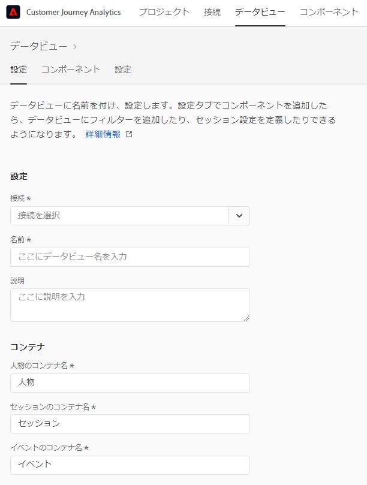
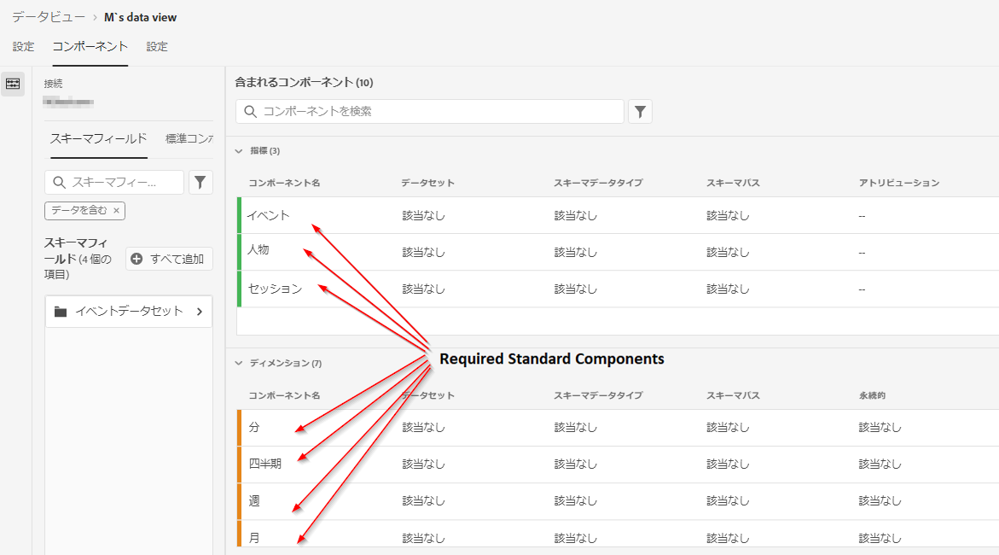
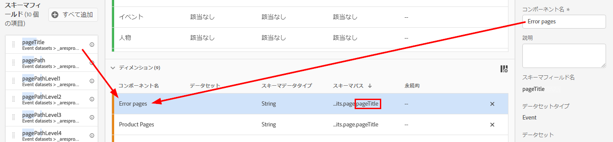
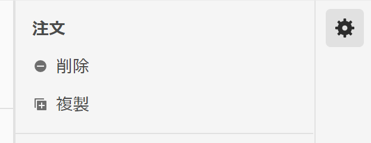
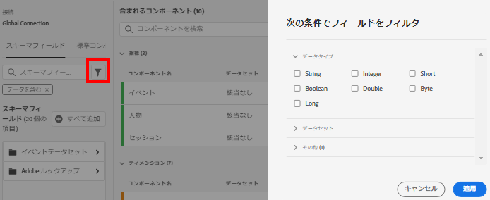
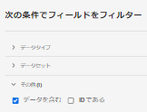

# データビューの作成または編集

データビューを作成するには、スキーマ要素から指標やディメンションを作成するか、標準コンポーネントを使用する必要があります。ほとんどのスキーマ要素は、ビジネスの要件に応じて、ディメンションまたは指標のいずれかになります。スキーマ要素をデータビューにドラッグすると、右側にオプションが表示され、CJA でのディメンションや指標の動作を調整できます。

## データビューの設定

1. [Customer Journey Analytics](https://analytics.adobe.com) にログインし、「**[!UICONTROL データビュー]**」タブに移動します。
2. 「**[!UICONTROL 追加]**」をクリックしてデータビューを作成するか、既存のデータビューをクリックして編集します。

### データビュー設定

データビューの包括的な設定を提供します。

| 設定 | 説明 |
| --- | --- |
| [!UICONTROL 接続] | このフィールドは、データビューを、1 つ以上の Adobe Experience Platform データセットを含む、以前確立した接続にリンクします。 |
| [!UICONTROL 名前] | 必須。データビューの名前。この値は、Analysis Workspace の右上のドロップダウンに表示されます。 |
| [!UICONTROL 説明] | （オプション。Adobeは、データビューの存在理由とデザインの目的をユーザーが理解できるよう、詳細な説明を提示します。 |

### コンテナ

データビューのコンテナの名前を指定します。コンテナ名は、 [フィルター](/help/components/filters/filters-overview.md#Filter-containers) でよく使用されます。

| 設定 | 説明 |
| --- | --- |
| [!UICONTROL 人物のコンテナ名] | [!UICONTROL 個人]（デフォルト）。[!UICONTROL 個人] コンテナには、指定した期間内の訪問者に対するすべてのセッションとイベントが含まれます。組織で別の用語（「訪問者」や「ユーザー」など）を使用している場合は、ここでコンテナの名前を変更できます。 |
| [!UICONTROL セッションのコンテナ名] | [!UICONTROL セッション]（デフォルト）。[!UICONTROL セッション]コンテナでは、特定のセッションのページインタラクション、キャンペーンまたはコンバージョンを識別できます。このコンテナの名前は、「訪問」または組織が指定したその他の用語に変更できます。 |
| [!UICONTROL イベントのコンテナ名] | [!UICONTROL イベント]（デフォルト）。[!UICONTROL イベント] コンテナは、データセット内の個々のイベントを定義します。組織で異なる用語（「ヒット数」や「ページビュー数」など）を使用している場合は、ここでコンテナの名前を変更できます。 |

### カレンダー

データビューで使用するカレンダーの形式を示します。同じ [接続](/help/connections/create-connection.md) に基づいて複数のデータビューを作成し、異なるカレンダータイプやタイムゾーンを設定できます。これらのデータビューを使用すると、異なるカレンダータイプを使用するチームが、同じ基データを使用して、それぞれのニーズに対応できます。

| 設定 | 説明 |
| --- | --- |
| [!UICONTROL タイムゾーン] | データを表示するタイムゾーンを選択します。夏時間を実施中のタイムゾーンを選択すると、それに合わせてデータが自動的に調整されます。時計が 1 時間前に調整される春には、1 時間の間隔があります。時計を 1 時間遅く調整する秋には、DST シフト中に 1 時間が繰り返されます。 |
| [!UICONTROL カレンダータイプ] | 月の週をグループ化する方法を指定します。 **西暦：** 標準のカレンダー形式です。四半期は月ごとにグループ化されます。 **4-5-4 小売：** 標準化された 4-5-4 小売カレンダー。四半期の最初の月と最後の月は 4 週間、四半期の 2 番目の月は 5 週間となります。 **カスタム (4-5-4)：** 4-5-4 カレンダーと同様に、年の最初の日と、「追加」週を含む年を選択できる点が異なります。 **カスタム (4-4-5)：** 各四半期の最初の月と 2 番目の月は 4 週で、各四半期の最後の週は 5 週で構成されます。 **カスタム (5-4-4)：** 各四半期の最初の月は 5 週で、2 番目と 3 番目の月は 4 週で構成されます。 |
| [!UICONTROL 年の最初の月] と [!UICONTROL 週の最初の曜日] | 西暦カレンダータイプに対して表示されます。暦年の開始月と、週の開始日を指定します。 |
| [!UICONTROL 現在の年の最初の日] | カスタムのカレンダータイプに対して表示されます。現在の年の開始日を指定します。カレンダーでは、この値に基づいて各週の最初の曜日が自動的に書式設定されます。 |
| [!UICONTROL 「余分な」週が発生する年] | ほとんどの 364 日間カレンダー（7 日間を 52 週間）では、残りの日が 1 週間分貯まるまで毎年累積されます。 この追加の週は、その年の最後の月に追加されます。余分な週を追加する年を指定します。 |

## データビューのコンポーネントの設定

次に、スキーマ要素から指標やディメンションを作成できます。標準コンポーネントも使用できます。

1. [Customer Journey Analytics](https://analytics.adobe.com) にログインし、「**[!UICONTROL データビュー]**」タブに移動します。
1. 「**[!UICONTROL 追加]**」をクリックしてデータビューを作成するか、既存のデータビューをクリックして編集します。
1. 「**[!UICONTROL コンポーネント]**」タブをクリックします。

   

   データセットを含む「[!UICONTROL 接続]」が左上に表示され、その「[!UICONTROL スキーマフィールド]」が下に表示されます。既に含まれているコンポーネントは、すべてのデータビューに対して標準的に必要なコンポーネント（システム生成）です。アドビは、「**[!UICONTROL データを含む]**」というフィルターもデフォルトで適用するので、データを含むスキーマフィールドのみが表示されます。データを含まないフィールドが必要な場合は、このフィルターを削除します。

1. `pageTitle` などのスキーマフィールドを左側のパネルから「指標」セクションまたは「ディメンション」セクションにドラッグします。

   同じスキーマフィールドをディメンションまたは指標セクションに複数回ドラッグし、同じディメンションまたは指標を異なる方法で設定できます。例えば、「`pageTitle` 」フィールドから、「製品ページ」というディメンションと、右側の別の「[コンポーネント設定](component-settings/overview.md)」を使用して別の「エラーページ」を作成できます。

   

   スキーマフィールドフォルダーを左パネルからドラッグすると、通常のセクションに自動的に並べ替えられます。文字列フィールドは [!UICONTROL ディメンション] セクションで終わり、数値スキーマタイプは [!UICONTROL 指標] セクションで終わります。「**[!UICONTROL すべてを追加]**」をクリックして、すべてのスキーマフィールドをそれぞれの場所に追加することもできます。

1. コンポーネントを選択すると、右側に多数の設定が表示されます。[コンポーネント設定](component-settings/overview.md) を使用してコンポーネントを設定します。使用可能なコンポーネント設定は、コンポーネントがディメンション／指標であるかどうか、およびスキーマデータタイプであるかどうかによって異なります。「設定」には次の項目が含まれます。

   * [[!UICONTROL アトリビューション]](component-settings/attribution.md)
   * [[!UICONTROL 動作]](component-settings/behavior.md)
   * [[!UICONTROL 書式]](component-settings/format.md)
   * [[!UICONTROL 値を含める / 除外]](component-settings/include-exclude-values.md)
   * [[!UICONTROL 指標の重複排除]](component-settings/metric-deduplication.md)
   * [[!UICONTROL 値オプションなし]](component-settings/no-value-options.md)
   * [[!UICONTROL 永続性]](component-settings/persistence.md)
   * [[!UICONTROL 値のバケット化]](component-settings/value-bucketing.md)

## 指標またはディメンションの重複

指標またはディメンションを複製してから特定の設定を変更すると、1 つのスキーマフィールドから複数の指標またはディメンションを簡単に作成できます。右上にある指標またはディメンションの名前の下にある「[!UICONTROL 複製]」設定を選択します。新しいディメンションまたは指標を変更し、わかりやすい名前で保存します。

## スキーマフィールドまたはデータセットのフィルタリング

左側のパネルのスキーマフィールドは、次のデータタイプでフィルタリングできます。

また、データセットによって、およびデータがスキーマフィールドに含まれているか、またはデータが ID であるかによって、フィルタリングすることもできます。 デフォルトでは、アドビは最初に、「**[!UICONTROL データを含む]**」フィルターをすべてのデータビューに適用します。

## 設定 tab

1. [Customer Journey Analytics](https://analytics.adobe.com) にログインし、「**[!UICONTROL データビュー]**」タブに移動します。
1. 「**[!UICONTROL 追加]**」をクリックしてデータビューを作成するか、既存のデータビューをクリックして編集します。
1. 「**[!UICONTROL 設定]**」タブをクリックします。

### グローバルフィルター

データビュー全体に適用するフィルターを追加できます。このフィルターは、ワークスペースで実行するすべてのレポートに適用されます。左側のパネルのリストから「「[!UICONTROL フィルターを追加]」フィールドにフィルターをドラッグします。

### セッション設定

セッションの有効期限が切れてから新しいセッションが開始されるまでの間に無操作状態が続く期間を指定します。

期間を指定する必要があります。オプションで、イベントに特定の指標が含まれる場合は新しいセッションを強制的に開始することもできます。

必要な設定をすべて指定したら、「**[!UICONTROL 保存して終了]**」をクリックします。
