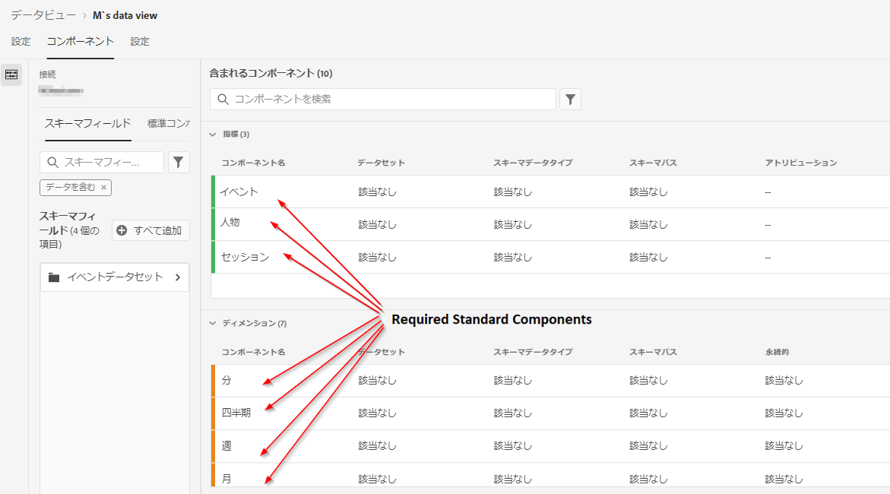
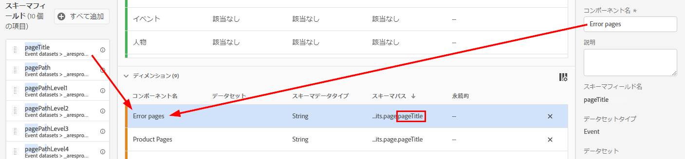

# 新しいデータ表示の作成

データ表示の作成には、スキーマエレメントから指標やディメンションを作成するか、標準コンポーネントを使用します。 指標やディメンションを作成すると、非常に柔軟に作業を行えます。 以前は、Adobe Experience Platformにデータセットがある場合、文字列フィールドはディメンション、数値フィールドは指標を想定していました。 これらのフィールドのいずれかを変更するには、Platformでスキーマを編集する必要がありました。 データ表示UIで、指標とディメンションのよりフリーフォームを定義できるようになりました。

## データ表示の設定とコンテナの設定

1. Customer Journey Analytics で、「**データビュー**」タブに移動します。
2. **追加**&#x200B;をクリックして新しいデータ表示を作成し、その設定を行います。

| 設定 | 説明/使用例 |
| --- | --- |
| 接続 | このフィールドは、データ表示を、以前に確立した接続(Adobe Experience Platformデータセットが1つ以上含まれている)にリンクします。 |
| 名前 | データビューに名前を付ける必要があります。 |
| 説明 | 詳細な説明は必須ではありませんが、お勧めします。 |
| タイムゾーン | データを表示するタイムゾーンを選択します。 |
| タグ | タグを使用すると、データビューをカテゴリ別に整理できます。 |
| コンテナ | ここでコンテナの名前を変更できます。この名前は、このデータ表示に基づくWorkspaceプロジェクトでの表示方法です。 コンテナは、フィルターやフォールアウト/フローで使用され、範囲やコンテキストの範囲や範囲を定義します。 [詳細情報](https://experienceleague.adobe.com/docs/analytics-platform/using/cja-components/cja-filters/filters-overview.html?lang=en#filter-containers) |
| 個人コンテナ名は… | Person（デフォルト）。 ユーザーコンテナには、指定期間内に発生した訪問者による訪問とページビューがすべて含まれます。この名前は、「ユーザー」または任意の任意のキーワードに変更できます。 |
| セッションコンテナ名は… | Session（デフォルト）。 セッションコンテナでは、特定の セッションのページでのインタラクション、キャンペーンまたはコンバージョンを識別できます。この名前は、「訪問」または任意の任意の用語に変更できます。 |
| イベントコンテナ名は… | イベント（デフォルト） イベントコンテナは、フィルターに含めるまたは除外するページイベントを定義します。 |

次に、スキーマエレメントから指標とディメンションを作成します。

## スキーマエレメントから指標およびディメンションを作成する

1. [!UICONTROL 顧客ジャーニー分析]/[!UICONTROL データ表示]で、[!UICONTROL コンポーネント]タブをクリックします。

左上の[!UICONTROL Connection]が表示されます。この中にはデータセットと[!UICONTROL スキーマフィールド]が含まれています。

1. 次に、[!UICONTROL pageTitle]などのスキーマフィールドを左側のナビゲーションバーから「指標」セクションまたは「Dimension」セクションにドラッグします。

   同じスキーマフィールドをディメンションまたは指標に何度もドラッグして、異なる方法で同じディメンションまたは指標を設定できます。 例えば、**[!UICONTROL pageTitle]**&#x200B;フィールドから、「製品のページ」という名前のディメンションと、別の「エラーページ」という名前のディメンションを作成できます。 **[!UICONTROL pageTitle]**;フィールドで指標を作成する場合は、文字列値から指標を作成することもできます。 例えば、異なるアトリビューション設定と異なる値を含む/除外する1つ以上の&#x200B;**[!UICONTROL 注文件数]**&#x200B;指標を作成できます。

   

1. コンポーネントを選択すると、右側に多数の設定が表示されます。 以下の設定を使用して、コンポーネントを設定します。

### コンポーネント設定の指定

| 設定 | 説明/使用例 |
| --- | --- |
| [!UICONTROL コンポーネントの種類] | 必須。コンポーネントを指標からDimensionに、またはその逆に変更できます。 |
| [!UICONTROL コンポーネント名] | 必須。Analysis Workspaceに表示されるわかりやすい名前を指定できます。 コンポーネントの名前を変更して、データ表示固有の名前を付けることができます。 |
| [!UICONTROL 説明] | 他のユーザーにコンポーネントの情報を提供する場合は、オプションです（ただし推奨）。 |
| [!UICONTROL タグ] | （オプション）Analysis WorkspaceUIで検索/フィルタリングを容易にするために、カスタムタグまたは標準搭載のタグでコンポーネントにタグを付けることができます。 |
| [!UICONTROL フィールド名] | スキーマフィールドの名前。 |
| [!UICONTROL データセットタイプ] | 必須。コンポーネントの元のデータセットタイプ(イベント、参照、またはプロファイル)を示す編集不可のフィールド。 |
| [!UICONTROL データセット] | 必須。コンポーネントの送信元のフィールドのタイプを示す編集不可のフィールド（文字列、整数など）。 このフィールドには、複数のデータセットを含めることができます。例えば、複数のレポートスイートを組み合わせる場合などです。 |
| [!UICONTROL スキーマタイプ] | コンポーネントが文字列、整数などかを示します。 |
| [!UICONTROL コンポーネント ID] | 必須。[CJA API](https://adobe.io/cja-apis/docs)は、このフィールドを使用してコンポーネントを参照します。 編集アイコンをクリックして、このコンポーネントIDを変更できます。 ただし、このコンポーネントIDを変更すると、このコンポーネントを含む既存のWorkspaceプロジェクトがすべて破棄されます。 pageTitleディメンションとは異なるフィールドを使用する別のデータ表示を作成する場合は、名前を変更して、ディメンションのクロスデータ表示との互換性を持たせることができます。 |
| Path | 必須。コンポーネントの作成元のスキーマパスを示す編集不可能なフィールドです。 |
| レポートのコンポーネントを非表示 | 初期設定=オフ レポートで使用する場合に、データ表示からコンポーネントをキュレーションできます。 これは権限には影響しません。コンポーネントのキュレーションだけです。 つまり、レポートの非管理者に対してコンポーネントを非表示にできます。 管理者は、Analysis Workspaceプロジェクトで「[!UICONTROL すべてのコンポーネントを表示]」をクリックしてアクセスできます。 |

### 形式の設定

形式の設定は指標に対してのみ有効です。

| 設定 | 説明/使用例 |
| --- | --- |
| [!UICONTROL Format] | 指標の書式を、十進数、時間、パーセント、通貨の形式で指定できます。 |
| [!UICONTROL 小数点以下の桁数] | 指標で表示する小数点以下の桁数を指定できます。 |
| [!UICONTROL 上昇傾向を次の形式で表示] | この指標の上昇傾向を良い（緑）と見なすか、悪い（赤）と見なすかを指定できます。 |
| [!UICONTROL 通貨] | この設定は、選択した指標の形式が[!UICONTROL 通貨]の場合にのみ表示されます。 通貨オプションのリストを使用できます。 デフォルトは通貨ではありません。 これにより、売上高をレポートで選択した通貨で表すことができます。 これは通貨換算ではなく、単なるUI書式設定オプションです。 |

### アトリビューションの設定

| 設定 | 説明/使用例 |
| --- | --- |
| [!UICONTROL アトリビューションを設定] | この指標を使用する場合に、デフォルトでこの指標に適用するアトリビューション設定を指定できます。 このデフォルトは、フリーフォームテーブルまたは計算指標で上書きできます。 |
| [!UICONTROL アトリビューションモデル] | デフォルトのアトリビューションモデルを指定できます。これは、「[!UICONTROL デフォルト以外のアトリビューションモデルを使用]」設定をオンにした場合にのみ有効です。 デフォルトは[!UICONTROL ラストタッチ]です。 オプションは次のとおりです。ラストタッチ、ファーストタッチ、リニア、パーティシペーション、同じタッチ、U字型、J曲線、逆J、時間減衰、カスタム、アルゴリズム。 これらのオプションの一部は、カスタム(Custom)や時間減衰度(Time Decay)など、入力が必要な追加フィールドを作成します。 同じフィールドを使用して複数の指標を作成できます。つまり、1つの[!UICONTROL ラストタッチ]売上高指標と1つの[!UICONTROL ファーストタッチ]売上高指標を持つことができますが、スキーマ内の同じ売上高フィールドに基づきます。 |
| [!UICONTROL ルックバックウィンドウ] | 指標に対するデフォルトのルックバックウィンドウを指定できます。[!UICONTROL デフォルト以外のアトリビューションモデルを使用]設定をオンにした場合にのみアクティブになります。 オプションは次のとおりです。Person(レポートー・ウィンドウ)、Session、Custom。 「カスタム」を選択すると、日数、週数、月数などを選択するオプションも表示されます。 （最長90日間）、Attribution IQと同様。 同じスキーマフィールドを使用して複数の指標を設定できますが、指標ごとに別々のルックバックウィンドウがあります。 |

### 値を含む/除外の設定

この設定を使用すると、クエリ時にレポート対象の基になるデータを変更できます。 フィルター（以前のセグメント）とは異なります。 しかし、フィルターは、パスやアトリビューションと同様に、この新しいディメンションを尊重します。

例えば、pageTitleフィールドからディメンションを作成し、「error pages」と呼び出して、[!UICONTROL に]「error」というフレーズを含むページを含めることができます。

| 設定 | 説明/使用例 |
| --- | --- |
| [!UICONTROL 大文字と小文字を区別] | 初期設定=オン この設定は、Dimensionと指標で少し異なります。<ul><li>**指標**:この設定は、「値を [!UICONTROL 含む/除外する」セクションにのみ適用され] ます。適用するフィルターで大文字と小文字を区別するかどうかを指定できます。</li><li>**Dimension** :この設定は、このディメンションのデータを、大文字と小文字を区別するか、大文字と小文字を区別しないかのどちらで集計するかを決定します。これにより、文字列フィールドに対するレポート/フィルター/アトリビューション設定の実行方法が変更されます。</li></ul> |
| [!UICONTROL 次に一致] | アトリビューションとセグメント化の前に、レポートのために考慮する値を指定できます（例：「error」というフレーズを含む値のみを使用します）。 次を指定できます。**[!UICONTROL すべての条件が満たされた場合]**、または&#x200B;**[!UICONTROL いずれかの条件が満たされた場合]**。 |
| [!UICONTROL 条件] | 特定のフィルタールールに適用する一致ロジックを指定できます。<ul><li>**文字列**:フレーズが含まれる場合、「任意の語句を含む」、「すべての語句を含む」、「いずれも語句を含まない」、「次と等しい」、「次と等しくない」、「次と等しい」、「次の語句で終わる」</li><li>**重複/整数**:等しい、等しくない、次より大きい、次より小さい、次より大きい、等しい、次より小さい、等しい</li><li>**日付**:等しい、等しくない、より後、より前、次の範囲内で発生</li></ul> |
| [!UICONTROL 一致演算値] | 一致演算子を適用する一致オペランドを指定できます。<ul><li>**文字列**:テキストフィールド</li><li>**重複/整数**:数値に上向き/下向き矢印を付けたテキストフィールド</li><li>**日付**:日の精度の選択（カレンダー）</li><li>**日時**:日付と時間の精度の選択</li></ul> |
| [!UICONTROL ルールを追加] | 追加の一致演算子とオペランドを指定できます。 |

### 動作の設定

| 設定 | 説明/使用例 |
| --- | --- |
| [!UICONTROL 値をカウント] | これにより、ブール値フィールドが`true`に設定された回数を作成できます。を指標として使用します。 例えば、[!UICONTROL ページ表示]の数です。この場合、`isPage`という名前のブール値フィールドは`true`に設定されます。 |
| [!UICONTROL インスタンスをカウント] | 指標として使用する数値フィールドまたは日付タイプフィールドで、値自体ではなく設定時間をカウントするかどうかを指定できます。  数値フィールドのインスタンスを合計し、そのフィールドが内部の実際の値とは ** 異なる回数だけを合計する場合。 これは、例えば、売上高フィールドから  Orders指標を作成する場合に役立ち  ます。売上高が設定された場合、売上高の数値ではなく、1件の注文をカウントする必要があります。 |

### [!UICONTROL 値オプションなし]の設定を構成

[!UICONTROL 「値なし」] オプションの設定は、「指定なし」または「レポート内の    値なし」と同様です。データ表示UIでは、コンポーネント単位で、これらの値をレポートでどのように扱うかを指定できます。 また、[!UICONTROL 値]なしを、[!UICONTROL Null]、[!UICONTROL 設定しない]など、環境に適した値に変更することもできます。

重要：このフィールドをカスタム値に変更すると、カスタム値は正当な文字列値として扱われます。 したがって、このフィールドに「Red」と入力した場合、データ自体に「Red」という文字列が出現すると、指定した行項目の下にもロールします。

また、「値なしのオプション」の設定に記載されているように、レポートの「値なし」行項目の特別なUI処理に、このフィールドで指定した内容を使用できます。 （これが何を意味するかは不明です）。

| 設定 | 説明/使用例 |
| --- | --- |
| 表示されている場合は、[!UICONTROL 値]なし…を呼び出します。 | **[!UICONTROL 値]**&#x200B;を指定しない場所に別の名前を付けることができます。 |
| **[!UICONTROL 値]**&#x200B;をデフォルトで表示しない | レポートにこの値を表示しません。 |
| デフォルトで&#x200B;**[!UICONTROL 値]**&#x200B;を表示しない | この値をレポートで表示します。 |
| **[!UICONTROL 値]**&#x200B;を値として扱わない | 例えば、モバイルデバイスのタイプをディメンションとして指定した場合、**[!UICONTROL 値なし]**&#x200B;項目の名前を「デスクトップ」に変更できます。 |

### 永続性設定の指定

これらの設定は、従来のAdobe AnalyticsのeVar設定と似ています。

| 設定 | 説明/使用例 |
| --- | --- |
| 永続化を設定 | 切り替えキー |
| 配分 | ディメンションで永続性のために使用する割り当てモデルを指定できます。 オプションは次のとおりです。最新、オリジナル、インスタンス、すべて。 値を永続的に（従来のAnalyticsのeVarと同様に）設定する場合は、ここで設定します。 唯一の主な違いは、設定できる最大永続性が90日であることです。 また、[!UICONTROL 期限切れのない]はオプションではありません。 |
| 有効期限 | ディメンションの永続性ウィンドウを指定できます。 オプションは次のとおりです。セッション（デフォルト）、人、時間、指標。購入時にディメンションの有効期限を切れる必要がある場合があります（内部検索用語や他のマーチャンダイジングの使用例など）。 「指標」を使用すると、定義済みの指標のいずれかを、このディメンションの有効期限として指定できます（「購入」指標など）。 |

### 値グループの設定

| 設定 | 説明/使用例 |
| --- | --- |
| バケットの値 | 数値ディメンションのグループバージョンを作成できます。 これにより、売上高のグループやその他の数値をレポートのディメンションとしてレポートできます。 最大5つのグループを作成できます。 |
| ～ | 最初の数値ディメンショングループの境界を指定できます。 これは、数値ディメンションにのみ適用されます。 |
| 次の範囲内 | 後続の数値ディメンショングループの境界を指定できます。 |
| バケットを追加 | 数値ディメンショングループに別のグループを追加できます。 |

## 標準コンポーネントの使用

スキーマエレメントから指標やディメンションを作成する以外に、データ表示で標準コンポーネントを使用することもできます。

標準コンポーネントとは、データセットスキーマフィールドから生成されるのではなく、システムによって生成されるコンポーネントです。 Analysis Workspaceでのレポート機能を容易にするために、任意のデータ表示で必要となるシステムコンポーネントもありますが、他のシステムコンポーネントはオプションです。

必要な標準コンポーネント

| コンポーネント名 | Dimensionまたは指標 | メモ |
| --- | --- | --- |
| People | 指標 | 従来のAnalyticsでは、[!UICONTROL 実訪問者]と呼ばれていました。 この指標は、「接続」で指定された個人IDに基づきます。 |
| Sessions | 指標 | 従来のAnalyticsでは、[!UICONTROL 訪問回数]と呼ばれていました。 この指標は、以下に指定したセッション設定に基づきます。 |
| イベント | 指標 | 従来のAnalyticsでは、[!UICONTROL 回数]と呼ばれていました。 このメトリックは、接続内のすべてのイベント・データセットからの行数を表します。 |
| 日 | ディメンション |  |
| 週 | ディメンション |  |
| 月 | ディメンション |  |
| 四半期 | ディメンション |  |
| 年 | ディメンション |  |
| 時間 | ディメンション |  |
| 分 | ディメンション |  |

## 標準コンポーネント（オプション）

Analysis Workspaceでのレポート機能を容易にするために、任意のデータ表示で必要となるシステムコンポーネントもありますが、以下のシステムコンポーネントはオプションです。

| コンポーネント名 | Dimensionまたは指標 | メモ |
| --- | --- | --- |
| [!UICONTROL セッション開始] | 指標 | このメトリックは、セッションの最初のイベントであったイベントの数をカウントします。 フィルター定義で使用する場合(例：&#39;[!UICONTROL セッション開始]が存在する&#39;)、各セッションの最初のイベントにフィルターします。 これは、セッションの最初のイベントを常にカウントする点で、[!UICONTROL Entries]とは異なる動作です。セッション内のディメンションに存在する最初の値ではありません。 |
| [!UICONTROL セッション終了] | 指標 | このメトリックは、セッションの最後のイベントであったイベントの数をカウントします。 [!UICONTROL セッション開始]と同様、フィルタ定義でも各セッションの最後のイベントまでフィルタリングできます。 これは、セッション内のディメンションに存在する最後の値ではなく、常にセッションの最後のイベントをカウントする点で、[!UICONTROL Exits]とは異なる動作です。 |
| [!UICONTROL 滞在時間 (秒)] | 指標 | [!UICONTROL 滞在時間]指標は、従来のAdobe Analyticsと同様に機能し、ディメンションに対して2つの異なる値の間の時間を合計します。 ただし、Session開始とSession Ends指標を使用すると、ユーザーは、[!UICONTROL 個人別滞在時間]および[!UICONTROL セッション別滞在時間]の計算指標自体を作成できます(後述のOOTBフィルターと計算指標を参照)。 |
| [!UICONTROL イベント別滞在時間] | ディメンション | 機能的には、これは上記の指標の一部に過ぎません。 デフォルトのグループを指定しますが、グループは好きなように変更できます。 |
| セッション別滞在時間 | ディメンション |  |
| ユーザー別滞在時間 | ディメンション |  |
| バッチ ID | ディメンション |  |
| データセット ID | ディメンション |  |
