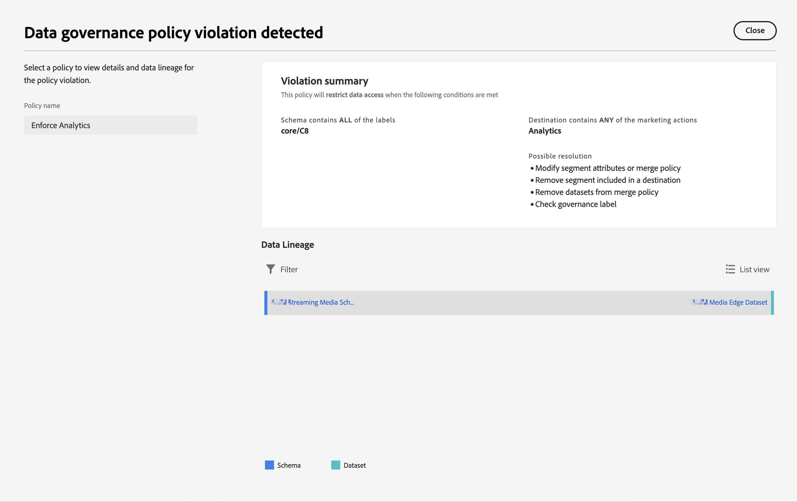

# ラベルとポリシー

Experience Platform でデータセットを作成する場合、データセットの一部またはすべての要素に対して[データ使用状況ラベル](https://experienceleague.adobe.com/ja/docs/experience-platform/data-governance/labels/reference)を作成できます。 これらのラベルとポリシーは、Customer Journey Analytics で表示できます。

次のラベルは、Customer Journey Analytics にとって特に重要です。

* `C8` ラベル - **[!UICONTROL 測定なし]**。 このラベルは、組織の web サイトやアプリで分析に対してデータが使用できないことを示します。

* `C12` ラベル - **[!UICONTROL 一般的なデータの書き出しがありません]**。 この方法でラベル付けされたスキーマフィールドは、Customer Journey Analytics から（レポート、書き出し、API などを介して）書き出しまたはダウンロードはできません。

>[!NOTE]
>
>データ使用状況ラベルは、ステッチされたデータセットに自動的に生成されません。 ただし、手動で追加することはできます。

「ラベル付け」自体は、これらのデータ使用状況ラベルが適用されるという意味ではありません。 これを行うにはポリシーを使用します。 ポリシーは、[Experience Platform UI](https://experienceleague.adobe.com/ja/docs/experience-platform/data-governance/policies/user-guide) を使用するか、Experience Platform で [Policy Service API](https://experienceleague.adobe.com/ja/docs/experience-platform/data-governance/api/overview) を介して作成できます。

Experience Platform にはアドビが定義するポリシーが 2 つあります。これらのポリシーは、Customer Journey Analytics に表示され、レポートとデータの書き出しに影響する可能性があります。

* `C8` ラベルを使用する、**[!UICONTROL 使用状況分析とユーザーベースの測定の制限]**&#x200B;ポリシー
* `C12` ラベルを使用する、。**[!UICONTROL データの書き出しの制限]**&#x200B;ポリシー

## Customer Journey Analytics データビューでのデータラベルの表示

Experience Platform で自分または他のユーザーが作成したデータラベルは、データビューのユーザーインターフェイスで次の 3 つの場所に表示されます。

| 場所 | 説明 |
| --- | --- |
| スキーマフィールドの情報ボタン | このボタンをクリックすると、現在フィールドに適用される[!UICONTROL データ使用状況ラベル]が表示されます。
 |
| [コンポーネント設定](/help/data-views/component-settings/overview.md)の下の右パネル | すべての[!UICONTROL データ使用状況ラベル]はここに一覧表示されます。
 |
| データラベルを列として追加 | データビューの「[!UICONTROL 含まれるコンポーネント]」列に、「[!UICONTROL データ使用状況ラベル]」を列として追加できます。 列セレクターアイコンを選択し、「**[!UICONTROL データ使用状況ラベル]**」を選択します。
 |

{style="table-layout:auto"}

## データビューのデータガバナンスラベルに対するフィルター

データビューエディターで、左側のパネルの[!UICONTROL フィルター]アイコンを選択し、**[!UICONTROL データガバナンス]**&#x200B;および&#x200B;**[!UICONTROL ラベル]**&#x200B;のタイプで、データビューコンポーネントをフィルタリングします。

「**[!UICONTROL 適用]**」をクリックして、どのコンポーネントにラベルが付いているかを確認します。

## データビューでデータガバナンスポリシーをフィルタリング

ポリシー（例えば、自身が作成した、「**[!UICONTROL Analytics の適用]**」という名前のポリシー）がオンになっているかどうかを確認できます。 また、そのポリシーによって、分析またはデータの書き出しのための特定の Customer Journey Analytics データビュー要素の使用がブロックされるかどうかも確認できます。

再度、左側のパネルの&#x200B;**[!UICONTROL データガバナンス]**&#x200B;下の [!UICONTROL フィルター] アイコン、「**[!UICONTROL ポリシー]**」の順に選択します。

「**[!UICONTROL 適用]**」をクリックし、有効になっているポリシーを確認します。

## 有効なポリシーがデータビューに与える影響

C8 または C12 ラベルで 1 つ以上のポリシーをオンにすると、特定のデータラベルが適用されているスキーマコンポーネントをデータビューに追加できません。

これらのコンポーネントは、左側のパネルの[!UICONTROL スキーマフィールド]リストでグレー表示されます。

また、ブロックされたフィールドがあるデータビューは保存できません。

データビューで既にコンポーネントが定義されている Experience Platform のフィールドまたはフィールドグループに、アクセスラベルとデータガバナンスラベルを（ポリシーを通じて）適用する場合は注意が必要です。 このダイアログが表示される可能性があります。

まず、違反を解決する必要があります（例えば、データビューからコンポーネントを削除するなど）。

>[!MORELIKETHIS]
>
>[機密データのダウンロード](/help/analysis-workspace/export/download-send.md)

>[!MORELIKETHIS]
>
>[Report Builder の制限ラベルとは？](https://experienceleague.adobe.com/ja/docs/analytics-platform/using/cja-reportbuilder/restricted-labels)

