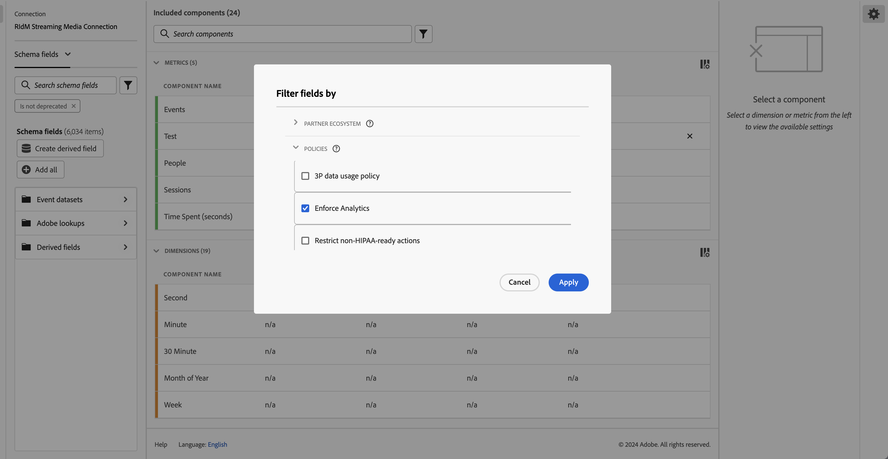

# Adobe Experience Platform Data Governance に対する CJA のサポート

CJA との統合 [Adobe Experience Platform Data Governance](https://experienceleague.adobe.com/docs/experience-platform/data-governance/home.html?lang=en) では、機密性の高い CJA データのラベル付けとプライバシーポリシーの実施を可能にします。

Experience Platformが使用するデータセットで作成されたプライバシーラベルとポリシーは、 CJA データビューワークフローで表示できます。 これらのラベルは、機密性の高いフィールドから指標やディメンションを作成するユーザーに対して、停止または警告を出します。

また、データが CJA から（レポート、書き出し、API などを介して）書き出されると、警告またはラベルが追加され、特定の方法で処理する必要のある機密情報がレポートに含まれていることをユーザーに通知します。

この統合により、コンプライアンスをより簡単に管理できます。 組織のデータ管理人は、使用を制限するポリシーを設定できます。 その結果、CJA ユーザーは、データ管理人が定義したポリシーに準拠していることを知り、より自信を持ってデータを使用できます。

## Adobe Experience Platformでのラベル付けとポリシー

データセットをExperience Platformで作成する際に、 [データ使用ラベル](https://experienceleague.adobe.com/docs/experience-platform/data-governance/labels/reference.html?lang=en) の一部またはすべての要素が含まれている場合。 これまで、これらのラベルは CJA では公開されていませんでした。 このリリースでは、これらのラベルを CJA で表示できます。 CJA にとって特に重要なのは、C8 ラベルです。このラベルは、「データを組織の Web サイトやアプリの測定に使用することはできません」と表しています。

ラベル付け自体は、これらのデータ使用ラベルが適用されるという意味ではありません。 それが政策の目的です ポリシーは、 [ポリシーサービス API](https://experienceleague.adobe.com/docs/experience-platform/data-governance/api/overview.html?lang=en) Experience Platform

ポリシーには次の 2 つのコンポーネントがあります。制限されたデータ使用ポリシーのコンテキスト内でデータコンシューマーが実行できるデータラベルとマーケティングアクション。 CJA のコンテキストでは、2 つのAdobe定義 [マーケティングアクション](https://experienceleague.adobe.com/docs/experience-platform/data-governance/policies/overview.html?lang=en#appendix) は重要です。

* Analytics — 組織のサイトやアプリの消費者使用状況の測定、分析、レポートなど、分析目的でデータを使用します。

* サードパーティへのデータの書き出しなど、Adobe環境からこのデータを書き出す。

ポリシーと共にラベルとマーケティングアクションを結び付け、ポリシーをオンにします。 このポリシーは、ラベルとマーケティングアクションを使用し、次のように記述します。この制限を適用します。 CJA では、次の 2 つのAdobe定義ポリシーが表示されます。

* Analytics ポリシー
* ダウンロードポリシー

## CJA データビューでのデータラベルの表示

Experience Platformで作成したデータラベルは、データビューユーザーインターフェイスの 3 つの場所に表示されます。

| 場所 | 説明 |
| --- | --- |
| スキーマフィールドの情報ボタン | このボタンをクリックすると、現在フィールドに適用されているデータ使用ラベルが示されます。
 |
| の下の右パネル [コンポーネント設定](/help/data-views/component-settings/overview.md) | データ使用ラベルは次のとおりです。
 |
| データラベルを列として追加 | データビューの「含まれるコンポーネント」列にデータラベルを列として追加できます。 列セレクターアイコンをクリックして、「データ使用状況ラベル」を選択します。
 |

### CJA のデータガバナンスラベルに対するフィルター

データビューエディターで、左側のトレールのフィルターアイコンをクリックし、データビューコンポーネントをデータガバナンスラベルでフィルタリングします。

### CJA のデータガバナンスポリシーに対するフィルター

分析または書き出しの目的で特定の CJA データビュー要素の使用をブロックするポリシーがオンになっているかどうかを確認できます。

再度、左側のパネルでフィルターアイコンをクリックし、「データガバナンス」で「ポリシー」をクリックします。

ポリシーをオンにした場合、特定のデータラベル（C8 など）が関連付けられているこれらのスキーマフィールドは、CJA Workspace 内での分析やダウンロード（PDF の電子メール送信や共有など）に使用できません。

以下の点に注意してください。

* データビューに追加することはできません。 これらのフィールドは、左側のパネルのスキーマフィールドリストで灰色表示になります。
* フィールドがブロックされたデータビューは保存できません。

