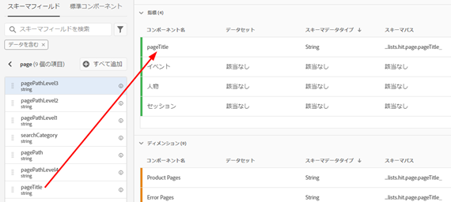
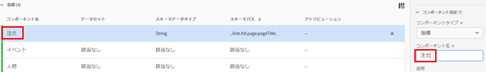
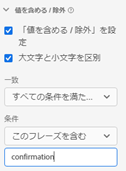
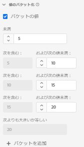
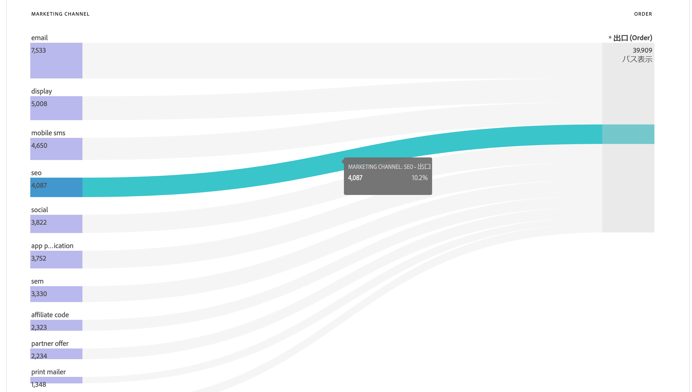
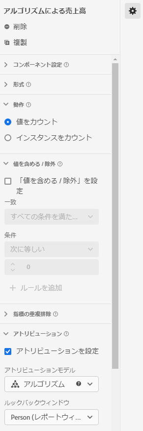

# データビューの使用例

これらの使用例では、Customer Journey Analytics におけるデータビューの柔軟性と能力を示しています。

## 1. 文字列スキーマフィールドから指標を作成する {#string}

例えば、データビューを作成する場合、文字列の [!UICONTROL pageTitle] スキーマフィールドから [!UICONTROL 注文件数]指標を作成できます。手順は次のとおりです。

1. 「コンポーネント」タブで、[!UICONTROL pageTitle] を「[!UICONTROL 含まれるコンポーネント]」の下の「[!UICONTROL 指標]」セクションにドラッグします。
   
1. ドラッグした指標を強調表示し、右側の「[!UICONTROL コンポーネント設定]」の下で名前を変更します。
   
1. 右側の[!UICONTROL 値を含む / 除外する]ダイアログを開き、次の内容を指定します。
   

   「confirmation」フレーズは、これが注文であることを示します。これらの条件が満たされたページタイトルをすべて確認すると、インスタンスごとに「1」がカウントされます。結果は、（計算指標ではなく）新しい指標になります。値を含めた／除外した指標は、他の指標を使用できるすべての場所で使用できます。Attribution IQ、フィルターなど、標準指標を使用できるあらゆる場所で機能します。
1. [!UICONTROL セッション]を[!UICONTROL ルックバックウィンドウ]として、[!UICONTROL ラストタッチ]など、この指標のアトリビューションモデルをさらに指定できます。
また、同じフィールドから別の[!UICONTROL 注文件数]指標を作成し、その指標に対して別のアトリビューションモデル（[!UICONTROL ファーストタッチ]など）と別の[!UICONTROL ルックバックウィンドウ]（[!UICONTROL 30 日]など）を指定できます。

もう 1 つの例として、訪問者 ID（ディメンション）を指標として使用し、会社の訪問者 ID の数を判断します。

## 2. 整数をディメンションとして使用する {#integers}

以前は、整数は CJA で指標として自動的に扱われていました。現在は、数値（Adobe Analytics のカスタムイベントを含む）をディメンションとして扱うことができます。次に例を示します。

1. [!UICONTROL call_length_min] 整数を「[!UICONTROL 含まれるコンポーネント]」の下の「[!UICONTROL ディメンション]」セクションにドラッグします。

   

1. これで、「[!UICONTROL 値のグループ化]」を追加して、このディメンションをグループ化してレポートに表示できます。（グループ化を使用しない場合、このディメンションの各インスタンスはワークスペースレポートに行項目として表示されます）。

   

## 3. フロー図で数値ディメンションを「指標」として使用する {#numeric}

数値ディメンションを使用して、[!UICONTROL フロー]ビジュアライゼーションに「指標」を取り込むことができます。

1. データビューの「[コンポーネント](https://experienceleague.adobe.com/docs/analytics-platform/using/cja-dataviews/create-dataview.html?lang=ja#configure-component-settings) 」タブで、[!UICONTROL マーケティングチャネル]スキーマフィールドを「[!UICONTROL 含まれるコンポーネント]」の下の「[!UICONTROL 指標]」領域にドラッグします。
2. ワークスペースレポートでは、このフローは、[!UICONTROL マーケティングチャネル]が[!UICONTROL 注文]に進むことを示します。

## 4. サブイベントをフィルタリングする {#sub-event}

この機能は、特に配列ベースのフィールドに適用できます。含める／除外する機能では、サブイベントレベルでフィルタリングを実行できますが、フィルタービルダーに組み込まれているフィルター（セグメント）では、イベントレベルでのみフィルタリングを実行できます。そのため、データビューで「含める／除外する」を使用してサブイベントフィルタリングを実行し、イベントレベルのフィルターでその新しい指標／ディメンションを参照できます。

例えば、データビューの含める／除外する機能を使用して、50 ドル以上の売り上げをもたらした製品にのみ焦点を当てます。そのため、1 件の注文に 50 ドルの製品購入と 25 ドルの製品購入が含まれる場合、注文全体ではなく、25 ドルの製品購入のみを除外します。

1. データビュー「[コンポーネント](https://experienceleague.adobe.com/docs/analytics-platform/using/cja-dataviews/create-dataview.html#configure-component-settings) 」タブで、「[!UICONTROL 売上高]」スキーマフィールドを「[!UICONTROL 含まれるコンポーネント]」の下の「[!UICONTROL 指標]」領域にドラッグします。
1. 指標を選択し、右側で次の項目を設定します。
a.「[!UICONTROL 形式]」で、「[!UICONTROL 通貨]」を選択します。
b.「[!UICONTROL 通貨]」で、「USD」を選択します。
c. 「[!UICONTROL 含める / 除外する値]」で、「[!UICONTROL 含める / 除外する値を設定]」の横にあるチェックボックスをオンにします。
d.「[!UICONTROL 一致]」で、「[!UICONTROL すべての条件を満たす場合]」を選択します。
e.「[!UICONTROL 条件]」で、「[!UICONTROL 次よりも大きいまたは等しい]」を選択します。
f. 値として「50」を指定します。

これらの新しい設定では、値の大きい売上高のみを表示し、50 ドルを下回るものはすべて除外できます。

## 5. 「[!UICONTROL 値なしオプション]」設定を利用します {#no-value}

会社はユーザーのトレーニングに時間を費やしており、レポートで「未指定」と表示される可能性があります。データビューのデフォルトは「値なし」です。 データビュー UI で、[「値なし」を「未指定」に変更](https://experienceleague.adobe.com/docs/analytics-platform/using/cja-dataviews/create-dataview.html?lang=ja#configure-no-value-options-settings)できるようになりました。

もう 1 つの例として、メンバーシッププログラム登録のディメンションがあります。 この場合、「値なし」を「メンバーシッププログラム登録なし」に名称変更できます。

## 6. 異なる[!UICONTROL アトリビューション]設定を持つ複数の指標を作成する {#attribution}

右上の[!UICONTROL 複製]機能を使用し、[!UICONTROL ファーストタッチ]、[!UICONTROL ラストタッチ]、[!UICONTROL アルゴリズム]など、アトリビューション設定の異なる多数の売上高指標を作成します。

各指標には、違いを反映した名前を設定するようにしてください（「アルゴリズムによる売上高」など）。

その他のデータビューの設定について詳しくは、「[データビューの作成](/help/data-views/create-dataview.md)」を参照してください。
データビューの概念的な概要については、「[データビューの概要](/help/data-views/data-views.md)」を参照してください。

## 7. 新規セッションレポートとリピートセッションレポート {#new-repeat}

>[!NOTE]
>
>この機能は、現在、限定的にテスト中です。

このデータビューに対して定義したレポートウィンドウと 13 か月のルックバックウィンドウに基づいて、セッションがユーザーにとって実際に初めてのセッションであるかどうかを判断できます。このレポートを使用すると、次のような情報を確認できます。

* 注文件数の何パーセントが新規セッションとリピートセッションから来るものなのか。

* 任意のマーケティングチャネルまたは特定のキャンペーンについて、初めてのユーザーと再来訪ユーザーのどちらをターゲティングしているのか。これらの選択がコンバージョン率にどのように影響したか。

次の 3 つのコンポーネントによって、このレポーティングが促進されます。

* 1 ディメンション：[セッションタイプ](https://experienceleague.adobe.com/docs/analytics-platform/using/cja-dataviews/component-reference.html?lang=ja#optional) - このディメンションには次の 2 つの値があります。1) [!UICONTROL 新規] および 2) [!UICONTROL 再来訪]。この[!UICONTROL 新規]行項目には、ユーザーの定義された最初のセッションと判断されたセッションのすべての動作（このディメンションに対する指標）が含まれます。その他すべては、[!UICONTROL 再来訪]行項目（すべてがセッションに属すると仮定）に含まれます。指標がセッションに含まれていない場合は、このディメンションの「該当なし」バケットに入ります。

* 2 指標：[新規セッション、再来訪セッション](https://experienceleague.adobe.com/docs/analytics-platform/using/cja-dataviews/component-reference.html?lang=en#optional)。新規セッションは、レポートウィンドウ内でのユーザーの定義された最初のセッションと定義されます。再来訪セッションは、ユーザーの初めてのセッションではなかったセッションの数です。

これらのコンポーネントにアクセスするには：

1. データビューエディターに移動します。
1. 「**[!UICONTROL コンポーネント]**」をクリックし、左パネルにある「**[!UICONTROL オプションの標準コンポーネント]**」タブをクリックします。
1. データビューにドラッグします。

95%～99%の確率で、新規セッションが正確に報告されます。唯一の例外は次のとおりです。

* 13 か月間のルックバックウィンドウの前に最初のセッションが発生した場合。このセッションは無視されます。

* セッションがルックバックウィンドウとレポートウィンドウの両方にまたがっている場合。2022年6月1日から 6月15日までにレポートを実行したとします。ルックバックウィンドウは、2021年5月1日から 2022年5月31日までです。 2022年5月30日に開始し、2022年6月1日に終了した場合、セッションはルックバックウィンドウに含まれるので、レポートウィンドウのすべてのセッションは、再来訪セッションとしてカウントされます。

