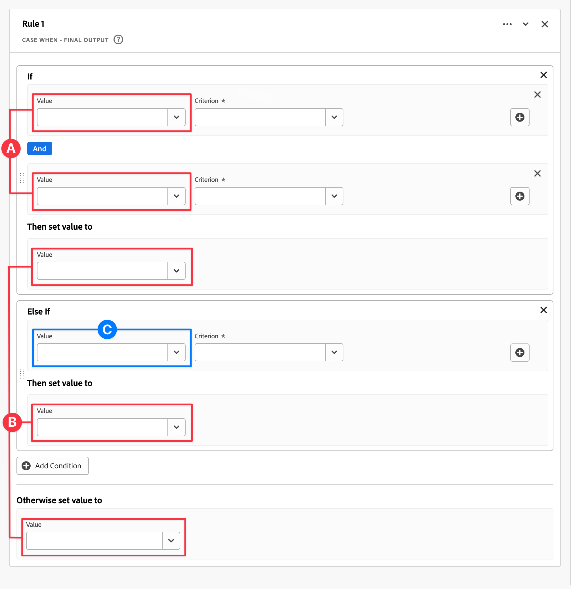
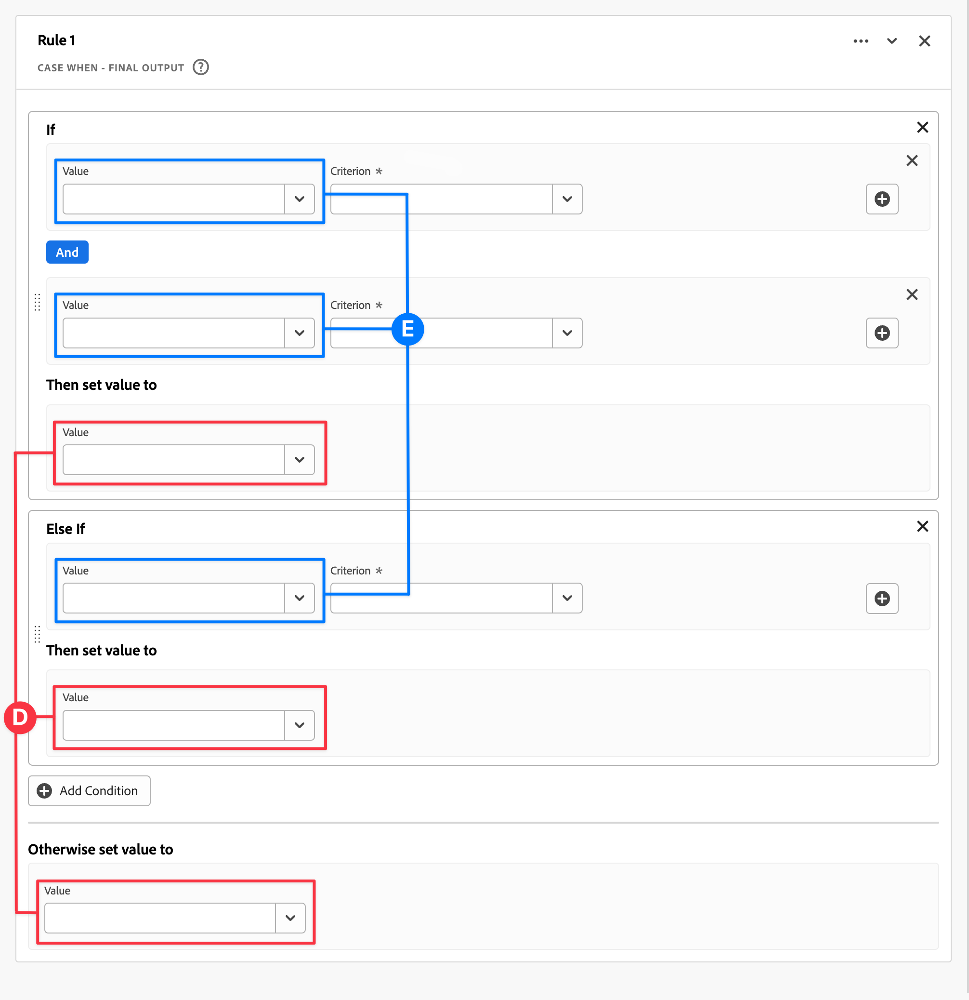

# 派生フィールド

{{release-limited-testing}}

派生フィールドは、Customer Journey Analytics(CJA) のリアルタイムレポート機能の重要な側面です。 派生（カスタム）フィールドを使用すると、カスタマイズ可能なルールビルダーを通じて、（多くの場合、複雑な）データ操作をその場で定義できます。 その派生フィールドを、 [Workspace](../../analysis-workspace/home.md) または、さらに、 [データビュー](../data-views.md).

派生フィールドを使用すると、CJA 以外の他の場所でデータを変換または操作する場合と比べて、大幅な時間と労力を節約できます。 例： [データ準備](https://experienceleague.adobe.com/docs/experience-platform/data-prep/home.html?lang=ja), [データDistiller](https://experienceleague.adobe.com/docs/experience-platform/query/data-distiller/overview.html?lang=en)または独自の変換読み込みの抽出 (ETL)/読み込み変換の抽出 (ELT) プロセス内で実行できます。

派生フィールドは、 [データビュー](../data-views.md)は、ルールとして定義された一連の関数に基づき、使用可能な標準フィールドやスキーマフィールドに適用されます。

使用例を次に示します。

- ページ名の値を正しく修正するために、収集された不適切なページ名の値を修正するカスタムのページ名フィールドを定義します。

- 1 つ以上の条件（URL パラメーター、ページ URL、ページ名など）に基づいて適切なマーケティングチャネルを決定する、カスタムの「マーケティングチャネル」フィールドを定義します。

## カスタムフィールドインターフェイス

カスタムフィールドを作成または編集する場合、カスタムフィールドインターフェイスを使用します。

|  | 名前 | 説明 |
|---------|----------|--------|
| 1 | **セレクター** | セレクター領域を使用して、  関数 関数テンプレート スキーマフィールド、または標準フィールドをルールビルダーに追加します。  ドロップダウンを使用して、次の中から選択します。 [!UICONTROL 関数], [!UICONTROL 関数テンプレート], [!UICONTROL スキーマフィールド]、および [!UICONTROL 標準フィールド]. 関数、関数テンプレート、スキーマ、標準フィールドは、  検索ボックス。  選択したオブジェクトのリストをフィルタするには、  フィルターを設定し、 [!UICONTROL 次の条件でフィールドをフィルター] ダイアログ。 フィルターを簡単に削除するには、  フィルターごとに |
| 2 | **ルールビルダー** | カスタムフィールドは、1 つ以上のルールを使用して順番に作成します。 ルールは、関数の特定の実装なので、常に 1 つの関数にのみ関連付けられます。 ルールを作成するには、関数をルールビルダーにドラッグ&amp;ドロップします。 関数の型によって、ルールのインターフェイスが決まります。 詳しくは、 [ルールインターフェイス](#rule-interface) を参照してください。  関数は、ルールビルダーで既に使用可能なルールの開始、終了または中間に挿入できます。 ルールビルダーの最後のルールによって、カスタムフィールドの最終出力が決まります。 |
| 3 | **[!UICONTROL **&#x200B;フィールド設定&#x200B;**]** | カスタムフィールドに名前を付け、説明し、そのフィールドタイプを調べることができます。 |
| 4 | **[!UICONTROL **&#x200B;最終出力&#x200B;**]** | この領域には、過去 30 日間のデータと、ルールビルダーのカスタムフィールドに加えた変更に基づき、出力値のプレビューがその場で表示されます。 |

{style="table-layout:auto"}

カスタムフィールドインターフェイスに初めてアクセスしたとき、 [!UICONTROL フィールドテンプレートから開始] ウィザードが表示されます。

1. 作成しようとしているフィールドのタイプに最も適したテンプレートを選択します。
2. を選択します。 **[!UICONTROL **&#x200B;選択&#x200B;**]** ボタンをクリックして続行します。

カスタムフィールドダイアログには、選択したフィールドのタイプに必要なルール（および関数）が入力されます。 詳しくは、 [関数テンプレート](#function-templates) を参照してください。

## ルールインターフェイス

ルールビルダーでルールを定義する場合、ルールインターフェイスを使用します。

|  | 名前 | 説明 |
|---------|----------|--------|
| A | **ルール名** | デフォルトでは、ルール名は **ルール X** （X はシーケンス番号を参照）。 ルールの名前を編集するには、ルールの名前を選択し、新しい名前を入力します（例： ）。 `Query Parameter`. |
| B | **関数名** | ルールの選択された関数名（例： ）。 [!DNL URL PARSE]. 関数が関数のシーケンスの最後で、最終的な出力値を決定する場合、関数名の後に [!DNL FINAL OUTPUT]例： [!DNL URL PARSE - FINAL OUTPUT].  関数の詳細情報を含むポップアップを表示するには、 . |
| C | **ルールの説明** | オプションで、ルールに説明を追加できます。 選択 を選択し、「 **[!UICONTROL **&#x200B;説明を追加&#x200B;**]** 説明を追加するには、または **[!UICONTROL **&#x200B;説明を編集&#x200B;**]** 既存の説明を編集する場合。 説明を入力するには、エディターを使用します。 ツールバーを使用して、テキストの書式設定（スタイルセレクター、太字、斜体、下線、右、左、中央揃え、色、番号リスト、箇条書きリストを使用）や、外部情報へのリンクの追加を行うことができます。  説明の編集を終了するには、エディターの外側をクリックします。 |
| D | **機能領域** | 関数のロジックを定義します。 インターフェイスは、関数のタイプによって異なります。 詳しくは、 [関数リファレンス](#function-reference) を参照してください。 |

{style="table-layout:auto"}

## カスタムフィールドの作成

1. 既存のデータビューを選択するか、データビューを作成します。 詳しくは、 [データビュー](../data-views.md) を参照してください。

2. を選択します。 **[!UICONTROL **&#x200B;コンポーネント&#x200B;**]** 」タブをクリックします。

3. 選択 **[!UICONTROL **&#x200B;カスタムフィールドを作成&#x200B;**]** をクリックします。

4. カスタムフィールドを定義するには、 [!UICONTROL カスタムフィールドを作成] インターフェイス。 詳しくは、 [カスタムフィールドインターフェイス](#custom-field-interface).

   新しいカスタムフィールドを保存するには、「 **[!UICONTROL **&#x200B;保存&#x200B;**]**.

5. 新しいカスタムフィールドが **[!UICONTROL **&#x200B;カスタムフィールド >**]** コンテナ、 **[!UICONTROL **&#x200B;スキーマフィールド&#x200B;**]** をクリックします。

## カスタムフィールドの編集

1. 既存のデータビューを選択します。 詳しくは、 [データビュー](../data-views.md) を参照してください。

2. を選択します。 **[!UICONTROL **&#x200B;コンポーネント&#x200B;**]** 」タブをクリックします。

3. 選択 **[!UICONTROL **&#x200B;スキーマフィールド&#x200B;**]** 」タブをクリックします。 [!UICONTROL 接続] 」パネルを開きます。

4. 選択 **[!UICONTROL **&#x200B;カスタムフィールド >**]** コンテナ。

5. 編集するカスタムフィールドにカーソルを移動し、「 」を選択します。 .

6. カスタムフィールドを編集するには、 [!UICONTROL カスタムフィールドを編集] インターフェイス。 詳しくは、 [カスタムフィールドインターフェイス](#custom-field-interface).

   - 選択 **[!UICONTROL **&#x200B;保存&#x200B;**]** 更新したカスタムフィールドを保存します。

   - 選択 **[!UICONTROL **&#x200B;キャンセル&#x200B;**]** をクリックして、カスタムフィールドに加えた変更をキャンセルします。

   - 選択 **[!UICONTROL **&#x200B;名前を付けて保存&#x200B;**]** をクリックして、カスタムフィールドを新しいカスタムフィールドとして保存します。 新しいカスタムフィールドの名前は、元の編集済みカスタムフィールドの名前と同じで、 `(copy)` を追加しました。

## カスタムフィールドの削除

1. 既存のデータビューを選択します。 詳しくは、 [データビュー](../data-views.md) を参照してください。

2. を選択します。 **[!UICONTROL **&#x200B;コンポーネント&#x200B;**]** 」タブをクリックします。

3. 選択 **[!UICONTROL **&#x200B;スキーマフィールド&#x200B;**]** タブ [!UICONTROL 接続] ウィンドウ

4. 選択 **[!UICONTROL **&#x200B;カスタムフィールド >**]** コンテナ。

5. 削除するカスタムフィールドの上にマウスポインターを置いて、「 .

6. 使用中 **[!UICONTROL **&#x200B;カスタムフィールドを編集&#x200B;**]** インタフェースで、「削除」を選択します。

   A [!UICONTROL コンポーネントを削除] 削除を確認するダイアログが表示されます。 データビューの外部にあるカスタムフィールドに対する外部参照が存在する可能性があるとします。

   - 選択 **[!UICONTROL **&#x200B;続行&#x200B;**]** をクリックして、カスタムフィールドを削除します。

## 関数テンプレート

特定の使用例に合わせてカスタムフィールドをすばやく作成するには、関数テンプレートを使用できます。 これらの関数テンプレートは、カスタムフィールドインターフェイスの「セレクター」領域からアクセスできます。また、 [!UICONTROL フィールドテンプレートから開始] ウィザード。

### マーケティングチャネル

このテンプレートは、 [Url 解析](#dnl-url-parse) および [例：](#dnl-case-when) は複数回関数を使用して、URL から適切な値を取得します。 次に、これらの値にロジックが適用され、URL が特定のマーケティングチャネルに関連付けられます。

+++ 詳細

このテンプレートを使用するには、テンプレートのルールの一部としてリストされている各関数に対して正しいパラメーターを指定する必要があります。 詳しくは、 [関数リファレンス](#function-reference) を参照してください。

+++

<!--

+++ Data clean up template

>[!WARNING]
>
>Could not find any information on this template.
+++

-->

## 関数リファレンス

サポートされる各関数について、以下の詳細を確認します。

- 仕様：
   - 入力データタイプ：サポートされるデータのタイプ
   - 入力：入力に指定可能な値
   - 含まれる演算子：この関数でサポートされる演算子（存在する場合）
   - 制限：この関数で使用できるルールの最大数は、派生フィールドで使用できます。
   - 出力。

- 次のような使用例です。
   - カスタムフィールドを定義する前のデータ
   - カスタムフィールドの定義方法
   - カスタムフィールドを定義した後のデータ

- dependencies （オプション）

<!-- Concatenate -->

### [!DNL Concatenate]

2 つ以上のフィールド、カスタムフィールドまたはユーザーが入力した値を、定義した区切り文字で 1 つのフィールドに結合します。

+++ 詳細

## 仕様 {#concatenate-io}

| データタイプを入力 | 入力 | 含まれる演算子 | 上限 | 出力 |
|---|---|---|:--:|---|
| 
文字列
 | <ul><li>2 つ以上の値を組み合わせます<ul><li>フィールド</li><li>以前のルールから派生した値</li><li>ユーザー入力値</li></ul></li><li>ペア区切り<ul><li>各値の区切り文字の入力または選択</li></ul></li> </ul> | 
該当なし
 | 
2
 | 
新しいカスタムフィールド
 |

{style="table-layout:auto"}

## ユースケース {#concatenate-uc}

現在、オリジンおよび目的地の空港コードを別々のフィールドとして収集しています。 2 つのフィールドを結合して、ハイフン (-) で区切られた 1 つのディメンションにします。 したがって、接触チャネルと宛先の組み合わせを分析して、予約済みの上位ルートを特定できます。

前提条件：

- 同じテーブル内の別々のフィールドで、接触チャネルと宛先の値が収集されます。
- ユーザーは、値の間に区切り文字「 — 」を使用することを決定します。

次の予約が発生するとします。

- お客様 ABC123 は、Salt Lake City(SLC) と Orlando(MCO) 間のフライトを予約しています
- 顧客 ABC456 は、Salt Lake City(SLC) と Los Angeles(LAX) 間のフライトを予約しています
- お客様 ABC789 は、Salt Lake City(SLC) と Seattle(SEA) 間のフライトを予約しています
- お客様 ABC987 は、Salt Lake City(SLC) と San Jose(SJO) 間のフライトを予約しています
- お客様 ABC654 は、Salt Lake City(SLC) と Orlando(MCO) 間のフライトを予約しています

目的のレポートは次のようになります。

| 起源/宛先 | 予約 |
|----|---:|
| SLC-MCO | 2 |
| SLC-LAX | 1 |
| SLC-SEA | 1 |
| SLC-SJO | 1 |

{style="table-layout:auto"}

### 次より前のデータ {#concatenate-uc-databefore}

| 接触チャネル | 宛先 |
|----|---:|
| SLC | MCO |
| SLC | LAX |
| SLC | SEA |
| SLC | SJO |
| SLC | MCO |

{style="table-layout:auto"}

### カスタムフィールド {#concatenate-customfield}

新しい **[!UICONTROL ** Origin - Destination **]** カスタムフィールド。 次を使用する **[!UICONTROL 連結]** 関数を使用して [!UICONTROL オリジナル] および [!UICONTROL 宛先] を使用するフィールド `-` [!UICONTROL 区切り].

![[!DNL Concatenate] ルール](assets/concatenate.png)

### 後のデータ {#concatenate-dataafter}

| Origin - Destination （カスタムフィールド） |
|---|
| SLC-MCO |
| SLC-LAX |
| SLC-SEA |
| SLC-SJO |
| SLC-MCO |

{style="table-layout:auto"}

+++

<!-- CASE WHEN -->

### [!DNL Case When]

1 つ以上のフィールドの定義された条件に基づいて条件を適用します。 次に、これらの条件を使用して、条件の順序に基づいて新しいカスタムフィールドの値を定義します。

+++ 詳細

## 仕様 {#casewhen-io}

| データタイプを入力 | 入力 | 含まれる演算子 | 上限 | 出力 |
|---|---|---|:---:|---|
| <ul><li>文字列</li><li>数値</li><li>Date/Date-Time</li></ul> | <ul><li>入力フィールド</li><li>条件</li></ul> | 
<u>文字列</u>
<ul><li>次と等しい</li><li>いずれかの語句と等しい</li><li>フレーズを含む</li><li>いずれかの語句を含む</li><li>すべての語句を含む</li><li>次の語句で始まる</li><li>任意の語句で始まる</li><li>次の語句で終わる</li><li>任意の語句で終わる</li><li>次と等しくない</li><li>いずれの語句も含まない</li><li>このフレーズを含まない</li><li>いずれの語句も含まない</li><li>すべての語句を含まない</li><li>次で始まらない</li><li>どの用語でも始まらない</li><li>次で終わらない</li><li>次の語句で終わらない</li><li>設定済み</li><li>未設定</li></ul>
<u>数値</u>
<ul><li>次と等しい</li><li>次と等しくない</li><li>次より大きい</li><li>次よりも大きいか等しい</li><li>次より小さい</li><li>次よりも小さいか等しい</li><li>設定済み</li><li>未設定</li></ul>
<u>日付</u>
<ul><li>次と等しい</li><li>次と等しくない</li><li>次より後</li><li>次より後または等しい</li><li>次の値より前</li><li>次より前または等しい</li><li>設定済み</li><li>未設定</li></ul> | 
5
 | 
新しいカスタムフィールド
 |

{style="table-layout:auto"}

## 使用例 1 {#casewhen-uc1}

様々なマーケティングチャネルを識別するルールを定義するには、カスケードロジックを適用してマーケティングチャネルフィールドを適切な値に設定します。

- リファラーが検索エンジンからのもので、ページにクエリー文字列値が含まれている場合、 `cid` 次を含む `ps_`に値を指定する場合、マーケティングチャネルは **有料検索**.
- リファラーが検索エンジンからのもので、ページにクエリ文字列がない場合 `cid`に値を指定する場合、マーケティングチャネルは **自然検索**.
- ページにクエリー文字列値がある場合、 `cid` 次を含む `em_`に値を指定する場合、マーケティングチャネルは **電子メール**.
- ページにクエリー文字列値がある場合、 `cid` 次を含む `ds_`に値を指定する場合、マーケティングチャネルは **ディスプレイ広告**.
- ページにクエリー文字列値がある場合、 `cid` 次を含む `so_`に値を指定する場合、マーケティングチャネルは **有料ソーシャル**.
- リファラーがtwitter.com、facebook.com、linkedin.com または tiktok.com の参照ドメインからのものである場合、マーケティングチャネルは **自然社会**.
- 上記のルールがいずれも一致しない場合は、マーケティングチャネルを **その他のリファラー**.

サイトがリファラーとページ URL を含む次のサンプルイベントを受け取った場合、これらのイベントは次のように識別する必要があります。

| イベント | リファラー | ページ URL | マーケティングチャネル |
|:--:|----|----|----|
| 1 | `https://facebook.com` | `https://site.com/home` | 自然社会 |
| 2 | `https://abc.com` | `https://site.com/?cid=ds_12345678` | 表示 |
| 3 |  | `https://site.com/?cid=em_12345678` | 電子メール |
| 4 | `https://google.com` | `https://site.com/?cid=ps_abc098765` | 有料検索 |
| 5 | `https://google.com` | `https://site.com/?cid=em_765544332` | 電子メール |
| 6 | `https://google.com` |  | 自然検索 |

{style="table-layout:auto"}

### 次より前のデータ {#casewhen-uc1-databefore}

| リファラー | ページ URL |
|----|----|
| `https://facebook.com` | `https://site.com/home` |
| `https://abc.com` | `https://site.com/?cid=ds_12345678` |
|  | `https://site.com/?cid=em_12345678` |
| `https://google.com` | `https://site.com/?cid=ps_abc098765` |
| `https://google.com` | `https://site.com/?cid=em_765544332` |
| `https://google.com` |

{style="table-layout:auto"}

### カスタムフィールド {#casewhen-uc1-customfield}

新しい `Marketing Channel` カスタムフィールド。 次を使用する **[!UICONTROL 次の場合にケース]** 関数を使用して、両方の `Page URL` および `Referring URL` フィールドに入力します。

関数の使用に注意してください **[!UICONTROL ** URL 解析&#x200B;**]** 値を取得するルールを定義するには `Page Url` および `Referring Url` の前 **[!UICONTROL **&#x200B;次の場合にケース&#x200B;**]** ルールが適用されます。

![[!DNL Case when] ルール 1](assets/case-when-1.png)

### 後のデータ {#casewhen-uc1-dataafter}

| マーケティングチャネル |
|----|
| 自然社会 |
| 表示 |
| 電子メール |
| 有料検索 |
| 電子メール |
| 自然検索 |

{style="table-layout:auto"}

## 使用例 2 {#casewhen-uc2}

「製品の検索方法」ディメンション内で、様々なバリエーションの検索を収集している。 検索と参照の全体的なパフォーマンスを理解するには、結果を手動で組み合わせるのに非常に時間を費やす必要があります。

サイトは、製品検索方法ディメンションに対して次の値を収集します。 最後に、これらの値はすべて検索を示します。

| 収集された値 | 実際の値 |
|---|---|
| p13n_no を検索 | 検索 |
| p13n_yes を検索 | 検索 |
| 検索 refine p13n_no | 検索 |
| 検索 refine p13n_yes | 検索 |
| redirect p13n_yes を検索 | 検索 |
| search-redirect | 検索 |

{style="table-layout:auto"}

### 次より前のデータ {#casewhen-uc2-databefore}

| 製品検索方法 |
|----|
| p13_no を検索 |
| p13_yes を検索する |
| 閲覧 |
| p13_no を検索 |
| p13_yes を検索 |
| 閲覧 |
| redirect p13_yes を検索 |
| search-redirect |
| 閲覧 |

{style="table-layout:auto"}

### カスタムフィールド {#casewhen-uc2-customfield}

次の項目を定義します。 `Product Finding Methods (new)` カスタムフィールド。 次を作成します **[!UICONTROL **&#x200B;次の場合にケース&#x200B;**]** ルールを作成します。 これらのルールは、古い **[!UICONTROL **&#x200B;製品検索方法&#x200B;**]** フィールド値 `search` および `browse` の使用 **[!UICONTROL フレーズを含む]** 条件

![[!DNL Case When] ルール 2](assets/case-when-2.png)

### 後のデータ {#casewhen-uc2-dataafter}

| 製品検索方法（新規） |
|----|
| 検索 |
| 検索 |
| 閲覧 |
| 検索 |
| 検索 |
| 閲覧 |
| 検索 |
| 検索 |
| 閲覧 |

{style="table-layout:auto"}

## 使用例 3 {#casewhen-uc3}

旅行会社の場合、予約済みのトリップのトリップ期間をバケット化して、トリップのグループ長をレポートできます。

前提条件：

- 組織は、数値フィールドに対してトリップ期間を収集しています。
- 1 ～ 3 日の期間を「短い旅」と呼ばれるバケットにグループ化する必要があります。
- 4 ～ 7 日の期間を「中旅」と呼ばれるバケットにグループ化する必要があります。
- 8 日以上の期間を「長い旅行」と呼ばれるバケットにグループ化する必要があります。
- 132 回の旅行は 1 日間予約されていた
- 110 回の旅行が 2 日間の予約を受けていた
- 105 回の旅行は 3 日間の予約を受けていた
- 99 回の旅行は 4 日間の予約を受けていた
- 92 回の旅行は 5 日間予約されていた
- 85 回の旅行は 6 日間予約されていた
- 82 回の旅行は、7 日間の予約を受けていた
- 78 回の旅行は 8 日間予約されていた
- 50 回の旅行は 9 日間予約されていた
- 44 回の旅行は 10 日間の予約を受けていた
- 38 回の旅行は 11 日間の予約を受けていた
- 31 回の旅行は 12 日間予約されていた

目的のレポートは次のようになります。

| 旅行期間のタイプ | 予約 |
|----|---:|
| 中途半端な旅行 | 358 |
| 短い旅 | 347 |
| 長旅 | 241 |

{style="table-layout:auto"}

### 次より前のデータ {#casewhen-uc3-databefore}

| 旅行期間 |
|---:|
| 1 |
| 12 |
| 3 |
| 6 |
| 4 |
| 8 |
| 6 |
| 2 |
| 1 |
| 2 |
| 21 |
| 8 |

### カスタムフィールド {#casewhen-uc3-customfield}

次の項目を定義します。 `Trip Duration (bucketed)` カスタムフィールド。 次を作成します **[!UICONTROL **&#x200B;次の場合にケース&#x200B;**]** ルールビルダーのルールを参照してください。 このルールは、古い **[!UICONTROL **&#x200B;旅行期間&#x200B;**]** フィールドの値を 3 つの値に変換します。 `short trip`, `medium  trip`、および `long trip`.

![[!DNL Case When] ルール 3](assets/case-when-3.png)

### 後のデータ {#casewhen-uc3-dataafter}

| 旅行期間（グループ） |
|---|
| 短い旅 |
| 長旅 |
| 短い旅 |
| 中途半端な旅行 |
| 中途半端な旅行 |
| 長旅 |
| 中途半端な旅行 |
| 短い旅 |
| 短い旅 |
| 短い旅 |
| 長旅 |
| 長旅 |

## 依存関係

値を選択して設定する際には、次の依存関係が適用されます。

|  | データセットの依存関係 |
|:---:|----|
| A | 値 _選択_ 同じ内部で [!UICONTROL If], [!UICONTROL Else If] 構文 ( [!UICONTROL および] または [!UICONTROL または]) を同じデータセットから作成する必要があります。 |
| B | すべての値 _設定_ 構成内およびルール間は、同じデータセットから作成する必要があります。 |
| C | 指定した値 _選択_ 横 [!UICONTROL If], [!UICONTROL Else If] ルール内の構成では、次の処理が行われます _not_ 同じデータセットから派生する必要があります。 |

{style="table-layout:auto"}

|  | タイプ依存関係 |
|:---:|----|
| D | 値のタイプ _設定_ ルール全体で同じにする必要があります。 |
| E | 値のタイプ _選択_ 構文内、またはルール内の複数の構成をまたいで、任意のタイプ（文字列、数値、日付）を指定できます。 |

{style="table-layout:auto"}

+++

<!-- FIND AND REPLACE -->

### [!DNL Find and Replace]

選択したフィールド内のすべての値を検索し、新しいカスタムフィールド内の別の値に置き換えます。

+++ 詳細

## 仕様 {#findreplace-io}

| データタイプを入力 | 入力 | 含まれる演算子 | 上限 | 出力 |
|---|---|---|:---:|---|
| 
文字列
 | <ul><li>「置き換えるタイミング」フィールドの条件</li><li>「次で置換」フィールド値<ul><li>ユーザー入力</li><li>別のフィールド</li></ul></li></ul> | 
<u>文字列</u>
<ul><li>すべてを検索してすべてを置換</li></ul> | 
1
 | 
新しいカスタムフィールド
 |

{style="table-layout:auto"}

## ユースケース {#findreplace-uc}

外部マーケティングチャネルレポートの値の形式が正しくありません。例： `email%20 marketing` の代わりに `email marketing`. これらの不正な値により、レポートが破壊され、E メールのパフォーマンスがより難しくなります。 置き換えますか？ `email%20marketing` と `email marketing`.

**元のレポート**

| 外部マーケティングチャネル | セッション数 |
|---|--:|
| 電子メールマーケティング | 500 |
| メール%20marketing | 24 |

{style="table-layout:auto"}

**優先レポート**

| 外部マーケティングチャネル | セッション数 |
|---|--:|
| 電子メールマーケティング | 524 |

### 次より前のデータ {#findreplace-uc-databefore}

| 外部マーケティング |
|----|
| 電子メールマーケティング |
| email%20marketing |
| 電子メールマーケティング |
| 電子メールマーケティング |
| email%20marketing |

{style="table-layout:auto"}

### カスタムフィールド {#findreplace-uc-customfield}

次の項目を定義します。 `Email Marketing (updated)` カスタムフィールド。 次を使用する **[!UICONTROL 検索と置換]** 関数を使用して、 `email%20marketing` と `email marketing`.

![[!DNL Find and Replace] ルール](assets/find-and-replace.png)

### 後のデータ {#findreplace-uc-dataafter}

| 外部マーケティング （カスタムフィールド） |
|----|
| 電子メールマーケティング |
| 電子メールマーケティング |
| 電子メールマーケティング |
| 電子メールマーケティング |
| 電子メールマーケティング |

{style="table-layout:auto"}

+++

<!-- LOOKUP -->

### [!DNL Lookup]

対応する値に置き換えられる参照値のセットを定義します。

+++ 詳細

## 仕様 {#lookup-io}

| データタイプを入力 | 入力 | 含まれる演算子 | 上限 | 出力 |
|---|---|---|:---:|---|
| <ul><li>文字列</li><li>数値</li><li>日付</li></ul> | <ul><li>フィールドを歌う</li><li>参照ファイル<ul><li>Key Column</li><li>新しいフィールド列</li></ul></li></ul> | 
該当なし
 | 
5
 | 
新しいカスタムフィールド
 |

{style="table-layout:auto"}

## 使用例 1 {#lookup-uc1}

次のキー列を含む CSV ファイルがあります： `hotelID` および `hotelID`: `city`, `rooms`, `hotel name`.
ディメンションで Hotel ID を収集していますが、 `hotelID` を CSV ファイルに追加します。

**CSV ファイルの構造とコンテンツ**

| hotelID | city | 部屋 | ホテル名 |
|---|---|---:|---|
| SLC123 | ソルトレイクシティ | 40 | SLC Downtown |
| LAX342 | ロスアンジェルス | 60 | LA エアポート |
| SFO456 | サンフランシスコ | 75 | Market Street |

{style="table-layout:auto"}

**現在のレポート**

| ホテル ID | 製品表示 |
|---|---:|
| SLC123 | 200 |
| LX342 | 198 |
| SFO456 | 190 |

{style="table-layout:auto"}

**目的のレポート**

| ホテル名 | 製品表示 |
|----|----:|
| SLC Downtown | 200 |
| LA エアポート | 198 |
| Market Street | 190 |

{style="table-layout:auto"}

### 次より前のデータ {#lookup-uc1-databefore}

| ホテル ID |
|----|
| SLC123 |
| LAX342 |
| SFO456 |

{style="table-layout:auto"}

### カスタムフィールド {#lookup-uc1-customfield}

次の項目を定義します。 `Hotel Name` カスタムフィールド。 次を使用する **[!UICONTROL **&#x200B;参照&#x200B;**]** 関数を使用して、 **[!UICONTROL **&#x200B;ホテル ID **]** フィールドに値を入力し、新しい値に置き換えます。

![[!DNL Lookup] ルール 1](assets/lookup-1.png)

### 後のデータ {#lookup-uc1-dataafter}

| ホテル名 |
|----|
| SLC Downtown |
| LA エアポート |
| Market Street |

{style="table-layout:auto"}

## 使用例 2 {#lookup-uc2}

複数のページのわかりやすいページ名の代わりに URL を収集した。 この値の組み合わせコレクションは、レポートを壊します。

### 次より前のデータ {#lookup-uc2-databefore}

| ページ名 |
|---|
| ホームページ |
| フライト検索 |
| `http://www.adobetravel.ca/Hotel-Search` |
| `https://www.adobetravel.com/Package-Search` |
| 契約およびオファー |
| `http://www.adobetravel.ca/user/reviews` |
| `https://www.adobetravel.com.br/Generate-Quote/preview` |

{style="table-layout:auto"}

### カスタムフィールド {#lookup-uc2-customfield}

次の項目を定義します。 `Page Name (updated)` カスタムフィールド。 次を使用する **[!UICONTROL **&#x200B;参照&#x200B;**]** 関数を使用して、既存の **[!UICONTROL **&#x200B;ページ名&#x200B;**]** フィールドに入力し、更新された正しい値に置き換えます。

![[!DNL Lookup] ルール 2](assets/lookup-2.png)

### 後のデータ {#lookup-uc2-dataafter}

| ページ名（更新） |
|---|
| ホームページ |
| フライト検索 |
| ホテルサーチ |
| パッケージ検索 |
| 契約およびオファー |
| レビュー |
| 見積もりの生成 |

+++

<!-- URL PARSE -->

### [!DNL URL Parse]

プロトコル、ホスト、パス、クエリーのパラメーターを含む、URL の様々な部分を解析します。

+++ 詳細

## 仕様 {#urlparse-io}

| データタイプを入力 | 入力 | 含まれる演算子 | 上限 | 出力 |
|---|---|---|:---:|---|
| <ul><li>文字列</li></ul> | <ul><li>フィールドを歌う</li><li>解析オプション<ul><li>プロトコルを取得</li><li>ホストを取得</li><li>パスを取得</li><li>クエリ値を取得<ul><li>クエリパラメーター</li></ul></li><li>ハッシュ値を取得</li></ul></li></ul></li></ul> | 
該当なし
 | 
5
 | 
新しいカスタムフィールド
 |

{style="table-layout:auto"}

## 使用例 1 {#urlparse-uc1}

マーケティングチャネルのルールセットの一部として、参照 URL からの参照ドメインのみを使用する必要がある場合。

### 次より前のデータ {#urlparse-uc1-databefore}

| 参照 URL |
|----|
| `https://www.google.com/` |
| `https://duckduckgo.com/` |
| `https://t.co/` |
| `https://l.facebook.com/` |

{style="table-layout:auto"}

### カスタムフィールド {#urlparse-uc1-customfield}

次の項目を定義します。  `Referring Domain` カスタムフィールド。 次を使用する **[!UICONTROL ** URL 解析&#x200B;**]** 関数を使用して、 **参照 URL** 新しいカスタムフィールドに格納します。

![[!DNL Url Parse] ルール 1](assets/url-parse-1.png)

### 後のデータ {#urlparse-uc1-dataafter}

| リファラードメイン |
|----|
| www.google.com |
| duckduckgo.com |
| t.co |
| l.facebook.com |

{style="table-layout:auto"}

## 使用例 2 {#urlparse-uc2}

次の `cid` 派生トラッキングコードレポートの出力の一部としてのページ URL 内のクエリー文字列のパラメーター。

### 次より前のデータ {#urlparse-uc2-databefore}

| ページ URL |
|----|
| `https://www.adobe.com/?cid=abc123` |
| `https://www.adobe.com/?em=email1234&cid=def123` |
| `https://www.adobe.com/landingpage?querystring1=test&test2=1234&cid=xyz123` |

{style="table-layout:auto"}

### カスタムフィールド {#urlparse-uc2-customfield}

次の項目を定義します。 `Query String CID` カスタムフィールド。 次を使用する **[!UICONTROL ** URL 解析&#x200B;**]** 関数を使用してルールを定義し、ページ URL のクエリー文字列パラメーターの値を取得する場合は、 `cid` をクエリパラメーターとして使用します。 出力値は、新しいカスタムフィールドに格納されます。

![[!DNL Url Parse] ルール 2](assets/url-parse-2.png)

### 後のデータ {#urlparse-uc2-dataafter}

| クエリ文字列 CID |
|----|
| abc123 |
| def123 |
| xyz123 |

{style="table-layout:auto"}

+++
