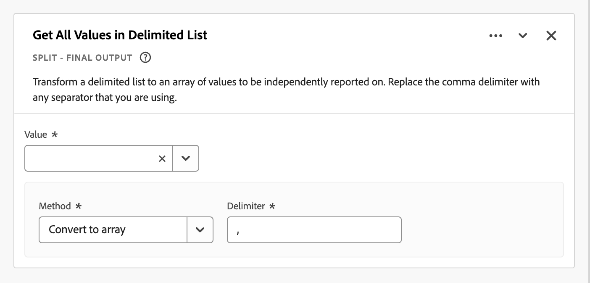
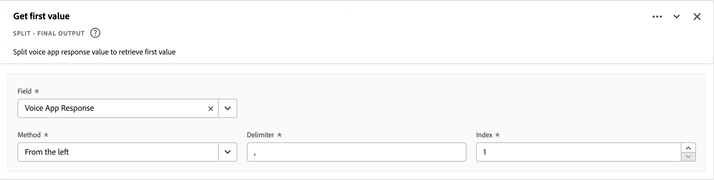

# 派生フィールド

派生フィールドは、Adobe Customer Journey Analyticsのリアルタイムレポート機能の重要な側面になります。 派生フィールドを使用すると、カスタマイズ可能なルールビルダーを使用して、（多くの場合、複雑な）データ操作をその場で定義できます。その後、その派生フィールドをコンポーネント（指標またはディメンション）として次で使用できます [Workspace](../../analysis-workspace/home.md) または、派生フィールドをでさらにコンポーネントとして定義します [データビュー](../data-views.md).

派生フィールドを使用すると、Customer Journey Analytics外の他の場所でデータを変換または操作する場合と比較して、大幅な時間と労力を節約できます。 例： [データ準備](https://experienceleague.adobe.com/docs/experience-platform/data-prep/home.html?lang=ja), [Data Distiller](https://experienceleague.adobe.com/docs/experience-platform/query/data-distiller/overview.html)または、独自の抽出変換読み込み（ETL）/抽出読み込み変換（ELT）プロセス内で使用します。

派生フィールドは以下で定義されます。 [データビュー](../data-views.md)は、ルールとして定義された一連の関数に基づいており、使用可能な標準フィールドやスキーマフィールドに適用されます。

例えば、次のようなユースケースがあります。

- 収集した不適切なページ名の値を修正してページ名の値を修正する、派生ページ名フィールドを定義します。

- 1 つ以上の条件（例：URL パラメーター、ページ URL、ページ名）に基づいて適切なマーケティングチャネルを決定する、派生マーケティングチャネルフィールドを定義します。

## 派生フィールドインターフェイス

派生フィールドを作成または編集する場合は、派生フィールドインターフェイスを使用します。

|  | 名前 | 説明 |
|---------|----------|--------|
| 1 | **セレクター** | セレクター領域を使用して、関数、関数テンプレート、スキーマフィールド、または標準フィールドを選択してルールビルダーにドラッグ&amp;ドロップします。  ドロップダウンを使用して、次のいずれかを選択します。   [!UICONTROL 関数] - リストが使用可能 [関数](#function-reference),   [!UICONTROL 関数テンプレート] - リストが使用可能 [関数テンプレート](#function-templates),    [!UICONTROL スキーマフィールド] - データセットカテゴリ（イベント、プロファイル、ルックアップ）から使用できるフィールドと、以前に定義した派生フィールドをリストします。   [!UICONTROL 標準フィールド]  – 標準の使用可能フィールド（Platform データセット ID など）。 文字列および数値の標準フィールドのみがセレクターに表示されます。 関数が他のデータタイプをサポートしている場合、これらの他のデータタイプを持つ標準フィールドを、値またはルールインターフェイス内のフィールドに選択できます。 関数、関数テンプレート、スキーマおよび標準フィールドは、  検索ボックス。  選択したオブジェクトリストをフィルタリングするには、次のオプションを選択します。  でのフィルターとフィルターの指定 [!UICONTROL フィールドのフィルター基準] ダイアログ。 を使用すると、フィルターを簡単に削除できます  各フィルターに対して。 |
| 2 | **ルールビルダー** | 1 つ以上のルールを使用して、派生フィールドを順番に作成します。 ルールは関数の特定の実装なので、常に 1 つの関数にのみ関連付けられます。 ルールを作成するには、関数をルールビルダーにドラッグ&amp;ドロップします。 関数タイプは、ルールのインターフェイスを決定します。 を参照してください。 [ルールインターフェイス](#rule-interface) を参照してください。  関数は、ルールビルダーで既に使用可能なルールの先頭、末尾または間に挿入できます。 ルールビルダーの最後のルールによって、派生フィールドの最終的な出力が決定されます。 |
| 3 | **[!UICONTROL **&#x200B;フィールド設定&#x200B;**]** | 派生フィールドに名前を付けて説明し、そのフィールドタイプを調べることができます。 |
| 4 | **[!UICONTROL **&#x200B;最終出力&#x200B;**]** | この領域には、過去 30 日間のデータと、ルールビルダーで派生フィールドに加えた変更に基づいて、出力値を即座に更新したプレビューが表示されます。 |

{style="table-layout:auto"}

## フィールドテンプレートウィザード

派生フィールドインターフェイスに初めてアクセスする場合は、 [!UICONTROL フィールドテンプレートから開始] ウィザードが表示されます。

1. 作成しようとしているフィールドのタイプに最も近いテンプレートを選択します。
2. 「」を選択します **[!UICONTROL **&#x200B;を選択&#x200B;**]** ボタンをクリックして続行します。

派生フィールドダイアログには、選択したフィールドのタイプに必須または便利なルール（および関数）が入力されます。 参照： [関数テンプレート](#function-templates) 使用可能なテンプレートについて詳しくは、こちらを参照してください。

## ルールインターフェイス

ルールビルダーでルールを定義する場合は、ルールインターフェイスを使用します。

|  | 名前 | 説明 |
|---------|----------|--------|
| A | **ルール名** | デフォルトでは、ルール名はです **ルール X** （X はシーケンス番号）。 ルールの名前を編集するには、名前を選択し、新しい名前を入力します（例：）。 `Query Parameter`. |
| B | **関数名** | ルール用に選択された関数名（例：） [!UICONTROL URL の解析]. 関数が関数のシーケンスの最後にあり、最終的な出力値を決定する場合、関数名の後に [!UICONTROL  – 最終出力]、例： [!UICONTROL URL の解析 – 最終出力].  関数に関する詳細をポップアップに表示するには、 . |
| C | **ルールの説明** | オプションで、ルールに説明を追加できます。 を選択 を選択してから、 **[!UICONTROL **&#x200B;説明を追加&#x200B;**]** 説明を追加する **[!UICONTROL **&#x200B;説明を編集&#x200B;**]** 既存の説明を編集するには、次の手順を実行します。 エディターを使用して説明を入力します。 ツールバーを使用して、テキストの書式を設定したり（スタイルセレクター、太字、斜体、アンダーライン、右、左、中央、カラー、番号リスト、箇条書きを使用）、外部情報へのリンクを追加したりできます。  説明の編集を終了するには、エディターの外側をクリックします。 |
| D | **関数領域** | 関数のロジックを定義します。 インターフェイスは、関数のタイプによって異なります。 のドロップダウン [!UICONTROL フィールド] または [!UICONTROL 値] 関数が想定する入力の種類に基づいて、使用可能なすべてのフィールドのカテゴリ （動作規則、標準フィールド、フィールド）を表示します。 または、スキーマと標準フィールド セレクターからフィールドをフィールドまたは値にドラッグ&amp;ドロップすることもできます。 ドラッグされたフィールドがルックアップデータセットから派生している場合、ルックアップ関数は、定義した関数の前に自動的に挿入されます。  参照： [関数リファレンス](#function-reference) サポートされる各関数の詳細情報について説明します。 |

{style="table-layout:auto"}

## 派生フィールドの作成

1. 既存のデータビューを選択するか、データビューを作成します。 参照： [データビュー](../data-views.md) を参照してください。

2. 「」を選択します **[!UICONTROL ** Components **]** データ ビューのタブです。

3. を選択 **[!UICONTROL **&#x200B;派生フィールドを作成&#x200B;**]** 左パネルから。

4. 派生フィールドを定義するには、を使用します [!UICONTROL 派生フィールドを作成] インターフェイス。 参照： [派生フィールドインターフェイス](#derived-field-interface).

   新しい派生フィールドを保存するには、を選択します。 **[!UICONTROL **&#x200B;保存&#x200B;**]**.

5. 新しい派生フィールドがに追加されます [!UICONTROL 派生フィールド >] コンテナ（の一部） **[!UICONTROL **&#x200B;スキーマフィールド&#x200B;**]** データビューの左側のパネルで、

## 派生フィールドの編集

1. 既存のデータビューを選択します。 参照： [データビュー](../data-views.md) を参照してください。

2. 「」を選択します **[!UICONTROL ** Components **]** データ ビューのタブです。

3. を選択 **[!UICONTROL **&#x200B;スキーマフィールド&#x200B;**]** タブ [!UICONTROL 接続] 左側のペイン。

4. を選択 **[!UICONTROL **&#x200B;派生フィールド >**]** コンテナ。

5. 編集する派生フィールドの上にマウスポインターを置いて、次を選択します .

6. 派生フィールドを編集するには、を使用します [!UICONTROL 派生フィールドを編集] インターフェイス。 参照： [派生フィールドインターフェイス](#derived-field-interface).

   - を選択 **[!UICONTROL **&#x200B;保存&#x200B;**]** 更新した派生フィールドを保存します。

   - を選択 **[!UICONTROL **&#x200B;キャンセル&#x200B;**]** ：派生フィールドに加えた変更をキャンセルします。

   - を選択 **[!UICONTROL **&#x200B;名前を付けて保存&#x200B;**]** 派生フィールドを新しい派生フィールドとして保存します。 新しい派生フィールドの名前は、元のフィールドが編集されたのと同じです `(copy)` がに追加されました。

または、派生フィールドをデータビューのディメンションまたは指標のコンポーネントとして使用した場合は、次のようになります。

1. コンポーネントを選択します。 コンポーネントは、派生フィールドとは異なる名前を持つ場合があることに注意してください。

1. コンポーネントパネルで、  派生フィールドの横の「スキーマフィールド名」の下

1. 派生フィールドを編集するには、を使用します [!UICONTROL 派生フィールドを編集] インターフェイス。 参照： [派生フィールドインターフェイス](#derived-field-interface).

   - を選択 **[!UICONTROL **&#x200B;保存&#x200B;**]** 更新した派生フィールドを保存します。

   - を選択 **[!UICONTROL **&#x200B;キャンセル&#x200B;**]** ：派生フィールドに加えた変更をキャンセルします。

   - を選択 **[!UICONTROL **&#x200B;名前を付けて保存&#x200B;**]** 派生フィールドを新しい派生フィールドとして保存します。 新しい派生フィールドの名前は、元のフィールドが編集されたのと同じです `(copy)` がに追加されました。

## 派生フィールドの削除

1. 既存のデータビューを選択します。 参照： [データビュー](../data-views.md) を参照してください。

2. 「」を選択します **[!UICONTROL ** Components **]** データ ビューのタブです。

3. を選択 **[!UICONTROL **&#x200B;スキーマフィールド&#x200B;**]** タブ [!UICONTROL 接続] ペイン。

4. を選択 **[!UICONTROL **&#x200B;派生フィールド >**]** コンテナ。

5. 削除する派生フィールドの上にマウスポインターを置いて、次を選択します .

6. が含まれる [!UICONTROL 派生フィールドを編集] インタフェース、選択 **[!UICONTROL 削除]**.

   A [!UICONTROL コンポーネントを削除] 削除を確認するダイアログが表示されます。 データビューの外部の派生フィールドに外部参照が存在する可能性があることを考慮してください。

   - を選択 **[!UICONTROL **&#x200B;続行&#x200B;**]** をクリックして、派生フィールドを削除します。

または、派生フィールドをデータビューのディメンションまたは指標のコンポーネントとして使用した場合は、次のようになります。

1. コンポーネントを選択します。 コンポーネントは、派生フィールドとは異なる名前を持つ場合があることに注意してください。

1. コンポーネントパネルで、  派生フィールドの横の「スキーマフィールド名」の下

1. が含まれる [!UICONTROL 派生フィールドを編集] インタフェース、選択 **[!UICONTROL 削除]**.

   A [!UICONTROL コンポーネントを削除] 削除を確認するダイアログが表示されます。 データビューの外部の派生フィールドに外部参照が存在する可能性があることを考慮してください。

   - を選択 **[!UICONTROL **&#x200B;続行&#x200B;**]** をクリックして、派生フィールドを削除します。

>[!NOTE]
>
>派生フィールドは、Customer Journey Analyticsの接続レベルで管理されます。 その接続に関連付けられたいずれかのデータビューの派生フィールドに加えられた変更は、関連付けられたすべてのデータビューに適用されます。

## 関数テンプレート

特定のユースケースの派生フィールドをすばやく作成するために、関数テンプレートを使用できます。 これらの関数テンプレートは、派生フィールドインターフェイスのセレクター領域からアクセスすることも、 [!UICONTROL フィールドテンプレートから開始] ウィザード。

### マーケティングチャネル

この関数テンプレートは、ルールのコレクションを使用してマーケティングチャネルを作成します。

+++ 詳細

テンプレートを使用するには、テンプレートのルールの一部としてリストされている各関数に対して正しいパラメーターを指定する必要があります。 参照： [関数リファレンス](#function-reference) を参照してください。

+++

### バウンス数

この関数テンプレートは、ルールのコレクションを使用して、サイトバウンスを識別します。

+++ 詳細

テンプレートを使用するには、テンプレートのルールの一部としてリストされている各関数に対して正しいパラメーターを指定する必要があります。 参照： [関数リファレンス](#function-reference) を参照してください。

+++

### マルチディメンション結合

この関数テンプレートは、2 つの値を 1 つに結合します。

+++ 詳細

テンプレートを使用するには、テンプレートのルールの一部としてリストされている各関数に対して正しいパラメーターを指定する必要があります。 参照： [関数リファレンス](#function-reference) を参照してください。

+++

### わかりやすいデータセット名

この関数テンプレートは、読み取り可能なデータセット名を提供します。

+++ 詳細

テンプレートを使用するには、テンプレートのルールの一部としてリストされている各関数に対して正しいパラメーターを指定する必要があります。 参照： [関数リファレンス](#function-reference) を参照してください。

+++

### URL からのページ名

この関数テンプレートは、単純なページ名を作成します。

+++ 詳細

テンプレートを使用するには、テンプレートのルールの一部としてリストされている各関数に対して正しいパラメーターを指定する必要があります。 参照： [関数リファレンス](#function-reference) を参照してください。

+++

### ホリデーシーズン

この関数テンプレートは、年の主な時期を分類します。

+++ 詳細

テンプレートを使用するには、テンプレートのルールの一部としてリストされている各関数に対して正しいパラメーターを指定する必要があります。 参照： [関数リファレンス](#function-reference) を参照してください。

+++

### 月間目標

この関数テンプレートは、カスタムの月次目標を設定します。

+++ 詳細

テンプレートを使用するには、テンプレートのルールの一部としてリストされている各関数に対して正しいパラメーターを指定する必要があります。 参照： [関数リファレンス](#function-reference) を参照してください。

+++

### 区切りリストのすべての値を取得

この関数テンプレートは、制限リストを配列に変換します。

+++ 詳細

テンプレートを使用するには、テンプレートのルールの一部としてリストされている各関数に対して正しいパラメーターを指定する必要があります。 参照： [関数リファレンス](#function-reference) を参照してください。

+++

### 区切りリストの最初の値を取得

この関数テンプレートは、区切られたリストの最初の値を取得します。

+++ 詳細

テンプレートを使用するには、テンプレートのルールの一部としてリストされている各関数に対して正しいパラメーターを指定する必要があります。 参照： [関数リファレンス](#function-reference) を参照してください。

+++

### 区切りリストの最後の値を取得

この関数テンプレートは、区切られたリストの最後の値を取得します。

+++ 詳細

テンプレートを使用するには、テンプレートのルールの一部としてリストされている各関数に対して正しいパラメーターを指定する必要があります。 参照： [関数リファレンス](#function-reference) を参照してください。

+++

### ドメイン名

この関数テンプレートは、正規表現を使用してドメイン名を抽出します。

+++ 詳細

テンプレートを使用するには、テンプレートのルールの一部としてリストされている各関数に対して正しいパラメーターを指定する必要があります。 参照： [関数リファレンス](#function-reference) を参照してください。

+++

### クエリ文字列パラメーターを取得

この関数テンプレートは、クエリ文字列値を抽出します。

+++ 詳細

テンプレートを使用するには、テンプレートのルールの一部としてリストされている各関数に対して正しいパラメーターを指定する必要があります。 参照： [関数リファレンス](#function-reference) を参照してください。

+++

### 移行フィールド

この関数テンプレートは、あるフィールドから別のフィールドにレポートを移行します。

+++ 詳細

テンプレートを使用するには、テンプレートのルールの一部としてリストされている各関数に対して正しいパラメーターを指定する必要があります。 参照： [関数リファレンス](#function-reference) を参照してください。

+++

### シンプルなボット検出

この関数テンプレートは、ライトボットの識別を実装します。

+++ 詳細

テンプレートを使用するには、テンプレートのルールの一部としてリストされている各関数に対して正しいパラメーターを指定する必要があります。 参照： [関数リファレンス](#function-reference) を参照してください。

+++

### 離脱リンク

この関数テンプレートは、セッションで最後にクリックされたリンクを識別します。

+++ 詳細

テンプレートを使用するには、テンプレートのルールの一部としてリストされている各関数に対して正しいパラメーターを指定する必要があります。 参照： [関数リファレンス](#function-reference) を参照してください。

+++

### ダウンロードリンク

この関数テンプレートは、一般的なダウンロードリンクにフラグを立てます。

+++ 詳細

テンプレートを使用するには、テンプレートのルールの一部としてリストされている各関数に対して正しいパラメーターを指定する必要があります。 参照： [関数リファレンス](#function-reference) を参照してください。

+++

<!--

+++ Data clean up template

>[!WARNING]
>
>Could not find any information on this template.
+++

-->

## 関数リファレンス

{{select-package}}

サポートされている各関数について、次の点で詳細を確認してください。

- 仕様：
   - 入力データタイプ：サポートされるデータのタイプ
   - input：入力に使用可能な値
   - 含まれる演算子：この関数でサポートされる演算子（ある場合）、
   - 制限事項：この特定の関数に適用される制限事項
   - 出力。

- 次のような使用例
   - 派生フィールドを定義する前のデータ。
   - 派生フィールドの定義方法
   - 派生フィールドを定義した後のデータ。

- 制約（該当する場合）。

<!-- CASE WHEN -->

### Case When

1 つ以上のフィールドから定義された条件に基づいて、条件を適用します。 これらの条件は、条件のシーケンスに基づいて、新しい派生フィールドの値を定義するために使用します。

+++ 詳細

## 仕様 {#casewhen-io}

| 入力データタイプ | 入力 | 含まれる演算子 | 制限事項 | 出力 |
|---|---|---|---|---|
| <ul><li>文字列</li><li>数値</li><li>日付</li></ul> | <ul><li>[!UICONTROL 次の場合], [!UICONTROL Else If] コンテナ：
<ul><li>[!UICONTROL 値]</li><ul><li>ルール</li><li>標準フィールド</li><li>フィールド</li></ul><li>[!UICONTROL 条件] （選択した値のタイプに基づいて、含まれる演算子を参照してください）</li></ul></li><li>[!UICONTROL 次に、値を以下のように設定], [!UICONTROL それ以外の場合は、値を次のように設定]:
<ul><li>[!UICONTROL 値]</li><ul><li>ルール</li><li>標準フィールド</li><li>フィールド</li></ul></ul></li></ul> | 
文字列
<ul><li>次と等しい</li><li>が次のいずれかの語句に等しい</li><li>フレーズを含む</li><li>いずれかの語句を含む</li><li>すべての語句を含む</li><li>次の語句で始まる</li><li>任意の語句で始まる</li><li>次の語句で終わる</li><li>任意の語句で終わる</li><li>次と等しくない</li><li>が次のいずれの語句にも等しくない</li><li>このフレーズを含まない</li><li>いずれの語句も含まない</li><li>が次のすべての語句を含まない</li><li>次で始まらない</li><li>いずれの語句でも開始しない</li><li>次で終わらない</li><li>いずれの語句も含まない</li><li>設定済み</li><li>未設定</li></ul>
数値
<ul><li>次と等しい</li><li>次と等しくない</li><li>次より大きい</li><li>次よりも大きいか等しい</li><li>次より小さい</li><li>次よりも小さいか等しい</li><li>設定済み</li><li>未設定</li></ul>
日付
<ul><li>次と等しい</li><li>次と等しくない</li><li>が次よりも後</li><li>が次以降</li><li>次より前</li><li>が次以前</li><li>設定済み</li><li>未設定</li></ul> | <ul><li>派生フィールドごとに 5 つの関数</li><li>200 [演算子](#operators) 派生フィールドごとに。 単一のオペレーターの例としては、「参照ドメインに google が含まれる」などがあります。 </li></ul> | 
新しい派生フィールド
 |

{style="table-layout:auto"}

## ユースケース 1 {#casewhen-uc1}

カスケードロジックを適用してマーケティングチャネルフィールドを適切な値に設定することで、様々なマーケティングチャネルを識別するルールを定義する必要があります。

- リファラーが検索エンジンからのリファラーで、ページにクエリ文字列値がある場合 `cid` 次を含む `ps_`マーケティングチャネルはとして識別される必要があります。 [!DNL *ペイド検索*].
- リファラーが検索エンジンからのファイルで、ページにクエリ文字列が含まれていない場合 `cid`マーケティングチャネルはとして識別される必要があります。 [!DNL *自然検索*].
- ページにクエリ文字列値がある場合、次のように指定します `cid` 次を含む `em_`マーケティングチャネルはとして識別される必要があります。 [!DNL *電子メール*].
- ページにクエリ文字列値がある場合、次のように指定します `cid` 次を含む `ds_`マーケティングチャネルはとして識別される必要があります。 [!DNL *広告を表示*].
- ページにクエリ文字列値がある場合、次のように指定します `cid` 次を含む `so_`マーケティングチャネルはとして識別される必要があります。 [!DNL *ペイドソーシャル*].
- リファラーがの参照ドメインからの場合 [!DNL twitter.com], [!DNL facebook.com], [!DNL linkedin.com]、または [!DNL tiktok.com]マーケティングチャネルはとして識別される必要があります。 [!DNL *自然社会*].
- 上記のルールのいずれも一致しない場合、マーケティングチャネルはと識別される必要があります。 [!DNL *その他のリファラー*].

サイトが次のサンプルイベントを受け取った場合、以下を含みます [!UICONTROL リファラー] および [!UICONTROL ページ URL]これらのイベントは、次のように識別する必要があります。

| [!DNL Event] | [!DNL Referrer] | [!DNL Page URL] | [!DNL Marketing Channel] |
|:--:|----|----|----|
| 1 | `https://facebook.com` | `https://site.com/home` | [!DNL Natural Social] |
| 2 | `https://abc.com` | `https://site.com/?cid=ds_12345678` | [!DNL Display] |
| 3 | | `https://site.com/?cid=em_12345678` | [!DNL Email] |
| 4 | `https://google.com` | `https://site.com/?cid=ps_abc098765` | [!DNL Paid Search] |
| 5 | `https://google.com` | `https://site.com/?cid=em_765544332` | [!DNL Email] |
| 6 | `https://google.com` |  | [!DNL Natural Search] |

{style="table-layout:auto"}

### 前のデータ {#casewhen-uc1-databefore}

| [!DNL Referrer] | [!DNL Page URL] |
|----|----|
| `https://facebook.com` | `https://site.com/home` |
| `https://abc.com` | `https://site.com/?cid=ds_12345678` |
|  | `https://site.com/?cid=em_12345678` |
| `https://google.com` | `https://site.com/?cid=ps_abc098765` |
| `https://google.com` | `https://site.com/?cid=em_765544332` |
| `https://google.com` | |

{style="table-layout:auto"}

### 派生フィールド {#casewhen-uc1-derivedfield}

を定義します `Marketing Channel` 派生フィールド。 を使用します [!UICONTROL 条件の場合] 両方のコンポーネントの既存の値に基づいての値を作成するルールを定義するための関数 `Page URL` および `Referring URL` フィールド。

関数の使い方に注意してください [!UICONTROL URL の解析] 値を取得するルールを定義するには `Page Url` および `Referring Url` 次の前 [!UICONTROL 条件の場合] ルールが適用されます。

### 後のデータ {#casewhen-uc1-dataafter}

| [!DNL Marketing Channel] |
|----|
| [!DNL Natural Social] |
| [!DNL Display] |
| [!DNL Email] |
| [!DNL Paid Search] |
| [!DNL Email] |
| [!DNL Natural Search] |

{style="table-layout:auto"}

## ユースケース 2 {#casewhen-uc2}

内でいくつかの異なるバリエーションの検索を収集しました [!DNL Product Finding Methods] ディメンション。 検索と参照の全体的なパフォーマンスを理解するには、結果を手動で組み合わせることに多くの時間を費やす必要があります。

サイトは、に対して次の値を収集します [!DNL Product Finding Methods] ディメンション。 最後に、これらの値はすべて検索を示します。

| 収集された値 | 実際の値 |
|---|---|
| [!DNL search p13n_no] | [!DNL search] |
| [!DNL search p13n_yes] | [!DNL search] |
| [!DNL search refine p13n_no] | [!DNL search] |
| [!DNL search refine p13n_yes] | [!DNL search] |
| [!DNL search redirect p13n_yes] | [!DNL search] |
| [!DNL search-redirect] | [!DNL search] |

{style="table-layout:auto"}

### 前のデータ {#casewhen-uc2-databefore}

| [!DNL Product Finding Methods] |
|----|
| [!DNL search p13_no] |
| [!DNL search p13_yes] |
| [!DNL browse] |
| [!DNL search refine p13_no] |
| [!DNL search refine p13_yes] |
| [!DNL browse] |
| [!DNL search redirect p13_yes] |
| [!DNL search-redirect] |
| [!DNL browse] |

{style="table-layout:auto"}

### 派生フィールド {#casewhen-uc2-derivedfield}

を定義します `Product Finding Methods (new)` 派生フィールド。 次を作成します [!UICONTROL 条件の場合] ルールビルダーのルール。 これらのルールは、古いのすべてのバリエーションにロジックを適用します。 [!UICONTROL 製品の検索方法] のフィールド値 `search` および `browse` の使用 [!UICONTROL フレーズを含む] 条件。

### 後のデータ {#casewhen-uc2-dataafter}

| [!DNL Product Finding Methods (new)] |
|----|
| [!DNL search] |
| [!DNL search] |
| [!DNL browse] |
| [!DNL search] |
| [!DNL search] |
| [!DNL browse] |
| [!DNL search] |
| [!DNL search] |
| [!DNL browse] |

{style="table-layout:auto"}

## ユースケース 3 {#casewhen-uc3}

旅行会社として、記帳済トリップのバケット・トリップ期間をレポートして、トリップのバケット長をレポートできるようにします。

前提：

- 組織が、旅行期間を数値フィールドに収集しています。
- 1～3 日の期間を「」というバケットにバケット化します。[!DNL short trip]&#39;
- 期間を 4～7 日のバケットと呼ばれるバケットに入れようとします。[!DNL medium trip]&#39;
- 8 日以上の期間を「」というバケットにバケット化しようとしています[!DNL long trip]&#39;
- 132 回の旅行が 1 日間の期間で予約されました
- 2 日間で 110 回の旅行が予約されました
- 3 日間で 105 回の旅行が予約されました
- 99 回の旅行が 4 日間にわたって予約された
- 92 回の旅行が 5 日間にわたって予約された
- 6 日間で 85 回の旅行が予約されました
- 7 日間で 82 回の旅行が予約されました
- 78 回の旅行が 8 日間にわたって予約された
- 9 日間で 50 回の旅行が予約されました
- 44 回の旅行が 10 日間にわたって予約された
- 38 回の旅行が 11 日間にわたって予約された
- 31 回の旅行が 12 日間にわたって予約された

目的のレポートは次のようになります。

| [!DNL Trip Duration Type] | [!DNL Bookings] |
|----|---:|
| [!DNL medium trip] | 358 |
| [!DNL short trip] | 347 |
| [!DNL long trip] | 241 |

{style="table-layout:auto"}

### 前のデータ {#casewhen-uc3-databefore}

| [!DNL Trip Duration] |
|---:|
| 1 |
| 12 |
| 3 |
| 6 |
| 4 |
| 8 |
| 6 |
| 2 |
| 1 |
| 2 |
| 21 |
| 8 |

### 派生フィールド {#casewhen-uc3-derivedfield}

を定義します `Trip Duration (bucketed)` 派生フィールド。 次を作成します [!UICONTROL 条件の場合] ルールビルダーのルール。 このルールは、古いをバケット化するロジックを適用します [!UICONTROL 旅の期間] フィールド値を次の 3 つの値に変換します。 `short trip`, `medium  trip`、および `long trip`.

### 後のデータ {#casewhen-uc3-dataafter}

| [!DNL Trip Duration (bucketed)] |
|---|
| [!DNL short trip] |
| [!DNL long trip] |
| [!DNL short trip] |
| [!DNL medium trip] |
| [!DNL medium trip] |
| [!DNL long trip] |
| [!DNL medium trip] |
| [!DNL short trip] |
| [!DNL short trip] |
| [!DNL short trip] |
| [!DNL long trip] |
| [!DNL long trip] |

## 詳細情報 {#casewhen-more-info}

Customer Journey Analyticsでは、Adobe Experience Platformのに倣って、ネストされたコンテナ構造を使用します [XDM](https://experienceleague.adobe.com/docs/experience-platform/xdm/home.html?lang=ja) （エクスペリエンスデータモデル）。 参照： [コンテナ](../create-dataview.md#containers) および [フィルターコンテナ](../../components/filters/filters-overview.md#filter-containers) を参照してください。 このコンテナモデルは、本質的に柔軟性がありますが、ルールビルダーを使用する際にいくつかの制約を課します。

Customer Journey Analyticsでは、次のデフォルトのコンテナモデルを使用します。

次の制約が適用され、次の場合に適用されます *選択* および *設定* 値。

|  | 制約 |
|:---:|----|
| **A** | ユーザーが設定する値 *選択* 同じ範囲内で [!UICONTROL 次の場合], [!UICONTROL Else If] コンストラクト（使用 [!UICONTROL および] または [!UICONTROL または]）内のルールは、同じコンテナから生成され、任意のタイプ（文字列）にすることができます 、数値 など）。   |
| **B** | すべての値 *set* ルール全体は、同じコンテナから得られ、同じ型または同じ型の派生値を持つ必要があります。    |
| **C** | 指定した値 *選択* 間 [!UICONTROL 次の場合], [!UICONTROL Else If] ルール内の構成要素 do *ではない* 同じ容器から生まれて行わなければならない *ではない* 同じタイプにする必要があります。    |

{style="table-layout:auto"}

+++

<!-- CLASSIFY -->

### 分類

新しい派生フィールドで対応する値に置き換えられる値のセットを定義します。

+++ 詳細

## 仕様 {#classify-io}

| 入力データタイプ | 入力 | 含まれる演算子 | 制限事項 | 出力 |
|---|---|---|---|---|
| <ul><li>文字列</li><li>数値</li><li>日付</li></ul> | <ul><li>[!UICONTROL 分類するフィールド]:<ul><li>ルール</li><li>標準フィールド</li><li>フィールド</li></ul></li><li>[!UICONTROL 値がと等しい場合] および [!UICONTROL 値を次の値に置換]:
<ul><li>文字列</li></ul><li>元の値を表示<ul><li>ブール値</li></ul></li></ul> | 
該当なし
 | <ul><li>派生フィールドごとに 5 つの関数</li><li>200 [演算子](#operators) 派生フィールドごとに。 のすべてのエントリ [!UICONTROL 値が元の値と等しい場合] [!UICONTROL 値を新しい値に置換] は操作と見なされます。</li></ul> | 
新しい派生フィールド
 |

{style="table-layout:auto"}

## ユースケース 1 {#classify-uc1}

のキー列を含む CSV ファイルがあります `hotelID` と、に関連付けられた 1 つ以上の追加の列 `hotelID`: `city`, `rooms`, `hotel name`.
を収集しています [!DNL Hotel ID] あるディメンションで、を作成したい場合 [!DNL Hotel Name] から派生したディメンション `hotelID` を CSV ファイル内に記述します。

**CSV ファイルの構造とコンテンツ**

| [!DNL hotelID] | [!DNL city] | [!DNL rooms] | [!DNL hotel name] |
|---|---|---:|---|
| [!DNL SLC123] | [!DNL Salt Lake City] | 40 | [!DNL SLC Downtown] |
| [!DNL LAX342] | [!DNL Los Angeles] | 60 | [!DNL LA Airport] |
| [!DNL SFO456] | [!DNL San Francisco] | 75 | [!DNL Market Street] |
| [!DNL AMS789] | [!DNL Amsterdam] | 50 | [!DNL Okura] |

{style="table-layout:auto"}

**現在のレポート**

| [!DNL Hotel ID] | 製品表示 |
|---|---:|
| [!DNL SLC123] | 200 |
| [!DNL LX342] | 198 |
| [!DNL SFO456] | 190 |
| [!DNL AMS789] | 150 |

{style="table-layout:auto"}

**目的のレポート**

| [!DNL Hotel Name] | 製品表示 |
|----|----:|
| [!DNL SLC Downtown] | 200 |
| [!DNL LA Airport] | 198 |
| [!DNL Market Street] | 190 |

{style="table-layout:auto"}

### 前のデータ {#classify-uc1-databefore}

| [!DNL Hotel ID] |
|----|
| [!DNL SLC123] |
| [!DNL LAX342] |
| [!DNL SFO456] |
| [!DNL AMS789] |

{style="table-layout:auto"}

### 派生フィールド {#classify-uc1-derivedfield}

を定義します `Hotel Name` 派生フィールド。 を使用します [!UICONTROL 分類] の値を分類できるルールを定義する関数 [!UICONTROL ホテル ID] フィールドに移動し、新しい値で置き換えます。

分類する値の一部として定義していない元の値を含める場合（例：ホテル ID AMS789）、必ず選択してください **[!UICONTROL 元の値を表示]**. これにより、値が分類されていないにもかかわらず、AMS789 が派生フィールドの出力の一部になります。

### 後のデータ {#classify-uc1-dataafter}

| [!DNL Hotel Name] |
|----|
| [!DNL SLC Downtown] |
| [!DNL LA Airport] |
| [!DNL Market Street] |

{style="table-layout:auto"}

## ユースケース 2 {#classify-uc2}

複数のページのわかりやすいページ名の代わりに URL を収集しました。 この値の混在コレクションにより、レポートが中断されます。

### 前のデータ {#classify-uc2-databefore}

| [!DNL Page Name] |
|---|
| [!DNL Home Page] |
| [!DNL Flight Search] |
| `http://www.adobetravel.ca/Hotel-Search` |
| `https://www.adobetravel.com/Package-Search` |
| [!DNL Deals & Offers] |
| `http://www.adobetravel.ca/user/reviews` |
| `https://www.adobetravel.com.br/Generate-Quote/preview` |

{style="table-layout:auto"}

### 派生フィールド {#classify-uc2-derivedfield}

を定義します `Page Name (updated)` 派生フィールド。 を使用します [!UICONTROL 分類] 既存の値を分類できるルールを定義する関数 [!UICONTROL ページ名] フィールドに入力し、更新された正しい値で置き換えます。

### 後のデータ {#classify-uc2-dataafter}

| [!DNL Page Name (updated)] |
|---|
| [!DNL Home Page] |
| [!DNL Flight Search] |
| [!DNL Hotel Search] |
| [!DNL Package Search] |
| [!DNL Deals & Offers] |
| [!DNL Reviews] |
| [!DNL Generate Quote] |

## 詳細情報 {#classify-moreinfo}

分類ルールインターフェイスでは次の追加機能を使用できます。

- すべてのテーブル値をすばやくクリアするには、  **[!UICONTROL すべてのテーブル値をクリア]**.
- 「値が等しい場合」の元の値と「値を次の値に置き換える」の新しい値を含む CSV ファイルをアップロードするには、次を選択します  **[!UICONTROL CSV をアップロード]**.
- アップロードする元の値と新しい値を含む CSV ファイルを作成するためのテンプレートをダウンロードするには、以下を選択します  **[!UICONTROL CSV テンプレートをダウンロード]**.
- ルールインターフェイスに入力された元の値と新しい値をすべて含む CSV ファイルをダウンロードするには、以下を選択します  **[!UICONTROL CSV 値をダウンロード]**.

+++

<!-- CONCATENATE -->

### 連結

フィールド値を、定義済みの区切り文字を使用して単一の新しい派生フィールドに結合します。

+++ 詳細

## 仕様 {#concatenate-io}

| 入力データタイプ | 入力 | 含まれる演算子 | 制限事項 | 出力 |
|---|---|---|---|---|
| <ul><li>文字列</li></ul> | <ul><li>[!UICONTROL 値]:<ul><li>ルール</li><li>標準フィールド</li><li>フィールド</li><li>文字列</li></ul></li><li>[!UICONTROL 区切り文字]:<ul><li>文字列</li></ul></li> </ul> | 
該当なし
 | 
派生フィールドごとに 2 つの関数
 | 
新しい派生フィールド
 |

{style="table-layout:auto"}

## ユースケース {#concatenate-uc}

現在、出発地と目的地の空港コードを別のフィールドとして収集しています。 2 つのフィールドを取り込み、ハイフン（–）で区切られた単一のディメンションに結合する場合。 そのため、接触チャネルと宛先の組み合わせを分析して、予約された上位のルートを特定できます。

前提：

- 起源と宛先の値は、同じテーブルの別々のフィールドに収集されます。
- ユーザーは、値の間に区切り文字「–」を使用することを決定します。

次の予約が発生すると仮定します。

- お客様 ABC123 様がソルトレイクシティ（SLC）とオーランド（MCO）間のフライトを予約
- お客様の ABC456 がソルトレイクシティ（SLC）とロサンゼルス（LAX）間のフライトを予約
- お客様 ABC789 がソルトレイクシティ（SLC）とシアトル（SEA）間のフライトを予約
- お客様 ABC987 がソルトレイクシティ（SLC）とサンノゼ（SJO）間のフライトを予約
- お客様 ABC654 がソルトレイクシティ（SLC）とオーランド（MCO）間のフライトを予約

目的のレポートは次のようになります。

| 接触チャネル/移動先 | Bookings |
|----|---:|
| SLC-MCO | 2 |
| SLC-LAX | 1 |
| SLC 海 | 1 |
| SLC-SJO | 1 |

{style="table-layout:auto"}

### 前のデータ {#concatenate-uc-databefore}

| 複製元 | 宛先 |
|----|---:|
| SLC | MCO |
| SLC | LAX |
| SLC | 海 |
| SLC | SJO |
| SLC | MCO |

{style="table-layout:auto"}

### 派生フィールド {#concatenate-derivedfield}

を定義します。 `Origin - Destination` 派生フィールド。 を使用します [!UICONTROL 連結] を連結するためのルールを定義する関数 [!UICONTROL オリジナル] および [!UICONTROL 宛先] を使用したフィールド `-` [!UICONTROL 区切り文字].

### 後のデータ {#concatenate-dataafter}

| 接触チャネル – 移動先 （派生フィールド） |
|---|
| SLC-MCO |
| SLC-LAX |
| SLC 海 |
| SLC-SJO |
| SLC-MCO |

{style="table-layout:auto"}

+++

<!-- DEDUPLICATE

### Deduplicate

Prevents counting a value multiple times.

+++ Details

{{release-limited-testing-section}}

## Specifications {#deduplicate-io}

| Input Data Type | Input | Included Operators | Limitations | Output |
|---|---|---|---|---|
| <ul><li>String</li><li>Numeric</li></ul> | <ul><li>[!UICONTROL Value]:<ul><li>Rules</li><li>Standard fields</li><li>Fields</li><li>String</li></ul></li><li>[!UICONTROL Scope]:<ul><li>Person</li><li>Session</li></ul></li><li>[!UICONTROL Deduplication ID]:<ul><li>Rules</li><li>Standard fields</li><li>Fields</li><li>String</li></ul><li>[!UICONTROL Value to keep]:<ul><li>Keep first instance</li><li>Keep last instance</li></ul></li></ul> | 
N/A
| 
5 functions per derived field
 | 
New derived field
 |

{style="table-layout:auto"}

## Use case 1 {#deduplicate-uc1}

You want to prevent counting duplicate revenue when a user reloads the booking confirmation page. You use the booking confirmation ID at the identifier to not count the revenue again, when received on the same event.

### Data before {#deduplicate-uc1-databefore}

| Booking Confirmation ID | Revenue |
|----|---:|
| ABC123456789 | 359 |
| ABC123456789 | 359 |
| ABC123456789 | 359 |

{style="table-layout:auto"}

### Derived field {#deduplicate-uc1-derivedfield}

You define a `Booking Confirmation` derived field. You use the [!UICONTROL DEDUPLICATE] function to define a rule to deduplicate the [!UICONTROL Value] [!DNL Booking] for [!UICONTROL Scope] [!DNL Person] using [!UICONTROL Deduplication ID] [!UICONTROL Booking Confirmation ID]. You select [!UICONTROL Keep first instance] as [!UICONTROL Value to keep].

### Data after {#deduplicate-uc1-dataafter}

| Booking Confirmation ID | Revenue |
|----|---:|
| ABC123456789 | 359 |
| ABC123456789 | 0 |
| ABC123456789 | 0 |

{style="table-layout:auto"}

## Use case 2 {#deduplicate-uc2}

You use events as a proxy for campaign click-throughs with external marketing campaigns. Reloads & redirects are causing the event metric to be inflated. You would like to deduplicate the tracking code dimension so only the first is collected and minimize the event overcounting.

### Data before {#deduplicate-uc2-databefore}

| Visitor ID | Marketing Channel | Events |
|----|---|---:|
| ABC123 | paid search | 1 |
| ABC123 | paid search | 1 |
| ABC123 | paid search | 1 |
| DEF123 | email | 1 |
| DEF123 | email | 1 |
| JKL123 | natural search | 1 |
| JKL123 | natural search | 1 |

{style="table-layout:auto"}

### Derived field {#deduplicate-uc2-derivedfield}

You define a new `Tracking Code (deduplicated)` derived field. You use the [!UICONTROL DEDUPLICATE] function to define a rule to deduplicate the [!UICONTROL Tracking Code] with a [!UICONTROL Deduplication scope] of [!UICONTROL Session] and [!UICONTROL Keep first instance] as the [!UICONTROL Value to keep].

### Data after {#deduplicate-uc2-dataafter}

| Visitor ID | Marketing Channel | Events |
|----|---|---:|
| ABC123 | paid search | 1 |
| DEF123 | email | 1 |
| JKL123 | natural search | 1 |

{style="table-layout:auto"}

+++

-->

<!-- FIND AND REPLACE -->

### 検索と置換

選択したフィールド内のすべての値を検索し、それらの値を新しい派生フィールド内の別の値に置き換えます。

+++ 詳細

## 仕様 {#findreplace-io}

| 入力データタイプ | 入力 | 含まれる演算子 | 制限事項 | 出力 |
|---|---|---|---|---|
| <ul><li>文字列</li></ul> | <ul><li>[!UICONTROL 値]<ul><li>ルール</li><li>標準フィールド</li><li>フィールド</li></ul></li><li>[!UICONTROL すべてを検索], [!UICONTROL すべてを以下で置換]:<ul><li>文字列</li></ul></li></ul></ul> | 
文字列
<ul><li>[!UICONTROL すべてを検索], [!UICONTROL すべてを以下で置換]</li></ul> | 
派生フィールドごとに 5 つの関数
 | 
新しい派生フィールド
 |

{style="table-layout:auto"}

## ユースケース {#findreplace-uc}

外部マーケティングチャネルレポートに対して、不正な形式の値（など）を受け取っています `email%20 marketing` の代わりに `email marketing`. これらの不正な値によりレポートが破損するため、メールのパフォーマンスを確認するのが難しくなります。 置換する `email%20marketing` （を使用） `email marketing`.

**元のレポート**

| [!DNL External Marketing Channels] | [!DNL Sessions] |
|---|--:|
| [!DNL email marketing] | 500 |
| [!DNL email %20marketing] | 24 |

{style="table-layout:auto"}

**優先するレポート**

| [!DNL External Marketing Channels] | [!DNL Sessions] |
|---|--:|
| [!DNL email marketing] | 524 |

### 前のデータ {#findreplace-uc-databefore}

| [!DNL External Marketing] |
|----|
| [!DNL email marketing] |
| [!DNL email%20marketing] |
| [!DNL email marketing] |
| [!DNL email marketing] |
| [!DNL email%20marketing] |

{style="table-layout:auto"}

### 派生フィールド {#findreplace-uc-derivedfield}

を定義します。 `Email Marketing (updated)` 派生フィールド。 を使用します [!UICONTROL 検索と置換] すべての出現箇所を検索して置換するルールを定義する関数 `email%20marketing` （を使用） `email marketing`.

### 後のデータ {#findreplace-uc-dataafter}

| [!DNL External Marketing (updated)] |
|----|
| [!DNL email marketing] |
| [!DNL email marketing] |
| [!DNL email marketing] |
| [!DNL email marketing] |
| [!DNL email marketing] |

{style="table-layout:auto"}

+++

<!-- LOOKUP -->

### ルックアップ

ルックアップデータセットのフィールドを使用して値をルックアップし、新しい派生フィールドまたは追加のルール処理のための値を返します。

+++ 詳細

## 仕様 {#lookup-io}

| 入力データタイプ | 入力 | 含まれる演算子 | 上限 | 出力 |
|---|---|---|---|---|
| <ul><li>文字列</li><li>数値</li><li>日付</li></ul> | <ul><li>[!UICONTROL 参照を適用するフィールド]:</li><ul><li>ルール</li><li>標準フィールド</li><li>フィールド</li></ul><li>[!UICONTROL データセットを検索]</li><ul><li>データセット</li></ul><li>[!UICONTROL 一致するキー]<ul><li>ルール</li><li>フィールド</li></ul></li><li>戻す値<ul><li>ルール</li><li>フィールド</li></ul></li></ul> | 
該当なし
 | 
派生フィールドごとに 3 つの関数
 | 
次のルールでさらに処理するための新しい派生フィールドまたは値
 |

{style="table-layout:auto"}

## ユースケース {#lookup-uc}

Adobe Targetを通じて表示されるパーソナライズされたバナーを顧客がクリックしたときに収集されたアクティビティ ID を使用して、アクティビティ名を参照したいと考えています。 アクティビティ ID とアクティビティ名を含む Analytics for Target （A4T）アクティビティでルックアップデータセットを使用する。

### A4T ルックアップデータセット {#lookup-uc-lookup}

| アクティビティ Id | アクティビティ名 |
|---|---|
| 415851 | MVT テストカテゴリページ |
| 415852 | Luma - Campaign Max 2022 |
| 402922 | ホーム ページ バナー |

{style="table-layout:auto"}

### 派生フィールド {#lookup-uc-derivedfield}

を定義します。 `Activity Name` 派生フィールド。 を使用します [!UICONTROL 参照] 関数を使用すると、で指定された、収集したデータから値を検索するルールを定義することができます。 [!UICONTROL 参照を適用するフィールド] フィールド（例： **[!DNL ActivityIdentifier]**）に設定します。 からルックアップデータセットを選択します [!UICONTROL データセットを検索] リスト（例： **[!DNL New CJA4T Activities]**）に設定します。 次に、識別子フィールドを選択します（例： **[!DNL ActivityIdentifier]**）から [!UICONTROL 一致するキー] リストおよび返されるフィールド [!UICONTROL 返す値] リスト（例： **[!DNL ActivityName]**）に設定します。

## 詳細情報 {#lookup-more-info}

ルックアップ関数は、接続の一部として設定したルックアップデータセットからCustomer Journey Analyticsによって取得されたデータに、レポート時に適用されます。

を素早く挿入できます [!UICONTROL 参照] ルールビルダー内の関数。1 つ以上の他の関数が既に含まれています。

1. を選択 **[!UICONTROL スキーマフィールド]** セレクターから。
1. を選択  **[!UICONTROL 参照データセット]**.
1. ルックアップデータセットを選択し、ルックアップに使用するフィールドを見つけます。
1. 関数に使用可能な入力フィールドのいずれかにルックアップフィールドをドラッグ&amp;ドロップします（例：Case When）。 有効な場合、というラベルの付いた青いボックス **[!UICONTROL +追加]**を使用すると、フィールドをドロップして、ルックアップフィールドをドロップした関数の前にルックアップ関数を自動的に挿入できます。 挿入されたルックアップ関数は、すべてのフィールドの関連する値に自動的に設定されます。
   

+++

<!-- LOWERCASE -->

### 小文字

フィールドの値を小文字に変換して、新しい派生フィールドに格納します。

+++ 詳細

## 仕様 {#lowercase-io}

| 入力データタイプ | 入力 | 含まれる演算子 | 上限 | 出力 |
|---|---|---|---|---|
| <ul><li>文字列</li><li>数値</li><li>日付</li></ul> | <ul><li>[!UICONTROL フィールド]:</li><ul><li>ルール</li><li>標準フィールド</li><li>フィールド</li></ul> | 
該当なし
 | 
派生フィールドごとに 2 つの関数
 | 
新しい派生フィールド
 |

{style="table-layout:auto"}

## ユースケース {#lowercase-uc}

適切なレポートを作成するために、収集されたすべての製品名を小文字に変換したいと考えています。

### 前のデータ {#lowercase-uc-databefore}

| 収集された製品名 | 製品表示 |
|---|---:|
| テニスラケット | 35 |
| テニスラケット | 33 |
| テニスラケット | 21 |
| 野球バット | 15 |
| 野球バット | 12 |
| 野球バット | 10 |

{style="table-layout:auto"}

### 派生フィールド {#lowercase-uc-derivedfield}

を定義します `Product Names` 派生フィールド。 を使用します [!UICONTROL 小文字] 値を変換するルールを定義する関数 [!UICONTROL 収集された製品名] フィールドを小文字に変換して、新しい派生フィールドに保存します。

### 後のデータ {#lowercase-uc-dataafter}

| 製品名 | 製品表示 |
|---|---|
| テニスラケット | 89 |
| 野球バット | 37 |

{style="table-layout:auto"}

+++

<!-- MATH -->

### Math

数値フィールドに対して基本的な数学演算子（加算、減算、乗算、除算、累乗）を使用します。

+++ 詳細

## 仕様 {#math-io}

| 入力データタイプ | 入力 | 含まれる演算子 | 上限 | 出力 |
|---|---|---|---|---|
| <ul><li>数値</li></ul> | <ul><li>1 つまたは複数の数値フィールド</li><li>1 つまたは複数の演算子（加算、減算、乗算、除算、累乗）</li><li>ユーザー入力値</li></ul> | <ul><li>`+` （追加）</li><li>`-` （減算）</li><li>`*` （multiply）</li><li>`/` （除算）</li><li>`^` （昇任）</li></ul> | <ul><li>派生フィールドあたり 25 操作</li><li>派生フィールドごとに 5 つの数学関数</li></ul> | 
新しい派生フィールド
 |

{style="table-layout:auto"}

## ユースケース {#math-uc}

インフレが原因で、取り込んだ CRM データの収益数を 5% のインフレで修正する必要があります。

### 前のデータ {#math-uc-databefore}

| CRM ID | 年間売上高 |
|---|---:|
| 1234 | 35,070,000 |
| 4133 | 7,500,000 |
| 8110 | 10,980 |
| 2201 | 42,620 |

{style="table-layout:auto"}

### 派生フィールド {#math-uc-derivedfield}

を定義します `Corrected Annual Revenue` 派生フィールド。 を使用します [!UICONTROL MATH] 元の年間売上高の数値に 1.05 を乗算するルールを定義する機能。

### 後のデータ {#math-uc-dataafter}

| CRM ID | 修正済み年間収益 |
|---|---:|
| 1234 | 36,823,500 |
| 4133 | 7,875,000 |
| 8110 | 11,529,00 |
| 2201 | 44,751 |

{style="table-layout:auto"}

## 詳細情報 {#math-more-info}

式を作成するには、次の手順に従います。

1. 数式フィールドと入力した値に一致する数値フィールドに入力するだけで、ポップアップメニューに表示されます。 または、左側のペインの使用可能なフィールドから数値フィールドをドラッグ&amp;ドロップすることもできます。
   

1. オペランドを追加（例： `*` 乗算）の後に別のフィールドまたは静的な値を指定します。 括弧を使用すると、より複雑な式を定義できます。

1. 静的な値を挿入するには（例： `1.05`）、値を入力して選択します。 **[!UICONTROL 追加 *x* 静的値として]** または **[!UICONTROL 追加 – *x* 負の静的値として]** ポップアップメニューから選択します。
   

1. 緑のチェックマーク  数式が有効かどうかを示します。有効でない場合は、警告が表示されます  とメッセージ [!UICONTROL 式が無効です].
   

で静的な数値を使用する場合、いくつかの重要な考慮事項があります [!UICONTROL MATH] 関数：

- 静的値はフィールドに関連付ける必要があります。 例えば、 [!UICONTROL MATH] 静的フィールドのみを含む関数はサポートされていません。
- 累乗演算子（`ˆ`）に設定する必要があります。
- 数式内で複数の静的値を使用している場合、数式を有効にするには、これらの静的値を括弧で囲む必要があります。 次に例を示します。

   - この式はエラーを返します。
     

   - この式は有効です。
     

ヒットレベルに基づく計算には、数学関数を使用します。 の使用 [要約](#summarize) イベント、セッションまたはユーザーの範囲に基づく計算の関数。

+++

<!-- MERGE FIELDS -->

### フィールドを結合

2 つの異なるフィールドの値を新しい派生フィールドに結合します。

+++ 詳細

## 仕様 {#merge-fields-io}

| 入力データタイプ | 入力 | 含まれる演算子 | 上限 | 出力 |
|---|---|---|---|---|
| <ul><li>文字列</li><li>数値</li><li>日付</li></ul> | <ul><li>[!UICONTROL フィールド]:</li><ul><li>ルール</li><li>標準フィールド</li><li>フィールド</li></ul> | 
該当なし
 | 
派生フィールドごとに 5 つの関数
 | 
新しい派生フィールド
 |

{style="table-layout:auto"}

## ユースケース {#merge-fields-uc}

チャネルをまたいでジャーニーを分析する目的で、ページ名フィールドと問い合わせ理由フィールドから構成されるディメンションを作成したいと考えています。

### 前のデータ {#merge-fields-uc-databefore}

| ページ名 | セッション | 訪問者 |
|---|--:|--:|
| ヘルプページ | 250 | 200 |
| ホームページ | 500 | 250 |
| 製品詳細ページ | 300 | 200 |

{style="table-layout:auto"}

| 通話理由 | セッション | 訪問者 |
|---|--:|--:|
| 注文に関する質問 | 275 | 250 |
| 注文を変更する | 150 | 145 |
| 順序付けに関する問題 | 100 | 95 |

{style="table-layout:auto"}

### 派生フィールド {#merge-fields-uc-derivedfield}

を定義します `Cross Channel Interactions` 派生フィールド。 を使用します [!UICONTROL フィールドを結合] から値を結合するルールを定義する関数 [!UICONTROL ページ名] フィールドと [!UICONTROL 通話理由] フィールドに移動し、それを新しい派生フィールドに保存します。

### 後のデータ {#merge-fields-uc-dataafter}

| クロスチャネルインタラクション | セッション数 | 訪問者 |
|---|--:|--:|
| ホームページ | 500 | 250 |
| 製品詳細ページ | 300 | 200 |
| 注文に関する質問 | 275 | 250 |
| ヘルプページ | 250 | 200 |
| 注文を変更する | 150 | 145 |
| 順序付けに関する問題 | 100 | 95 |

{style="table-layout:auto"}

## 詳細情報 {#merge-fields-moreinfo}

結合フィールドルール内で同じタイプのフィールドを選択する必要があります。 例えば、日付フィールドを選択した場合、結合する他のすべてのフィールドは日付フィールドである必要があります。

+++

<!-- NEXT OR PREVIOUS -->

### 次または前

フィールドを入力として受け取り、セッションまたは使用の範囲内で、そのフィールドの次または前の値を解決します。 これは、訪問およびイベント テーブルのフィールドにのみ適用されます。

+++ 詳細

## 仕様 {#prevornext-io}

| 入力データタイプ | 入力 | 含まれる演算子 | 上限 | 出力 |
|---|---|---|---|---|
| <ul><li>文字列</li><li>数値</li><li>日付</li></ul> | <ul><li>[!UICONTROL フィールド]:</li><ul><li>ルール</li><li>標準フィールド</li><li>フィールド</li></ul><li>[!UICONTROL メソッド]:<ul><li>前の値</li><li>次の値</li></ul></li><li>[!UICONTROL 範囲]:<ul><li>ユーザー</li><li>セッション</li></ul></li><li>[!UICONTROL 索引]:<ul><li>数値</li></ul><li>[!UICONTROL 繰り返しを含める]:<ul><li>ブール値</li></ul></li></ul> | 
該当なし
 | 
派生フィールドごとに 3 つの関数
 | 
新しい派生フィールド
 |

{style="table-layout:auto"}

## ユースケース {#prevornext-uc1}

以下を理解する必要があります **次へ** または **前へ** 値は、受け取るデータのを、繰り返し値を考慮に入れて指定します。

### データ {#prevornext-uc1-databefore}

**例 1 – 繰り返しを含める処理**

| 受信データ | 次の値 Session インデックス = 1 繰り返しを含める | 次の値 Session インデックス = 1 繰り返しを含めない | 前の値 Session インデックス = 1 繰り返しを含める | 前の値 Session インデックス = 1 繰り返しを含めない |
|---|---|---|---|---|
| ホーム | ホーム | 検索 | *値なし* | *値なし* |
| ホーム | 検索 | 検索 | ホーム | *値なし* |
| 検索 | 検索 | 製品の詳細 | ホーム | ホーム |
| 検索 | 製品の詳細 | 製品の詳細 | 検索 | ホーム |
| 製品の詳細 | 検索 | 検索 | 検索 | 検索 |
| 検索 | 製品詳細 | 製品の詳細 | 製品の詳細 | 製品の詳細 |
| 製品の詳細 | 検索 | 検索 | 検索 | 検索 |
| 検索 | 検索 | *値なし* | 製品の詳細 | 製品の詳細 |
| 検索 | *値なし* | *値なし* | 検索 | 製品の詳細 |

{style="table-layout:auto"}

**例 2 – 処理には、受信したデータに空白の値を含めて繰り返しを含める**

| 受信データ | 次の値 Session インデックス = 1 繰り返しを含める | 次の値 Session インデックス = 1 繰り返しを含めない | 前の値 Session インデックス = 1 繰り返しを含める | 前の値 Session インデックス = 1 繰り返しを含めない |
|---|---|---|---|---|
| ホーム | ホーム | 検索 | *値なし* | *値なし* |
| ホーム | ホーム | 検索 | ホーム | *値なし* |
| ホーム | 検索 | 検索 | ホーム | *値なし* |
| 検索 | 検索 | 製品の詳細 | ホーム | ホーム |
|   |   |   |   |   |
| 検索 | 検索 | 製品の詳細 | 検索 | ホーム |
| 検索 | 製品の詳細 | 製品の詳細 | 検索 | ホーム |
| 製品の詳細 | *値なし* | *値なし* | 検索 | 検索 |
|   |   |   |   |   |

{style="table-layout:auto"}

### 派生フィールド {#prevnext-uc1-derivedfield}

を定義します `Next Value` または `Previous value` 派生フィールド。 を使用します [!UICONTROL 次または前] を選択するルールを定義する関数 [!UICONTROL 受信データ] フィールド、選択 [!UICONTROL 次の値] または [!UICONTROL 前の値] as [!UICONTROL メソッド], [!UICONTROL Session] 範囲として、の値を設定します。 [!UICONTROL 索引] 対象： `1`.

## 詳細情報 {#prevnext-moreinfo}

選択できるのは、「訪問」または「イベント」テーブルに属するフィールドのみです。

[!UICONTROL 繰り返しを含める] の繰り返し値の処理方法を決定します [!UICONTROL 次または前] 関数。

- 繰り返しのルックと、次または前の値を含めます。 次の場合 [!UICONTROL 繰り返しを含める] を選択すると、現在のヒットから次または前の値の連続した繰り返しが無視されます。

- 選択したフィールドに（空白の）値がない行では、次または前の値が [!UICONTROL 次または前] 関数の出力

+++

<!-- REGEX REPLACE -->

### 正規表現による置換

正規表現を使用してフィールドの値を新しい派生フィールドに置き換えます。

+++ 詳細

## 仕様 {#regex-replace-io}

| 入力データタイプ | 入力 | 含まれる演算子 | 上限 | 出力 |
|---|---|---|---|---|
| <ul><li>文字列</li><li>数値</li></ul> | <ul><li>[!UICONTROL フィールド]:</li><ul><li>ルール</li><li>標準フィールド</li><li>フィールド</li></ul></ul><ul><li>[!UICONTROL 正規表現]:</li><ul><li>文字列</li></ul></li><li>[!UICONTROL 出力形式]:<ul><li>文字列</li></ul></ul><ul><li>大文字と小文字を区別</li><ul><li>ブール値</li></ul></li></ul></li> | 
該当なし
 | 
派生フィールドごとに 1 つの関数
 | 
新しい派生フィールド
 |

{style="table-layout:auto"}

## ユースケース {#regex-replace-uc}

URL の一部を取得し、それを一意のページ識別子として使用してトラフィックを分析します。 を使用します `[^/]+(?=/$|$)` URL の末尾を取得する正規表現および `$1` 出力パターンとして使用します。

### 前のデータ {#regex-replace-uc-databefore}

| ページ URL |
|---|
| `https://business.adobe.com/products/analytics/adobe-analytics-benefits.html` |
| `https://business.adobe.com/products/analytics/adobe-analytics.html` |
| `https://business.adobe.com/products/experience-platform/customer-journey-analytics.html` |
| `https://business.adobe.com/products/experience-platform/adobe-experience-platform.html` |

{style="table-layout:auto"}

### 派生フィールド {#regex-replace-uc-derivedfield}

を作成します `Page Identifier` 派生フィールド。 を使用します [!UICONTROL 正規表現の置換] の値を置換するルールを定義する関数 [!UICONTROL 参照 URL] を使用したフィールド [!UICONTROL 正規表現] 件中 `[^/]+(?=/$|$)` および [!UICONTROL 出力形式] 件中 `$1`.

### 後のデータ {#regex-replace-uc-dataafter}

| ページ識別子 |
|---|
| adobe-analytics-benefits.html |
| adobe-analytics.html |
| customer-journey-analytics.html |
| adobe-experience-platform.html |

## 詳細情報 {#regex-replace-more-info}

Customer Journey Analyticsでは、Perl 正規表現構文のサブセットを使用します。 次の式がサポートされています。

| 式 | 説明 |
| --- | --- |
| `a` | 単一の文字 `a`。 |
| `a\|b` | 単一の文字 `a` または `b`。 |
| `[abc]` | 単一の文字 `a`、`b` または `c`。 |
| `[^abc]` | `a`、`b` または `c` を除く任意の単一の文字。 |
| `[a-z]` | `a` ～ `z` の範囲の任意の単一の文字。 |
| `[a-zA-Z0-9]` | `a` ～ `z`、`A` ～ `Z` または数字 `0` ～ `9` の範囲の任意の単一の文字。 |
| `^` | 行の先頭に一致します。 |
| `$` | 行の末尾に一致します。 |
| `\A` | 文字列の開始。 |
| `\z` | 文字列の終わり。 |
| `.` | 任意の文字に一致します。 |
| `\s` | 空白文字。 |
| `\S` | 空白以外の文字。 |
| `\d` | 数字。 |
| `\D` | 数字以外。 |
| `\w` | 文字、数字、アンダースコア。 |
| `\W` | 単語以外の文字。 |
| `\b` | 単語の境界。 |
| `\B` | 単語の境界以外の文字。 |
| `\<` | 単語の始まり。 |
| `\>` | 単語の終わり。 |
| `(...)` | 囲まれている内容をすべてキャプチャ。 |
| `(?:...)` | マーキングのないキャプチャ。出力文字列で一致を参照できないようにします。 |
| `a?` | 0 または 1 個の `a`。 |
| `a*` | 0 個以上の `a`。 |
| `a+` | 1 個以上の `a`。 |
| `a{3}` | 厳密に 3 個の `a`。 |
| `a{3,}` | 3 個以上の `a`。 |
| `a{3,6}` | 3 ～ 6 個の `a`。 |

[!UICONTROL 出力形式]では、目的の文字列出力を実現するために、これらのシーケンスを何回でも、どのような順序でも使用できます。

| 出力プレースホルダーシーケンス | 説明 |
| --- | --- |
| `$&` | 式全体に一致したものを出力します。 |
| `$n` | n 番目のサブ式に一致したものを出力します。 例： `$1` 最初のサブ式を出力します。 |
| ``$` `` | 最後に見つかった一致の終わり（前に一致が見つからなかった場合は、テキストの始まり）から、現在の一致の始まりまでのテキストを出力します。 |
| `$+` | 正規表現で最後にマークされたサブ式に一致するものを出力します。 |
| `$$` | 文字列文字 `"$"` を出力します。 |

{style="table-layout:auto"}

+++

<!-- SPLIT -->

### Split

フィールドから新しい派生フィールドに値を分割します。

+++ 詳細

## 仕様 {#split-io}

| 入力データタイプ | 入力 | 含まれる演算子 | 上限 | 出力 |
|---|---|---|---|---|
| <ul><li>文字列</li><li>数値</li></ul> | <ul><li>[!UICONTROL フィールド]:</li><ul><li>ルール</li><li>標準フィールド</li><li>フィールド</li></ul></ul><ul><li>[!UICONTROL メソッド]:</li><ul><li>左から</li><li>右から</li><li>配列に変換</li></ul></li><li>区切り文字の場合：<ul><li>文字列</li></ul><li>インデックスの場合：<ul><li>数値</li></ul></li> | 
該当なし
 | 
派生フィールドごとに 5 つの関数
 | 
新しい派生フィールド
 |

{style="table-layout:auto"}

## ユースケース 1 {#split-uc1}

音声アプリの応答を、1 つのディメンションで区切られたリストに収集します。 リスト内の各値を、応答レポート内で一意の値にする必要があります。

### 前のデータ {#split-uc1-databefore}

| 音声アプリの応答 | イベント |
|---|--:|
| それは素晴らしく、完璧に理にかなっていて、他の人に推薦します | 1 |
| それは素晴らしく、やや混乱していて、他の人に推奨されます | 1 |
| それは素晴らしくなく、非常に混乱していて、他の人に勧められません | 1 |

{style="table-layout:auto"}

### 派生フィールド {#split-u1-derivedfield}

を作成します `Responses` 派生フィールド。 を使用します [!UICONTROL SPLIT] を使用してルールを定義する関数  [!UICONTROL 配列に変換] 値を AEM の [!UICONTROL 音声アプリの応答] を使用したフィールド `,` as the [!UICONTROL 区切り文字].

### 後のデータ {#split-uc1-dataafter}

| 応答 | イベント |
|---|--:|
| 素晴らしかった | 2 |
| 他のユーザーにをレコメンデーションします | 2 |
| それは素晴らしくなかった | 1 |
| 完全に理解した | 1 |
| やや混乱させる | 1 |
| 非常に混乱させる | 1 |
| 他のユーザーにお勧めしません | 1 |

{style="table-layout:auto"}

## ユースケース 2 {#split-uc2}

音声アプリの応答を、1 つのディメンションで区切られたリストに収集します。 リストの最初の値からの応答を、独自のディメンションに変換します。 リストの最後の値を、独自のディメンションに配置する必要があります。

### 前のデータ {#split-uc2-databefore}

| 応答 | イベント |
|---|--:|
| それは素晴らしく、完全に理にかなっていて、他の人に勧められるでしょう | 1 |
| それは素晴らしく、やや混乱していて、他の人に推奨されます | 1 |
| それは素晴らしくなく、非常に混乱していて、他の人に勧められません | 1 |

{style="table-layout:auto"}

### 派生フィールド {#split-u2-derivedfield}

を作成します  `First Response` 派生フィールド。 を使用します [!UICONTROL SPLIT] 最初の値をから取得するルールを定義する関数 [!UICONTROL 回答] 応答の左側からのフィールド `,` を区切り文字として使用します。

を作成します `Second Response` から最後の値を取得するための派生フィールド [!UICONTROL 回答] フィールドを作成するには、右側から「From」、区切り文字として「1」、インデックスとして「1」を選択します。

### 後のデータ {#split-uc2-dataafter}

| 最初の応答 | イベント |
|---|--:|
| 素晴らしかった | 2 |
| それは素晴らしくなかった | 1 |

{style="table-layout:auto"}

| 2 番目の応答 | イベント |
|---|--:|
| 他のユーザーにをレコメンデーションします | 2 |
| 他のユーザーにお勧めしません | 1 |

{style="table-layout:auto"}

+++

<!-- SUMMARIZE -->

### 要約

イベント、セッションおよびユーザーレベルで指標またはディメンションに集計タイプ関数を適用します。

+++ 詳細

## 仕様 {#summarize-io}

| 入力データタイプ | 入力 | 含まれる演算子 | 上限 | 出力 |
|---|---|---|---|---|
| <ul><li>文字列</li><li>数値</li><li>日付</li></ul> | <ul><li>値<ul><li>ルール</li><li>標準フィールド</li><li>フィールド</li></ul></li><li>要約方法</li><li>範囲<ul><li>イベント</li><li>セッション</li><li>ユーザー</li></ul></li></ul> | <ul><li>数値<ul><li>MAX – 値のセットから最大値を返します</li><li>MIN – 値のセットから最小値を返します</li><li>MEDIAN – 一連の値の中央値を返します</li><li>MEAN – 一連の値の平均を返します。</li><li>SUM - セットの値の合計を返します</li><li>COUNT – 受信した値の数を返します</li><li>DISTINCT - ユニーク値のセットを返します。</li></ul></li><li>文字列<ul><li>DISTINCT - ユニーク値のセットを返します。</li><li>COUNT DISTINCT – 個別の値の数を返します</li><li>MOST COMMON – 最も頻繁に受信された文字列値を返します</li><li>LEAST COMMON – 最も頻度が低い文字列値を返します</li><li>FIRST – 受け取った最初の値。セッションテーブルとイベントテーブルにのみ適用されます。</li><li>LAST – 最後に受け取った値。セッションテーブルとイベントテーブルにのみ適用できます。</li></ul></li><li>日付<ul><li>DISTINCT - ユニーク値のセットを返します。</li><li>COUNT DISTINCT – 個別の値の数を返します</li><li>MOST COMMON – 最も頻繁に受信された文字列値を返します</li><li>LEAST COMMON – 最も頻度が低い文字列値を返します</li><li>FIRST – 受け取った最初の値。セッションテーブルとイベントテーブルにのみ適用されます。</li><li>LAST – 最後に受け取った値。セッションテーブルとイベントテーブルにのみ適用できます。</li><li>最早値 – 最も早く受け取った値（時間によって決定）。セッションおよびイベント表にのみ適用されます。</li><li>LATEST – 受信した最新の値（時間によって決定）。セッションテーブルとイベントテーブルにのみ適用されます</li></ul></li></ul> | 派生フィールドごとに 3 つの関数 | 新しい派生フィールド |

{style="table-layout:auto"}

## ユースケース {#summarize-uc}

買い物かごに追加売上高は、小、Medium、大の 3 つの異なるカテゴリに分類したいとします。 これにより、価値の高い顧客の特性を分析および特定できます。

### 前のデータ {#summarize-uc-databefore}

前提：

- 買い物かごに追加する売上高は、数値フィールドとして収集されます。

シナリオ：

- CustomerABC123 は、ProductABC の買い物かごに 35 ドルを追加し、その後、75 ドルで ProductDEF を買い物かごに個別に追加します。
- CustomerDEF456 は、ProductGHI の買い物かごに 50 ドルを追加し、その後 275 ドルで ProductJKL を買い物かごに個別に追加します。
- CustomerGHI789 は、ProductMNO のために買い物かごに 500 ドルを追加します。

ロジック :

- 訪問者の「買い物かごに追加する売上高の合計」が 150 ドル未満の場合は、「小」に設定します。
- 訪問者の「買い物かごに追加する売上高の合計」が 150 ドルを超え、500 ドル未満の場合は、Mediumに設定します。
- 訪問者の「買い物かごに追加する売上高の合計」が 500 ドル以上の場合は、「大」に設定します。

結果：

- CustomerABC123 に対する$110 の買い物かごへの追加売上高の合計。
- CustomerDEF456 の買い物かごへの追加売上高の合計（$325）。
- CustomerGHI789 の買い物かごへの追加売上高の合計が 500 ドルになる。

### 派生フィールド {#summarize-uc-derivedfield}

を作成します `Add To Cart Revenue Size` 派生フィールド。 を使用します [!UICONTROL 要約] 関数と [!UICONTROL 合計] [!UICONTROL 要約方法] （を使用） [!UICONTROL 範囲] をに設定 [!UICONTROL 人物] の値を合計する [!UICONTROL cart_add] フィールド。 次に、秒を使用します [!UICONTROL 条件の場合] 結果をツリーカテゴリサイズで分割するルール。

### 後のデータ {#summarize-uc-dataafter}

| 買い物かごに追加の売上高サイズ | 訪問者 |
|---|--:|
| 小 | 1 |
| メディア | 1 |
| 大 | 1 |

{style="table-layout:auto"}

## 詳細情報 {#summarize-more-info}

イベント、セッションまたはユーザー範囲に基づく計算に要約関数を使用します。 の使用 [Math](#math) ヒットレベルに基づく計算の関数。

+++

<!-- TRIM -->

### トリミング

フィールド値の先頭または末尾の空白、特殊文字または文字数を新しい派生フィールドにトリミングします。

+++ 詳細

## 仕様 {#trim-io}

| 入力データタイプ | 入力 | 含まれる演算子 | 上限 | 出力 |
|---|---|---|---|---|
| <ul><li>文字列</li></ul> | <ul><li>[!UICONTROL フィールド]<ul><li>ルール</li><li>標準フィールド</li><li>フィールド</li></ul></li><li>空白をトリミング</li><li>特殊文字をトリミング<ul><li>特殊文字の入力</li></ul></li><li>左からトリミング<ul><li>送信元 <ul><li>文字列の開始</li><li>位置<ul><li>位置#</li></ul></li><li>文字列<ul><li>文字列値</li><li>索引</li><li>文字列を含めるフラグ</li></ul></li></ul></li><li>設定値<ul><li>文字列の終了</li><li>位置<ul><li>位置#</li></ul></li><li>文字列<ul><li>文字列値</li><li>索引</li><li>文字列を含めるフラグ</li></ul></li><li>長さ</li></ul></li></ul></li><li>右からトリミング<ul><li>送信元 <ul><li>文字列の終了</li><li>位置<ul><li>位置#</li></ul></li><li>文字列<ul><li>文字列値</li><li>索引</li><li>文字列を含めるフラグ</li></ul></li></ul></li><li>設定値<ul><li>文字列の開始</li><li>位置<ul><li>位置#</li></ul></li><li>文字列<ul><li>文字列値</li><li>索引</li><li>文字列を含めるフラグ</li></ul></li><li>長さ</li></ul></li></ul></li></ul> | 
該当なし
 | 
派生フィールドごとに 1 つの関数
 | 
新しい派生フィールド
 |

## ユースケース 1 {#trim-uc1}

製品データは収集しますが、そのデータには、フラグメントレポート用の非表示の空白文字が含まれています。 余分な空白を簡単にトリミングしたい場合

### 前のデータ {#trim-uc1-databefore}

| 製品 ID | イベント |
|---|--:|
| `"prod12356 "` | 1 |
| `"prod12356"` | 1 |
| `" prod12356"` | 1 |

{style="table-layout:auto"}

### 派生フィールド {#trim-u1-derivedfield}

を作成します `Product Identifier` 派生フィールド。 を使用します [!UICONTROL TRIM] ルールを定義する関数 **[!UICONTROL 空白をトリミング]** から **[!UICONTROL 商品 ID]** フィールド。

### 後のデータ {#trim-uc1-dataafter}

| 商品識別子 | イベント |
|---|--:|
| `"prod12356"` | 3 |

{style="table-layout:auto"}

## ユースケース 2 {#trim-uc2}

収集されたページ名のデータで、ページ名の末尾に誤った特殊文字が含まれています。この特殊文字は削除する必要があります。

### 前のデータ {#trim-uc2-databefore}

| 名前 | イベント |
|---|--:|
| ホームページ# | 1 |
| ホーム ページ？ | 1 |
| ホームページ % | 1 |
| ホームページ&amp; | 1 |
| ホームページ/ | 1 |

{style="table-layout:auto"}

### 派生フィールド {#trim-u2-derivedfield}

を作成します  `Page Name` 派生フィールド。 を使用します [!UICONTROL TRIM] ルールを定義する関数 [!UICONTROL 特殊文字をトリミング] から [!UICONTROL 名前] を使用したフィールド [!UICONTROL 特殊文字] `#?%&/`.

### 後のデータ {#trim-uc2-dataafter}

| ページ名 | イベント |
|---|--:|
| ホームページ | 5 |

{style="table-layout:auto"}

## ユースケース 3 {#trim-uc3}

storeID を含むデータを収集します。 storeID には、最初の 2 文字として略語の US 状態コードが含まれます。 レポートでその状態コードのみを使用したい場合。

### 前のデータ {#trim-uc3-databefore}

| storeID | イベント |
|---|--:|
| CA293842 | 1 |
| CA423402 | 1 |
| UT123418 | 1 |
| UT189021 | 1 |
| ID028930 | 1 |
| または 234223 | 1 |
| NV22342 | 1 |

{style="table-layout:auto"}

### 派生フィールド {#trim-u3-derivedfield}

を作成します  `Store Identifier` 派生フィールド。 を使用します [!UICONTROL TRIM] ルールを定義する関数 [!UICONTROL 右から切り捨て] この [!UICONTROL storeID] 文字列の末尾から位置までのフィールド `3`.

### 後のデータ {#trim-uc3-dataafter}

| ストア識別子 | イベント |
|---|--:|
| CA | 2 |
| UT | 2 |
| ID | 1 |
| OR | 1 |
| NV | 1 |

{style="table-layout:auto"}
+++

<!-- URL PARSE -->

### URL の解析

プロトコル、ホスト、パス、クエリパラメーターなど、URL の様々な部分を解析します。

+++ 詳細

## 仕様 {#urlparse-io}

| 入力データタイプ | 入力 | 含まれる演算子 | 上限 | 出力 |
|---|---|---|---|---|
| <ul><li>文字列</li></ul> | <ul><li>[!UICONTROL フィールド]:</li><ul><li>ルール</li><li>標準フィールド</li><li>フィールド</li></ul><li>[!UICONTROL オプション]:<ul><li>[!UICONTROL プロトコルを取得]</li><li>[!UICONTROL ホストを取得]</li><li>[!UICONTROL パスを取得]</li><li>[!UICONTROL クエリ文字列値を取得]<ul><li>[!UICONTROL クエリパラメーター]:<ul><li>文字列</li></ul></li></ul></li><li>[!UICONTROL ハッシュ値を取得]</li></ul></li></ul></li></ul> | 
該当なし
 | 
派生フィールドごとに 5 つの関数
 | 
新しい派生フィールド
 |

{style="table-layout:auto"}

## ユースケース 1 {#urlparse-uc1}

マーケティングチャネルのルールセットの一部として、参照 URL の参照ドメインのみを使用できます。

### 前のデータ {#urlparse-uc1-databefore}

| [!DNL Referring URL] |
|----|
| `https://www.google.com/` |
| `https://duckduckgo.com/` |
| `https://t.co/` |
| `https://l.facebook.com/` |

{style="table-layout:auto"}

### 派生フィールド {#urlparse-uc1-derivedfield}

を定義します  `Referring Domain` 派生フィールド。 を使用します [!UICONTROL URL の解析] からホストを取得するルールを定義する関数 [!UICONTROL 参照 URL] フィールドに移動し、それを新しい派生フィールドに保存します。

### 後のデータ {#urlparse-uc1-dataafter}

| [!DNL Referrer Domain] |
|----|
| [!DNL www.google.com] |
| [!DNL duckduckgo.com] |
| [!DNL t.co] |
| [!DNL l.facebook.com] |

{style="table-layout:auto"}

## ユースケース 2 {#urlparse-uc2}

の値を使用する `cid` 内のクエリ文字列のパラメーター [!DNL Page URL] 派生トラッキングコードレポートの出力の一部として。

### 前のデータ {#urlparse-uc2-databefore}

| [!DNL Page URL] |
|----|
| `https://www.adobe.com/?cid=abc123` |
| `https://www.adobe.com/?em=email1234&cid=def123` |
| `https://www.adobe.com/landingpage?querystring1=test&test2=1234&cid=xyz123` |

{style="table-layout:auto"}

### 派生フィールド {#urlparse-uc2-derivedfield}

を定義します `Query String CID` 派生フィールド。 を使用します [!UICONTROL URL の解析] 内のクエリ文字列パラメーターの値を取得するルールを定義する関数 [!UICONTROL ページ URL] フィールド、指定する `cid` クエリパラメーターとして使用します。 出力値は新しい派生フィールドに保存されます。

### 後のデータ {#urlparse-uc2-dataafter}

| [!DNL Query String CID] |
|----|
| [!DNL abc123] |
| [!DNL def123] |
| [!DNL xyz123] |

{style="table-layout:auto"}

+++

## 制限事項

派生フィールド機能全般に次の制限が適用されます。

- 派生フィールドのルールを定義する際には、（標準フィールドを除く）最大 10 個の異なるスキーマフィールドを使用できます。
   - この最大 10 個の異なるスキーマフィールドから、最大 3 個のルックアップスキーマまたはプロファイルスキーマフィールドのみを使用できます。
- Customer Journey Analytics接続ごとに最大 100 個の派生フィールドを設定できます。

### 関数の制限事項の概要

| 関数 | 制限事項 |
|---|---|
| 
Case When
 | <ul><li>派生フィールドごとに関数が 5 つの場合</li><li>200 [演算子](#operators) 派生フィールドあたり</li></ul> |
| 
分類
 | <ul><li>派生フィールドごとに 5 つの分類関数</li><li>200 [演算子](#operators) 派生フィールドあたり</li></ul> |
| 
連結
 | <ul><li>派生フィールドごとに 2 つの関数を連結</li></ul> |
| 
重複排除
 | <ul><li>派生フィールドごとに 5 つの重複排除関数</li></ul> |
| 
検索と置換
 | <ul><li>派生フィールドごとに 2 つの検索と置換関数</li></ul> |
| 
ルックアップ
 | <ul><li>派生フィールドごとに 5 つのルックアップ関数</li></ul> |
| 
小文字
 | <ul><li>派生フィールドごとに 2 つの小文字の関数</li></ul> |
| 
Math
 | <ul><li>派生フィールドあたり 25 操作</li><li>派生フィールドごとに 5 つの数学関数</li></ul> |
| 
フィールドを結合
 | <ul><li>派生フィールドごとに 2 つの結合フィールド関数</li></ul> |
| 
次または前
 | <ul><li>派生フィールドごとに 3 つの次または前の関数</li></ul> |
| 
正規表現による置換
 | <ul><li>派生フィールドごとに 1 つの正規表現置換関数</li></ul> |
| 
Split
 | <ul><li>派生フィールドごとに 5 つの分割関数</li></ul> |
| 
要約
 | <ul><li>3 派生フィールドごとの要約関数</li></ul> |
| 
トリミング
 | <ul><li>派生フィールドごとに 1 つの Trim 関数</li></ul> |
| 
URL の解析
 | <ul><li>派生フィールドごとに 5 つの URL 解析関数</li></ul> |

{style="table-layout:auto"}

### 演算子

Case When 関数内の If または Else If 構成内の演算子は、条件と **1** の値。 条件に値を追加するたびに、演算子の数が加算されます。

例えば、以下の条件では、13 個の演算子を使用しています。

Classify 関数の演算子は、 [!UICONTROL 値が元の値と等しい場合] [!UICONTROL 値を新しい値に置換].

例えば、以下の分類ルールでは、3 つの演算子を使用します。

## 詳細情報 {#trim-more-info}

[`Trim`](#trim) および [`Lowercase`](#lowercase) は、のコンポーネント設定で既に使用できる機能です。 [データビュー](../component-settings/overview.md). 派生フィールドを使用すると、これらの関数を組み合わせて、より複雑なデータ変換をCustomer Journey Analyticsで直接実行できます。 例えば、 `Lowercase` イベント フィールドで大文字と小文字を区別しないようにするには、次を使用します [`Lookup`](#lookup) 小文字のルックアップキーのみを持つルックアップデータセットに対して、新しい小文字フィールドを一致させます。 または、次を使用できます `Trim` 設定前に文字を削除するには `Lookup` 新しいフィールドで、をクリックします。

派生フィールドでの参照およびプロファイルフィールドのサポートにより、イベントの参照とプロファイル属性に基づいてデータを変換できます。 これは、ルックアップまたはプロファイルデータセットにアカウントレベルのデータが含まれている B2B シナリオで特に役立ちます。 また、このサポートは、ルックアップデータ（キャンペーン情報やオファータイプなど）やプロファイルデータ（メンバー層やアカウントタイプなど）の共通フィールドでデータを操作する場合に役立ちます。

派生フィールドの背景情報については、を参照してください。

- [データを最大限に活用：Customer Journey Analyticsで派生フィールドを使用するフレームワーク](https://experienceleaguecommunities.adobe.com/t5/adobe-analytics-blogs/making-the-most-of-your-data-a-framework-for-using-derived/ba-p/601670)

- [派生フィールドのCustomer Journey Analytics用ユースケース](https://experienceleaguecommunities.adobe.com/t5/adobe-analytics-blogs/derived-fields-use-cases-for-customer-journey-analytics/ba-p/601679)
