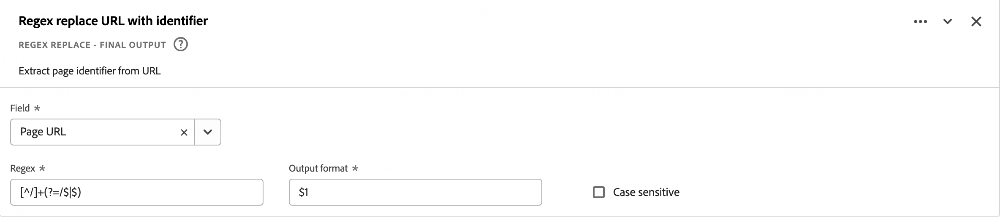

# 派生フィールド {#derived-fields}

<!-- markdownlint-disable MD034 -->

>[!CONTEXTUALHELP]
>id="dataview_derivedfields"
>title="派生フィールド"
>abstract="派生フィールドを使用すると、カスタマイズ可能なルールビルダーを使用して、データ操作をその場で定義できます。その派生フィールドを Workspace のコンポーネント（指標またはディメンション）として使用したり、さらにデータビューでコンポーネントとして定義したりできます。"

<!-- markdownlint-enable MD034 -->

派生フィールドは、Adobe Customer Journey Analytics のリアルタイムレポート機能の重要な側面です。派生フィールドを使用すると、カスタマイズ可能なルールビルダーを使用して、（多くの場合、複雑な）データ操作をその場で定義できます。その派生フィールドを [Workspace](../../analysis-workspace/home.md) のコンポーネント（指標またはディメンション）として使用したり、[データビュー](../data-views.md)でコンポーネントとしてさらに定義したりできます。

派生フィールドを使用すると、Adobe Customer Journey Analytics 外部の他の場所でデータを変換または操作する場合と比較して、大幅な時間と労力を節約できます。[データ準備](https://experienceleague.adobe.com/docs/experience-platform/data-prep/home.html?lang=ja)、[Data Distiller](https://experienceleague.adobe.com/docs/experience-platform/query/data-distiller/overview.html?lang=ja)、独自の ETL（抽出、変換、読み込み）／ELT（抽出、読み込み、変換）プロセス内など。

派生フィールドは[データビュー](../data-views.md)内で定義され、ルールとして定義された一連の関数に基づいており、使用可能な標準フィールドやスキーマフィールドに適用されます。

ユースケースの例を次に示します。

- 収集した不適切なページ名の値を正しいページ名の値に修正する派生ページ名フィールドを定義する。

- 1 つ以上の条件（例：URL パラメーター、ページ URL、ページ名など）に基づいて適切なマーケティングチャネルを決定する派生マーケティングチャネルフィールドを定義する。

## 派生フィールドインターフェイス {#interface}

派生フィールドを作成または編集する場合は、派生フィールドインターフェイスを使用します。

|  | 名前 | 説明 |
|---------|----------|--------|
| 1 | **セレクター** | セレクター領域を使用して、関数、関数テンプレート、スキーマフィールドまたは標準フィールドを選択してルールビルダーにドラッグ＆ドロップします。 ドロップダウンを使用して次の中から選択します。  [!UICONTROL 関数] - 使用可能な[関数](#function-reference)を一覧表示します  [!UICONTROL 関数テンプレート] - 使用可能な[関数テンプレート](#function-templates)を一覧表示します  [!UICONTROL スキーマフィールド] - データセットカテゴリ（イベント、プロファイル、ルックアップ）および以前定義した派生フィールドから使用可能なフィールドを一覧表示します  [!UICONTROL 標準フィールド] - 使用可能な標準フィールド（プラットフォームデータセット ID など）文字列および数値の標準フィールドのみがセレクターに表示されます。関数が他のデータタイプをサポートしている場合は、それらの他のデータタイプを持つ標準フィールドを、ルールインターフェイス内で値またはフィールドに選択できます。  関数、関数テンプレート、スキーマおよび標準フィールドは、 検索ボックスを使用して検索できます。 選択したオブジェクトリストをフィルタリングするには、「フィルター」を選択し、[!UICONTROL 次の条件でフィールドをフィルター]ダイアログでフィルターを指定します。各フィルターの  を使用して、フィルターを簡単に削除できます。 |
| 2 | **ルールビルダー** | 1 つ以上のルールを使用して、派生フィールドを順番に作成します。ルールは関数の具体的な実装なので、常に 1 つの関数にのみ関連付けられます。ルールを作成するには、関数をルールビルダーにドラッグ＆ドロップします。関数タイプによって、ルールのインターフェイスが決まります。 詳しくは、[ルールインターフェイス](#rule-interface)を参照してください。 関数は、ルールビルダーで既に使用可能なルールの先頭、末尾または間に挿入できます。ルールビルダーの最後のルールによって、派生フィールドの最終的な出力が決まります。 |
| 3 | **[!UICONTROL **&#x200B;フィールド設定&#x200B;**]** | 派生フィールドに名前を付けて説明し、そのフィールドタイプを調べることができます。 |
| 4 | **[!UICONTROL **&#x200B;最終出力&#x200B;**]** | この領域には、過去 30 日間のデータと、ルールビルダーで派生フィールドに行った変更に基づいて、出力値のその場で更新したプレビューが表示されます。 |

{style="table-layout:auto"}

## フィールドテンプレートウィザード {#wizard}

派生フィールドインターフェイスに初めてアクセスする際、[!UICONTROL フィールドテンプレートから開始]ウィザードが表示されます。

1. 作成しようとしているフィールドのタイプを最もよく表しているテンプレートを選択します。
2. 「**[!UICONTROL **&#x200B;選択&#x200B;**]**」ボタンを選択して続行します。

派生フィールドダイアログには、選択したフィールドのタイプに必須または役立つルール（および関数）が入力されます。使用可能なテンプレートについて詳しくは、[関数テンプレート](#function-templates)を参照してください。

## ルールインターフェイス {#rules}

ルールビルダーでルールを定義する際は、ルールインターフェイスを使用します。

|  | 名前 | 説明 |
|---------|----------|--------|
| A | **ルール名** |  デフォルトでは、ルール名は&#x200B;**ルール X** です（X はシーケンス番号を表します）。ルールの名前を編集するには、その名前を選択し、新しい名前（例：`Query Parameter`）を入力します。 |
| B | **関数名** | ルール用に選択された関数名（[!UICONTROL 例：URL PARSE]）。関数が関数シーケンスの最後であり、最終出力値を決定する際、関数名の後に [!UICONTROL - FINAL OUTPUT] が続きます（例：[!UICONTROL URL PARSE - FINAL OUTPUT]）。 関数の詳細情報を含むポップアップを表示するには、 を選択します。 |
| C | **ルールの説明** | オプションでルールに説明を追加できます。  を選択し、「**[!UICONTROL **&#x200B;説明を追加&#x200B;**]**」を選択して説明を追加するか、「**[!UICONTROL **&#x200B;説明を編集&#x200B;**]**」を選択して既存の説明を編集します。 エディターを使用して説明を入力します。ツールバーを使用して、テキストの書式設定（スタイルセレクター、太字、斜体、下線、右揃え、左揃え、中央揃え、カラー、番号リスト、ブレットリストの使用）や、外部情報へのリンクの追加を行うことができます。 説明の編集を終了するには、エディターの外側をクリックします。 |
| D | **関数領域** | 関数のロジックを定義します。インターフェイスは、関数のタイプによって異なります。[!UICONTROL フィールド]または[!UICONTROL 値]のドロップダウンには、関数で想定される入力のタイプに基づいて、使用可能なすべてのフィールドカテゴリ（ルール、標準フィールド、フィールド）が表示されます。または、スキーマおよび標準のフィールドセレクターからフィールドをフィールドまたは値にドラッグ＆ドロップすることもできます。ドラッグしたフィールドがルックアップデータセットからのものである場合、定義した関数の前にルックアップ関数が自動的に挿入されます。 サポートされる各関数について詳しくは、[関数リファレンス](#function-reference)を参照してください。 |

{style="table-layout:auto"}

## 派生フィールドの作成 {#create}

1. 既存のデータビューを選択するか、データビューを作成します。詳しくは、[データビュー](../data-views.md)を参照してください。

2. データビューの「**[!UICONTROL **&#x200B;コンポーネント&#x200B;**]**」タブを選択します。

3. 左側のパネルから「**[!UICONTROL **&#x200B;派生フィールドを作成&#x200B;**]**」を選択します。

4. 派生フィールドを定義するには、[!UICONTROL 派生フィールドを作成]インターフェイスを使用します。[派生フィールドインターフェイス](#derived-field-interface)を参照してください。

   新しい派生フィールドを保存するには、「**[!UICONTROL **&#x200B;保存&#x200B;**]**」を選択します。

5. 新しい派生フィールドは、データビューの左側のパネルの&#x200B;**[!UICONTROL **&#x200B;スキーマフィールド&#x200B;**]**&#x200B;の一部として、[!UICONTROL 派生フィールド／]コンテナーに追加されます。

## 派生フィールドの編集 {#edit}

1. 既存のデータビューを選択します。詳しくは、[データビュー](../data-views.md)を参照してください。

2. データビューの「**[!UICONTROL **&#x200B;コンポーネント&#x200B;**]**」タブを選択します。

3. 左側の[!UICONTROL 接続]パネルにある「**[!UICONTROL **&#x200B;スキーマフィールド&#x200B;**]**」タブを選択します。

4. **[!UICONTROL **&#x200B;派生フィールド／**]**&#x200B;コンテナーを選択します。

5. 編集する派生フィールドにポインタを合わせて、 を選択します。

6. 派生フィールドを編集するには、[!UICONTROL 派生フィールドを編集]インターフェイスを使用します。[派生フィールドインターフェイス](#derived-field-interface)を参照してください。

   - 更新した派生フィールドを保存するには、「**[!UICONTROL **&#x200B;保存&#x200B;**]**」を選択します。

   - 派生フィールドに行った変更をキャンセルするには、「**[!UICONTROL **&#x200B;キャンセル&#x200B;**]**」を選択します。

   - 派生フィールドを新しい派生フィールドとして保存するには、「**[!UICONTROL **&#x200B;名前を付けて保存&#x200B;**]**」を選択します。新しい派生フィールドの名前は、編集した元の派生フィールドと同じで、`(copy)` が追加されます。

または、データビューで派生フィールドをディメンションまたは指標のコンポーネントとして使用している場合は、次のようになります。

1. コンポーネントを選択します。コンポーネントの名前は、派生フィールドの名前と異なる可能性があります。

1. コンポーネントパネルで、スキーマフィールド名の下にある、派生フィールドの横の  を選択します。

1. 派生フィールドを編集するには、[!UICONTROL 派生フィールドを編集]インターフェイスを使用します。[派生フィールドインターフェイス](#derived-field-interface)を参照してください。

   - 更新した派生フィールドを保存するには、「**[!UICONTROL **&#x200B;保存&#x200B;**]**」を選択します。

   - 派生フィールドに行った変更をキャンセルするには、「**[!UICONTROL **&#x200B;キャンセル&#x200B;**]**」を選択します。

   - 派生フィールドを新しい派生フィールドとして保存するには、「**[!UICONTROL **&#x200B;名前を付けて保存&#x200B;**]**」を選択します。新しい派生フィールドの名前は、編集した元の派生フィールドと同じで、`(copy)` が追加されます。

## 派生フィールドの削除 {#delete}

1. 既存のデータビューを選択します。詳しくは、[データビュー](../data-views.md)を参照してください。

2. データビューの「**[!UICONTROL **&#x200B;コンポーネント&#x200B;**]**」タブを選択します。

3. [!UICONTROL 接続]パネルにある「**[!UICONTROL **&#x200B;スキーマフィールド&#x200B;**]**」タブを選択します。

4. **[!UICONTROL **&#x200B;派生フィールド／**]**&#x200B;コンテナーを選択します。

5. 削除する派生フィールドにポインタを合わせて、 を選択します。

6. [!UICONTROL 派生フィールドを編集]インターフェイスで、「**[!UICONTROL 削除]**」を選択します。

   削除を確認する[!UICONTROL コンポーネントを削除]ダイアログが表示されます。データビューの外部に派生フィールドへの外部参照が存在する可能性があることを考慮します。

   - 派生フィールドを削除するには、「**[!UICONTROL **&#x200B;続行&#x200B;**]**」を選択します。

または、データビューで派生フィールドをディメンションまたは指標のコンポーネントとして使用している場合は、次のようになります。

1. コンポーネントを選択します。コンポーネントの名前は、派生フィールドの名前と異なる可能性があります。

1. コンポーネントパネルで、スキーマフィールド名の下にある、派生フィールドの横の  を選択します。

1. [!UICONTROL 派生フィールドを編集]インターフェイスで、「**[!UICONTROL 削除]**」を選択します。

   削除を確認する[!UICONTROL コンポーネントを削除]ダイアログが表示されます。データビューの外部に派生フィールドへの外部参照が存在する可能性があることを考慮します。

   - 派生フィールドを削除するには、「**[!UICONTROL **&#x200B;続行&#x200B;**]**」を選択します。

>[!NOTE]
>
>派生フィールドは、Customer Journey Analytics の接続レベルで管理されます。その接続に関連付けられたいずれかのデータビューの派生フィールドに行った変更は、関連付けられているすべてのデータビューに適用されます。

## 関数テンプレート {#templates}

特定のユースケースの派生フィールドをすばやく作成するために、関数テンプレートが使用できます。 これらの関数テンプレートは、派生フィールドインターフェイスのセレクター領域からアクセスできます。また、[!UICONTROL フィールドテンプレートから開始]ウィザードで初めて使用するときにも表示されます。

### マーケティングチャネル {#mchannel}

この関数テンプレートは、ルールのコレクションを使用してマーケティングチャネルを作成します。

+++ 詳細

テンプレートを使用するには、テンプレート内のルールの一部として一覧表示されている各関数に対して正しいパラメーターを指定する必要があります。詳しくは、[関数リファレンス](#function-reference)を参照してください。

+++

### バウンス数 {#bounces}

この関数テンプレートは、ルールのコレクションを使用して、サイトバウンスを識別します。

+++ 詳細

{{select-package}}

テンプレートを使用するには、テンプレート内のルールの一部として一覧表示されている各関数に対して正しいパラメーターを指定する必要があります。詳しくは、[関数リファレンス](#function-reference)を参照してください。

+++

### マルチディメンション結合 {#multi-dim}

この関数テンプレートは、2 つの値を 1 つに結合します。

+++ 詳細

{{select-package}}

テンプレートを使用するには、テンプレート内のルールの一部として一覧表示されている各関数に対して正しいパラメーターを指定する必要があります。詳しくは、[関数リファレンス](#function-reference)を参照してください。

+++

### わかりやすいデータセット名 {#friendlyname}

この関数テンプレートは、読み取り可能なデータセット名を提供します。

+++ 詳細

{{select-package}}

テンプレートを使用するには、テンプレート内のルールの一部として一覧表示されている各関数に対して正しいパラメーターを指定する必要があります。詳しくは、[関数リファレンス](#function-reference)を参照してください。

+++

### URL からのページ名 {#pagename}

この関数テンプレートは、単純なページ名を作成します。

+++ 詳細

{{select-package}}

テンプレートを使用するには、テンプレート内のルールの一部として一覧表示されている各関数に対して正しいパラメーターを指定する必要があります。詳しくは、[関数リファレンス](#function-reference)を参照してください。

+++

### ホリデーシーズン {#holiday}

この関数テンプレートは、年の主な時期を分類します。

+++ 詳細

{{select-package}}

テンプレートを使用するには、テンプレート内のルールの一部として一覧表示されている各関数に対して正しいパラメーターを指定する必要があります。詳しくは、[関数リファレンス](#function-reference)を参照してください。

+++

### 月間目標 {#goals}

この関数テンプレートは、カスタムの月次目標を設定します。

+++ 詳細

{{select-package}}

テンプレートを使用するには、テンプレート内のルールの一部として一覧表示されている各関数に対して正しいパラメーターを指定する必要があります。詳しくは、[関数リファレンス](#function-reference)を参照してください。

+++

### 区切りリストのすべての値を取得 {#allvalues}

この関数テンプレートは、制限リストを配列に変換します。

+++ 詳細

{{select-package}}

テンプレートを使用するには、テンプレート内のルールの一部として一覧表示されている各関数に対して正しいパラメーターを指定する必要があります。詳しくは、[関数リファレンス](#function-reference)を参照してください。

+++

### 区切りリストの最初の値を取得 {#firstvalue}

この関数テンプレートは、区切られたリストの最初の値を取得します。

+++ 詳細

{{select-package}}

テンプレートを使用するには、テンプレート内のルールの一部として一覧表示されている各関数に対して正しいパラメーターを指定する必要があります。詳しくは、[関数リファレンス](#function-reference)を参照してください。

+++

### 区切りリストの最後の値を取得 {#lastvalue}

この関数テンプレートは、区切られたリストの最後の値を取得します。

+++ 詳細

{{select-package}}

テンプレートを使用するには、テンプレート内のルールの一部として一覧表示されている各関数に対して正しいパラメーターを指定する必要があります。詳しくは、[関数リファレンス](#function-reference)を参照してください。

+++

### ドメイン名 {#domain}

この関数テンプレートは、正規表現を使用してドメイン名を抽出します。

+++ 詳細

{{select-package}}

テンプレートを使用するには、テンプレート内のルールの一部として一覧表示されている各関数に対して正しいパラメーターを指定する必要があります。詳しくは、[関数リファレンス](#function-reference)を参照してください。

+++

### クエリ文字列パラメーターを取得 {#querystring}

この関数テンプレートは、クエリ文字列値を抽出します。

+++ 詳細

{{select-package}}

テンプレートを使用するには、テンプレート内のルールの一部として一覧表示されている各関数に対して正しいパラメーターを指定する必要があります。詳しくは、[関数リファレンス](#function-reference)を参照してください。

+++

### 移行フィールド {#transition}

この関数テンプレートは、あるフィールドから別のフィールドにレポートを移行します。

+++ 詳細

{{select-package}}

テンプレートを使用するには、テンプレート内のルールの一部として一覧表示されている各関数に対して正しいパラメーターを指定する必要があります。詳しくは、[関数リファレンス](#function-reference)を参照してください。

+++

### シンプルなボット検出 {#botdetection}

この関数テンプレートは、ライトボットの識別を実装します。

+++ 詳細

{{select-package}}

テンプレートを使用するには、テンプレート内のルールの一部として一覧表示されている各関数に対して正しいパラメーターを指定する必要があります。詳しくは、[関数リファレンス](#function-reference)を参照してください。

+++

### 離脱リンク {#exit}

この関数テンプレートは、セッションで最後にクリックされたリンクを識別します。

+++ 詳細

{{select-package}}

テンプレートを使用するには、テンプレート内のルールの一部として一覧表示されている各関数に対して正しいパラメーターを指定する必要があります。詳しくは、[関数リファレンス](#function-reference)を参照してください。

+++

### ダウンロードリンク {#download}

この関数テンプレートは、一般的なダウンロードリンクにフラグを立てます。

+++ 詳細

{{select-package}}

テンプレートを使用するには、テンプレート内のルールの一部として一覧表示されている各関数に対して正しいパラメーターを指定する必要があります。詳しくは、[関数リファレンス](#function-reference)を参照してください。

+++

<!--

+++ Data clean up template

>[!WARNING]
>
>Could not find any information on this template.
+++

-->

## 関数リファレンス {#functionref}

{{select-package}}

サポートされている各関数について、次の点で詳細を確認してください。

- 仕様：
   - 入力データタイプ：サポートされるデータのタイプ、
   - 入力：入力に使用可能な値、
   - 含まれる演算子：この関数でサポートされる演算子（ある場合）、
   - 制限事項：この特定の関数に適用される制限事項、
   - 出力。

- 次のようなユースケース：
   - 派生フィールドを定義する前のデータ、
   - 派生フィールドの定義方法、
   - 派生フィールドを定義した後のデータ。

- 制約（該当する場合）。

<!-- CASE WHEN -->

### Case When {#casewhen}

<!-- markdownlint-disable MD034 -->

>[!CONTEXTUALHELP]
>id="dataview_derivedfields_casewhen"
>title="Case When"
>abstract="この関数は、1 つ以上のフィールドから定義された基準に基づいて条件を適用する機能を提供します。これらの基準は、条件のシーケンスに基づいて、新しい派生フィールドの値を定義するのに使用されます。"

<!-- markdownlint-enable MD034 -->

1 つ以上のフィールドから定義された条件に基づいて、条件を適用します。これらの基準は、条件のシーケンスに基づいて、新しい派生フィールドの値を定義するのに使用されます。

+++ 詳細

## 仕様 {#casewhen-io}

| 入力データタイプ | 入力 | 含まれる演算子 | 制限事項 | 出力 |
|---|---|---|---|---|
| <ul><li>文字列</li><li>数値</li><li>日付</li></ul> | <ul><li>[!UICONTROL If], [!UICONTROL Else If] コンテナ：
<ul><li>[!UICONTROL 値]</li><ul><li>ルール</li><li>標準フィールド</li><li>フィールド</li></ul><li>[!UICONTROL 条件]（選択した値のタイプに基づく含まれる演算子を参照してください）</li></ul></li><li>[!UICONTROL 値を以下に設定]、[!UICONTROL それ以外の場合は値を以下に設定]：
<ul><li>[!UICONTROL 値]</li><ul><li>ルール</li><li>標準フィールド</li><li>フィールド</li></ul></ul></li></ul> | 
文字列
<ul><li>次と等しい</li><li>が次のいずれかの語句に等しい</li><li>フレーズを含む</li><li>いずれかの語句を含む</li><li>すべての語句を含む</li><li>次の語句で始まる</li><li>任意の語句で始まる</li><li>次の語句で終わる</li><li>任意の語句で終わる</li><li>次と等しくない</li><li>が次のいずれの語句にも等しくない</li><li>このフレーズを含まない</li><li>いずれの語句も含まない</li><li>が次のすべての語句を含まない</li><li>次で始まらない</li><li>いずれの語句でも開始しない</li><li>次で終わらない</li><li>いずれの語句でも終わらない</li><li>設定済み</li><li>未設定</li></ul>
数値
<ul><li>次と等しい</li><li>次と等しくない</li><li>次より大きい</li><li>次よりも大きいか等しい</li><li>次より小さい</li><li>次よりも小さいか等しい</li><li>設定済み</li><li>未設定</li></ul>
日付
<ul><li>次と等しい</li><li>次と等しくない</li><li>が次よりも後</li><li>が次以降</li><li>次より前</li><li>が次以前</li><li>設定済み</li><li>未設定</li></ul> | <ul><li>派生フィールドごとに 5 つの関数</li><li>派生フィールドあたり 200 [ 演算子 ](#operators)。単一のオペレーターの例としては、「参照ドメインに google が含まれる」があります。 </li></ul> | 
新しい派生フィールド
 |

{style="table-layout:auto"}

## ユースケース 1 {#casewhen-uc1}

カスケードロジックを適用してマーケティングチャネルフィールドを適切な値に設定することで、様々なマーケティングチャネルを識別するルールを定義する必要があります。

- リファラーが検索エンジンからのものであり、ページのクエリ文字列値が `cid` に `ps_` を含む場合、マーケティングチャネルは&#x200B;[!DNL *有料検索*]&#x200B;として識別される必要があります。
- リファラーが検索エンジンからのもので、ページにクエリ文字列 `cid` がない場合、マーケティングチャネルは&#x200B;[!DNL *自然検索*]&#x200B;として識別される必要があります。
- ページのクエリ文字列値が `cid` に `em_` を含む場合、マーケティングチャネルは&#x200B;[!DNL *メール*]&#x200B;として識別される必要があります。
- ページのクエリ文字列値が `cid` に `ds_` を含む場合、マーケティングチャネルは&#x200B;[!DNL *ディスプレイ広告*]&#x200B;として識別される必要があります。
- ページのクエリ文字列値が `cid` に `so_` を含む場合、マーケティングチャネルは&#x200B;[!DNL *有料ソーシャル*]&#x200B;として識別される必要があります。
- リファラーが [!DNL twitter.com]、[!DNL facebook.com]、[!DNL linkedin.com] または [!DNL tiktok.com] の参照ドメインからものの場合、マーケティングチャネルは&#x200B;[!DNL *ナチュラルソーシャル*]&#x200B;として識別される必要があります。
- 上記のルールのいずれも一致しない場合、マーケティングチャネルは&#x200B;[!DNL *その他のリファラー*]&#x200B;として識別される必要があります。

サイトが[!UICONTROL リファラー]と[!UICONTROL ページ URL] を含む次のサンプルイベントを受け取った場合、これらのイベントは次のように識別される必要があります。

| [!DNL Event] | [!DNL Referrer] | [!DNL Page URL] | [!DNL Marketing Channel] |
|:--:|----|----|----|
| 1 | `https://facebook.com` | `https://site.com/home` | [!DNL Natural Social] |
| 2 | `https://abc.com` | `https://site.com/?cid=ds_12345678` | [!DNL Display] |
| 3 | | `https://site.com/?cid=em_12345678` | [!DNL Email] |
| 4 | `https://google.com` | `https://site.com/?cid=ps_abc098765` | [!DNL Paid Search] |
| 5 | `https://google.com` | `https://site.com/?cid=em_765544332` | [!DNL Email] |
| 6 | `https://google.com` |  | [!DNL Natural Search] |

{style="table-layout:auto"}

### 前のデータ {#casewhen-uc1-databefore}

| [!DNL Referrer] | [!DNL Page URL] |
|----|----|
| `https://facebook.com` | `https://site.com/home` |
| `https://abc.com` | `https://site.com/?cid=ds_12345678` |
|  | `https://site.com/?cid=em_12345678` |
| `https://google.com` | `https://site.com/?cid=ps_abc098765` |
| `https://google.com` | `https://site.com/?cid=em_765544332` |
| `https://google.com` | |

{style="table-layout:auto"}

### 派生フィールド {#casewhen-uc1-derivedfield}

`Marketing Channel` の派生フィールドを定義します。[!UICONTROL CASE WHEN] 関数を使用して、`Page URL` フィールドと`Referring URL` フィールドの両方の既存の値に基づいて値を作成するルールを定義します。

[!UICONTROL CASE WHEN] ルールが適用される前に `Page Url` と `Referring Url` の値を取得するルールを定義するための関数 [!UICONTROL URL PARSE] の使用に注意してください。

### 後のデータ {#casewhen-uc1-dataafter}

| [!DNL Marketing Channel] |
|----|
| [!DNL Natural Social] |
| [!DNL Display] |
| [!DNL Email] |
| [!DNL Paid Search] |
| [!DNL Email] |
| [!DNL Natural Search] |

{style="table-layout:auto"}

## ユースケース 2 {#casewhen-uc2}

[!DNL Product Finding Methods] ディメンション内の複数の異なるバリエーションの検索を収集しました。検索と参照の全体的なパフォーマンスを理解するには、結果を手動で組み合わせることに多くの時間を費やす必要があります。

サイトは、[!DNL Product Finding Methods] ディメンションに対して次の値を収集します。最後に、これらの値はすべて検索を示します。

| 収集された値 | 実際の値 |
|---|---|
| [!DNL search p13n_no] | [!DNL search] |
| [!DNL search p13n_yes] | [!DNL search] |
| [!DNL search refine p13n_no] | [!DNL search] |
| [!DNL search refine p13n_yes] | [!DNL search] |
| [!DNL search redirect p13n_yes] | [!DNL search] |
| [!DNL search-redirect] | [!DNL search] |

{style="table-layout:auto"}

### 前のデータ {#casewhen-uc2-databefore}

| [!DNL Product Finding Methods] |
|----|
| [!DNL search p13_no] |
| [!DNL search p13_yes] |
| [!DNL browse] |
| [!DNL search refine p13_no] |
| [!DNL search refine p13_yes] |
| [!DNL browse] |
| [!DNL search redirect p13_yes] |
| [!DNL search-redirect] |
| [!DNL browse] |

{style="table-layout:auto"}

### 派生フィールド {#casewhen-uc2-derivedfield}

`Product Finding Methods (new)` の派生フィールドを定義します。次の [!UICONTROL CASE WHEN] ルールをルールビルダーで作成します。これらのルールは、[!UICONTROL フレーズを含む]条件を使用して `search` と `browse` の古い[!UICONTROL 製品検索方法]フィールド値のすべての可能なバリエーションにロジックを適用します。

### 後のデータ {#casewhen-uc2-dataafter}

| [!DNL Product Finding Methods (new)] |
|----|
| [!DNL search] |
| [!DNL search] |
| [!DNL browse] |
| [!DNL search] |
| [!DNL search] |
| [!DNL browse] |
| [!DNL search] |
| [!DNL search] |
| [!DNL browse] |

{style="table-layout:auto"}

## ユースケース 3 {#casewhen-uc3}

旅行会社として、予約された旅行の旅行期間をバケット化して、バケット化された旅行の長さをレポートできるようにしたいと考えています。

前提：

- 組織が、旅行期間を数値フィールドに収集しています。
- 1～3 日の期間を「[!DNL short trip]」というバケットにバケット化したいと考えています
- 期間が 4～7 日のバケットを「[!DNL medium trip]」というバケットに入れたいと考えています
- 8 日以上の期間を「[!DNL long trip]」というバケットにバケット化したいとします
- 1 日の期間で 132 件の旅行が予約されました
- 2 日の期間で 110 件の旅行が予約されました
- 3 日の期間で 105 件の旅行が予約されました
- 4 日の期間で 99 件の旅行が予約されました
- 5 日の期間で 92 件の旅行が予約されました
- 6 日の期間で 85 件の旅行が予約されました
- 7 日の期間で 82 件の旅行が予約されました
- 8 日の期間で 78 件の旅行が予約されました
- 9 日の期間で 50 件の旅行が予約されました
- 10 日の期間で 44 件の旅行が予約されました
- 11 日の期間で 38 件の旅行が予約されました
- 31 日の期間で 12 件の旅行が予約されました

目的のレポートは次のようになります。

| [!DNL Trip Duration Type] | [!DNL Bookings] |
|----|---:|
| [!DNL medium trip] | 358 |
| [!DNL short trip] | 347 |
| [!DNL long trip] | 241 |

{style="table-layout:auto"}

### 前のデータ {#casewhen-uc3-databefore}

| [!DNL Trip Duration] |
|---:|
| 1 |
| 12 |
| 3 |
| 6 |
| 4 |
| 8 |
| 6 |
| 2 |
| 1 |
| 2 |
| 21 |
| 8 |

### 派生フィールド {#casewhen-uc3-derivedfield}

`Trip Duration (bucketed)` の派生フィールドを定義します。次の [!UICONTROL CASE WHEN] ルールをルールビルダーで作成します。このルールは、古い[!UICONTROL トリップ期間]フィールド値を `short trip`、`medium  trip` および `long trip` の 3 つの値にバケット化するロジックを適用します。

### 後のデータ {#casewhen-uc3-dataafter}

| [!DNL Trip Duration (bucketed)] |
|---|
| [!DNL short trip] |
| [!DNL long trip] |
| [!DNL short trip] |
| [!DNL medium trip] |
| [!DNL medium trip] |
| [!DNL long trip] |
| [!DNL medium trip] |
| [!DNL short trip] |
| [!DNL short trip] |
| [!DNL short trip] |
| [!DNL long trip] |
| [!DNL long trip] |

## 詳細情報 {#casewhen-more-info}

Customer Journey Analytics は、Adobe Experience Platform の [XDM](https://experienceleague.adobe.com/docs/experience-platform/xdm/home.html?lang=ja)（エクスペリエンスデータモデル）をモデルにした、ネストされたコンテナ構造を使用します。背景情報について詳しくは、[コンテナ](../create-dataview.md#containers)および[フィルターコンテナ](../../components/filters/filters-overview.md#filter-containers)を参照してください。このコンテナモデルは、本質的には柔軟性がありますが、ルールビルダーを使用する際にいくつかの制約が課せられます。

Customer Journey Analytics では、次のデフォルトのコンテナモデルが使用されます。

値の&#x200B;*選択*&#x200B;と&#x200B;*設定*&#x200B;時には、次の制約が適用されます。

|  | 制約 |
|:---:|----|
| **A** | ルール内の同じ [!UICONTROL If]、[!UICONTROL Else If] 構造（[!UICONTROL And] または [!UICONTROL Or] を使用）内で&#x200B;*選択*&#x200B;する値は、同じコンテナから取得する必要があり、任意のタイプ（文字列  、数値  など）にすることができます。  |
| **B** | ルールをまたいで&#x200B;*設定*&#x200B;するすべての値は、同じコンテナからのものであり、同じタイプや、同じタイプの派生値にする必要があります。   |
| **C** | ルール内の [!UICONTROL If]、[!UICONTROL Else If] 構造をまたいで&#x200B;*選択*&#x200B;する値は、同じコンテナから取得する必要は&#x200B;*なく*、同じタイプにする必要も&#x200B;*ありません*。   |

{style="table-layout:auto"}

+++

<!-- CLASSIFY -->

### Classify {#classify}

<!-- markdownlint-disable MD034 -->

>[!CONTEXTUALHELP]
>id="dataview_derivedfields_classify"
>title="Classify"
>abstract="この関数には、テキスト入力によって対応する値に置き換えられる一連の値を定義する機能があります。"

<!-- markdownlint-enable MD034 -->

新しい派生フィールド内の対応する値に置き換えられる値のセットを定義します。

+++ 詳細

## 仕様 {#classify-io}

| 入力データタイプ | 入力 | 含まれる演算子 | 制限事項 | 出力 |
|---|---|---|---|---|
| <ul><li>文字列</li><li>数値</li><li>日付</li></ul> | <ul><li>[!UICONTROL 分類するフィールド]：<ul><li>ルール</li><li>標準フィールド</li><li>フィールド</li></ul></li><li>[!UICONTROL 値が等しい場合]および[!UICONTROL 値を次の値に置換]：
<ul><li>文字列</li></ul><li>元の値を表示<ul><li>ブール値</li></ul></li></ul> | 
該当なし
 | <ul><li>派生フィールドごとに 5 つの関数</li><li>派生フィールドごとに 200 個の[演算子](#operators)。[!UICONTROL 値が元の値と等しい場合]、[!UICONTROL 新しい値と置き換える]の各エントリは、操作と見なされます。</li></ul> | 
新しい派生フィールド
 |

{style="table-layout:auto"}

## ユースケース 1 {#classify-uc1}

`hotelID` のキー列と、`hotelID` に関連付けられた `city`、`rooms`、`hotel name` などの 1 つ以上の追加の列を含む CSV ファイルがあります。
ディメンションで [!DNL Hotel ID] を収集していますが、CSV ファイル内の `hotelID` から派生した [!DNL Hotel Name] ディメンションを作成したいと考えています。

**CSV ファイルの構造と内容**

| [!DNL hotelID] | [!DNL city] | [!DNL rooms] | [!DNL hotel name] |
|---|---|---:|---|
| [!DNL SLC123] | [!DNL Salt Lake City] | 40 | [!DNL SLC Downtown] |
| [!DNL LAX342] | [!DNL Los Angeles] | 60 | [!DNL LA Airport] |
| [!DNL SFO456] | [!DNL San Francisco] | 75 | [!DNL Market Street] |
| [!DNL AMS789] | [!DNL Amsterdam] | 50 | [!DNL Okura] |

{style="table-layout:auto"}

**現在のレポート**

| [!DNL Hotel ID] | 製品閲覧数 |
|---|---:|
| [!DNL SLC123] | 200 |
| [!DNL LX342] | 198 |
| [!DNL SFO456] | 190 |
| [!DNL AMS789] | 150 |

{style="table-layout:auto"}

**目的のレポート**

| [!DNL Hotel Name] | 製品閲覧数 |
|----|----:|
| [!DNL SLC Downtown] | 200 |
| [!DNL LA Airport] | 198 |
| [!DNL Market Street] | 190 |

{style="table-layout:auto"}

### 前のデータ {#classify-uc1-databefore}

| [!DNL Hotel ID] |
|----|
| [!DNL SLC123] |
| [!DNL LAX342] |
| [!DNL SFO456] |
| [!DNL AMS789] |

{style="table-layout:auto"}

### 派生フィールド {#classify-uc1-derivedfield}

`Hotel Name` の派生フィールドを定義します。[!UICONTROL CLASSIFY] 関数を使用して、「[!UICONTROL ホテル ID]」フィールドの値を分類し、新しい値に置き換えることができるルールを定義します。

分類する値の一部として定義していない元の値（例：ホテル ID AMS789）を含める場合は、「**[!UICONTROL 元の値を表示]**」を選択します。これにより、AMS789 の値が分類されていないにもかかわらず、派生フィールドの出力の一部となります。

### 後のデータ {#classify-uc1-dataafter}

| [!DNL Hotel Name] |
|----|
| [!DNL SLC Downtown] |
| [!DNL LA Airport] |
| [!DNL Market Street] |

{style="table-layout:auto"}

## ユースケース 2 {#classify-uc2}

複数のページで、わかりやすいページ名の代わりに URL を収集しました。この混在した値のコレクションにより、レポートが中断されます。

### 前のデータ {#classify-uc2-databefore}

| [!DNL Page Name] |
|---|
| [!DNL Home Page] |
| [!DNL Flight Search] |
| `http://www.adobetravel.ca/Hotel-Search` |
| `https://www.adobetravel.com/Package-Search` |
| [!DNL Deals & Offers] |
| `http://www.adobetravel.ca/user/reviews` |
| `https://www.adobetravel.com.br/Generate-Quote/preview` |

{style="table-layout:auto"}

### 派生フィールド {#classify-uc2-derivedfield}

`Page Name (updated)` の派生フィールドを定義します。 [!UICONTROL CLASSIFY] 関数を使用して、既存の「[!UICONTROL ページ名]」フィールドの値を分類し、更新された正しい値に置き換えることができるルールを定義します。

### 後のデータ {#classify-uc2-dataafter}

| [!DNL Page Name (updated)] |
|---|
| [!DNL Home Page] |
| [!DNL Flight Search] |
| [!DNL Hotel Search] |
| [!DNL Package Search] |
| [!DNL Deals & Offers] |
| [!DNL Reviews] |
| [!DNL Generate Quote] |

## 詳細情報 {#classify-moreinfo}

分類ルールインターフェイスでは、次の追加機能を使用できます。

- すべてのテーブルの値をすばやくクリアするには、 **[!UICONTROL すべてのテーブルの値をクリア]** を選択します。
- 「値が等しい場合」の元の値と「値を次の値に置換」の新しい値を含む CSV ファイルをアップロードするには、 **[!UICONTROL CSV をアップロード]** を選択します。
- アップロードする元の値と新しい値を含む CSV ファイルを作成するためのテンプレートをダウンロードするには、 **[!UICONTROL CSV テンプレートをダウンロード]** を選択します。
- ルールインターフェイスに入力されたすべての元の値と新しい値を含む CSV ファイルをダウンロードするには、 **[!UICONTROL CSV 値をダウンロード]** を選択します。

+++

<!-- CONCATENATE -->

### 連結 {#concatenate}

<!-- markdownlint-disable MD034 -->

>[!CONTEXTUALHELP]
>id="dataview_derivedfields_concatenate"
>title="連結"
>abstract="この関数は、2 つ以上のフィールド、派生フィールド、またはユーザーが入力した文字列値を、定義済みの区切り文字を使用して 1 つのフィールドに結合する機能を提供します。"

<!-- markdownlint-enable MD034 -->

定義済みの区切り記号を使用して、フィールド値を 1 つの新しい派生フィールドに結合します。

+++ 詳細

## 仕様 {#concatenate-io}

| 入力データタイプ | 入力 | 含まれる演算子 | 制限事項 | 出力 |
|---|---|---|---|---|
| <ul><li>文字列</li></ul> | <ul><li>[!UICONTROL 値]：<ul><li>ルール</li><li>標準フィールド</li><li>フィールド</li><li>文字列</li></ul></li><li>[!UICONTROL 区切り記号]：<ul><li>文字列</li></ul></li> </ul> | 
該当なし
 | 
派生フィールドごとに 2 つの関数
 | 
新しい派生フィールド
 |

{style="table-layout:auto"}

## ユースケース {#concatenate-uc}

現在、出発地と目的地の空港コードを別々のフィールドとして収集しています。この 2 つのフィールドをハイフン（-）で区切られた 1 つのディメンションに結合したいと考えています。これにより、出発地と目的地の組み合わせを分析して、予約されている上位のルートを特定できます。

前提：

- 出発地と目的地の値は、同じテーブルの別々のフィールドに収集されます。
- ユーザーは、値の間に区切り記号「-」を使用することを決定します。

次の予約が発生したとします。

- お客様の ABC123 がソルトレイクシティ（SLC）とオーランド（MCO）間のフライトを予約
- お客様の ABC456 がソルトレイクシティ（SLC）とロサンゼルス（LAX）間のフライトを予約
- お客様の ABC789 がソルトレイクシティ（SLC）とシアトル（SEA）間のフライトを予約
- お客様の ABC987 がソルトレイクシティ（SLC）とサンノゼ（SJO）間のフライトを予約
- お客様の ABC654 がソルトレイクシティ（SLC）とオーランド（MCO）間のフライトを予約

目的のレポートは次のようになります。

| 出発地／目的地 | 予約 |
|----|---:|
| SLC-MCO | 2 |
| SLC-LAX | 1 |
| SLC-SEA | 1 |
| SLC-SJO | 1 |

{style="table-layout:auto"}

### 前のデータ {#concatenate-uc-databefore}

| 出発地 | 宛先 |
|----|---:|
| SLC | MCO |
| SLC | LAX |
| SLC | SEA |
| SLC | SJO |
| SLC | MCO |

{style="table-layout:auto"}

### 派生フィールド {#concatenate-derivedfield}

`Origin - Destination` の派生フィールドを定義します。[!UICONTROL CONCATENATE] 関数を使用し、`-` [!UICONTROL 区切り記号]を使用して、「[!UICONTROL 出発地]」フィールドと「[!UICONTROL 目的地]」フィールドを連結するルールを定義します。

### 後のデータ {#concatenate-dataafter}

| 出発地 - 目的地 （派生フィールド） |
|---|
| SLC-MCO |
| SLC-LAX |
| SLC-SEA |
| SLC-SJO |
| SLC-MCO |

{style="table-layout:auto"}

+++

### Deduplicate {#dedup}

<!-- markdownlint-disable MD034 -->

>[!CONTEXTUALHELP]
>id="dataview_derivedfields_deduplicate"
>title="Deduplicate"
>abstract="この関数は、セッションレベルまたはユーザーレベルで繰り返し値をカウントしないようにフィールドを設定する機能を提供します。さらに、重複排除 ID を使用すると、特定の ID（購入 ID など）に基づいて、1 つの値（最初のインスタンスまたは最後のインスタンス）のみが使用されるようにすることができます。"

<!-- markdownlint-enable MD034 -->

値が複数回カウントされるのを防ぎます。

+++ 詳細

## 仕様 {#deduplicate-io}

| 入力データタイプ | 入力 | 含まれる演算子 | 制限事項 | 出力 |
|---|---|---|---|---|
| <ul><li>文字列</li><li>数値</li></ul> | <ul><li>[!UICONTROL 値]：<ul><li>ルール</li><li>標準フィールド</li><li>フィールド</li><li>文字列</li></ul></li><li>[!UICONTROL 範囲]：<ul><li>ユーザー</li><li>セッション</li></ul></li><li>[!UICONTROL 重複排除 ID]：<ul><li>ルール</li><li>標準フィールド</li><li>フィールド</li><li>文字列</li></ul><li>[!UICONTROL 保持する値]：<ul><li>最初のインスタンスを維持</li><li>最後のインスタンスを維持</li></ul></li></ul> | 
該当なし
 | 
派生フィールドごとに 5 つの関数
 | 
新しい派生フィールド
 |

{style="table-layout:auto"}

## ユースケース 1 {#deduplicate-uc1}

ユーザーが予約確認ページを再読み込みした際に、売上高が重複してカウントされるのを防ぐ必要があります。識別子に予約確認 ID を使用すると、同じイベントで受信した際に売上高が再度カウントされません。

### 前のデータ {#deduplicate-uc1-databefore}

| 予約確認 ID | 売上高 |
|----|---:|
| ABC123456789 | 359 |
| ABC123456789 | 359 |
| ABC123456789 | 359 |

{style="table-layout:auto"}

### 派生フィールド {#deduplicate-uc1-derivedfield}

`Booking Confirmation` の派生フィールドを定義します。[!UICONTROL DEDUPLICATE] 関数を使用すると、[!UICONTROL 重複排除 ID] [!UICONTROL 予約確認 ID] を使用して[!UICONTROL 範囲] [!DNL Person] の[!UICONTROL 値] [!DNL Booking] の重複排除を行うルールを定義できます。[!UICONTROL 最初のインスタンスを保持]を[!UICONTROL 保持する値]として選択します。

### 後のデータ {#deduplicate-uc1-dataafter}

| 予約確認 ID | 売上高 |
|----|---:|
| ABC123456789 | 359 |
| ABC123456789 | 0 |
| ABC123456789 | 0 |

{style="table-layout:auto"}

## ユースケース 2 {#deduplicate-uc2}

イベントを、外部マーケティングキャンペーンでのキャンペーンのクリックスルーのプロキシとして使用します。リロードとリダイレクトが原因で、イベント指標が水増しされます。トラッキングコードディメンションの重複を排除して、最初のディメンションのみが収集されるようにし、イベントのオーバーカウントを最小限に抑えたいと考えています。

### 前のデータ {#deduplicate-uc2-databefore}

| 訪問者 ID | マーケティングチャネル | イベント |
|----|---|---:|
| ABC123 | 有料検索 | 1 |
| ABC123 | 有料検索 | 1 |
| ABC123 | 有料検索 | 1 |
| DEF123 | メール | 1 |
| DEF123 | メール | 1 |
| JKL123 | 自然検索 | 1 |
| JKL123 | 自然検索 | 1 |

{style="table-layout:auto"}

### 派生フィールド {#deduplicate-uc2-derivedfield}

新しい `Tracking Code (deduplicated)` の派生フィールドを定義します。[!UICONTROL DEDUPLICATE] 関数を使用すると、[!UICONTROL トラッキングコード]の重複を排除するルールを、[!UICONTROL 重複排除範囲]の[!UICONTROL セッション]と、[!UICONTROL 最初のインスタンスを保持]を[!UICONTROL 保持する値]として定義できます。

### 後のデータ {#deduplicate-uc2-dataafter}

| 訪問者 ID | マーケティングチャネル | イベント |
|----|---|---:|
| ABC123 | 有料検索 | 1 |
| DEF123 | メール | 1 |
| JKL123 | 自然検索 | 1 |

{style="table-layout:auto"}

+++

<!-- FIND AND REPLACE -->

### 検索と置換 {#find-and-replace}

<!-- markdownlint-disable MD034 -->

>[!CONTEXTUALHELP]
>id="dataview_derivedfields_findandreplace"
>title="検索と置換"
>abstract="この関数は、選択したフィールド内のすべての値を検索し、それらの値を新しい派生フィールド内の別の値に置き換える機能を提供します。"

<!-- markdownlint-enable MD034 -->

選択したフィールド内のすべての値を検索し、それらの値を新しい派生フィールド内の別の値に置き換えます。

+++ 詳細

## 仕様 {#findreplace-io}

| 入力データタイプ | 入力 | 含まれる演算子 | 制限事項 | 出力 |
|---|---|---|---|---|
| <ul><li>文字列</li></ul> | <ul><li>[!UICONTROL 値]<ul><li>ルール</li><li>標準フィールド</li><li>フィールド</li></ul></li><li>[!UICONTROL すべてを検索]、[!UICONTROL およびすべてを次と置換]：<ul><li>文字列</li></ul></li></ul></ul> | 
文字列
<ul><li>[!UICONTROL すべてを検索]、[!UICONTROL およびすべてを次と置換]</li></ul> | 
派生フィールドごとに 5 つの関数
 | 
新しい派生フィールド
 |

{style="table-layout:auto"}

## ユースケース {#findreplace-uc}

外部マーケティングチャネルレポートで不正な値を受信しました（例：`email marketing` ではなく `email%20 marketing`）。これらの不正な値によりレポートが破損し、メールのパフォーマンスを確認するのが難しくなります。`email%20marketing` を `email marketing` に置き換える必要があります。

**元のレポート**

| [!DNL External Marketing Channels] | [!DNL Sessions] |
|---|--:|
| [!DNL email marketing] | 500 |
| [!DNL email %20marketing] | 24 |

{style="table-layout:auto"}

**優先レポート**

| [!DNL External Marketing Channels] | [!DNL Sessions] |
|---|--:|
| [!DNL email marketing] | 524 |

### 前のデータ {#findreplace-uc-databefore}

| [!DNL External Marketing] |
|----|
| [!DNL email marketing] |
| [!DNL email%20marketing] |
| [!DNL email marketing] |
| [!DNL email marketing] |
| [!DNL email%20marketing] |

{style="table-layout:auto"}

### 派生フィールド {#findreplace-uc-derivedfield}

`Email Marketing (updated)` の派生フィールドを定義します。[!UICONTROL FIND AND REPLACE] 関数を使用して、`email%20marketing` のすべての発生を検索して `email marketing` に置き換えるルールを定義します。

### 後のデータ {#findreplace-uc-dataafter}

| [!DNL External Marketing (updated)] |
|----|
| [!DNL email marketing] |
| [!DNL email marketing] |
| [!DNL email marketing] |
| [!DNL email marketing] |
| [!DNL email marketing] |

{style="table-layout:auto"}

+++

<!-- LOOKUP -->

### ルックアップ {#lookup}

<!-- markdownlint-disable MD034 -->

>[!CONTEXTUALHELP]
>id="dataview_derivedfields_lookup"
>title="ルックアップ"
>abstract="この関数には、データセット間で一致するキーを使用して、ルックアップデータセットのフィールドを使用する機能があります。"

<!-- markdownlint-enable MD034 -->

ルックアップデータセットのフィールドを使用して値をルックアップし、新しい派生フィールドまたは追加のルール処理に値を返します。

+++ 詳細

## 仕様 {#lookup-io}

| 入力データタイプ | 入力 | 含まれる演算子 | 上限 | 出力 |
|---|---|---|---|---|
| <ul><li>文字列</li><li>数値</li><li>日付</li></ul> | <ul><li>[!UICONTROL ルックアップを適用するフィールド]：</li><ul><li>ルール</li><li>標準フィールド</li><li>フィールド</li></ul><li>[!UICONTROL ルックアップデータセット]</li><ul><li>データセット</li></ul><li>[!UICONTROL 一致するキー]<ul><li>ルール</li><li>フィールド</li></ul></li><li>戻す値<ul><li>ルール</li><li>フィールド</li></ul></li></ul> | 
該当なし
 | 
派生フィールドごとに 3 つの関数
 | 
次のルールでさらに処理するための新しい派生フィールドまたは値
 |

{style="table-layout:auto"}

## ユースケース {#lookup-uc}

Adobe Target を通じて表示されるパーソナライズされたバナーをお客様がクリックした際に収集されたアクティビティ ID を使用して、アクティビティ名をルックアップしたいと考えています。アクティビティ ID とアクティビティ名を含む Analytics for Target（A4T）アクティビティでルックアップデータセットを使用する必要があります。

### A4T ルックアップデータセット {#lookup-uc-lookup}

| アクティビティ ID | アクティビティ名 |
|---|---|
| 415851 | MVT テストカテゴリページ |
| 415852 | Luma - Campaign Max 2022 |
| 402922 | ホーム ページバナー |

{style="table-layout:auto"}

### 派生フィールド {#lookup-uc-derivedfield}

`Activity Name` の派生フィールドを定義します。[!UICONTROL LOOKUP] 関数を使用して、「[!UICONTROL ルックアップを適用するフィールド]」フィールド（例：**[!DNL ActivityIdentifier]**）で指定した、収集されたデータから値をルックアップするルールを定義します。[!UICONTROL ルックアップデータセット]リストからルックアップデータセットを選択します（例：**[!DNL New CJA4T Activities]**）。次に、[!UICONTROL 一致するキー]リストから識別子フィールド (例：**[!DNL ActivityIdentifier]**）を選択し、[!UICONTROL 戻す値]リストから返されるフィールド（例：**[!DNL ActivityName]**）を選択します。

## 詳細情報 {#lookup-more-info}

ルックアップ関数は、レポート時、接続の一部として設定したルックアップデータセットから Customer Journey Analytics によって取得されたデータに適用されます。

既に 1 つ以上の他の関数が含まれているルールビルダーに、[!UICONTROL ルックアップ]関数をすばやく挿入できます。

1. セレクターから「**[!UICONTROL スキーマフィールド]**」を選択します。
1.  **[!UICONTROL ルックアップデータセット]** を選択します。
1. ルックアップデータセットを選択し、ルックアップに使用するフィールドを見つけます。
1. ルックアップフィールドを、関数の使用可能な入力フィールド（例：条件の場合）のいずれかにドラッグ＆ドロップします。有効な場合、「**[!UICONTROL + 追加]**」というラベルの付いた青色のボックスを使用してフィールドをドロップすると、ルックアップフィールドをドロップした関数の前にルックアップ関数が自動的に挿入されます。挿入されたルックアップ関数には、すべてのフィールドの関連する値が自動的に入力されます。
   

+++

<!-- LOWERCASE -->

### Lowercase {#lowercase}

<!-- markdownlint-disable MD034 -->

>[!CONTEXTUALHELP]
>id="dataview_derivedfields_lowercase"
>title="Lowercase"
>abstract="この関数は、文字列テキスト全体を小文字の値に変換します。"

<!-- markdownlint-enable MD034 -->

フィールドの値を小文字に変換し、新しい派生フィールドに格納します。

+++ 詳細

## 仕様 {#lowercase-io}

| 入力データタイプ | 入力 | 含まれる演算子 | 上限 | 出力 |
|---|---|---|---|---|
| <ul><li>文字列</li><li>数値</li><li>日付</li></ul> | <ul><li>[!UICONTROL フィールド]：</li><ul><li>ルール</li><li>標準フィールド</li><li>フィールド</li></ul> | 
該当なし
 | 
派生フィールドごとに 2 つの関数
 | 
新しい派生フィールド
 |

{style="table-layout:auto"}

## ユースケース {#lowercase-uc}

適切なレポートを作成するために、収集したすべての製品名を小文字に変換したいと考えています。

### 前のデータ {#lowercase-uc-databefore}

| 収集された製品名 | 製品閲覧数 |
|---|---:|
| テニスラケット | 35 |
| テニスラケット | 33 |
| テニスラケット | 21 |
| ベースボールバット | 15 |
| ベースボールバット | 12 |
| ベースボールバット | 10 |

{style="table-layout:auto"}

### 派生フィールド {#lowercase-uc-derivedfield}

`Product Names` の派生フィールドを定義します。[!UICONTROL LOWERCASE] 関数を使用して、「[!UICONTROL 収集された製品名]」フィールドの値を小文字に変換し、新しい派生フィールドに格納するルールを定義します。

### 後のデータ {#lowercase-uc-dataafter}

| 製品名 | 製品閲覧数 |
|---|---|
| テニスラケット | 89 |
| ベースボールバット | 37 |

{style="table-layout:auto"}

+++

<!-- MATH -->

### Math {#math}

<!-- markdownlint-disable MD034 -->

>[!CONTEXTUALHELP]
>id="dataview_derivedfields_math"
>title="Math"
>abstract="この関数は、フィールドに対して数学演算を実行する機能を提供します。この関数を使用して、加算、減算、乗算、除算などの基本的な算術演算を実行できます。"

<!-- markdownlint-enable MD034 -->

数値フィールドに対して基本的な数学演算子（加算、減算、乗算、除算、累乗）を使用します。

+++ 詳細

## 仕様 {#math-io}

| 入力データタイプ | 入力 | 含まれる演算子 | 上限 | 出力 |
|---|---|---|---|---|
| <ul><li>数値</li></ul> | <ul><li>1 つまたは複数の数値フィールド</li><li>1 つまたは複数の演算子（加算、減算、乗算、除算、累乗）</li><li>ユーザー入力値</li></ul> | <ul><li>`+`（追加）</li><li>`-`（減算）</li><li>`*`（乗算）</li><li>`/`（除算）</li><li>`^`（累乗）</li></ul> | <ul><li>派生フィールドごとに 25 の操作</li><li>派生フィールドごとに 5 つの数学関数</li></ul> | 
新しい派生フィールド
 |

{style="table-layout:auto"}

## ユースケース {#math-uc}

インフレーションにより、取り込まれた CRM データの売上高の数値を 5％のインフレーションで修正する必要があります。

### 前のデータ {#math-uc-databefore}

| CRM ID | 年間売上高 |
|---|---:|
| 1234 | 35,070,000 |
| 4133 | 7,500,000 |
| 8110 | 10,980 |
| 2201 | 42,620 |

{style="table-layout:auto"}

### 派生フィールド {#math-uc-derivedfield}

`Corrected Annual Revenue` の派生フィールドを定義します。[!UICONTROL MATH] 関数を使用して、元の年間売上高の数値に 1.05 を乗算するルールを定義します。

### 後のデータ {#math-uc-dataafter}

| CRM ID | 修正済み年間売上高 |
|---|---:|
| 1234 | 36,823,500 |
| 4133 | 7,875,000 |
| 8110 | 11,529,00 |
| 2201 | 44,751 |

{style="table-layout:auto"}

## 詳細情報 {#math-more-info}

数式を作成するには：

1. 数式フィールドに入力を開始するだけで、入力した内容に一致する数値フィールドがポップアップメニューに表示されます。または、左側のパネルの使用可能なフィールドから数値フィールドをドラッグ＆ドロップすることもできます。
   

1. オペランド（例：乗算の場合は `*`）を追加し、その後に別のフィールドまたは静的な値を追加します。括弧を使用して、より複雑な数式を定義できます。

1. 静的な値（例：`1.05`）を挿入するには、値を入力し、ポップアップメニューから「**[!UICONTROL *x* を静的な値として追加]**」または「**[!UICONTROL -*x* をを静的な負の値として追加]**」を選択します。
   

1. 緑色のチェックマーク  は数式が有効かどうかを示します。有効でない場合は警告  と「[!UICONTROL 数式が無効です]」というメッセージが表示されます。
   

[!UICONTROL MATH] 関数で静的な数値を使用する場合は、いくつかの重要な考慮事項があります。

- 静的な値は、フィールドに関連付ける必要があります。例えば、静的フィールドのみで [!UICONTROL MATH] 関数を使用することはサポートされていません。
- 静的な値に累乗演算子（`ˆ`）は使用できません。
- 数式で複数の静的な値を使用している場合、数式を有効にするには、これらの静的の値を括弧を使用してグループ化する必要があります。例：

   - この数式はエラーを返します。
     

   - この数式は有効です。
     

ヒットレベルに基づく計算には、Math 関数を使用します。イベント、セッションまたはユーザーの範囲に基づく計算には、[Summarize](#summarize) 関数を使用します。

+++

<!-- MERGE FIELDS -->

### Merge Fields {#merge}

<!-- markdownlint-disable MD034 -->

>[!CONTEXTUALHELP]
>id="dataview_derivedfields_mergefields"
>title="Merge Fields"
>abstract="この関数は、2 つの異なるフィールドから値を取得し、それぞれの値を 1 つのディメンションに含める機能を提供します。まず、最初の値が設定されているかどうかを確認します。設定されていない場合は、2 番目の値などが使用されます。"

<!-- markdownlint-enable MD034 -->

2 つの異なるフィールドの値を新しい派生フィールドに結合します。

+++ 詳細

## 仕様 {#merge-fields-io}

| 入力データタイプ | 入力 | 含まれる演算子 | 上限 | 出力 |
|---|---|---|---|---|
| <ul><li>文字列</li><li>数値</li><li>日付</li></ul> | <ul><li>[!UICONTROL フィールド]：</li><ul><li>ルール</li><li>標準フィールド</li><li>フィールド</li></ul> | 
該当なし
 | 
派生フィールドごとに 5 つの関数
 | 
新しい派生フィールド
 |

{style="table-layout:auto"}

## ユースケース {#merge-fields-uc}

チャネルをまたいでジャーニーを分析する目的で、ページ名フィールドと通話理由フィールドから構成されるディメンションを作成したいと考えています。

### 前のデータ {#merge-fields-uc-databefore}

| ページ名 | セッション | 訪問者数 |
|---|--:|--:|
| ヘルプページ | 250 | 200 |
| ホームページ | 500 | 250 |
| 製品詳細ページ | 300 | 200 |

{style="table-layout:auto"}

| 通話理由 | セッション | 訪問者数 |
|---|--:|--:|
| 注文に関する質問 | 275 | 250 |
| 注文に対する変更 | 150 | 145 |
| 注文に関する問題 | 100 | 95 |

{style="table-layout:auto"}

### 派生フィールド {#merge-fields-uc-derivedfield}

`Cross Channel Interactions` の派生フィールドを定義します。[!UICONTROL MERGE FIELDS] 関数を使用して、「[!UICONTROL ページ名]」フィールドと「[!UICONTROL 通話理由]」フィールドの値を結合し、新しい派生フィールドに格納するルールを定義します。

### 後のデータ {#merge-fields-uc-dataafter}

| クロスチャネルインタラクション | セッション数 | 訪問者数 |
|---|--:|--:|
| ホームページ | 500 | 250 |
| 製品詳細ページ | 300 | 200 |
| 注文に関する質問 | 275 | 250 |
| ヘルプページ | 250 | 200 |
| 注文に対する変更 | 150 | 145 |
| 注文に関する問題 | 100 | 95 |

{style="table-layout:auto"}

## 詳細情報 {#merge-fields-moreinfo}

結合フィールドルール内で同じタイプのフィールドを選択する必要があります。例えば、「日付」フィールドを選択した場合、結合する他のすべてのフィールドは「日付」フィールドにする必要があります。

+++

<!-- NEXT OR PREVIOUS -->

### Next or Previous {#next-previous}

<!-- markdownlint-disable MD034 -->

>[!CONTEXTUALHELP]
>id="dataview_derivedfields_nextprevious"
>title="Next or Previous"
>abstract="この関数は、特定のフィールドに関して収集された次または前の値を確認する機能を提供します。"

<!-- markdownlint-enable MD034 -->

フィールドを入力として受け取り、セッションまたは使用の範囲内で、そのフィールドの次または前の値を解決します。これは、「訪問」および「イベント」テーブルフィールドにのみ適用されます。

+++ 詳細

## 仕様 {#prevornext-io}

| 入力データタイプ | 入力 | 含まれる演算子 | 上限 | 出力 |
|---|---|---|---|---|
| <ul><li>文字列</li><li>数値</li><li>日付</li></ul> | <ul><li>[!UICONTROL フィールド]：</li><ul><li>ルール</li><li>標準フィールド</li><li>フィールド</li></ul><li>[!UICONTROL メソッド]：<ul><li>前の値</li><li>次の値</li></ul></li><li>[!UICONTROL 範囲]：<ul><li>ユーザー</li><li>セッション</li></ul></li><li>[!UICONTROL インデックス]：<ul><li>数値</li></ul><li>[!UICONTROL 繰り返しを含める]：<ul><li>ブール値</li></ul></li></ul> | 
該当なし
 | 
派生フィールドごとに 3 つの関数
 | 
新しい派生フィールド
 |

{style="table-layout:auto"}

## ユースケース {#prevornext-uc1}

繰り返し値を考慮して、受信したデータの&#x200B;**次**&#x200B;または&#x200B;**前**&#x200B;の値が何であるかを理解したいと考えています。

### データ {#prevornext-uc1-databefore}

**例 1 - 繰り返しを含む処理**

| 受信データ | 次の値 セッション インデックス = 1 繰り返しを含める | 次の値 セッション インデックス = 1  繰り返しを含めない | 前の値 セッション インデックス = 1 繰り返しを含める | 前の値  セッション インデックス = 1 繰り返しを含まない |
|---|---|---|---|---|
| ホーム | ホーム | 検索 | *値なし* | *値なし* |
| ホーム | 検索 | 検索 | ホーム | *値なし* |
| 検索 | 検索 | 製品詳細 | ホーム | ホーム |
| 検索 | 製品詳細 | 製品詳細 | 検索 | ホーム |
| 製品詳細 | 検索 | 検索 | 検索 | 検索 |
| 検索 | 製品詳細 | 製品詳細 | 製品詳細 | 製品詳細 |
| 製品詳細 | 検索 | 検索 | 検索 | 検索 |
| 検索 | 検索 | *値なし* | 製品詳細 | 製品詳細 |
| 検索 | *値なし* | *値なし* | 検索 | 製品詳細 |

{style="table-layout:auto"}

**例 2 - 処理には、受信データに空値を含む繰り返しが含まれる**

| 受信データ | 次の値 セッション インデックス = 1 繰り返しを含める | 次の値 セッション インデックス = 1  繰り返しを含めない | 前の値 セッション インデックス = 1 繰り返しを含める | 前の値  セッション インデックス = 1 繰り返しを含まない |
|---|---|---|---|---|
| ホーム | ホーム | 検索 | *値なし* | *値なし* |
| ホーム | ホーム | 検索 | ホーム | *値なし* |
| ホーム | 検索 | 検索 | ホーム | *値なし* |
| 検索 | 検索 | 製品詳細 | ホーム | ホーム |
|   |   |   |   |   |
| 検索 | 検索 | 製品詳細 | 検索 | ホーム |
| 検索 | 製品詳細 | 製品詳細 | 検索 | ホーム |
| 製品詳細 | *値なし* | *値なし* | 検索 | 検索 |
|   |   |   |   |   |

{style="table-layout:auto"}

### 派生フィールド {#prevnext-uc1-derivedfield}

`Next Value` または `Previous value` の派生フィールドを定義します。[!UICONTROL NEXT OR PREVIOUS] 関数を使用して、「[!UICONTROL 受信データ]」フィールドを選択するルールを定義し、[!UICONTROL メソッド]として「[!UICONTROL 次の値]」または「[!UICONTROL 前の値]」、範囲として「[!UICONTROL セッション]」を選択し、[!UICONTROL インデックス]の値を `1` に設定します。

## 詳細情報 {#prevnext-moreinfo}

訪問またはイベントテーブルに属するフィールドのみを選択できます。

[!UICONTROL 繰り返しを含める]は、[!UICONTROL NEXT OR PREVIOUS] 関数の繰り返し値の処理方法を決定します。

- 繰り返しの外観と次または前の値を含めます。 「[!UICONTROL 繰り返しを含める]」を選択した場合、現在のヒットからの次または前の値の連続した繰り返しは無視されます。

- 選択したフィールドに値がない（空白の）行には、[!UICONTROL NEXT OR PREVIOUS] 関数の出力の一部として次または前の値が返されません。

+++

<!-- REGEX REPLACE -->

### Regex Replace {#regex-replace}

<!-- markdownlint-disable MD034 -->

>[!CONTEXTUALHELP]
>id="dataview_derivedfields_regexreplace"
>title="Regex Replace"
>abstract="この関数には、正規表現を使用して文字列の一部を抽出する機能があります。"

<!-- markdownlint-enable MD034 -->

正規表現を使用してフィールドの値を新しい派生フィールドに置き換えます。

+++ 詳細

## 仕様 {#regex-replace-io}

| 入力データタイプ | 入力 | 含まれる演算子 | 上限 | 出力 |
|---|---|---|---|---|
| <ul><li>文字列</li><li>数値</li></ul> | <ul><li>[!UICONTROL フィールド]：</li><ul><li>ルール</li><li>標準フィールド</li><li>フィールド</li></ul></ul><ul><li>[!UICONTROL 正規表現]：</li><ul><li>文字列</li></ul></li><li>[!UICONTROL 出力形式]：<ul><li>文字列</li></ul></ul><ul><li>大文字と小文字を区別</li><ul><li>ブール値</li></ul></li></ul></li> | 
該当なし
 | 
派生フィールドごとに 1 つの関数
 | 
新しい派生フィールド
 |

{style="table-layout:auto"}

## ユースケース {#regex-replace-uc}

URL の一部を取得し、一意のページ識別子として使用してトラフィックを分析したいと考えています。URL の末尾を取得するための正規表現として `[^/]+(?=/$|$)` を使用し、出力パターンとして `$1` を使用します。

### 前のデータ {#regex-replace-uc-databefore}

| ページ URL |
|---|
| `https://business.adobe.com/products/analytics/adobe-analytics-benefits.html` |
| `https://business.adobe.com/products/analytics/adobe-analytics.html` |
| `https://business.adobe.com/products/experience-platform/customer-journey-analytics.html` |
| `https://business.adobe.com/products/experience-platform/adobe-experience-platform.html` |

{style="table-layout:auto"}

### 派生フィールド {#regex-replace-uc-derivedfield}

`Page Identifier` の派生フィールドを作成します。[!UICONTROL REGEX REPLACE] 関数を使用して、`[^/]+(?=/$|$)` の[!UICONTROL 正規表現]と `$1` の[!UICONTROL 出力形式]を使用して「[!UICONTROL 参照 URL]」フィールドの値を置き換えるルールを定義します。

### 後のデータ {#regex-replace-uc-dataafter}

| ページ識別子 |
|---|
| adobe-analytics-benefits.html |
| adobe-analytics.html |
| customer-journey-analytics.html |
| adobe-experience-platform.html |

## 詳細情報 {#regex-replace-more-info}

Customer Journey Analytics では、Perl 正規表現構文のサブセットを使用します。次の式がサポートされています。

| 式 | 説明 |
| --- | --- |
| `a` | 単一の文字 `a`。 |
| `a\|b` | 単一の文字 `a` または `b`。 |
| `[abc]` | 単一の文字 `a`、`b` または `c`。 |
| `[^abc]` | `a`、`b` または `c` を除く任意の単一の文字。 |
| `[a-z]` | `a` ～ `z` の範囲の任意の単一の文字。 |
| `[a-zA-Z0-9]` | `a` ～ `z`、`A` ～ `Z` または数字 `0` ～ `9` の範囲の任意の単一の文字。 |
| `^` | 行の先頭に一致します。 |
| `$` | 行の末尾に一致します。 |
| `\A` | 文字列の開始。 |
| `\z` | 文字列の終わり。 |
| `.` | 任意の文字に一致します。 |
| `\s` | 空白文字。 |
| `\S` | 空白以外の文字。 |
| `\d` | 数字。 |
| `\D` | 数字以外。 |
| `\w` | 文字、数字、アンダースコア。 |
| `\W` | 単語以外の文字。 |
| `\b` | 単語の境界。 |
| `\B` | 単語の境界以外の文字。 |
| `\<` | 単語の始まり。 |
| `\>` | 単語の終わり。 |
| `(...)` | 囲まれている内容をすべてキャプチャ。 |
| `(?:...)` | マーキングのないキャプチャ。出力文字列で一致を参照できないようにします。 |
| `a?` | 0 または 1 個の `a`。 |
| `a*` | 0 個以上の `a`。 |
| `a+` | 1 個以上の `a`。 |
| `a{3}` | 厳密に 3 個の `a`。 |
| `a{3,}` | 3 個以上の `a`。 |
| `a{3,6}` | 3 ～ 6 個の `a`。 |

[!UICONTROL 出力形式]では、目的の文字列出力を実現するために、これらのシーケンスを何回でも、どのような順序でも使用できます。

| 出力プレースホルダーシーケンス | 説明 |
| --- | --- |
| `$&` | 式全体に一致したものを出力します。 |
| `$n` | n 番目のサブ式に一致したものを出力します。例えば、`$1` は最初のサブ式を出力します。 |
| ``$` `` | 最後に見つかった一致部分の末尾（前に一致部分が見つからなかった場合は、テキストの先頭）から、現在の一致部分の先頭までのテキストを出力します。 |
| `$+` | 正規表現で最後にマークされたサブ式に一致するものを出力します。 |
| `$$` | 文字列文字 `"$"` を出力します。 |

{style="table-layout:auto"}

+++

<!-- SPLIT -->

### Split {#split}

<!-- markdownlint-disable MD034 -->

>[!CONTEXTUALHELP]
>id="dataview_derivedfields_split"
>title="Split"
>abstract="この関数には、区切り文字に基づいてフィールドを複数のフィールドに分割する機能があります。"

<!-- markdownlint-enable MD034 -->

フィールドの値を新しい派生フィールドに分割します。

+++ 詳細

## 仕様 {#split-io}

| 入力データタイプ | 入力 | 含まれる演算子 | 上限 | 出力 |
|---|---|---|---|---|
| <ul><li>文字列</li><li>数値</li></ul> | <ul><li>[!UICONTROL フィールド]：</li><ul><li>ルール</li><li>標準フィールド</li><li>フィールド</li></ul></ul><ul><li>[!UICONTROL メソッド]：</li><ul><li>左から</li><li>右から</li><li>配列に変換</li></ul></li><li>区切り記号の場合：<ul><li>文字列</li></ul><li>インデックスの場合：<ul><li>数値</li></ul></li> | 
該当なし
 | 
派生フィールドごとに 2 つの関数
 | 
新しい派生フィールド
 |

{style="table-layout:auto"}

## ユースケース 1 {#split-uc1}

音声アプリの応答を単一のディメンションで区切られたリストに収集します。リスト内の各値が、応答レポート内で一意の値になるようにします。

### 前のデータ {#split-uc1-databefore}

| 音声アプリの応答 | イベント |
|---|--:|
| 素晴らしかったです。とても分かりやすく、他のユーザーにもお勧めします | 1 |
| 素晴らしかったです。少しわかりにくいですが、他のユーザーにもお勧めします | 1 |
| 素晴らしくなかったです。非常にわかりにくく、他のユーザーにもお勧めしません | 1 |

{style="table-layout:auto"}

### 派生フィールド {#split-u1-derivedfield}

`Responses` の派生フィールドを作成します。[!UICONTROL SPLIT] 関数を使用し、[!UICONTROL 配列に変換]メソッドを使用して、[!UICONTROL 区切り記号]として `,` を使用して「[!UICONTROL 音声アプリの応答]」フィールドの値を変換するルールを定義します。

### 後のデータ {#split-uc1-dataafter}

| 応答 | イベント |
|---|--:|
| 素晴らしかったです | 2 |
| 他のユーザーにもお勧めします | 2 |
| 素晴らしくなかったです | 1 |
| とても分かりやすい | 1 |
| 少しわかりにくい | 1 |
| 非常にわかりにくい | 1 |
| 他のユーザーにもお勧めしません | 1 |

{style="table-layout:auto"}

## ユースケース 2 {#split-uc2}

音声アプリの応答を単一のディメンションで区切られたリストに収集します。リストの最初の値からの応答を独自のディメンションに取り込みます。リストの最後の値を独自のディメンションに配置したいと考えています。

### 前のデータ {#split-uc2-databefore}

| 応答 | イベント |
|---|--:|
| 素晴らしかったです。とても分かりやすく、他のユーザーにもお勧めします | 1 |
| 素晴らしかったです。少しわかりにくいですが、他のユーザーにもお勧めします | 1 |
| 素晴らしくなかったです。非常にわかりにくく、他のユーザーにもお勧めしません | 1 |

{style="table-layout:auto"}

### 派生フィールド {#split-u2-derivedfield}

`First Response` の派生フィールドを作成します。[!UICONTROL SPLIT] 関数を使用し、応答 `,` の左側にある「[!UICONTROL 応答]」フィールドの最初の値を区切り記号として取得するルールを定義します。

「右から」を選択し、区切り記号として「1」、インデックスとして「1」を選択して、「[!UICONTROL 応答]」フィールドから最後の値を取得する `Second Response` の派生フィールドを作成します。

### 後のデータ {#split-uc2-dataafter}

| 最初の応答 | イベント |
|---|--:|
| 素晴らしかったです | 2 |
| 素晴らしくなかったです | 1 |

{style="table-layout:auto"}

| 2 回目の応答 | イベント |
|---|--:|
| 他のユーザーにもお勧めします | 2 |
| 他のユーザーにもお勧めしません | 1 |

{style="table-layout:auto"}

+++

<!-- SUMMARIZE -->

### Summarize {#summarize}

<!-- markdownlint-disable MD034 -->

>[!CONTEXTUALHELP]
>id="dataview_derivedfields_summarize"
>title="Summarize"
>abstract="この関数には、イベント、セッションまたはユーザーのレベルで値を集計する機能があります。選択フィールドのフィールドタイプに応じて、様々なオプションを使用できます。"

<!-- markdownlint-enable MD034 -->

イベント、セッションおよびユーザーレベルで指標またはディメンションに集計タイプ関数を適用します。

+++ 詳細

## 仕様 {#summarize-io}

| 入力データタイプ | 入力 | 含まれる演算子 | 上限 | 出力 |
|---|---|---|---|---|
| <ul><li>文字列</li><li>数値</li><li>日付</li></ul> | <ul><li>値<ul><li>ルール</li><li>標準フィールド</li><li>フィールド</li></ul></li><li>要約方法</li><li>範囲<ul><li>イベント</li><li>セッション</li><li>ユーザー</li></ul></li></ul> | <ul><li>数値<ul><li>MAX - 値のセットから最大値を返します</li><li>MIN - 値のセットから最小値を返します</li><li>MEDIAN - 値のセットの中央値を返します</li><li>MEAN - 値のセットの平均を返します</li><li>SUM - 値のセットの合計を返します</li><li>COUNT - 受信した値の数を返します</li><li>DISTINCT - 個別値のセットを返します</li></ul></li><li>文字列<ul><li>DISTINCT - 個別値のセットを返します</li><li>COUNT DISTINCT - 個別値の数を返します</li><li>MOST COMMON - 最も頻繁に受信される文字列値を返します</li><li>LEAST COMMON - 最も頻繁に受信されない文字列値を返します</li><li>FIRST - 最初に受信した値。セッションとイベントテーブルにのみ適用されます</li><li>LAST - 最後に受信した値。セッションとイベントテーブルにのみ適用されます</li></ul></li><li>日付<ul><li>DISTINCT - 個別値のセットを返します</li><li>COUNT DISTINCT - 個別値の数を返します</li><li>MOST COMMON - 最も頻繁に受信される文字列値を返します</li><li>LEAST COMMON - 最も頻繁に受信されない文字列値を返します</li><li>FIRST - 最初に受信した値。セッションとイベントテーブルにのみ適用されます</li><li>LAST - 最後に受信した値。セッションとイベントテーブルにのみ適用されます</li><li>EARLIEST - 受信した最も古い値（時間によって決定）。セッションとイベントテーブルにのみ適用されます</li><li>LATEST - 受信した最新の値（時間によって決定）。セッションとイベントテーブルにのみ適用されます</li></ul></li></ul> | 派生フィールドごとに 3 つの関数 | 新しい派生フィールド |

{style="table-layout:auto"}

## ユースケース {#summarize-uc}

買い物かごへの追加の売上高を、小、中、大の 3 つの異なるカテゴリに分類したいと考えています。これにより、価値の高いお客様の特性を分析および特定できます。

### 前のデータ {#summarize-uc-databefore}

前提：

- 買い物かごへの追加の売上高は、数値フィールドとして収集されます。

シナリオ：

- CustomerABC123 は、ProductABC の買い物かごに 35 ドルを追加し、その後、別途 75 ドルの ProductDEF を買い物かごに追加します。
- CustomerDEF456 は、ProductGHI の買い物かごに 50 ドルを追加し、その後、別途 275 ドルの ProductJKL を買い物かごに追加します。
- CustomerGHI789 は、ProductMNO の買い物かごに 500 ドルを追加します。

ロジック：

- 訪問者の買い物かごへの追加の売上高の合計が 150 ドル未満の場合は、小に設定します。
- 訪問者の買い物かごへの追加の売上高の合計が 150 ドルを超え、500 ドル未満の場合は、中に設定します。
- 訪問者の買い物かごへの追加の売上高の合計が 500 ドル以上の場合は、大に設定します。

結果：

- CustomerABC123 に対する買い物かごへの追加の売上高の合計は 110 ドルです。
- CustomerDEF456 に対する買い物かごへの追加の売上高の合計は 325 ドルです。
- CustomerDEF456 に対する買い物かごへの追加の売上高の合計は 500 ドルです。

### 派生フィールド {#summarize-uc-derivedfield}

`Add To Cart Revenue Size` の派生フィールドを作成します。[!UICONTROL cart_add] フィールドの値を合計するには、[!UICONTROL SUMMARIZE] 関数と、[!UICONTROL 範囲]を[!UICONTROL ユーザー]に設定した [!UICONTROL Sum] [!UICONTROL Summarize メソッド]を使用します。次に、2 番目の [!UICONTROL CASE WHEN] ルールを使用して、結果をツリーカテゴリサイズに分割します。

### 後のデータ {#summarize-uc-dataafter}

| 買い物かごへの追加の売上高のサイズ | 訪問者数 |
|---|--:|
| 小 | 1 |
| メディア | 1 |
| 大 | 1 |

{style="table-layout:auto"}

## 詳細情報 {#summarize-more-info}

イベント、セッションまたはユーザーの範囲に基づく計算には、Summarize 関数を使用します。ヒットレベルに基づく計算には、[Math](#math) 関数を使用します。

+++

<!-- TRIM -->

### Trim {#trim}

<!-- markdownlint-disable MD034 -->

>[!CONTEXTUALHELP]
>id="dataview_derivedfields_trim"
>title="Trim"
>abstract="この関数には、文字列の先頭または末尾から空白文字や特殊文字をトリミングする機能があります。また、文字列の先頭または末尾から、戻り値に使用する文字数を指定する機能もあります。"

<!-- markdownlint-enable MD034 -->

フィールド値の先頭または末尾から、空白、特殊文字、文字数を新しい派生フィールドにトリミングします。

+++ 詳細

## 仕様 {#trim-io}

| 入力データタイプ | 入力 | 含まれる演算子 | 上限 | 出力 |
|---|---|---|---|---|
| <ul><li>文字列</li></ul> | <ul><li>[!UICONTROL フィールド]<ul><li>ルール</li><li>標準フィールド</li><li>フィールド</li></ul></li><li>空白をトリミング</li><li>特殊文字をトリミング<ul><li>特殊文字の入力</li></ul></li><li>左からトリミング<ul><li>開始<ul><li>文字列の開始</li><li>位置<ul><li>位置 #</li></ul></li><li>文字列<ul><li>文字列値</li><li>インデックス</li><li>文字列を含めるフラグ</li></ul></li></ul></li><li>終了<ul><li>文字列の終了</li><li>位置<ul><li>位置 #</li></ul></li><li>文字列<ul><li>文字列値</li><li>インデックス</li><li>文字列を含めるフラグ</li></ul></li><li>長さ</li></ul></li></ul></li><li>右からトリミング<ul><li>開始<ul><li>文字列の終了</li><li>位置<ul><li>位置 #</li></ul></li><li>文字列<ul><li>文字列値</li><li>インデックス</li><li>文字列を含めるフラグ</li></ul></li></ul></li><li>終了<ul><li>文字列の開始</li><li>位置<ul><li>位置 #</li></ul></li><li>文字列<ul><li>文字列値</li><li>インデックス</li><li>文字列を含めるフラグ</li></ul></li><li>長さ</li></ul></li></ul></li></ul> | 
該当なし
 | 
派生フィールドごとに 1 つの関数
 | 
新しい派生フィールド
 |

## ユースケース 1 {#trim-uc1}

製品データを収集しますが、そのデータにはレポートをフラグメントする非表示の空白文字が含まれています。余分な空白を簡単にトリミングしたいと考えています

### 前のデータ {#trim-uc1-databefore}

| 製品 ID | イベント |
|---|--:|
| `"prod12356 "` | 1 |
| `"prod12356"` | 1 |
| `" prod12356"` | 1 |

{style="table-layout:auto"}

### 派生フィールド {#trim-u1-derivedfield}

`Product Identifier` の派生フィールドを作成します。[!UICONTROL TRIM] 関数を使用して、「**[!UICONTROL 製品 ID]**」フィールドから&#x200B;**[!UICONTROL 空白をトリミング]**&#x200B;するルールを定義します。

### 後のデータ {#trim-uc1-dataafter}

| 製品識別子 | イベント |
|---|--:|
| `"prod12356"` | 3 |

{style="table-layout:auto"}

## ユースケース 2 {#trim-uc2}

収集されたページ名のデータには、ページ名の末尾に誤った特殊文字が含まれているので、削除する必要があります。

### 前のデータ {#trim-uc2-databefore}

| 名前 | イベント |
|---|--:|
| ホームページ# | 1 |
| ホームページ? | 1 |
| ホームページ% | 1 |
| ホームページ&amp; | 1 |
| ホームページ/ | 1 |

{style="table-layout:auto"}

### 派生フィールド {#trim-u2-derivedfield}

`Page Name` の派生フィールドを作成します。[!UICONTROL TRIM] 関数を使用して、[!UICONTROL 特殊文字] `#?%&/` を使用して「[!UICONTROL 名前]」フィールドから[!UICONTROL 特殊文字をトリミング]するルールを定義します。

### 後のデータ {#trim-uc2-dataafter}

| ページ名 | イベント |
|---|--:|
| ホームページ | 5 |

{style="table-layout:auto"}

## ユースケース 3 {#trim-uc3}

storeID を含むデータを収集します。 storeID の最初の 2 文字には、略語の米国の州コードが含まれます。レポートでは、その州コードのみを使用する必要があります。

### 前のデータ {#trim-uc3-databefore}

| storeID | イベント |
|---|--:|
| CA293842 | 1 |
| CA423402 | 1 |
| UT123418 | 1 |
| UT189021 | 1 |
| ID028930 | 1 |
| OR234223 | 1 |
| NV22342 | 1 |

{style="table-layout:auto"}

### 派生フィールド {#trim-u3-derivedfield}

`Store Identifier` の派生フィールドを作成します。[!UICONTROL TRIM] 関数を使用して、「[!UICONTROL storeID]」フィールドの文字列の末尾から位置 `3` までを[!UICONTROL 右から切り詰める]ルールを定義します。

### 後のデータ {#trim-uc3-dataafter}

| ストア識別子 | イベント |
|---|--:|
| CA | 2 |
| UT | 2 |
| ID | 1 |
| OR | 1 |
| NV | 1 |

{style="table-layout:auto"}
+++

<!-- URL PARSE -->

### URL の解析 {#urlparse}

<!-- markdownlint-disable MD034 -->

>[!CONTEXTUALHELP]
>id="dataview_derivedfields_urlparse"
>title="Url Parse"
>abstract="この関数には、ホスト、パス、クエリパラメーターなど、URL の様々な部分を解析する機能があります。"

<!-- markdownlint-enable MD034 -->

プロトコル、ホスト、パス、クエリパラメーターなど、URL の様々な部分を解析します。

+++ 詳細

## 仕様 {#urlparse-io}

| 入力データタイプ | 入力 | 含まれる演算子 | 上限 | 出力 |
|---|---|---|---|---|
| <ul><li>文字列</li></ul> | <ul><li>[!UICONTROL フィールド]：</li><ul><li>ルール</li><li>標準フィールド</li><li>フィールド</li></ul><li>[!UICONTROL オプション]：<ul><li>[!UICONTROL プロトコルを取得]</li><li>[!UICONTROL ホストを取得]</li><li>[!UICONTROL パスを取得]</li><li>[!UICONTROL クエリ文字列値を取得]<ul><li>[!UICONTROL クエリーパラメーター]：<ul><li>文字列</li></ul></li></ul></li><li>[!UICONTROL ハッシュ値を取得]</li></ul></li></ul></li></ul> | 
該当なし
 | 
派生フィールドごとに 5 つの関数
 | 
新しい派生フィールド
 |

{style="table-layout:auto"}

## ユースケース 1 {#urlparse-uc1}

マーケティングチャネルのルールセットの一部として、参照 URL の参照ドメインのみを使用します。

### 前のデータ {#urlparse-uc1-databefore}

| [!DNL Referring URL] |
|----|
| `https://www.google.com/` |
| `https://duckduckgo.com/` |
| `https://t.co/` |
| `https://l.facebook.com/` |

{style="table-layout:auto"}

### 派生フィールド {#urlparse-uc1-derivedfield}

`Referring Domain` の派生フィールドを定義します。[!UICONTROL URL PARSE] 関数を使用して、「[!UICONTROL 参照 URL]」フィールドからホストを取得し、新しい派生フィールドに格納するルールを定義します。

### 後のデータ {#urlparse-uc1-dataafter}

| [!DNL Referrer Domain] |
|----|
| [!DNL www.google.com] |
| [!DNL duckduckgo.com] |
| [!DNL t.co] |
| [!DNL l.facebook.com] |

{style="table-layout:auto"}

## ユースケース 2 {#urlparse-uc2}

派生トラッキングコードレポートの出力の一部として、[!DNL Page URL] 内のクエリ文字列の `cid` パラメーターの値を使用する必要があります。

### 前のデータ {#urlparse-uc2-databefore}

| [!DNL Page URL] |
|----|
| `https://www.adobe.com/?cid=abc123` |
| `https://www.adobe.com/?em=email1234&cid=def123` |
| `https://www.adobe.com/landingpage?querystring1=test&test2=1234&cid=xyz123` |

{style="table-layout:auto"}

### 派生フィールド {#urlparse-uc2-derivedfield}

`Query String CID` の派生フィールドを定義します。[!UICONTROL URL PARSE] 関数を使用して、クエリパラメーターとして `cid` を指定して、「[!UICONTROL ページ URL]」フィールドのクエリ文字列パラメーターの値を取得するルールを定義します。出力値は、新しい派生フィールドに格納されます。

### 後のデータ {#urlparse-uc2-dataafter}

| [!DNL Query String CID] |
|----|
| [!DNL abc123] |
| [!DNL def123] |
| [!DNL xyz123] |

{style="table-layout:auto"}

+++

## 制限事項

派生フィールドの機能には,、一般に次の制限が適用されます。

- 派生フィールドのルールを定義する際は、最大 10 個の異なるスキーマフィールド（標準フィールドは含まない）を使用できます。
   - この最大 10 個の異なるスキーマフィールドから、最大 3 個のルックアップスキーマフィールドまたはプロファイルスキーマフィールドのみが許可されます。
- Customer Journey Analytics の接続ごとに最大 100 個の派生フィールドを使用できます。

### 関数の制限事項の概要

| 関数 | 制限事項 |
|---|---|
| 
Case When
 | <ul><li>派生フィールドごとに関数が 5 つの Case When 関数</li><li>派生フィールドごとに 200 個の[演算子](#operators)。</li></ul> |
| 
Classify
 | <ul><li>派生フィールドごとに 5 つの Classify 関数</li><li>派生フィールドごとに 200 個の[演算子](#operators)。</li></ul> |
| 
連結
 | <ul><li>派生フィールドごとに 2 つの Concatenate 関数</li></ul> |
| 
Deduplicate
 | <ul><li>派生フィールドごとに 5 つの Deduplicate 関数</li></ul> |
| 
検索と置換
 | <ul><li>派生フィールドごとに 2 つの Find &amp; Replace 関数</li></ul> |
| 
ルックアップ
 | <ul><li>派生フィールドごとに 5 つの Lookup 関数</li></ul> |
| 
Lowercase
 | <ul><li>派生フィールドごとに 2 つの Lowercase 関数</li></ul> |
| 
Math
 | <ul><li>派生フィールドごとに 25 の操作</li><li>派生フィールドごとに 5 つの数学関数</li></ul> |
| 
Merge Fields
 | <ul><li>派生フィールドごとに 2 つの Merge Fields 関数</li></ul> |
| 
Next or Previous
 | <ul><li>派生フィールドごとに 3 つの Next or Previous 関数</li></ul> |
| 
Regex Replace
 | <ul><li>派生フィールドごとに 1 つの Regex Replace 関数</li></ul> |
| 
Split
 | <ul><li>派生フィールドごとに 2 つの Split 関数</li></ul> |
| 
Summarize
 | <ul><li>派生フィールドごとに 3 つの Summarize 関数</li></ul> |
| 
Trim
 | <ul><li>派生フィールドごとに 1 つの Trim 関数</li></ul> |
| 
URL の解析
 | <ul><li>派生フィールドごとに 5 つの URL Parse 関数</li></ul> |

{style="table-layout:auto"}

### 演算子

Case When 関数内の If または Else If 構造の演算子は、条件と **1** の値の組み合わせです。条件の値を追加するたびに、演算子の数が加算されます。

例えば、以下の条件では 13 個の演算子が使用されます。

Classify 関数の演算子は、[!UICONTROL 値が元の値と等しい場合]、[!UICONTROL 新しい値と置き換える]という単一のエントリです。

例えば、以下の分類ルールでは、3 つの演算子が使用されます。

## 詳細情報 {#trim-more-info}

[`Trim`](#trim) と [`Lowercase`](#lowercase) は、[データビュー](../component-settings/overview.md)のコンポーネント設定で既に使用可能な機能です。 派生フィールドを使用すると、これらの関数を組み合わせて、Customer Journey Analytics で直接、より複雑なデータ変換を実行できます。例えば、`Lowercase` を使用してイベントフィールドの大文字と小文字の区別を削除し、[`Lookup`](#lookup) を使用して、新しい小文字のフィールドを、小文字のルックアップキーのみを持つルックアップデータセットと一致させることができます。または、新しいフィールドで `Lookup` を設定する前に、`Trim` を使用して文字を削除することもできます。

派生フィールドのルックアップフィールドとプロファイルフィールドのサポートにより、イベントルックアップとプロファイル属性に基づいてデータを変換できます。これは、ルックアップデータセットまたはプロファイルデータセットにアカウントレベルのデータが含まれる B2B シナリオで特に役立ちます。また、このサポートは、ルックアップデータ（キャンペーン情報やオファータイプなど）やプロファイルデータ（メンバー層やアカウントタイプなど）からの共通フィールドのデータの操作にも役立ちます。

>[!MORELIKETHIS]
>
>- [ ブログ：データを最大限に活用：Customer Journey Analyticsで派生フィールドを使用するためのフレームワーク ](https://experienceleaguecommunities.adobe.com/t5/adobe-analytics-blogs/making-the-most-of-your-data-a-framework-for-using-derived/ba-p/601670)
>- [ ブログ：Customer Journey Analyticsの派生フィールドのユースケース ](https://experienceleaguecommunities.adobe.com/t5/adobe-analytics-blogs/derived-fields-use-cases-for-customer-journey-analytics/ba-p/601679)
>- [ ブログ：Adobe Customer Journey Analytics派生フィールドの機能強化 ](https://experienceleaguecommunities.adobe.com/t5/adobe-analytics-blogs/adobe-customer-journey-analytics-derived-fields-enhancements/ba-p/697808)

