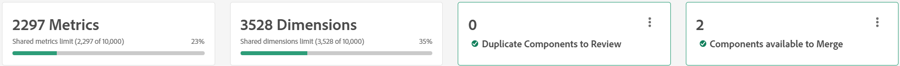
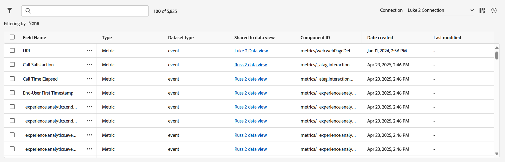

# 共有指標とディメンションの概要

共有指標とディメンションは、任意の数のデータビューで使用できるディメンションと指標を一元管理するための場所を提供します。 これらのコンポーネントは、特に、組織が複数のデータビューを使用し、これらのデータビューでコンポーネント設定が共通している場合に役立ちます。 共有指標とディメンションに対して行われた変更は、共有されているすべてのデータビューにすばやく適用されます。 個々のデータビューを編集する場合、共有ディメンションと指標は、コンポーネント名の横にある アイコンで識別できます。

共有ディメンションと指標を使用すると、多くのデータビューで共通コンポーネントを使用できますが、接続間で共有することはできません。

## ワークフロー

多くの企業では、ディメンションと指標の重複を排除し、長期的に維持するために、次のような包括的なワークフローを利用しています。

1. 各データビューからコンポーネントをインポートします。このコンポーネントは、複数のデータビューで共有できます。 同じディメンションまたは指標が複数のデータビューに存在する場合、Adobeでは、そのコンポーネントのすべてのインスタンスを読み込むことをお勧めします。 このベストプラクティスでは、重複をインポートしますが、重複を排除してWorkspace プロジェクトへの各参照を保持できるようにインポートします。
1. 同じコンポーネント IDを使用するが、異なるコンポーネント設定を持つすべてのコンポーネントを確認します。 重複するコンポーネントの各グループについて、そのコンポーネント IDを共有する他のすべてのコンポーネントに適用する目的のコンポーネント設定を選択します。
1. 同じコンポーネント IDを使用し、同じコンポーネント設定を持つすべてのコンポーネントを確認します。 これらのディメンションや指標は、容易かつ安全に統合できます。

## [!UICONTROL 共有指標とディメンション &#x200B;] マネージャー

**[!UICONTROL Customer Journey Analytics]** > **[!UICONTROL データビュー]** > **[!UICONTROL 共有メトリクスとディメンション]**

このUIに移動すると、複数のデータビューで共有できる現在のすべてのディメンションと指標が表示されます。 右上には、このインターフェイスにコンポーネントを追加するための2つのボタンが含まれています。

* **[!UICONTROL 読み込み]**: データビューを選択し、共有に使用できるコンポーネントを選択できるモーダルウィンドウを開きます。
* **[!UICONTROL 新規作成]**: [共有コンポーネントエディター](shared-component-editor.md)を開きます。

これら2つのボタンのすぐ下に、4つの概要カードが表示されます。

* **指標**：この接続のデータビュー間で共有できる指標の合計数。 各接続には、最大10,000個の共有指標を含めることができます。
* **ディメンション**：この接続のデータビュー間で共有できるディメンションの合計数。 各接続には、最大10,000個の共有ディメンションを含めることができます。
* **レビューするコンポーネントを複製**：複数のデータビューにコンポーネントをインポートする場合、一部のディメンションまたは指標が同じコンポーネント IDを共有する場合があります。 この概要カードの番号は、同じコンポーネント IDを持つが異なるコンポーネント設定を持つコンポーネントの合計数を示しています。 **[!UICONTROL レビュー]**&#x200B;を選択すると、目的のコンポーネントを選択して、同じIDを持つ他のすべてのコンポーネントの信頼できる唯一の情報源として機能できるフィルターが有効になります。
* **結合に使用できるコンポーネント**：ディメンションまたは指標が同じコンポーネント IDと同じコンポーネント設定を共有する場合、それらは実質的に同じであり、重複排除の準備が整っています。 **[!UICONTROL Review]**&#x200B;を選択すると、同じコンポーネント IDを持つすべてのコンポーネントを単一の共有ディメンションまたは指標に結合できるフィルターが有効になります。

共有ディメンションと指標はすべて、4つの概要カードの下に表示されます。

* **フィルター**:  アイコンを選択して、使用可能なフィルターを表示または非表示にします。 次のフィルターを使用できます。
   * **[!UICONTROL コンポーネントタイプ]**: ディメンションのみを表示するか、指標のみを表示します。
   * **[!UICONTROL データセット]**: コンポーネントが共有されているデータビューにデータセットが含まれているコンポーネントのみを表示します。
   * **[!UICONTROL データビュー]**：そのデータビューに共有されているコンポーネントのみを表示します。
   * **[!UICONTROL 作成者]**：特定のユーザーが作成したコンポーネントのみを表示します。
   * **[!UICONTROL 重複]**：別のコンポーネントと同じコンポーネント IDを持つコンポーネントのみを表示します。 これらのフィルターは、概要カードを使用してコンポーネントを確認するのと同じです。
* **検索**:  アイコンを使用して、名前でコンポーネントを検索します。
* **[!UICONTROL 接続]**: [接続](/help/connections/overview.md)を変更するドロップダウンメニュー。 共有ディメンションと指標は、常に単一の接続に固有です。
* **[!UICONTROL テーブルをカスタマイズ]**:  アイコンを選択して、テーブルの列を表示または非表示にします。 使用可能なオプションは次のとおりです。
   * **[!UICONTROL フィールド名]**：共有ディメンションまたは指標の名前。 このフィールドは常に表示されます。
   * **[!UICONTROL タイプ]**: コンポーネントがディメンションか指標かを示します。 このフィールドは常に表示されます。
   * **[!UICONTROL データセットの種類]**: データセットの種類。 ほとんどのデータセットはイベントデータセットです。
   * **[!UICONTROL データビューに共有]**：このコンポーネントが共有されているすべてのデータビュー。 このフィールドは常に表示されます。 リンクを選択すると、このコンポーネントが使用可能なすべてのデータビューを一覧表示するモーダルが開きます。
   * **[!UICONTROL データセット]**：このコンポーネントが共有されている各データビューに含まれているすべてのデータセット。 リンクを選択して、コンポーネントのすべてのデータセットを一覧表示するモーダルを開きます。
   * **[!UICONTROL 作成者]**: コンポーネントを作成または共有メトリクスとディメンション インターフェイスに読み込んだ個人の名前。
   * **[!UICONTROL スキーマの種類]**: データが保存される形式。 例としては、`string`、`double`または`boolean`が挙げられます。
   * **[!UICONTROL コンポーネント ID]**: ディメンションまたは指標のコンポーネント ID。 このインターフェイスで同じコンポーネント IDを共有するコンポーネントは、レビューおよび重複排除する必要があります。
   * **[!UICONTROL スキーマ]**: ディメンションまたは指標のスキーマパス。 例：`web.webPageDetails.URL`。
   * **[!UICONTROL 説明]**: コンポーネントの[説明](/help/data-views/component-settings/overview.md)。
   * **[!UICONTROL コンテキストラベル]**: コンポーネントの[&#x200B; コンテキストラベル &#x200B;](/help/data-views/component-settings/overview.md)。
   * **[!UICONTROL 値を含める/除外]**: [値を含める/除外](/help/data-views/component-settings/include-exclude-values.md)で指定されたルールの数を一覧表示します。
   * **[!UICONTROL データ使用ラベル]**: スキーマフィールドの[&#x200B; データ使用ラベル &#x200B;](https://experienceleague.adobe.com/ja/docs/experience-platform/data-governance/labels/overview)。
   * **[!UICONTROL 非推奨]**：非推奨フラグが設定されているかどうかを示します。
   * **[!UICONTROL Format]**：値が表示される形式。 ブール値は通常`True | False`、指標は通常`Decimal`などとして表示されます。
   * **[!UICONTROL 指標の重複排除]**: コンポーネントの[指標の重複排除](/help/data-views/component-settings/metric-deduplication.md)設定。
   * **[!UICONTROL ビヘイビアー]**: コンポーネントの[&#x200B; ビヘイビアー](/help/data-views/component-settings/behavior.md)設定。
   * **[!UICONTROL アトリビューション]**: コンポーネントの[&#x200B; アトリビューション &#x200B;](/help/data-views/component-settings/attribution.md)設定。
   * **[!UICONTROL 値なしオプション]**: コンポーネントの[値なしオプション &#x200B;](/help/data-views/component-settings/no-value-options.md)。
   * **[!UICONTROL 値のグループ化]**: コンポーネントの[値のグループ化](/help/data-views/component-settings/value-bucketing.md)設定。
   * **[!UICONTROL 永続性]**: コンポーネントの[永続性](/help/data-views/component-settings/persistence.md)設定。
   * **[!UICONTROL 小文字]**: コンポーネントの[&#x200B; ビヘイビアー](/help/data-views/component-settings/behavior.md)設定に基づいて、コンポーネントが小文字で有効かどうかを示します。
   * **[!UICONTROL 部分文字列]**: コンポーネントの[部分文字列](/help/data-views/component-settings/substring.md)設定。
   * **[!UICONTROL 概要データグループ]**: コンポーネントの[概要データグループ &#x200B;](/help/data-views/component-settings/summary-data-group.md)設定。
   * **[!UICONTROL 作成日]**: コンポーネントが作成またはインポートされた日付。
   * **[!UICONTROL 最終変更日]**: コンポーネントが作成後に変更された場合、最終変更日。
* **[!UICONTROL ジョブ履歴]**：多数のコンポーネントをインポートまたは共有すると、ジョブが自動的に作成されます。  アイコンを選択すると、個々のデータビューからディメンションと指標をインポートするすべてのインスタンスを表示するモーダルウィンドウが開きます。 読み込みまたは共有アクションのいずれも、ジョブをトリガーするのに十分なサイズになっていない場合、このボタンは表示されません。

## コンポーネントを編集するか、データビューにコンポーネントを共有する

コンポーネントの横にあるチェックボックスを使用して、使用可能なすべてのアクションを表示します。 複数の選択がサポートされています。

*  **[!UICONTROL 編集]**：選択したディメンションと指標を[共有コンポーネントエディター](shared-component-editor.md)で開き、[&#x200B; コンポーネント設定](/help/data-views/component-settings/overview.md)を調整できます。 複数のコンポーネントを選択して編集すると、すべてのコンポーネントがコンポーネントエディターで開きます。 コンポーネントエディターでShift キーを押しながらクリックすると、複数のコンポーネントに対して同じフィールドを編集できます。
*  **[!UICONTROL データビューに共有]**：選択した接続内で使用可能なすべてのデータビューを表示するウィンドウを開きます。 このコンポーネントを使用可能にする各データビューのチェックボックスをオンにし、**[!UICONTROL 共有]**&#x200B;を選択します。
*  **[!UICONTROL データビューからの共有解除]**：このコンポーネントが現在共有されているすべてのデータビューを表示するウィンドウを開きます。 このコンポーネントの可用性を削除する各データビューのチェックボックスをオンにし、**[!UICONTROL 共有を解除]**&#x200B;を選択します。
*  **[!UICONTROL 複製]**：選択したコンポーネントのコピーを作成します。 新しいコンポーネント IDが、重複したコンポーネントに対して生成されます。
*  **[!UICONTROL 削除]**：選択したコンポーネントをインターフェイスから削除します。 選択したコンポーネントが任意のデータビューと共有されている場合、それらのコンポーネントは共有されません。
