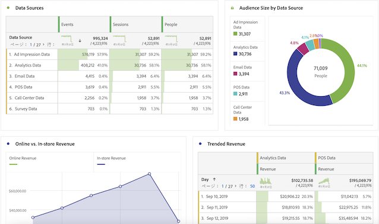
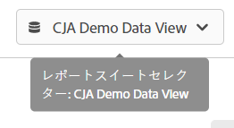

# Adobe Analyticsユーザー向け CJA ユーザーガイド

組織がCustomer Journey Analytics(CJA) を採用し始めている場合、従来の Analytics と CJA の類似点と違いに気付くかもしれません。 このページでは、組織を新しい実装およびレポートワークフローに適合させるために、これらの違いについて説明します。 また、このページでは、新しい概念に関する追加のリソースと、アナリストとしてのジャーニーをより簡単かつ成功に導くための手順についても説明します。

CJA のいくつかの機能は、業界標準に合わせて名前が変更され、再設計されています。 更新された用語には、セグメント、仮想レポートスイート、分類、顧客属性、コンテナ名などがあります。 柔軟なカスタムディメンションおよび指標を考慮して、eVar と prop の制限は存在しなくなりました。

## 変更されていないもの

レポート側での使い慣れた内容の多くは変更されていません。

* 引き続き、 [Analysis Workspace](/help/analysis-workspace/home.md) を使用してデータを分析します。 Workspace は、従来のAdobe Analyticsと同じように動作します。
* 同じバージョンの [Adobe Analyticsダッシュボード](/help/mobile-app/home.md) は使用可能で、CJA と従来の Analytics の間で同様に機能します。
* [Report Builder](/help/report-builder/report-buider-overview.md) には、MS Windows、iOS、および Web バージョンの Excel で動作する新しいインターフェイスが用意されています。 ( このバージョンのReport Builderの前は、VMware 上で実行しない限り、Mac上でを使用できませんでした。) このバージョンは、従来の AA データリクエストをまだサポートしていません。

## レポートの変更点

分析するために、より多くのクロスチャネルデータにアクセスできます。 例えば、複数のチャネルのパフォーマンスを分析する Workspace プロジェクトを作成できます。たとえば、これらのデータセットが組織で取り込まれ、CJA が使用するデータビューに含まれる場合です（以下の「データアーキテクチャの変更」を参照）。

## データアーキテクチャの変更 {#architecture}

CJA はAdobe Experience Platformからデータを取得します。 Experience Platformを使用すると、顧客データとコンテンツを任意のシステムまたはチャネルから一元管理し、データサイエンスと機械学習を適用して、パーソナライズされたエクスペリエンスのデザインと配信を改善できます。

Experience Platform内の顧客データは、 [スキーマ](https://experienceleague.adobe.com/docs/platform-learn/tutorials/schemas/schemas-and-experience-data-model.html?lang=ja) とデータのバッチ。 プラットフォームについて詳しくは、[Adobe Experience Platform アーキテクチャの概要](https://experienceleague.adobe.com/docs/platform-learn/tutorials/intro-to-platform/basic-architecture.html?lang=en)を参照してください。

CJA 管理者が設定します。 [接続](/help/connections/create-connection.md) をExperience Platformのデータセットに追加します。 その後、 [データビュー](/help/data-views/data-views.md) これらの接続を使用します。 データビューは、概念的には仮想レポートスイートと似ており、CJA でのレポートの基礎となります。 Experience Platformはレポートのすべてのデータをソースするので、レポートスイートはデータのコンテナとして存在しなくなりました。

接続を使用すれば、次のビデオに含まれる、Adobe Experience Platformのデータセットを Analytics 管理者が CJA に統合できます。

>[!VIDEO](https://video.tv.adobe.com/v/35111/?quality=12)

Adobeでは、Adobe Analyticsソースコネクタや Web SDK を使用したレポートスイートデータなど、複数の方法でAdobe Experience Platformにデータを取り込むことができます。 複数のレポートスイートから既存の実装を組み合わせることができます。Experience Platform これらのデータセットに基づく接続とデータビューは、別々のレポートスイートに以前存在したデータを組み合わせることができます。

## 仮想レポートスイートの概念の変更 {#data-views}

[!UICONTROL データビュー] 仮想レポートスイートの概念を現在の状態から取り上げ、 [データに対する追加の制御を有効にする](/help/data-views/create-dataview.md) 接続で使用可能になりました。 これらの変更により、タイムゾーンやセッションのタイムアウト間隔などの一般的な設定が設定可能になり、遡及的になります。 アトリビューションや有効期限などの個々の変数設定は、レポートレベルまたはデータビューレベルでカスタマイズすることもできます。 これらの設定は、非破壊的で遡及的です。

右上のレポートスイートセレクターで、利用可能なデータビューから選択できるようになりました。

詳しくは、 [データビューに関する使用例](/help/data-views/data-views-usecases.md) を参照してください。

## eVar および prop の概念の変更

の概念 [!UICONTROL eVar], [!UICONTROL prop]、および [!UICONTROL イベント] 従来のAdobe Analyticsでは、もはや存在しない [!UICONTROL Customer Journey Analytics]. Adobe Analyticsでは、eVar と prop に、コンテンツ、顧客、キャンペーンなどの説明が格納されます。 およびイベントは、売上高、購読、生成されたリードなどをカウントします。 Customer Journey Analyticsは両方のタイプのデータを保持し、同じ方法でアクセスできます。同じ方法で、Analysis Workspaceの左パネルの「Dimension」または「指標」の下に表示されます。

CJA では、ディメンション、指標、リストフィールドなど、無制限のスキーマ要素を使用できます。 これらは、Experience Platform内のディメンション、指標、リストフィールドなど、無制限のスキーマ要素にマッピングされます。 Adobe Analyticsの処理ルールの後に適用されたすべての訪問および属性設定が、Customer Journey Analyticsのクエリ時に適用されるようになりました。

この柔軟性により、1 つのスキーマフィールドをディメンションと指標の両方として使用して、異なるトラッキングニーズをサポートできる場合があります。

## セグメントの概念の変更

Adobeでは、業界標準に合わせて、Adobe Experience Platformのセグメントとの区別を改善するために、「セグメント」コンポーネントの名前を「フィルター」に変更しました。

[!UICONTROL Customer Journey Analytics] は、eVar、prop またはイベントを使用しなくなり、代わりに、マッピング先のExperience Platformスキーマフィールド名を使用します。 この変更により、Adobe Analyticsの既存のセグメントの中で、互換性のあるものは 1 つもなくなります。 [!UICONTROL Customer Journey Analytics]. 既存のAdobe AnalyticsセグメントをCustomer Journey Analyticsに移動する場合は、次のビデオを参照してください。

>[!VIDEO](https://video.tv.adobe.com/v/31982/?quality=12)

まだ共有または公開できませんが [!UICONTROL フィルター] ([!UICONTROL セグメント]から ) [!DNL Customer Journey Analytics] Experience Platform統合プロファイルに対して、この機能は開発中です。

セグメントの変更の概念に加えて、セグメントコンテナも更新されます。

* **ヒットコンテナが「イベント」コンテナになりました。**. [!UICONTROL 個人] コンテナには、指定した期間内の訪問者に対するすべてのセッションとイベントが含まれます。
* **訪問コンテナは、「セッション」コンテナになりました**. [!UICONTROL セッション]コンテナでは、特定のセッションのページインタラクション、キャンペーンまたはコンバージョンを識別できます。
* **訪問者コンテナが [!UICONTROL 人物] コンテナ**. [!UICONTROL 個人] コンテナには、指定した期間内の訪問者に対するすべてのセッションとイベントが含まれます。

## 計算指標の概念の変更

計算指標は、従来の Analytics と CJA では同様に名前が付けられています。 しかし、 [!UICONTROL Customer Journey Analytics] は、eVar、prop またはイベントを使用しなくなりました。代わりに、Experience Platformスキーマ要素を使用します。 この基本的な変更は、既存の計算指標に対して、 [!UICONTROL Customer Journey Analytics]. Adobe Analyticsの計算指標をCustomer Journey Analyticsに移行する場合は、次のビデオを参照してください。

>[!VIDEO](https://video.tv.adobe.com/v/31788/?quality=12)

## 変数の属性と有効期限の設定の変更

[!UICONTROL Customer Journey Analytics] は、レポート時に、アトリビューションと有効期限を含むすべての変数設定を適用します。 これらの設定は、現在は、 [データビュー](/help/data-views/component-settings/persistence.md)また、一部の変数設定（アトリビューションなど）は、Workspace プロジェクトで変更できます。

同じデータビューで、同じ変数の複数のバージョンを持つことができます。 例えば、30 日後に期限切れになるトラッキングコードディメンションと、セッションの終わりに期限切れになるトラッキングコードディメンションを設定できます。 これらのトラッキングコードディメンションは両方とも同じソースデータを使用しますが、異なるアトリビューション設定を使用します。

また、同じ接続に基づいて複数のデータビューを持つこともできます。 例えば、あるデータビューのセッションタイムアウトが 30 分の場合と、別のデータビューのセッションタイムアウトが 15 分の場合があります。 両方のデータビューが右上のセレクターに表示されるので、シームレスに切り替えることができます。

## 分類の概念の変更

「分類」は、「ルックアップデータセット」になりました。 ルックアップデータセットは、イベントまたはプロファイルデータにある値やキーを検索するために使用されます。 例えば、イベントデータ内の数値 ID を製品名にマッピングするルックアップデータをアップロードできます。詳しくは、 [アカウントレベルのデータをルックアップデータセットとして追加](/help/use-cases/b2b.md) を参照してください。

## 顧客属性の概念の変更

「顧客属性」は、「プロファイルデータセット」になりました。 プロファイルデータセットには、 [!UICONTROL イベント] データ。 例えば、顧客に関する CRM データをアップロードできます。 含める個人 ID を選択できます。で定義された各データセット [!DNL Experience Platform] には、1 つ以上のユーザー ID セットが定義されています。

## 訪問者の識別方法の変更Adobe

CJA は、ECID 以外に ID の概念を拡張し、顧客 ID、Cookie ID、関連付け ID、ユーザー ID、トラッキングコードなど、使用する ID を含めます。 データセット全体で共通の名前空間 ID を使用する、またはを使用する [クロスチャネル分析](/help/connections/cca/overview.md) は、異なるデータセットをまたいで人々をリンクするのに役立ちます。 CJA で Workspace プロジェクトを設定するユーザーは、データセット全体で使用される ID を理解する必要があります。 CJA での ID の使用に関する重要なビデオを以下に示します。

>[!VIDEO](https://video.tv.adobe.com/v/30750/?quality=12)

## 低トラフィックディメンション項目の概念の変更

従来のAdobe Analyticsでは、一意の値を受け取りすぎる変数が、以下にディメンション項目をグループ化し始めます。 [!UICONTROL 低トラフィック]. CJA には、基数の高いフィールドに対する制限が少なくなります。 レポートアーキテクチャが変更され、Analysis Workspaceは、より多くの一意のディメンション項目に関するレポートを作成できます。 詳しくは、 [ロングテール](../analysis-workspace/workspace-faq/long-tail.md) を参照してください。
