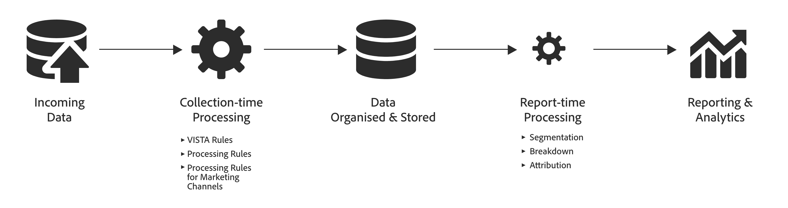
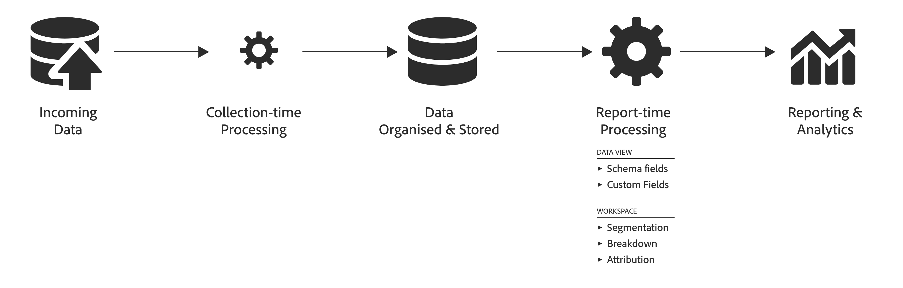

# Adobe Analytics と Customer Journey Analytics におけるデータ処理の比較

データをレポートで活用する前に、データを処理する機能が必要になる場合がよくあります。 データの収集からレポートやビジュアライゼーションの生成に至るまで、ジャーニーの複数の段階でそのデータを処理できます。

Adobe Analytics では、データの処理のほとんどは、データの収集直後に行われます。 この&#x200B;**収集時の処理**&#x200B;をサポートするには、VISTA ルール、処理ルール、マーケティングチャネル処理ルールなどの機能を使用できます。
その後、データは保存され、レポート時に追加の処理を適用できます。 例えば、ディメンションの分類、セグメント化の適用、別のアトリビューションモデルの選択などを行うことができます。 この&#x200B;**レポート時の処理**&#x200B;はその場で行われます。

Adobe Analytics では、通常、レポート時の処理は、収集時に発生する処理量よりも少ない処理量を表します。

対照的にCustomer Journey Analyticsは、データを整理して保存する前に、収集時間の前処理を最小限に抑えるように設計されています。 Customer Journey Analyticsの基盤となるアーキテクチャは、レポート時に保存されたデータを操作するように設計されています。 Customer Journey Analyticsは、Analysis Workspaceだけでなく、レポート時処理機能も備えています。 追加のレポート時処理機能は、データビューの[&#x200B; コンポーネント &#x200B;](/help/data-views/component-settings/overview.md)および[派生フィールド &#x200B;](/help/data-views/derived-fields/derived-fields.md)の定義を通じて使用できます。

様々なレポート機能におけるデータ処理の違いを理解することは、どの指標がどこで利用でき、なぜ異なるのかを理解するのに役立ちます。

例えば、*訪問回数*&#x200B;は、データ処理時にAdobe Analyticsの指標として定義されます。 *セッション*&#x200B;は、レポート時にCustomer Journey Analyticsの指標として計算されます。 その結果、Customer Journey Analytics データビューのセッション定義のルールに基づいて、2つの指標が異なる場合があります。

また、指標としての訪問とセッションは、Analytics ソースコネクタで作成されたデータセットでは使用できません。 そのため、比較を行うには、クエリロジックでセッションを定義する必要があります。

## 用語 {#terms}

次の表に、Adobe Analytics と Customer Journey Analytics に適用される様々なタイプの処理ロジックの用語の定義を示します。

| 用語 | 定義 | メモ |
| --- | --- | --- |
| 収集時の処理 | レポートや分析の目的で保存される前に、データ収集時および処理時に実行されるロジック。 | このロジックは、履歴データに「織り込み済み」で、通常、簡単には変更できません。 |
| レポート時の処理 | レポート実行時に実行されるロジック。 | このロジックは、レポート実行時に未来と履歴のデータに非破壊で適用できます。 |
| ヒットレベルのロジック | 行単位で適用されるロジック。 | 例：処理ルール、VISTA、特定のマーケティングチャネルのルール。 |
| 訪問レベルのロジック | 訪問レベルで適用されるロジック。 | 例：訪問およびセッション定義。 |
| 訪問者レベルのロジック | 個人レベルで適用されるロジック。 | 例：クロスデバイス／クロスチャネルのユーザーのステッチ。 |
| セグメントのロジック | イベント/訪問/人物（イベント/セッション/人物）セグメントルールの評価。 | 例：赤い靴を購入した人物。 |
| 計算指標 | 顧客が作成したカスタム指標の評価。 計算指標は、セグメントを含む複雑な式にもとづいて作成できます。 | 例えば、赤い靴を買った人の数。 |
| アトリビューションロジック | アトリビューションを計算するためのロジック。 | 例：eVar の永続性。 |
| コンポーネント設定 | アトリビューション、行動、形式などの指標やディメンションにカスタマイズを適用する | 例：範囲に基づいて数値を組み合わせる値のバケット化 |
| 派生フィールド | データビューでコンポーネントを定義する一環として、スキーマまたは標準フィールドに適用されるロジック。 | 例：新しいマーケティングチャネルディメンションの作成 |

{style="table-layout:auto"}

Adobe Analytics や現在の Customer Journey Analytics は、時間の経過と共に、訪問やユーザーレベルのデータロジックをレポートの実行時に実行できるようになり、その柔軟性が向上しています。

## データ処理のタイプ {#types}

Adobe AnalyticsとCustomer Journey Analyticsによって実行されるデータ処理ステップと、それらのステップのタイミングは、機能ごとに異なります。 以下の表は、各機能のデータ処理の種類と、データ処理が適用される場合の概要を示しています。

| 機能 | 処理時に適用 | レポート時に適用 | 使用不可 | メモ |
| --- | --- | --- | --- | --- |
| [Adobe Analytics](https://experienceleague.adobe.com/ja/docs/analytics) レポート   （高度なアトリビューション機能またはレポート時処理を含むバーチャルレポートスイートを含まない） | <ul><li>[処理ルール](https://experienceleague.adobe.com/ja/docs/analytics/admin/admin-tools/manage-report-suites/edit-report-suite/report-suite-general/c-processing-rules/processing-rules)</li><li>[VISTA ルール](https://experienceleague.adobe.com/ja/docs/analytics/technotes/terms)</li><li>ヒットレベルの[マーケティングチャネルのルール](https://experienceleague.adobe.com/ja/docs/analytics/admin/admin-tools/manage-report-suites/edit-report-suite/marketing-channels/c-rules)</li><li>訪問レベルのマーケティングチャネルのルール（メモを参照）</li><li>訪問定義</li><li>アトリビューションロジック</li></ul> | <ul><li>セグメントのロジック</li><li>計算指標</li></ul> | <ul><li>クロスデバイス分析（メモを参照）</li></ul> | <ul><li>クロスデバイス分析では、レポート時刻処理を使用した仮想レポートスイートを使用する必要があります。</li><li>「訪問レベルのマーケティングチャネルのルール」には、**訪問の最初のページ**、**ラストタッチチャネルを上書き**&#x200B;および&#x200B;**マーケティングチャネルの有効期限**&#x200B;が含まれます （[ドキュメント](https://experienceleague.adobe.com/ja/docs/analytics-platform/using/cja-usecases/aa-data/marketing-channels)を参照）。</li></ul> |
| Adobe Analytics [Data Warehouse](https://experienceleague.adobe.com/ja/docs/analytics/export/data-warehouse/data-warehouse) | <ul><li>処理ルール</li><li>VISTA ルール</li><li>ヒットレベルのマーケティングチャネルのルール</li><li>訪問レベルのマーケティングチャネルのルール</li><li>訪問定義</li><li>アトリビューションロジック</li></ul> | <ul><li>セグメントのロジック</li></ul> | <ul><li>計算指標</li><li>クロスデバイス分析</li></ul> |     |
| Adobe Analytics [データフィード](https://experienceleague.adobe.com/ja/docs/analytics/export/analytics-data-feed/data-feed-overview) | <ul><li>処理ルール</li><li>VISTA ルール</li><li>ヒットレベルのマーケティングチャネルのルール</li><li>訪問レベルのマーケティングチャネルのルール</li><li>訪問定義（visitnum フィールド）</li><li>アトリビューションロジック（post 列内）</li></ul> |   | <ul><li>セグメントのロジック</li><li>計算指標</li><li>クロスデバイス分析</li></ul> | <ul><li>データフィードの特定のマーケティングチャネル関連列に対する ID マッピングは、データフィードには含まれません （[データフィードのドキュメント](https://experienceleague.adobe.com/ja/docs/analytics/export/analytics-data-feed/data-feed-contents/datafeeds-reference)を参照）。</li></ul> |
| Adobe Analytics [Livestream](https://github.com/AdobeDocs/analytics-1.4-apis/blob/master/docs/live-stream-api/getting_started.md) | <ul><li> 処理ルール</li><li>VISTA ルール</li><ul> |   | <ul><li>ヒットレベルのマーケティングチャネルのルール</li><li>訪問レベルのマーケティングチャネルのルール</li><li>訪問ロジック</li><li>アトリビューションロジック</li><li>セグメントのロジック</li><li>計算指標</li><li>クロスデバイス分析</li></ul> |  |
| Adobe Analytics [高度なアトリビューション機能](https://experienceleague.adobe.com/ja/docs/analytics/analyze/analysis-workspace/attribution/overview) | <ul><li>処理ルール</li><li>VISTA ルール</li><li>訪問定義（メモを参照）</li><li>クロスデバイス分析（メモを参照）</li></ul> | <ul><li>ヒットレベルのマーケティングチャネルのルール（メモを参照）</li><li>訪問レベルのマーケティングチャネルのルール（メモを参照）アトリビューションロジック</li><li>セグメントのロジック</li><li>計算指標</li></ul> |  | <ul><li>クロスデバイス分析では、レポート時刻処理を使用した仮想レポートスイートを使用する必要があります。</li><li>Core Analyticsの高度なアトリビューション機能では、レポート時に完全に派生する（派生した中間値）マーケティングチャネルを使用します。</li><li>高度なアトリビューション機能は、レポート時処理仮想レポートスイートで使用される場合を除き、処理時の訪問定義を使用します。</li></ul> |
| [レポート時の処理](https://experienceleague.adobe.com/ja/docs/analytics/components/virtual-report-suites/vrs-report-time-processing)を含む Adobe Analytics 仮想レポートスイート | <ul><li>処理ルール</li><li>VISTA ルール</li><li>[クロスデバイス分析](https://experienceleague.adobe.com/ja/docs/analytics/components/cda/overview)</li></ul> | <ul><li>訪問定義</li><li>アトリビューションロジック</li><li>セグメントのロジック</li><li>計算指標</li><li>その他の仮想レポートスイートのレポート時の処理設定</li></ul> | <ul><li>ヒットレベルのマーケティングチャネルのルール</li><li>訪問レベルのマーケティングチャネルのルール</li></ul> | <ul><li>仮想レポートスイートのレポート時の処理の[ドキュメント](https://experienceleague.adobe.com/ja/docs/analytics/components/virtual-report-suites/vrs-report-time-processing)を参照してください。</li></ul> |
| Adobe Experience Platform データレイクの [Analytics ソースコネクタ](https://experienceleague.adobe.com/ja/docs/experience-platform/sources/connectors/adobe-applications/analytics)ベースのデータセット | <ul><li>処理ルール</li><li>VISTA ルール</li><li>ヒットレベルのマーケティングチャネルのルール</li><li>フィールドベースのステッチ（メモを参照）</li></ul> |   | <ul><li>[訪問レベルのマーケティングチャネルのルール](https://experienceleague.adobe.com/ja/docs/analytics-platform/using/cja-usecases/aa-data/marketing-channels)</li><li>訪問ロジック</li><li>アトリビューションロジック</li><li>セグメントのロジック</li></ul> | <ul><li>独自のセグメントロジックと計算指標の適用</li><li>フィールドベースのステッチでは、Analytics ソースコネクタで作成されたデータセットに加えて、個別のステッチされたデータセットが作成されます。</li></ul> |
| [Customer Journey Analytics](https://experienceleague.adobe.com/ja/docs/analytics-platform/using/cja-landing) レポート | <ul><li>Adobe Experience Platform データ収集の一部として実装</li></ul> | <ul><li>セッション定義</li><li>[データビュー](https://experienceleague.adobe.com/ja/docs/analytics-platform/using/cja-dataviews/data-views)設定<li>アトリビューションロジック</li><li>計算指標</li><li>セグメントのロジック</li></ul> | <ul><li>訪問レベルのマーケティングチャネルのルール</li></ul> | <ul><li>クロスチャネル分析を活用するために、合成データセットを使用します。</li></ul> |

{style="table-layout:auto"}
