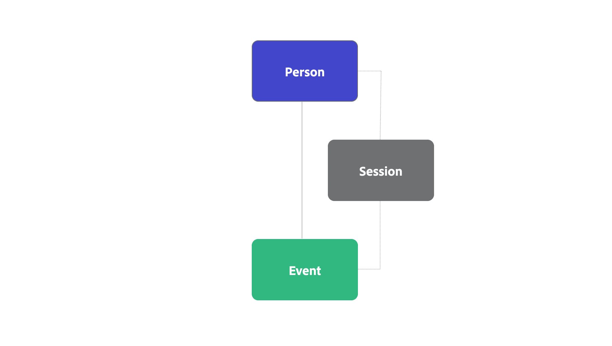
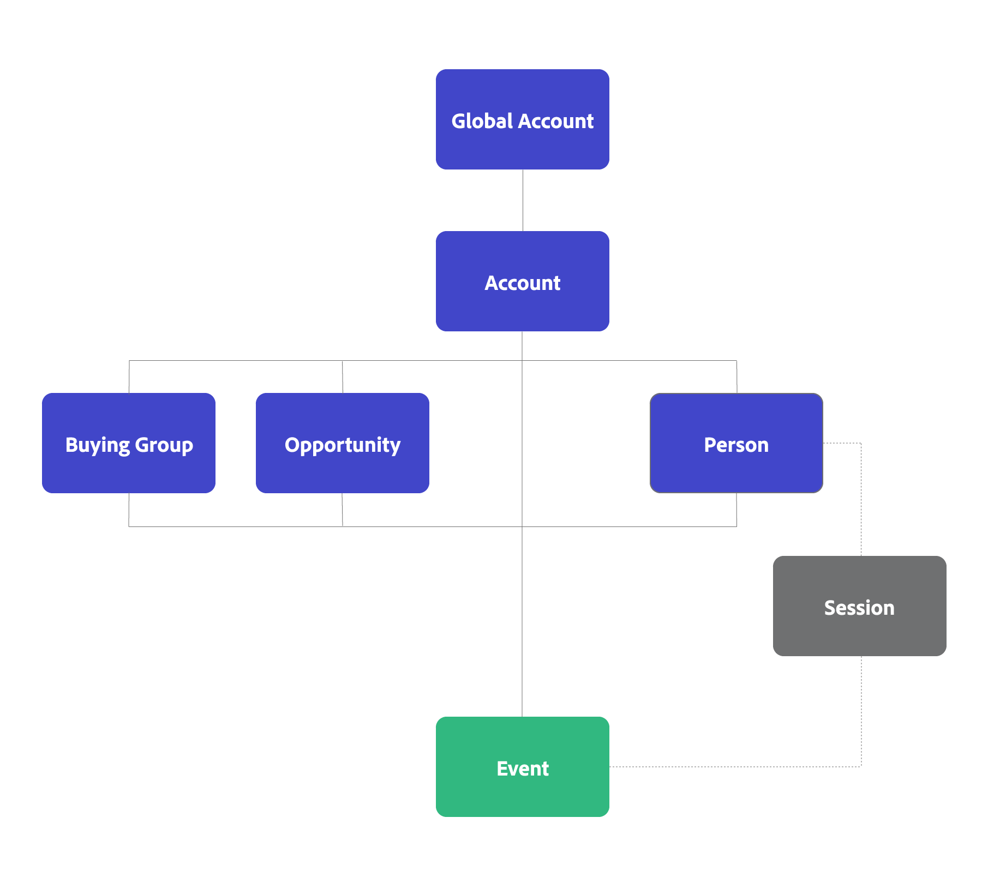
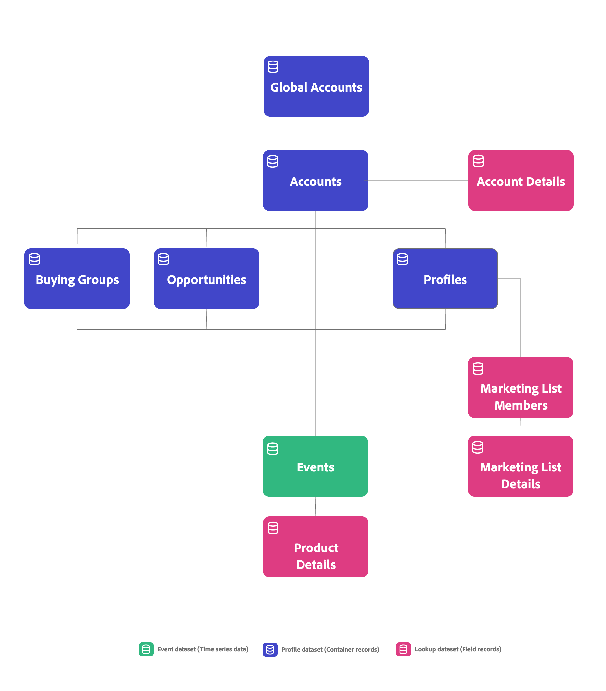

# B2B editionの概念と機能

この記事では、Customer Journey Analyticsで一般的に使用される接続、識別子、コンテナ、データセットなどの概念について説明します。 Customer Journey Analytics B2B editionが、これらのコンセプトにどのように機能を追加しているのかをご紹介します。

## 接続とID

Customer Journey Analyticsでは、イベントデータをプロファイルデータセットやルックアップデータセットなどのほかのデータセットに接続するために、Person IDと呼ばれる共通のIDを選択します。 このタイプの接続は、個人ベースのレポートと分析を促進する個人ベースの接続として知られています。

Customer Journey Analytics B2B editionでは、個人ベースの接続とアカウントベースの接続のどちらかを選択できます。 アカウントベースの接続により、アカウントベースのレポートと分析が促進されます。

* 個人ベースの接続の場合は、プライマリ IDとして「個人」を選択します。 次に、接続、データビュー、ワークスペースプロジェクトを設定して、個人ベースのレポート用に設定できます。
* アカウントベースの接続の場合は、プライマリ IDとして「アカウント」を選択します。 次に、グローバルアカウント、購買グループ、商談の追加コンテナをオプションで追加できます。 グローバルアカウントを追加するかどうかに基づいて、プライマリ識別子はアカウント識別子またはグローバルアカウント識別子です。

## コンテナ

Customer Journey Analyticsでは、コネクションとデータビューの設定の一部として生成され、データ構造とスコープを提供します。 Containersは識別子のグループを保存して、すべてのイベントタイムスタンプを一意の識別子で順序付けします。 セグメンテーション、アトリビューション、ビジュアライゼーションなどの機能を、迅速かつパフォーマンスの高い方法で実行できます。

### 標準コンテナ

Customer Journey Analyticsは、「Person」、「Session」、「Event」の3つのコンテナを中心に構築されています。 設定中、これらのコンテナは暗黙的に生成されます。

データビューを設定するときに、これらのコンテナの名前を再定義できますが、コンテナ間の階層と関係は事前に定義されています。 セッションコンテナは、データビューの[ セッション設定](/help/data-views/session-settings.md)でセッションを定義する方法に基づいて生成されます。

{zoomable="yes"}

### B2B コンテナ

Customer Journey Analytics B2B editionでは、生成されたコンテナのリストにアカウントコンテナが追加されます。 また、グローバルアカウント、購買グループ、商談など、追加のコンテナの生成を設定することもできます。

コンテナ間の階層と関係が予め定められている。 商談、購買グループ、人物はすべて、アカウントコンテナの兄弟コンテナです。 この階層では、個人コンテナとイベントコンテナの間のセッションコンテナが、データビューの[ セッション設定](/help/data-views/session-settings.md)でセッションを定義する方法に基づいて生成されます。 アカウントコンテナとイベントコンテナの間など、追加のセッションコンテナは現在生成されず、サポートされています。 B2B コンテナの説明と基本的な使用方法については、次の表を参照してください。

{zoomable="yes"}

| B2B コンテナ | 説明 基本的な使用例 |
|---|---|
| アカウント | 自社ビジネスの顧客または潜在顧客である企業。 その企業は、より大きな組織の子会社または部門である可能性があります。 アカウントは、その組織レベルで販売先および追跡したい組織を表します。 |
| グローバルアカウント （オプション） | 関連会社グループの最上位の親会社。 グローバルアカウントには親会社はありませんが、グローバルアカウントに属する子会社または部門がある場合があります。 接続でグローバルアカウントコンテナを設定している場合、親または子会社を持たないアカウントをアカウントフィールドとグローバルアカウントフィールドの両方にリストする必要があります。 |
| 機会（オプション） | 商品とサービスを同時に販売するコレクション。 オポチュニティは、多くの場合、セールス終了までのセールスサイクルのさまざまな段階を伴います。  データを使用して、セールス funnelの商談の進捗を測定します。 たとえば、ステージ 3からステージ 4に移行した上位の商談の詳細を記載したレポートなどです。 |
| 購買グループ （オプション） | 製品やサービスを購入するための意思決定プロセスに関与する、組織内の人物の集まり。  購買グループのデータを使用して、キャンペーン管理を通じて購買グループを追跡します。 例えば、主要な購買グループのオーディエンスセグメントを作成します。  購買グループからプロファイルデータへのルックアップが必要な可能性が高く、購買グループの人物をレポートできます。 |
| ユーザー | 個人。多くの場合、企業と接触した一意の電子メールアドレスによって特定されます。   プロファイルデータを使用して、アカウントで働くユーザーを特定します。 例：会議にサインアップしたアカウントのすべてのユーザーをターゲットにします。 |

>[!IMPORTANT]
>
>* アカウントベースの接続でグローバルアカウントコンテナを&#x200B;**有効**&#x200B;にしている場合、イベントデータセット内のすべてのレコードにアカウント IDとグローバルアカウント IDを含める必要があります。 そうでない場合、レコードはスキップされます。
>* アカウントベースの接続でグローバルアカウントコンテナを&#x200B;**有効にしていない**&#x200B;場合、イベントデータセット内のすべてのレコードにアカウント IDを含める必要があります。 そうでない場合、レコードはスキップされます。

Analysis Workspaceでは、B2B コンテナを使用して、特定のB2B機能を実行できます。

* **セグメント化**: [B2B セグメントコンテナ ](/help/components/segments/seg-overview.md#b2b-containers)を使用すると、個人、セッション、イベントを超えるコンテナスコープでセグメントを構築できます。 例：イベント登録セグメントのアカウント、購買グループおよびステージ 5の商談セグメントのアカウント。

  >[!NOTE]
  >
  >Customer Journey Analytics B2B editionのアカウントベースの設定のB2B イベントデータには、個人またはセッションを持たない行が含まれる場合があります。 例：商談ステージの進行を詳細に示す行。 セグメントを評価する際は、メンバーとセッションが適切な基準ではない可能性があることに留意してください。
  >

* **アトリビューション**：新しいB2B コンテナは、[ アトリビューションパネル ](/help/analysis-workspace/c-panels/attribution.md)、[ アトリビューションコンポーネント設定](/help/data-views/component-settings/attribution.md)、[計算指標](/help/components/calc-metrics/cm-workflow/m-metric-type-alloc.md)、または[列のフリーフォームテーブル ](/help/analysis-workspace/visualizations/freeform-table/column-row-settings/column-settings.md)で使用できます。 アカウントのルックバックが13か月に延長されました。

* **ビジュアライゼーション**: [ フォールアウト ](/help/analysis-workspace/visualizations/fallout/fallout-flow.md)、[ フロー](/help/analysis-workspace/visualizations/c-flow/flow.md)、[ジャーニーキャンバス ](/help/analysis-workspace/visualizations/journey-canvas/journey-canvas.md)、[ コホートテーブル ](/help/analysis-workspace/visualizations/cohort-table/cohort-analysis.md)のビジュアライゼーションは、新しいB2B コンテナをサポートしています。 例えば、新しいコンテナを使用して、購買グループがコンテンツをどのように使用しているのか、商談コホートが販売のクローズにどのように向かっているのかを把握できます。
これらのビジュアライゼーションのデフォルトコンテナは、[ ユーザー設定](/help/analysis-workspace/user-preferences.md#visualizations-preferences)で設定することもできます。

セグメント、アトリビューション、ビジュアライゼーションをB2B コンテナと組み合わせることで、B2Bの詳細な分析とインサイトを獲得できます。

## データセット

Customer Journey Analytics B2Bでは、次のデータタイプとデータセットが区別されます。

| データタイプ | 時系列 | コンテナレコード | フィールドレコード |
|---|---|---|---|
| **データセット** | **イベントデータセット** &#x200B;例：<ul><li>デジタル分析</li><li>CRM イベント</li><li>対面イベント</li><li>コールセンターデータ</li></ul> | **プロファイルデータセット** &#x200B;例：<ul><li>CRM レコード</li><li>AJO B2B レコード</li><li>CDP レコード</li><ul> | **Classications** &#x200B;例：<ul><li>キャンペーンレコード</li><li>マーケティングリストレコード</li><li>コンテンツメタデータ</li><li>製品レコード</li></ul> |
| 要件 | **タイムスタンプ** &#x200B;すべてのレコードに必要：<ul><li>アカウント ID</li><li>グローバルアカウント ID （オプション）</li></ul> | **アカウント ID**  レコードには、次のようなコンテナ IDが必要です。<ul><li>アカウント</li><li>ユーザー</li><li>商談</li><li>購買グループ</li></ul> | **一致するキー**  レコードには、次のようなコンテナまたはイベントデータセットに含まれるIDが必要です。<ul><li>キャンペーン ID</li><li>コンテンツ ID</li><li>製品 ID</li></ul> |

{style="table-layout:fixed"}

Customer Journey Analytics B2B editionのアカウントベースの接続の例：

Customer Journey Analytics B2B editionでは、[接続マップ ](/help/connections/create-connection.md#connection-map) インターフェイスを使用して、接続のデータセット間の関係の概要を表示できます。

Customer Journey Analyticsと同様に、イベントベースの時系列データはCustomer Journey Analytics B2B editionの中核を担っています。 アカウントベースの接続の主な違いは、イベントデータセット内のすべてのレコードに個人IDではなくアカウント IDが必要になることです。

Customer Journey Analytics B2B editionでアカウントベースの接続に[ データセット設定](/help/connections/create-connection.md#dataset-settings)を設定する場合、一部の設定で使用できるオプションは、[ データセットの種類](/help/connections/create-connection.md#dataset-types)によって異なります。 例えば、次のようなことが必要です。

* イベントデータセット用に設定した各コンテナの識別子を指定します。
* プロファイルデータセットのアカウントフィールドまたはグローバルアカウントフィールドを定義します。
* ルックアップデータセット用にキーを定義し、これらのキーを（フィールドのコンテナごとに）一致させる方法を定義します。

## コンテナまたはフィールドで一致

フィールド別またはコンテナ別にデータセットを一致させるかどうかに関係なく、ルックアップデータセットごとに定義できます。

### コンテナによる一致

レコードデータセットがコンテナで一致を使用する場合、レコードデータセットはプロファイルデータセットタイプとして、ユーザーインターフェイスではプロファイルデータセットとして扱われます。 コンテナレコードを含み、設定済みのコンテナをサポートするデータセットで、コンテナで一致を使用します。 例えば、購買グループのデータセットです。

### フィールドによる一致

レコードデータセットで一致フィールドを使用する場合、レコードデータセットはルックアップデータセットタイプとして扱われ、ユーザーインターフェイスではルックアップデータセットとして扱われます。 ルックアップを通じて追加の分類の詳細を含むデータセットで、フィールドごとに一致を使用します。 たとえば、マーケティングリストメンバーデータセットや製品詳細データセットなどです。

## 個人およびアカウントベースのデータに関するレポート

個人ベースのコンテナ（および個人ID）とアカウントベースのコンテナ（およびアカウント ID）についてレポートする場合は、Customer Journey Analytics内で2つの個別の接続を設定する必要があります。 プライマリIDとして「個人」を選択する1つの接続と、アカウント IDとして「プライマリ」を選択する1つの接続。 Customer Journey Analyticsは、1つのコンテナ階層からの個人ベースおよびアカウントベースのレポートをサポートしていません。

