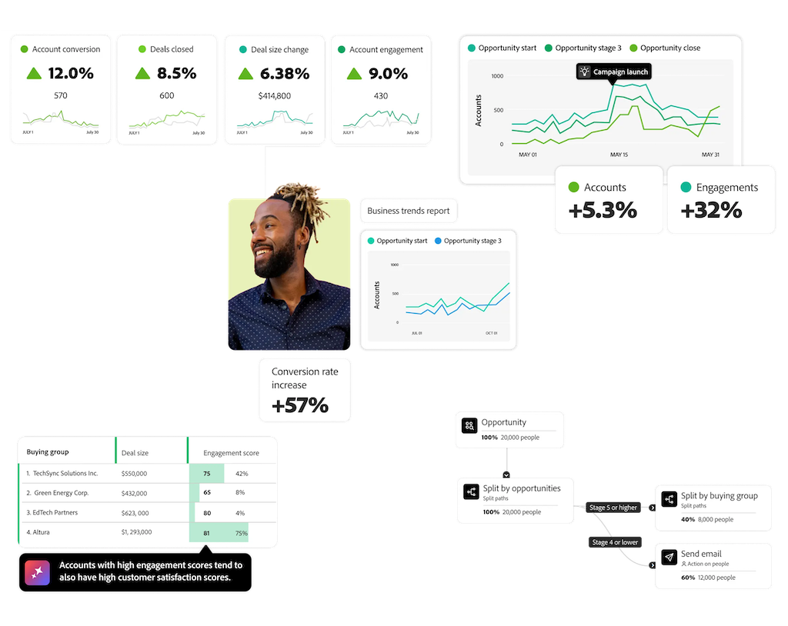

# Customer Journey Analytics B2B Edition

{{b2b-edition}}

Adobe Analytics は、マーケター向けの web およびデジタル分析ツールとして始まりましたが、Customer Journey Analytics は、マルチチャネル、オフライン、クロスプラットフォームのデータを含めるように範囲を拡大しました。  どちらのツールも、B2C（Business to Consumer）企業がマーケティング活動と顧客体験を分析して最適化するのに役立ちます。 **ユーザーベースのレポートと分析**&#x200B;に焦点を当てます。顧客が複数のチャネルでブランドとやり取りするカスタマージャーニーについて理解します。

Customer Journey Analytics B2B editionは、**アカウントベースのレポートと分析**&#x200B;を追加します。 B2B（business-to-business）販売では、購入ジャーニーに複数の関係者、オンラインとオフラインのタッチポイント、契約締結前の主要な段階が含まれます。 B2B 企業は、マーケティング活動とアカウントの体験を効果的に分析して最適化するために、これらすべてのインタラクションを統合されたジャーニービューで追跡する必要があります。

典型的な B2B 販売の特徴は次のとおりです。

* 大きいトランザクション金額
* 長い販売サイクル
* 通常「購買グループ」を形成する、複数の意思決定者と影響力を持つ人
* 知識豊富な購買者
* 顧客維持とアップセルのより高い重要性
* ミレニアル世代の B2B 購買者は、購買体験などのよりシームレスな「デジタル消費者」を期待しています

B2B マーケティングは、タッチポイントの最適化と、購入および考慮サイクルの短縮に焦点を当てています。 B2B の販売サイクルは、人と人の実際の対面、ライブイベントなどのオフラインインタラクション、購買グループとの連携に大きく依存するので、デジタルユーザーベースのデータだけでは不十分です。 B2B 組織は、CRM システムと専用ソリューションからのデータでこれを補完します。 しかし、従来の B2C マーケティングコンポーネント、キャンペーン、チャネルおよびサイト訪問者は、引き続き B2B マーケティングで重要な役割を果たします。

B2B の販売とマーケティングは、従来のリードジェネレーションファネルを超えて、顧客のライフサイクルと購買グループに焦点を当てるように進化しました。 このシフトは、様々なタッチポイントをまたいで複数の関係者が意思決定に関与する B2B 購入の性質の変化を反映しています。 今日の B2B の購買者は、複雑で非線形な意思決定プロセスに従っています。 B2C の顧客と同様に、B2B の購買者は、販売チームと関わる前に独自に調査することを好みます。 口コミやソーシャルメディアは、今や購買意思決定を形成する上で重要な役割を果たしています。

B2B マーケターは、自分たちの活動が収益の向上にどのように貢献しているかを示すという、高まるプレッシャーを感じています。  マーケティング活動をビジネス目標に合わせ、収益の影響を測定することは重要ですが、多くの測定ツールは B2C シナリオ向けに設計されています。 その結果、B2B マーケターは、正確なインサイトを提供し、自分たちの特定の目標に合致する専用ツールを求めています。

Customer Journey Analytics B2B Edition は、売上高の増加を促進する実用的なアカウントインサイトを提供することで、B2B 企業がマーケティング、セールス、製品の各チームを連携させるのに役立ちます。 データモデルの中心となるのはアカウントなので、すべての分析はアカウントジャーニーに焦点を当てます。 ユーザーおよび時間ベースのイベントの上にエンティティ（アカウント、商談、購買グループ）の新しいレイヤーを追加すると、B2B マーケティングおよび収益のライフサイクルの全体像が作成されます。

>[!MORELIKETHIS]
>
>[B2Bの概念と機能](cja-b2b-concepts-features.md)
>[B2B クイックスタートガイド](cja-b2b-quick-start-guide.md)
>[B2B移行ガイド](cja-b2b-transition.md)
>[B2B ユースケース](/help/use-cases/b2b/b2b-edition/use-cases-overview.md)
>
