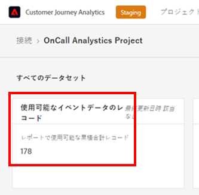

# よくある質問

[!UICONTROL Customer Journey Analytics]（CJA）は、次世代の Adobe Analytics 製品です。次に、CJA に関するよくある質問に対する回答を示します。詳しくは、[Customer Journey Analytics 機能のサポート](/help/getting-started/aa-vs-cja/cja-aa.md)を参照してください。

## 1. 前提条件 {#prerequisites}

| 質問 | 回答 |
| --- | --- |
| [!UICONTROL Customer Journey Analytics] には、[!UICONTROL プライベートデバイスのグラフ]または [!UICONTROL Device Co-op] は必要ですか？ | いいえ。[!UICONTROL Customer Journey Analytics] には、[!UICONTROL プライベートデバイスのグラフ]や [!UICONTROL Device Co-op] は必要ありません。実際、それらはまだサポートされていません。 |
| [!UICONTROL Customer Journey Analytics] には、[!UICONTROL Experience Cloud ID]（ECID）は必要ですか？ | いいえ。[!UICONTROL Customer Journey Analytics] は、データセット内の任意の ID（[!UICONTROL ECID] か選択した他の ID かに関わらず）をサポートします。 |
| [!UICONTROL Customer Journey Analytics] の前に、データの ETL（抽出、変換、読み込み）が必要になった場合、どうしたらいいですか？ | Customer Journey Analytics には、[データ準備](https://experienceleague.adobe.com/docs/experience-platform/data-prep/api/overview.html?lang=ja)機能が含まれており、Adobe Experience Platform データレイクに取り込む前にデータを変換するのに役立ちます。データが既に取り込まれた後に ETL が必要な場合、[Adobe Experience Platform クエリサービス](https://experienceleague.adobe.com/docs/platform-learn/tutorials/queries/understanding-query-service.html?lang=ja#queries)がいくつかの制限付きオプションを提供しますが、追加料金がかかる場合もあります。 |

{style=&quot;table-layout:auto&quot;}

## 2. データのステッチ（Cross-Channel Analytics） {#stitching}

| 質問 | 回答 |
| --- | --- |
| [!UICONTROL Customer Journey Analytics] は、デバイスやデータセットをまたいで「ステッチ」することはできますか。 | はい。[!UICONTROL Customer Journey Analytics] には、[Cross-Channel Analytics](https://experienceleague.adobe.com/docs/analytics-platform/using/cja-connections/cca/overview.html?lang=ja)（CCA）と呼ばれるステッチソリューションがあります。データセットの人物 ID のキーを更新できるので、複数のデータセットをシームレスに組み合わせることができます。 |
| 匿名の行動を、サポートされている認証済みの行動にステッチすることはサポートされていますか。 | はい。[Cross-Channel Analytics](https://experienceleague.adobe.com/docs/analytics-platform/using/cja-connections/cca/overview.html) では、認証済みセッションと未認証セッションの両方からのユーザーデータを調べて、ステッチされた ID を生成します。 |
| CCA での「再生」の仕組み | クロスチャネル分析では、学習した一意の ID に基づいてデータを「再生」します。再生を行うと、接続の新しいデバイスがステッチされます。[詳細情報](https://experienceleague.adobe.com/docs/analytics-platform/using/cja-connections/cca/replay.html?lang=ja#step-1%3A-live-stitching) |
| CCA での履歴データのステッチ（バックフィル）の仕組み | 初めてオンにしたとき、前月の初め（最大 60 日前）まで遡ってステッチデータのバックフィルが行われます。このバックフィルを行うには、ステッチされていない過去のデータに一時的な ID が存在する必要があります。[詳細情報](https://experienceleague.adobe.com/docs/analytics-platform/using/cja-connections/cca/overview.html?lang=ja#enable-cross-channel-analytics) |

{style=&quot;table-layout:auto&quot;}

## 3. [!UICONTROL Customer Journey Analytics] へのデータの取り込み {#ingest}

| 質問 | 回答 |
| --- | --- |
| 異なる [!UICONTROL Adobe Experience Platform] サンドボックスのデータを 1 つの [!UICONTROL Customer Journey Analytics] 接続に結合することはできますか？ | いいえ。サンドボックス全体のデータにアクセスすることはできません。同じサンドボックス内にあるデータセットのみを組み合わせることができます。[詳細情報](https://experienceleague.adobe.com/docs/analytics-platform/using/cja-connections/create-connection.html?lang=ja#select-sandbox-and-datasets) |
| [!UICONTROL Customer Journey Analytics] でオンラインデータをオフラインデータに接続する方法を教えてください。 | データセット間で人物 ID が一致する限り、[!UICONTROL Customer Journey Analytics] は、フィルター、アトリビューション、フロー、フォールアウトなどを接続できます。接続できます。 |
| オフラインデータを [!UICONTROL Customer Journey Analytics] に取り込む方法を教えてください。 | Customer Journey Analytics に対する使用権があれば、Experience Platform にデータを取り込むことができます。その後、Analysis Workspace でのレポート用に、[!UICONTROL Customer Journey Analytics] で、そのデータへの接続とデータビューを作成できます。Experience Platform のデータは、オンボーディングチームが必要に応じて、レコメンデーションやコンサルティングを提供するのに役立ちます。 |
| [!UICONTROL Adobe Analytics] データを [!UICONTROL Customer Journey Analytics] に取り込む方法を教えてください。 | [!UICONTROL Adobe Analytics] のデータは、[Adobe Analytics ソースコネクタ](https://experienceleague.adobe.com/docs/experience-platform/sources/connectors/adobe-applications/analytics.html?lang=ja)を通じて Experience Platform に接続できます。[!UICONTROL Adobe Analytics] のほとんどのフィールドは XDM 形式で取り込まれますが、それ以外のフィールドはまだ使用できません。 |
| データセット要素をデータビューに組み込むにはどの程度の時間がかかりますか。 | 開始するまでに数時間かかり、過去 13 か月のデータをバックフィルするのに数日かかります。 |
| PII データを取り込んでデータ間の接続を確立する必要がありますか。 | いいえ。PII ではない顧客 ID のハッシュを含む、任意の ID を使用できます。 |
| 過去または未来の日付やタイムスタンプを CJA イベントデータセットに取り込む際にはどのような制限がありますか？ | <ul><li>過去の日付／タイムスタンプの場合：最大 10 年前までのイベントデータ。</li><li>将来の日付／タイムスタンプの場合：最大 1 か月先のイベントデータ（予測）。</li></ul> |

{style=&quot;table-layout:auto&quot;}

## 4. 待ち時間に関する考慮事項 {#latency}

>[!NOTE]
>CJA のデータサイズは固定ではないので、アドビは標準的な取り込み時間を明言することはできません。アドビでは、更新プログラムの提供と取り込みの最適化を通じて、これらの待ち時間を短縮するよう積極的に取り組んでいます。

| 質問 | 回答 |
| --- | --- |
| [!UICONTROL Adobe Experience Platform] の [!UICONTROL Customer Journey Analytics] では、どの程度の遅延が予想されますか？ | <ul><li>ライブデータまたはイベント：AEP でデータが使用可能になってから 90 分以内に処理して取り込みます（バッチサイズが 5,000 万行を超える場合：90 分以上）。</li><li>少量のバックフィル（例：1,000 万行のルックアップデータセット）：7 日以内<li>大量のバックフィル （例：5,000 億行）：30 日</li></ul> |

## 5. [!UICONTROL 接続]データ保持ためのローリングウィンドウ（相対期間）の設定 {#data-retention}

>[!IMPORTANT]
>この設定を実装するには、カスタマーケアまたはアドビのアカウントマネージャーにお問い合わせください。CJA UI からは、まだ使用できません。

この設定を使用すると、CJA データ保持を、[!UICONTROL 接続]レベル（[!UICONTROL データセット]レベルではない）での月単位（3 か月、6 か月など）のローリングウィンドウとして定義できます。データ保持は、イベントデータセットのタイムスタンプに基づいており、イベントデータセットにのみ適用されます。適用可能なタイムスタンプがないので、プロファイルまたはルックアップデータセットのデータ保持設定は存在しません。

主な利点は、該当する有用なデータのみを保存またはレポートして、有用でなくなった古いデータを削除できるという点です。契約上の上限を超えないようにし、超過コストのリスクを軽減します。

## 6. データコンポーネントの削除の影響 {#deletion}

データの削除に関しては、サンドボックス、スキーマ、データセット、接続、データビュー、ワークスペースプロジェクトの 6 種類のコンポーネントを考慮する必要があります。次に、これらのコンポーネントを削除した場合に考えられるシナリオを示します。

| 目的 | 結果 |
| --- | --- |
| [!UICONTROL Adobe Experience Platform] のサンドボックスを削除する場合 | サンドボックスを削除すると、そのサンドボックス内のデータセットへの [!UICONTROL Customer Journey Analytics] 接続に対するデータフローが停止します。現在、削除されたサンドボックスに関連付けられていた CJA 内の[!UICONTROL 接続]は、自動的には削除されません。 |
| [!UICONTROL Adobe Experience Platform] のスキーマを削除し、このスキーマに関連付けられているデータセットを削除しない場合 | [!UICONTROL Adobe Experience Platform] では、1 つ以上の[!UICONTROL データセット]が関連付けられている[!UICONTROL スキーマ]を削除することはできません。ただし、適切な権限を持つ管理者は、データセットを削除してからスキーマを削除できます。 |
| [!UICONTROL Adobe Experience Platform] データレイクのデータセットを削除する場合 | AEP データレイクのデータセットを削除すると、そのデータセットから、そのデータセット自体を含むすべての CJA 接続へのデータフローが停止します。そのデータセットのデータは、関連付けられた CJA 接続から自動的に削除されます。 |
| [!UICONTROL Customer Journey Analytics] のデータセットを削除する場合 | 保存した接続内のデータセットの削除プロセスを実行するには、アドビのアカウントマネージャーに連絡してください。 |
| （[!UICONTROL Adobe Experience Platform] の）データセットからバッチを削除する場合 | [!UICONTROL Adobe Experience Platform] のデータセットからバッチを削除すると、そのバッチを含む CJA 接続からも同じバッチが削除されます。CJA には、[!UICONTROL Adobe Experience Platform] のバッチが削除されたことが通知されます。 |
| [!UICONTROL Customer Journey Analytics] への&#x200B;**取り込み中**&#x200B;にバッチを削除する場合 | データセットにバッチが 1 つしかない場合、そのバッチからのデータも部分的なデータも [!UICONTROL Customer Journey Analytics] には表示されません。取り込みがロールバックされます。例えば、データセットに 5 つのバッチがあり、そのうち 3 つがデータセットの削除時に既に取り込まれている場合、これら 3 つのバッチのデータは [!UICONTROL Customer Journey Analytics] に表示されます。 |
| [!UICONTROL Customer Journey Analytics] の接続を削除する場合 | 次の内容を示すエラーメッセージが表示されます。<ul><li>削除した接続用に作成されたデータビューは、機能しなくなります。</li><li> 同様に、削除した接続のデータビューに依存するワークスペースプロジェクトは動作しなくなります。</li></ul> |
| [!UICONTROL Customer Journey Analytics] のデータビューを削除する場合 | この削除されたデータビューに依存するワークスペースプロジェクトが動作しなくなることを示すエラーメッセージが表示されます。 |

## 7. CJA でレポートスイートを結合する際の考慮事項 {#merge-reportsuite}

[Adobe Analytics ソースコネクタ](https://experienceleague.adobe.com/docs/experience-platform/sources/connectors/adobe-applications/analytics.html) を通じて Adobe Analytics データを取り込む予定がある場合は、2 つ以上の Adobe Analytics レポートスイートを結合する際に、次の影響を考慮してください。

| 問題 | 考慮事項 |
| --- | --- |
| 変数 | [!UICONTROL eVars] などの変数は、レポートスイート間で並べて使用することはできません。例えば、レポートスイート 1 の eVar1 が&#x200B;**[!UICONTROL ページ]**&#x200B;を指し、レポートスイート 2 の eVar1 が **[!UICONTROL 内部キャンペーン]** を指している場合、レポートの内容が混在したり、不正確になったりする可能性があります。 |
| [!UICONTROL セッション] と [!UICONTROL 人物] のカウント | 複数のレポートスイートをまたいで重複排除が行われます。その結果、カウントが一致しない場合があります。 |
| 指標の重複排除 | 複数の行に同じトランザクション ID がある場合（例：[!UICONTROL 購入 ID]）、指標のインスタンスの重複を排除します（例：[!UICONTROL 注文]）。これにより、主要指標の数が増えすぎるのを防ぎます。その結果、[!UICONTROL 注文] などの指標が複数のレポートスイートにまたがって合計されない場合があります。 |
| 通貨 | CJA では、通貨換算はまだサポートされていません。異なる基本通貨を使用しているレポートスイートを結合すると、問題が発生する可能性があります。 |
| [!UICONTROL 永続性] | [永続性](../data-views/component-settings/persistence.md) は複数のレポートスイートにまたがって適用され、[!UICONTROL フィルター]、[!UICONTROL アトリビューション] などに影響します。数値が正しく加算されない場合があります。 |
| [!UICONTROL 分類] | [!UICONTROL 分類] は、レポートスイートを結合する際に、分類の重複が自動的に除外されないようにします。複数の分類ファイルを 1 つの [!UICONTROL ルックアップ] データセットに組み合わせると、問題が発生する場合があります。 |

## 8. 従来の [!UICONTROL Adobe Analytics] コンポーネント

| 質問 | 回答 |
| --- | --- |
| [!UICONTROL フィルター]（[!UICONTROL セグメント]）を [!DNL Customer Journey Analytics] から Experience Platform 統合プロファイルまたは他の Experience Cloud アプリケーションに共有または公開することはできますか？ | 現在はできませんが、アドビではこの機能を提供できるように鋭意取り組んでいます。 |
| 以前の [!UICONTROL eVar] 設定はどうなりましたか？ | 従来の Adobe Analytics の [!UICONTROL eVar]、[!UICONTROL prop] および[!UICONTROL イベント]は、[!UICONTROL Customer Journey Analytics] にはもう存在しません。スキーマ要素（ディメンション、指標、リストフィールド）は無制限です。したがって、データ収集プロセスで適用したアトリビューション設定はすべて、クエリ時に適用されます。 |
| すべてのセッションと変数の永続性の設定は、どこにありますか。 | [!UICONTROL Customer Journey Analytics] では、報告時にこれらのすべての設定が適用され、これらの設定はデータビューに反映されます。これらの設定に対する変更が遡及的となり、複数のデータビューを使用して複数のバージョンを持つことができるようになりました。 |
| 既存のセグメント／計算指標はどうなりますか。 | [!UICONTROL Customer Journey Analytics] は、eVar、prop またはイベントを使用しなくなりました。代わりに AEP スキーマを使用します。つまり、既存のセグメントや計算指標には、いずれも [!UICONTROL Customer Journey Analytics] との互換性はありません。 |
| [!UICONTROL Customer Journey Analytics] での `Uniques Exceeded` 制限の処理方法を教えてください。 | [!UICONTROL Customer Journey Analytics] には一意の値に関する制限がないので、ご心配は不要です。 |
| 既存の [!DNL Data Workbench] のユーザーであれば、今すぐ [!UICONTROL Customer Journey Analytics] に移行できますか。 | ユースケースによって異なります。アドビアカウントチームにご相談ください。お客様の現在のユースケースは、既に Customer Journey Analytics に適している可能性があります。 |

{style=&quot;table-layout:auto&quot;}

## 9. 接続サイズの予測 {#estimate-size}

[!UICONTROL Customer Journey Analytics] にある現在のデータの行数を知ることが必要になる場合があります。組織のイベントデータレコード（データ行）の使用状況を正確に把握するには、**組織が作成した各接続に対して**、次の手順を実行します。

1. [!UICONTROL Customer Journey Analytics] で、「**[!UICONTROL 接続]**」タブをクリックします。

   これで、現在のすべての接続のリストが表示されます。

1. 各接続名をクリックして、接続マネージャーに移動します。

1. 作成されたすべての接続で&#x200B;**[!UICONTROL 使用可能なイベントデータのレコード]**&#x200B;を合計します（接続のサイズによっては、数字の表示に時間がかかる場合があります）。

   

1. すべてのイベントデータ行の合計が表示されたら、自社とアドビで合意した Customer Journey Analytics 契約の「データ行」使用権を確認してください。

   これにより、受注で許可されているデータ行の最大数がわかります。手順 3 で取得したデータ行数がこの許可されている行数より多い場合は、データ使用量の超過が発生しています。

1. この状況を修正するには、次のようなオプションがあります。

   * [データ保持設定](https://experienceleague.adobe.com/docs/analytics-platform/using/cja-connections/manage-connections.html?lang=ja#set-rolling-window-for-connection-data-retention)を変更する。
   * [未使用の接続を削除する](https://experienceleague.adobe.com/docs/analytics-platform/using/cja-overview/cja-faq.html?lang=ja#implications-of-deleting-data-components)。
   * [AEP のデータセットを削除する](https://experienceleague.adobe.com/docs/analytics-platform/using/cja-overview/cja-faq.html#implications-of-deleting-data-components)。
   * 追加容量のライセンスを取得する（アドビのアカウントマネージャーにお問い合わせください）。

## 10. 使用量超過について {#overage}

使用量制限は、アドビによって定期的にモニタリングされ、適用されます。「データ行」とは、Customer Journey Analytics 内で分析に使用できる 1 日の平均データ行数を意味します。

例えば、契約によって 100 万行のデータが使用できる例を考えましょう。Customer Journey Analytics の使用開始 1 日目に 200 万行のデータをアップロードし、2 日目に 100 万行を削除して、ライセンスの残りの期間は、許可されたデータ行の最大値（この例では、100 万行）以内に使用量を抑えたとします。この場合でも、契約条件によっては、「データ行」ライセンスの使用量制限を超えた 1 日目について、超過分の料金（日割り計算）が発生することがあります。

## 11. データの不一致の診断 {#discrepancies}

場合によっては、接続によって取り込まれるイベントの合計数が [!UICONTROL Adobe Experience Platform] のデータセットの行数と異なることがあります。この例の場合、データセット「B2B Impression」には 7650 の行がありますが、[!UICONTROL Adobe Experience Platform] のデータセットの行数は 3830 です。不一致が発生する理由はいくつかあり、次の手順を実行して診断できます。

1. このディメンションを **[!UICONTROL プラットフォームデータセット ID]** で分類すると、サイズは同じでも、**[!UICONTROL プラットフォームデータセット ID]** が異なる 2 つのデータセットがあることがわかります。各データセットには 3825 件のレコードがあります。つまり、[!UICONTROL Customer Journey Analytics] では、人物 ID またはタイムスタンプが欠落していることにより、5 件のレコードが無視されています。

   

1. また、[!UICONTROL Adobe Experience Platform] にチェックインすると、ID「5f21c12b732044194bffc1d0」のデータセットがありません。つまり、他のユーザーが最初の接続の作成時に [!UICONTROL Adobe Experience Platform] からこのデータセットを削除しています。その後、そのデータセットは Customer Journey Analytics に再び追加されましたが、[!UICONTROL Adobe Experience Platform] によって、異なる[!UICONTROL プラットフォームデータセット ID] が生成されました。

[!UICONTROL Customer Journey Analytics] と [!UICONTROL Adobe Experience Platform] におけるデータセットと接続の削除の影響については、[こちら](https://experienceleague.adobe.com/docs/analytics-platform/using/cja-overview/cja-faq.html#implications-of-deleting-data-components)を参照してください。
