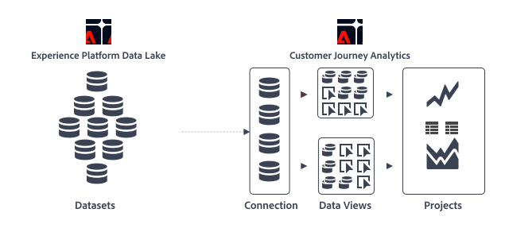

# Customer Journey Analytics の概要

Customer Journey Analytics は、Adobe Experience Platform からのデータと共に Analysis Workspace の機能を使用できるアドビの次世代 Analytics ソリューションです。数年分のデータを分類、セグメント化、クエリ、視覚化できます。また、あらゆるデータスキーマやデータタイプを保持できる Platform の機能と組み合わせられます。**Experience Data Model（XDM）**&#x200B;を使用すると、データを均一に表示および整理し、組み合わせや探索に対応できます。**Adobe Experience Platform クエリサービス**&#x200B;では、SQL 互換のツールとフレームワークを使用して、すべてのデータをクエリし、操作できます。

Customer Journey Analytics アーキテクチャの概要を以下に示します。

このアーキテクチャは、Customer Journey Analytics でどのように次の操作を実行できるかを示しています。

* 複数のデータセット  を[接続](/help/connections/overview.md)で組み合わせます。
* 接続で定義したデータセットから使用可能なフィールドに基づいて、[データビュー](/help/data-views/data-views.md)でディメンション  と指標  を定義および設定します。
* データビューのディメンションと指標に基づいて、[プロジェクト](/help/analysis-workspace/home.md)でレポート  やビジュアライゼーション（折れ線グラフ  や面グラフ  など）を作成します。

>[!BEGINSHADEBOX]

Customer Journey Analytics の概要ビデオについて詳しくは、 [Customer Journey Analysis：エクスペリエンスビジネスの分析](https://video.tv.adobe.com/v/36231/?quality=12&learn=on&captions=jpn){target="_blank"}を参照してください。

>[!ENDSHADEBOX]

## Customer Journey Analytics と従来の Adobe Analytics の比較

Customer Journey Analytics では、使いやすいクロスチャネル機能を提供し、以前のバージョンの Adobe Analytics の制限を取り除くことで、Adobe Analytics の範囲を広げています。主な改善点を次に示します。

* **変数とイベントは無制限**：eVar、prop、イベントの概念は存在しなくなりました。データは主にディメンションと指標に焦点を当てています。データセットには、無制限の数の一意のディメンションと指標を含めることができます。
* **無制限の一意の値**：Adobe Experience Platform では、一意制限を受けることはありません。
* **履歴データの変更**：Adobe Experience Platform を使用して、データを削除または修正できます。
* **クロスレポートスイートデータ**：複数のデータセットからの既存の実装を Platform で組み合わせることができます。

>[!TIP]
>
>これまで Adobe Analytics を使用していて、Customer Journey Analytics で Adobe Analytics データを使用する必要がある場合は、[データ取り込み](../data-ingestion/data-ingestion.md)の節に含まれている[従来の Adobe Analytics からのデータの取り込みと使用](../data-ingestion/analytics.md)のクイックスタートガイドを参照してください。

Customer Journey Analytics の最初のリリースには、Adobe Analytics に含まれる機能の多くが含まれています。完全なリストについては、[Customer Journey Analytics 機能のサポート](/help/getting-started/aa-vs-cja/cja-aa.md)を参照してください。

## 主なユースケース

Customer Journey Analytics では、次のことが可能です。

* **ジャーニーのコンテキストと照らし合わせて顧客を把握する**：複数のチャネルにまたがるデータを、順番に表示および分析できます。コールセンター、POS システム、オンラインプロパティのデータを、1 つのレポートビューに組み合わせることができます。
* **誰でもインサイトを利用可能**：データアクセスを民主化し、多くの人がデータに基づいたインサイトを活用してよりビジネス上の意思決定を行えるようにします。顧客体験のあらゆる側面を取り扱う組織に所属するすべてのメンバーが、より完全なデータに基づいて、実際の意思決定を迅速に下すことができます。
* **データアナリスト向けデータサイエンスの機能を活用**：Customer Journey Analytics を使用すると、専門家でなくてもデータサイエンスを活用して、深いインサイトと分析を解き放つことができます。
* **オンデマンドレポートを使用してデータセットの視覚化や操作を行う**：ワークスペースでは、いくつかの基本的なルールに準拠した Adobe Experience Platform のデータセットを使用できます。
* **Web 以外の表示データ**：ワークスペースは、「ヒット」または「イベント」の厳密な定義に制限されなくなりました。カスタムスキーマでは、データと定義を完全に制御できます。
* **データ操作をより詳細に制御**：アップロードしたデータの変更、データセットの作成、ワークスペースへの読み込みを行います。Adobe Experience Platform は、Experience Platform クエリサービスを通じて、ツールのクエリ、抽出、変換および読み込みを行います。

## 前提条件

Customer Journey Analytics の使用を開始する前に、次の前提条件を満たす必要があります。

* 組織が、Adobe Analytics（Select、Prime または Ultimate）および Customer Journey Analytics アドオンのアクティブな契約を結んでいる。契約の種類が不明な場合や、Customer Journey Analytics アドオンを使用しているかどうかが不明な場合は、アドビのアカウントチームにお問い合わせください。
* 組織が Adobe Experience Platform 用にプロビジョニングされている。
* Adobe Analytics を必要とせずに、Customer Journey Analytics をスタンドアロン製品として購入することもできます。

## アクセス制御

詳しくは、[アクセス制御](/help/technotes/access-control.md)を参照してください。

## 用語の更新

Customer Journey Analytics のいくつかの機能は、従来の Adobe Analytics と比較して、業界標準に合わせて名前が変更されました。次に、更新された用語の一部を示します。

* 仮想レポートスイートは、「データビュー」になりました。
* 分類は、「ルックアップデータセット」になりました。
* 顧客属性は、「プロファイルデータセット」になりました。
* ヒットコンテナは、「イベント」コンテナになりました。
* 訪問コンテナは、「セッション」コンテナになりました。
* 訪問者コンテナは、「人物」コンテナになりました。

## Adobe Experience Platform で構築されたその他の機能

Customer Journey Analytics は、Adobe Experience Platform に依存する多数の機能の 1 つです。Experience Platform には他にも、データを最大限に活用できる複数の機能が備わっています。

Adobe Experience Platform を使用すると、顧客データとコンテンツを任意のシステムから一元管理し、データサイエンスと機械学習を適用して、パーソナライズされた豊富なエクスペリエンスのデザインと配信を大幅に改善できます。プラットフォーム内の顧客データは、スキーマとデータのバッチで構成されるデータセットとして保存されます。Experience Platform について詳しくは、[Adobe Experience Platform アーキテクチャの概要](https://experienceleague.adobe.com/docs/platform-learn/tutorials/intro-to-platform/basic-architecture.html?lang=ja)を参照してください。

データ取り込みから SQL への直接アクセスに至るまで、Experience Platform のいくつかのコンポーネントが Customer Journey Analytics の中心となり、補完します。

* [xperience Platform クエリサービス](https://experienceleague.adobe.com/docs/experience-platform/query/home.html?lang=ja)：標準 SQL を使用して、Adobe Experience Platform からデータ（Adobe ソリューションデータ、お客様のファーストパーティデータ、その他の Platform データなど）を取得します。あらゆるデータセットを結合し、クエリ結果を新しいデータセットとして取り込んでレポートで使用したり、プロファイルサービスに取り込んだりできる、サーバーレスのツールです。Experience Platform クエリサービスを使用してデータ分析のエコシステムを構築し、様々なインタラクションチャネルをまたいだ消費者の全体像を把握できます。これらのチャネルには、POS（販売時点管理システム）、web、モバイル、CRM などが含まれます。
* [リアルタイム顧客プロファイル](https://experienceleague.adobe.com/ja/docs/experience-platform/profile/home)：
* [ID サービス](https://experienceleague.adobe.com/docs/experience-platform/identity/home.html?lang=ja)

## ビデオ

>[!BEGINSHADEBOX]

Customer Journey Analytics のデータの操作方法に関する概要ビデオについて詳しくは、 [Customer Journey Analytics のデータの操作](https://video.tv.adobe.com/v/36106/?quality=12&learn=on&captions=jpn){target="_blank"}を参照してください。

>[!ENDSHADEBOX]

>[!BEGINSHADEBOX]

Customer Journey Analytics のアーキテクチャと統合に関する概要ビデオについて詳しくは、 [アーキテクチャと統合](https://video.tv.adobe.com/v/330411/?quality=12&learn=on&captions=jpn){target="_blank"}を参照してください。

>[!ENDSHADEBOX]

>[!MORELIKETHIS]
>
>* [アナリスト向け Adobe Customer Journey Analytics クラッシュコース](https://experienceleaguecommunities.adobe.com/t5/adobe-analytics-blogs/adobe-customer-journey-analytics-crash-course-for-analysts/ba-p/719261?profile.language=ja)
>* [マインドセットと Adobe Customer Journey Analytics ワークフローの最適化：あらゆる規模の組織向けチームモデル](https://experienceleaguecommunities.adobe.com/t5/adobe-analytics-blogs/optimizing-your-mindset-and-adobe-customer-journey-analytics/ba-p/721456?profile.language=ja)
>* [組織の対応の作成：Adobe Customer Journey Analytics を拡大・縮小する人物ファーストガイド](https://experienceleaguecommunities.adobe.com/t5/adobe-analytics-blogs/building-organizational-readiness-a-people-first-guide-to/ba-p/723273?profile.language=ja)
