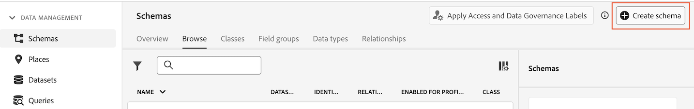

# Customer Journey Analytics でデータを分類するルックアップデータセットの作成 {#upgrade-lookup-dataset}

<!-- markdownlint-disable MD034 -->

>[!CONTEXTUALHELP]
>id="cja-upgrade-lookup-dataset-create"
>title="分類データを含む各ディメンションのルックアップデータセットの作成"
>abstract="Adobe Analytics の分類データと同様に、ルックアップデータセットは Customer Journey Analytics でデータを分類する方法です。"

<!-- markdownlint-enable MD034 -->

{{upgrade-note-step}}

Adobe Analytics の分類データと同様に、ルックアップデータセットは Customer Journey Analytics でデータを分類する方法です。

Analytics ソースコネクタを使用する場合、一部の標準検索データセットは、レポート時に自動的に適用されます。 詳しくは、[ データセットへの標準検索の追加 ](/help/connections/standard-lookups.md) を参照してください。

Experience Platform Web SDKを使用する場合、Customer Journey Analyticsでデータを分類するには、分類するデータを含む各ディメンションのカスタムスキーマとルックアップデータセットを作成する必要があります。

## ルックアップデータセットで使用するカスタムスキーマの作成

Customer Journey Analyticsで分類するデータを含むカスタムスキーマをディメンションごとに新規作成します。 後の手順でルックアップデータセットを作成すると、このスキーマが参照されます。

分類するデータを含むディメンションごとに、このプロセスを繰り返します。

Customer Journey Analyticsでルックアップデータセットとともに使用するスキーマを作成するには、次の手順を実行します。

1. Adobe Experience Platformで、左パネルの「**[!UICONTROL Data Management]**」セクションの **[!UICONTROL スキーマ]** を選択します。

1. **[!UICONTROL スキーマを作成]** を選択します。

   

1. **[!UICONTROL 手動]** を選択します。 これにより、フィールドとフィールドグループをスキーマに手動で追加できます。 「**[!UICONTROL 選択]**」を選択して、作成ウィザードの次のページに進みます。

1. **[!UICONTROL スキーマの詳細]** ページで、「**[!UICONTROL その他]**」を選択し、「**[!UICONTROL カスタム]**」を選択します。

   

1. **[!UICONTROL クラスを作成]** を選択します。

   <!-- add screenshot -->

1. **[!UICONTROL クラスを作成]** ダイアログボックスで、スキーマの名前と説明を指定し、「**[!UICONTROL レコード]**」を選択してから「**[!UICONTROL 作成]**」を選択します。

1. [ ルックアップデータセットの作成 ](#create-a-lookup-dataset) を参照してください。

## ルックアップデータセットの作成

[ カスタムスキーマを作成 ](#create-a-custom-schema-to-use-with-the-lookup-dataset) してルックアップデータセットに使用するには、ルックアップデータセットを作成してスキーマにマッピングする必要があります。

分類するデータを含むディメンションごとに、このプロセスを繰り返します。

Customer Journey Analyticsでスキーマとともに使用するルックアップデータセットを作成するには、次の手順を実行します。

>[!NOTE]
>
>次のプロセスでは、CSV ファイルを使用してデータセットを作成します。 また、データストリームの設定など、Experience Platformへのデータの読み込みに使用できるその他の方法も使用できます。

1. Adobe Experience Platformで、左パネルの「**[!UICONTROL ワークフロー]**」をクリックします。

   

1. 「**[!UICONTROL CSV を XDM スキーマにマッピング]**」を選択し、「**[!UICONTROL 起動]**」を選択します。

1. 「**[!UICONTROL データセットの詳細]**」セクションで、「**[!UICONTROL 新しいデータセット]**」を選択します。

1. データセットの名前と説明を指定します。

1. **[!UICONTROL スキーマ]** フィールドで、[ ルックアップデータセットのスキーマの作成 ](#create-a-schema-for-lookup-datasets) の説明に従って、ルックアップデータセット用に作成したスキーマを選択します。

1. 「**[!UICONTROL 次へ]**」を選択します。

1. **[!UICONTROL CSV を XDM スキーマにマッピング]** ページの「**[!UICONTROL ファイルをアップロード]**」セクションで、**[!UICONTROL ファイルを選択]** を選択します。次に、分類データを適用するディメンションの分類情報を含むファイルをファイルシステムで参照します。 例えば、フィールド ID と対応するフィールド名をリストするスプレッドシートなどがあります。<!-- correct? How can I better explain what this file is?-->

   

1. 「**[!UICONTROL 次へ]**」を選択します。

1. ファイルをアップロードした後、マッピングが正確であることを確認します。 CSV ファイルの列は **[!UICONTROL Source Data の下にリストされ]** 対応する XDM スキーマフィールドが **[!UICONTROL Target フィールド]** の下にリストされます。

   Platform は、選択したターゲットスキーマまたはデータセットに基づいて、自動マッピングされたフィールドに対してインテリジェントなレコメンデーションを自動的に提供します。 マッピングルールは、ユースケースに合わせて手動で調整できます。

   マッピングプロセスについて詳しくは、Experience Platform ドキュメントの [ 既存の XDM スキーマへの CSV ファイルのマッピング ](https://experienceleague.adobe.com/en/docs/experience-platform/ingestion/tutorials/map-csv/existing-schema) を参照してください。

1. 「**[!UICONTROL 完了]**」を選択します。

1. [Customer Journey Analyticsの接続へのルックアップデータセットの追加 ](#add-the-lookup-dataset-to-your-connection-in-customer-journey-analytics) を続けます。

## Customer Journey Analyticsの接続へのルックアップデータセットの追加

[ カスタムスキーマを作成 ](#create-a-custom-schema-to-use-with-the-lookup-dataset) して [ ルックアップデータセットを作成 ](#create-a-lookup-dataset) した後、Customer Journey Analyticsの接続にルックアップデータセットを追加する必要があります。

分類するデータを含むディメンションごとに、このプロセスを繰り返します。

Customer Journey Analyticsの接続にルックアップデータセットを追加するには、次の手順を実行します。

1. Customer Journey Analytics で、「**[!UICONTROL 接続]**」タブをクリックします。

1. ルックアップデータセットを追加する接続の横にある  を選択してから、「**[!UICONTROL 編集]** を選択します。

   <!-- add screenshot -->

1. 「**[!UICONTROL データセットを追加]**」を選択します。

1. **[!UICONTROL データセットを追加]** ダイアログボックスで、作成したルックアップデータセットを選択して、「**[!UICONTROL 次へ]**」を選択します。

1. **[!UICONTROL ユーザー ID]** フィールドで、Experience Platformで設定したデータセットスキーマで定義されている使用可能な ID からユーザー ID を選択します。<!-- fill out other fields? -->

1. **[!UICONTROL データセットを追加]** を選択してから、「**[!UICONTROL 保存]** を選択します。

   <!-- is there a step right in between here where you select the dataset -->

1. **[!UICONTROL キー]** フィールドと **[!UICONTROL 一致するキー]** フィールドを使用して、ルックアップデータセット内のフィールドとイベントまたはサマリーデータセット内のフィールドの間の相関関係を作成します。

1. すべてのルックアップデータセットがCustomer Journey Analyticsの接続に追加されるまで、このプロセスを繰り返します。

{{upgrade-final-step}}

