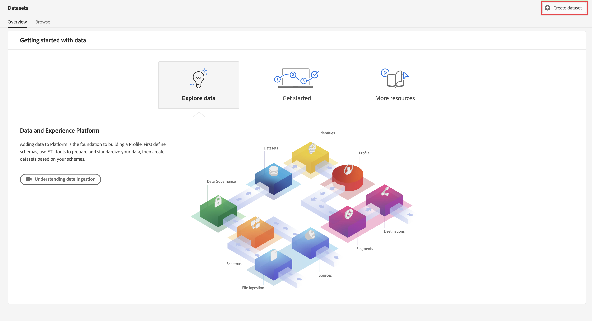

# Customer Journey Analyticsで使用するデータセットの作成 {#upgrade-create-dataset}

<!-- markdownlint-disable MD034 -->

>[!CONTEXTUALHELP]
>id="cja-upgrade-dataset-create"
>title="Adobe Experience Platformでのデータセットの作成"
>abstract="データセットは、収集されたデータが存在する場所です。 Adobe Experience Platformにこの場所を作成します。   スキーマを考慮したデータセットの作成は、数分で完了します。"

<!-- markdownlint-enable MD034 -->

>[!NOTE]
> 
>このページの手順は、以前のアップグレード手順をすべて完了した後でのみ実行してください。 [ 推奨されるアップグレード手順 ](/help/getting-started/cja-upgrade/cja-upgrade-recommendations.md#recommended-upgrade-steps-for-most-organizations) に従うか、[Adobe AnalyticsからCustomer Journey Analyticsへのアップグレードに関するアンケート ](https://gigazelle.github.io/cja-ttv/) で組織用に動的に生成されたアップグレード手順に従うことができます。
>
>このページの手順を完了した後、推奨されるアップグレード手順または動的に生成されるアップグレード手順に従って続行します。

<!-- Should we single source this instead of duplicate it? The following steps were copied from: /help/data-ingestion/aepwebsdk.md-->

データセットは、Adobe Experience Platformに収集するデータを保存および管理する構造です。

データセットを作成するには：

1. Adobe Experience Platformの左パネルの「**[!UICONTROL DATA MANAGEMENT]**」で「[!UICONTROL  データセット ]」を選択します。

1. 「**[!UICONTROL データセットを作成]**」を選択します。

   

1. 「**[!UICONTROL スキーマからデータセットを作成]**」をクリックします。

   

1. 作成したスキーマを選択し、「**[!UICONTROL 次へ]**」を選択します。

1. データセットに名前を付け、（オプション）説明を入力します。

   

1. 「**[!UICONTROL 完了]**」を選択します。

1. 「**[!UICONTROL プロファイル]**」スイッチを選択します。

   プロファイルのデータセットを有効にするよう求められます。有効にすると、データセットは、取り込んだデータを使用してリアルタイム顧客プロファイルを強化します。

   >[!IMPORTANT]
   >
   >    プロファイルのデータセットを有効にできるのは、データセットが準拠するスキーマがプロファイルに対しても有効になっている場合のみです。

   

   データセットの表示、プレビュー、作成、削除の方法について詳しくは、[ データセット UI ガイド ](https://experienceleague.adobe.com/docs/experience-platform/catalog/datasets/user-guide.html?lang=ja) を参照してください。 リアルタイム顧客プロファイルのデータセットを有効にする方法についても説明します。

1. [ 推奨されるアップグレード手順 ](/help/getting-started/cja-upgrade/cja-upgrade-recommendations.md#recommended-upgrade-steps-for-most-organizations) または [ 動的に生成されるアップグレード手順 ](https://gigazelle.github.io/cja-ttv/) に従って続行します。
