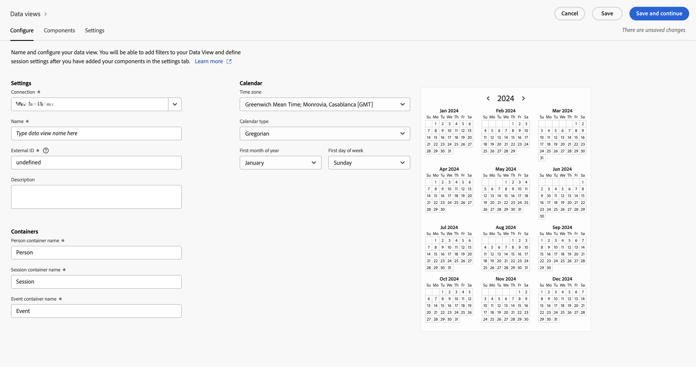

# Customer Journey Analytics でデータビューを作成 {#upgrade-create-dataview}

<!-- markdownlint-disable MD034 -->

>[!CONTEXTUALHELP]
>id="cja-upgrade-dataview"
>title="Customer Journey Analytics でデータビューを作成"
>abstract="データビューは、Customer Journey Analytics に特有のコンテナで、接続からデータを解釈する方法を決定できます。  データビューの初期作成には数分かかりますが、各ディメンションと指標を目的のコンポーネント設定で設定するには数日かかる場合があります。 これらの設定の調整は遡って適用されるので、組織は時間をかけて設定を調整できます。"

<!-- markdownlint-enable MD034 -->

{{upgrade-note-step}}

<!-- Should we single source this instead of duplicate it? The following steps were copied from: /help/data-views/create-dataview.md -->

データビューを作成するには、スキーマ要素から指標やディメンションを作成するか、標準コンポーネントを使用する必要があります。 ほとんどのスキーマ要素は、ビジネスの要件に応じて、ディメンションまたは指標のいずれかになります。 スキーマ要素をデータビューにドラッグすると、右側にオプションが表示され、Customer Journey Analytics でのディメンションや指標の動作を調整できます。

データビューを作成するには：

1. [Customer Journey Analytics](https://analytics.adobe.com) にログインし、上部のメニューにある&#x200B;**[!UICONTROL データ管理]**&#x200B;から、オプションで「**[!UICONTROL データビュー]**」を選択します。

1. 「**[!UICONTROL 新しいデータビューを作成]**」を選択します。 または、データビューのリストから既存のデータビューを選択して編集することもできます。

1. 「[!UICONTROL **設定**]」タブで、データビューの名前を指定し、基本設定、コンポーネントおよびカレンダーオプションを設定します。

   各フィールドについて詳しくは、[データビューの作成または編集](/help/data-views/create-dataview.md)の[設定](/help/data-views/create-dataview.md#configure)を参照してください。

   

1. 「[!UICONTROL **コンポーネント**]」タブを選択します。

   「[!UICONTROL **コンポーネント**]」タブでは、データビューのコンポーネントを設定します。つまり、スキーマ要素から指標とディメンションを作成できます。 また、標準コンポーネントも使用できます。

   

1. 「[!UICONTROL **コンポーネント**]」タブで、左側のパネルからスキーマ要素を「[!UICONTROL **指標**]」セクションまたは「[!UICONTROL **ディメンション**]」セクションにドラッグします。 追加したスキーマ要素は、データビューの指標またはディメンションになります。

   データビューにコンポーネントを追加する際に使用できるオプションについて詳しくは、[データビューの作成または編集](/help/data-views/create-dataview.md)の[コンポーネント](/help/data-views/create-dataview.md#components)を参照してください。

1. 「[!UICONTROL **設定**]」タブを選択します。 ここから、データビュー全体に適用するセグメントを設定したり、セッションのタイムアウトと指標を設定したりできます。

   データビューの設定を指定する際に使用できるオプションについて詳しくは、[データビューの作成または編集](/help/data-views/create-dataview.md)の[設定](/help/data-views/create-dataview.md#settings)を参照してください。

1. 「**[!UICONTROL 保存]**」を選択して、データビューの設定を保存します。

1. 必要な設定をすべて指定したら、「**[!UICONTROL 保存して終了]**」を選択します。

{{upgrade-final-step}}
