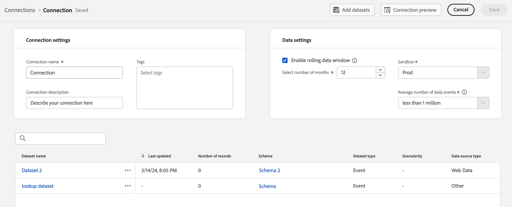

# 接続への Analytics ソースコネクタデータセットの追加 {#upgrade-source-connector-dataset}

<!-- markdownlint-disable MD034 -->

>[!CONTEXTUALHELP]
>id="cja-upgrade-source-connector-dataset"
>title="接続への Analytics ソースコネクタデータセットの追加"
>abstract="Analytics レポートスイートの履歴データが Adobe Experience Platform にあるので、そのデータセットを Customer Journey Analytics を最初に設定した際に作成した既存の接続に追加します。この手順が完了すると、Customer Journey Analytics の履歴データを使用できるようになります。  Customer Journey Analytics の接続にデータセットを追加するのは簡単で、完了するまでに数分しかかかりません。"

<!-- markdownlint-enable MD034 -->

{{upgrade-note-step}}

## Analytics ソースコネクタを使用して、履歴データを Customer Journey Analytics に取り込む方法について

Analytics ソースコネクタを使用して、Adobe Analytics レポートスイートデータを Adobe Experience Platform に取り込むことができます。 その後、このデータは、Customer Journey Analytics で履歴データとして使用できます。

このプロセスでは、組織のニーズと使用する特定のプラットフォームアプリケーションに合わせて調整された効率化されたスキーマが必要なので、[Customer Journey Analytics へのアップグレード時に XDM スキーマを作成](/help/getting-started/cja-upgrade/cja-upgrade-schema-create.md)することを前提としています。

Analytics ソースコネクタを使用して履歴データを Customer Journey Analytics に取り込むには、次の操作を行う必要があります。

1. [Analytics ソースコネクタ用に XDM スキーマを作成します](/help/getting-started/cja-upgrade/cja-upgrade-source-connector-schema.md)

1. Analytics ソースコネクタがまだない場合は、[Analytics ソースコネクタを作成し、フィールドを XDM スキーマにマッピングします](/help/getting-started/cja-upgrade/cja-upgrade-source-connector.md)。

   または

   既に Analytics ソースコネクタがある場合は、[ ソースコネクタのフィールドを XDM スキーマにマッピングします](/help/getting-started/cja-upgrade/cja-upgrade-from-source-connector.md)。

1. 以下の説明に従って、接続に Analytics ソースコネクタデータセットを追加します。

## 接続への Analytics ソースコネクタデータセットの追加

[履歴データ用の Analytics ソースコネクタを作成](/help/getting-started/cja-upgrade/cja-upgrade-source-connector.md)すると、Analytics データ用のデータセットが自動的に作成されます。

この自動作成されたデータセットを、Web SDK 実装用に作成したのと同じ接続に追加する必要があります。これにより、Analytics データが、Web SDK データと同じ Customer Journey Analytics のデータビューに表示されるようになります。

自動作成されたデータセットを Web SDK 実装用に作成したのと同じ接続に追加するには：

1. Customer Journey Analyticsで、必要に応じて **データ管理** から「**[!UICONTROL 接続]**」を選択します。

1. [Web SDK 実装用に作成した](/help/getting-started/cja-upgrade/cja-upgrade-connection.md)接続を選択します。

1. 「**[!UICONTROL 編集]**」を選択します。

   

1. 右上の「**[!UICONTROL データセットを追加]**」を選択します。

   

1. スクロールして、Analytics ソースコネクタの作成時に自動的に作成されたデータセットを探します。

   このデータセットの名前は、レポートスイートの名前の後に `midValues` を付けたものです。例：`My report suite midValues`

1. データセット名の横にあるチェックボックスをオンにし、「**[!UICONTROL 次へ]**」を選択します。

   

1. 次の情報を指定します。

   <!-- Copied from help/connections/create-connection.md. Should we single source? -->

   | 設定 | 説明 |
   | --- | --- |
   | **[!UICONTROL ユーザー ID]** | イベントデータセットとプロファイルデータセットでのみ使用できます。 使用可能な ID のドロップダウンメニューからユーザー ID を選択します。 これらの ID は、Experience Platform 内のデータセットスキーマで定義されています。 ユーザー ID として ID マップを使用する方法については、次を参照してください。
選択するユーザー ID がない場合は、1 つ以上のユーザー ID がスキーマで定義されていないことを意味します。 詳しくは、[UI で ID フィールドを定義](https://experienceleague.adobe.com/ja/docs/experience-platform/xdm/ui/fields/identity)を参照してください。 
選択したユーザー ID の値は、大文字と小文字が区別されると見なされます。 例えば、`abc123` と `ABC123` は 2 つの異なる値です。 |
   | **[!UICONTROL タイムスタンプ]** | イベントおよび概要データセットの場合のみ、この設定は、Experience Platform のイベントベースのスキーマからデフォルトのタイムスタンプフィールドに自動的に設定されます。 |
   | **[!UICONTROL タイムゾーン]** | 概要データでのみ使用できます。 時系列の概要データに適したタイムゾーンを選択します。 |
   | **[!UICONTROL データソースタイプ]** | データソースのタイプを選択します。  データソースのタイプを以下に示します。 <ul><li>[!UICONTROL Web データ]</li><li>[!UICONTROL モバイルアプリデータ]</li><li>[!UICONTROL POS データ]</li><li>[!UICONTROL CRM データ]</li><li>[!UICONTROL サーベイデータ]</li><li>[!UICONTROL コールセンターデータ]</li><li>[!UICONTROL 製品データ]</li><li> [!UICONTROL アカウントデータ]</li><li> [!UICONTROL トランザクションデータ]</li><li>[!UICONTROL 顧客フィードバックデータ]</li><li> [!UICONTROL その他]</li></ul>このフィールドは、使用中のデータソースのタイプを調査するために使用します。 |

   {style="table-layout:auto"}

1. 「**[!UICONTROL 新しいデータをインポート]**」セクションで、「**[!UICONTROL すべての新しいデータをインポート]**」オプションを無効のままにします。

   履歴データに Analytics ソースコネクタデータセットを使用しているので、収集された将来のデータをこのデータセットに取り込みたくない場合があります。

1. 「**[!UICONTROL データセットのバックフィル]**」セクションで、「**[!UICONTROL バックフィルをリクエスト]**」を選択します。

1. 開始日と終了日を入力するか、カレンダーアイコン  をクリックして、Customer Journey Analytics への接続のバックフィルに含める期間を定義します。

   バックフィルをリクエストする日付を指定する場合は、明示的に指定します。いくつかの要因に応じて、次のいずれかの操作を行うことができます。

   * Web SDK の実装でデータの収集を最初に開始した日付と同じ終了日を選択します。

   * Web SDKの実装でデータの収集を初めて開始した日付の直後の終了日を選択し、データビューセグメントを使用して重複するデータをセグメント化します。

   * データの重複が大きくなる終了日を選択してから、データビューセグメントを使用して重複するデータをセグメント化します。

     **メモ：**&#x200B;このオプションを使用すると、接続の行が増えるため、コストが増加します。

   <!-- Include any of the following?  Make sure you're explicit as to the dates you request backfill to. You want to request it to the date that you start gathering data with your Web SDK implementation. Also possibly include segments for any overlapping date. So you could request everything and then use a segment to exclude data that you don't want. That way if you need to move up the date, then you could change the date in the segment. Downside would be that you might pay for double rows.  When they do that, they're going to see all schema fields from both their custom schema and their Analytics schema. So they'll need to be cognizant to select the right fields, and never select any Analytics fields, because they will be mapped as part of the source connector. Never select any Analytics field group fields because they'll be mapped.  -->

1. 「**[!UICONTROL キューのバックフィル]**」を選択します。

1. 「**[!UICONTROL データセットを追加]**」を選択してから、「**[!UICONTROL 保存]**」を選択して接続を保存します。

1. （条件付き）ルックアップデータセットを使用する場合、ルックアップデータセットを作成して接続に追加する必要があります。詳しくは、[Customer Journey Analytics でルックアップデータセットを作成してデータを分類](/help/getting-started/cja-upgrade/cja-upgrade-dataset-lookup.md)を参照してください。

   これは、web SDK 実装を構成するときにまだ実行していない場合にのみ必要です。

{{upgrade-final-step}}
