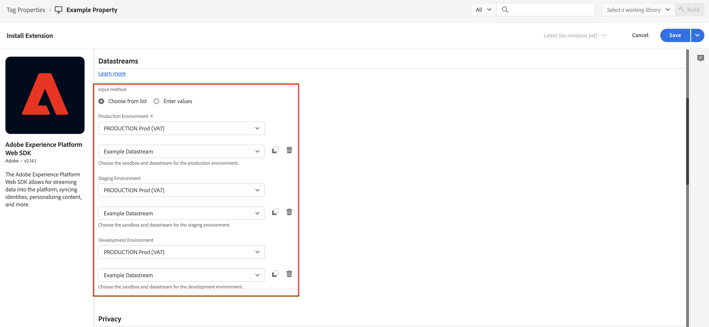

# タグへの Web SDK 拡張機能の追加 {#upgrade-tag-extension}

<!-- markdownlint-disable MD034 -->

>[!CONTEXTUALHELP]
>id="cja-upgrade-tag-extension"
>title="タグプロパティに Adobe Experience Platform Web SDK 拡張機能を追加"
>abstract="タグプロパティに Adobe Experience Platform Web SDK 拡張機能を追加します。 タグプロパティへの Web SDK 拡張機能の追加は簡略化されており、数分で完了します。"

<!-- markdownlint-enable MD034 -->

{{upgrade-note-step}}

Adobe Experience Platform 内のタグ機能を使用して、サイトにデータを収集するためのコードを実装できます。 このタグ管理ソリューションを使用すると、他のタグ要件と共にコードをデプロイできます。 タグは、Adobe Experience Platform Web SDK 拡張機能を使用して、Adobe Experience Platform とのシームレスな統合を提供します。

次の情報では、タグに Web SDK 拡張機能を追加する方法について説明します。 補足情報について詳しくは、Experience Platform ドキュメントの [Web SDK タグ拡張機能の設定](https://experienceleague.adobe.com/ja/docs/experience-platform/tags/extensions/client/web-sdk/web-sdk-extension-configuration)を参照してください。 Web SDKにはExperience Platform ID サービスが含まれているため、タグに[!UICONTROL Experience Cloud ID サービス &#x200B;]拡張機能を追加する必要はありません。

[タグを作成](/help/getting-started/cja-upgrade/cja-upgrade-tag-property.md)した後、Adobe Experience Platform Web SDK 拡張機能を使用して設定する必要があります。 これにより、Adobe Experience Platform に（データストリームを通じて）データを送信できます。

タグに Web SDK 拡張機能を追加するには：

1. Adobe ID 資格情報を使用して experiencecloud.adobe.com にログインします。

1. Adobe Experience Platform で、**[!UICONTROL データ収集]**／**[!UICONTROL タグ]**&#x200B;に移動します。

1. [!UICONTROL タグのプロパティ]をクリックして新しく作成したタグを開きます。

1. 左パネルで「**[!UICONTROL 拡張機能]**」を選択します。

1. 上部のバーで「**[!UICONTROL カタログ]**」をクリックします。

1. **[!UICONTROL Adobe Experience Platform Web SDK 拡張機能]**&#x200B;を検索またはスクロールし、「**[!UICONTROL インストール]**」を選択してインストールします。

   

1. サンドボックスと、以前に作成した[!UICONTROL 本番環境]、（オプション）[!UICONTROL ステージング環境]および[!UICONTROL 開発環境]用のデータストリームを選択します。

   

1. 「**[!UICONTROL 保存]**」を選択します。

{{upgrade-final-step}}
