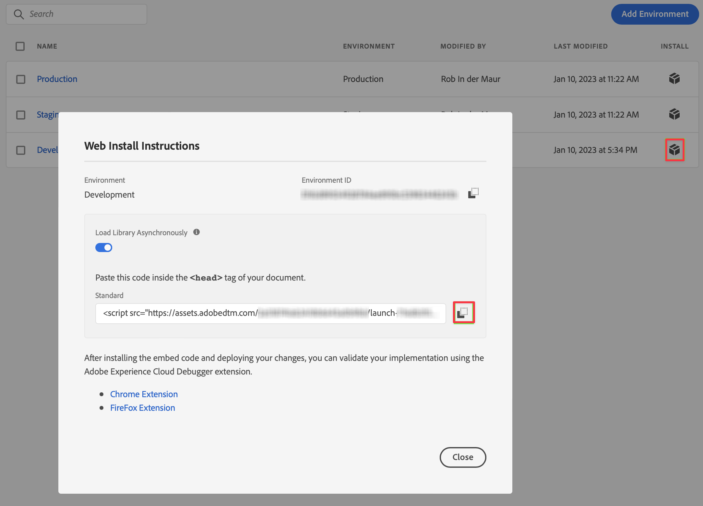

# Web SDK 拡張機能用のローダータグの実装 {#upgrade-tag-loader}

<!-- markdownlint-disable MD034 -->

>[!CONTEXTUALHELP]
>id="cja-upgrade-tag-loader"
>title="サイトにローダータグを実装"
>abstract="Web サイト開発チームと連携して、サイトのすべてのページにローダータグをインストールします。<br><br>このタスクの完了時間は、コードのデプロイと連携するエンジニアリングチームの応答時間に大きく依存します。 高度にアダプティブなエンジニアリングチームを持つ組織では、この手順を数日で完了できますが、タスクの膨大なバックログを持つエンジニアリングチームでは、1 か月以上かかる場合があります。"

<!-- markdownlint-enable MD034 -->

{{upgrade-note-step}}

追跡する web サイトにタグをインストールする必要があります。つまり、web サイトのテンプレートのヘッダータグにコードを配置する必要があります。

次のプロセスでは、タグを参照するコードを取得する方法について説明します。 補足情報について詳しくは、Experience Platform ドキュメントの[タグとイベント転送の実装ガイド](https://experienceleague.adobe.com/ja/docs/experience-platform/tags/get-started/implementation-guides)を参照してください。

タグを参照するコードを取得するには：

1. Adobe ID 資格情報を使用して experiencecloud.adobe.com にログインします。

1. Adobe Experience Platform で、**[!UICONTROL データ収集]**／**[!UICONTROL タグ]**&#x200B;に移動します。

1. **[!UICONTROL タグプロパティ]**&#x200B;ページで、プロパティのリストから新しく作成したタグを選択して開きます。

1. 左パネルで「**[!UICONTROL 環境]**」を選択します。

1. 環境のリストから、正しいインストール（ボックス）ボタンを選択します。

   [!UICONTROL Web インストール手順]ダイアログで、次のように読み込むスクリプトコードの横にある「コピー」ボタンを選択します。

   ```
   <script src="https://assets.adobedtm.com/2a518741ab24/.../launch-...-development.min.js" async></script>>
   ```

   

1. 「**[!UICONTROL 閉じる]**」を選択します。

   開発環境用のコードの代わりに、Adobe Experience Platform Web SDK をデプロイするプロセスの場所に基づいて、別の環境（ステージング、実稼動）を選択することもできます。

   詳しくは、[環境](https://experienceleague.adobe.com/docs/experience-platform/tags/publish/environments/environments.html?lang=ja)を参照してください。

{{upgrade-final-step}}
