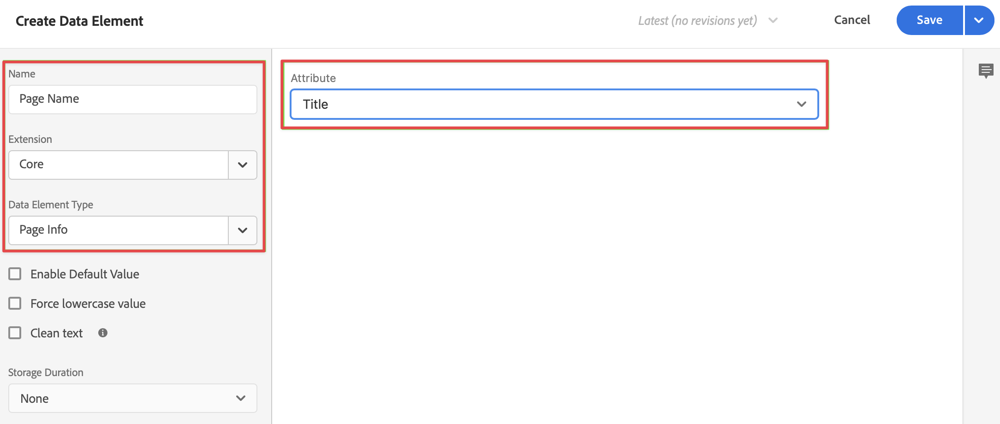
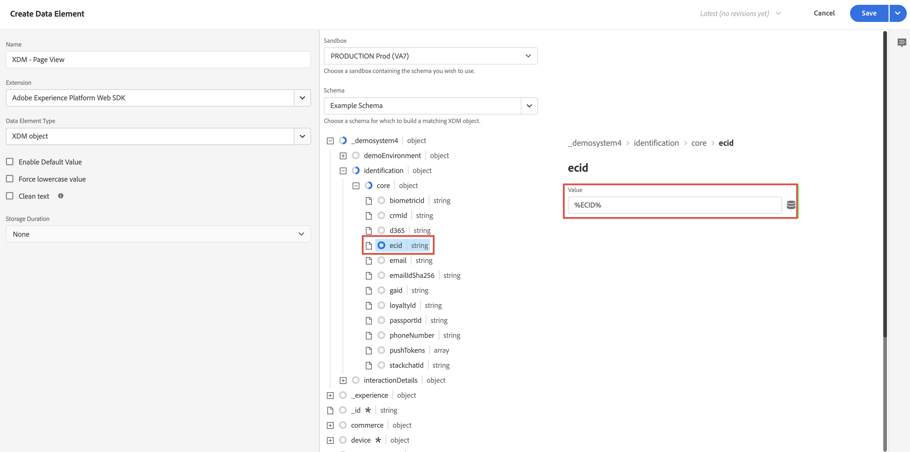

# タグへの XDM データ収集ロジックの追加

>[!NOTE]
> 
>このページの手順は、以前のアップグレード手順をすべて完了した後でのみ実行してください。 [ 推奨されるアップグレード手順 ](/help/getting-started/cja-upgrade/cja-upgrade-recommendations.md#recommended-upgrade-steps-for-most-organizations) に従うか、[Adobe AnalyticsからCustomer Journey Analyticsへのアップグレードに関するアンケート ](https://gigazelle.github.io/cja-ttv/) で組織用に動的に生成されたアップグレード手順に従うことができます。
>
>このページの手順を完了した後、推奨されるアップグレード手順または動的に生成されるアップグレード手順に従って続行します。

[ タグを作成して web SDK拡張機能を追加 ](/help/getting-started/cja-upgrade/cja-upgrade-tag-property.md) した後、サイトをトラッキングしてAdobe Experience Platformにデータを送信する方法に従って、データ要素とルールを使用してタグを設定する必要があります。 タグのデータ要素とルールを設定したら、タグを作成して公開できます。

## データ要素の設定

データ要素は、データディクショナリ（またはデータマップ）の構築ブロックです。データ要素を使用して、マーケティングおよび広告テクノロジー全体でデータを収集、整理、配信します。タグでデータレイヤーから読み取り、Adobe Experience Platform にデータを配信するために使用できるデータ要素を設定します。

データ要素には様々なタイプがあります。まず、データ要素を設定して、サイトでユーザーが表示しているページ名を取り込みます。 次に、Experience Cloud ID を参照するデータ要素を設定します。 最後に、XDM オブジェクトデータ要素を定義します。

### ページ名データ要素

ページ名データ要素を定義するには：

1. Adobe IDの資格情報を使用してexperience.adobe.comにログインします。

1. Adobe Experience Platformで、**[!UICONTROL Data Collection]**/**[!UICONTROL Tags]** に移動します。

1. [!UICONTROL タグのプロパティ]をクリックして新しく作成したタグを開きます。

1. 左パネルで「**[!UICONTROL データ要素]**」を選択します。

1. 「**[!UICONTROL データ要素を追加]**」を選択します。

1. [!UICONTROL  データ要素を作成 ] ダイアログで、次の情報を指定します。

   * **[!UICONTROL 名前]**：データ要素の名前。 例：`Page Name`。

   * **[!UICONTROL 拡張機能]**：リストから **[!UICONTROL Core]** を選択します。

   * **[!UICONTROL データ要素タイプ]**：リストから **[!UICONTROL ページ情報]** を選択します。

   * **[!UICONTROL 属性]**：リストから **[!UICONTROL タイトル]** を選択します。

     

     または、データレイヤーの変数の値（`pageName` や [!UICONTROL JavaScript 変数] データ要素タイプなど）を使用して、データ要素を定義できました。

     

1. 「**[!UICONTROL 保存]**」を選択します。

   次に、Experience Cloud ID（Adobe Experience Platform Web SDK によって自動的に提供され、Experience Cloud ID サービス拡張機能を通じて使用できる）を参照するデータ要素を設定します。

1. [ECID データ要素 ](#ecid-data-element) を続行します。

### ECID データ要素

ECID データ要素を定義するには：

1. Adobe IDの資格情報を使用してexperience.adobe.comにログインします。

1. Adobe Experience Platformで、**[!UICONTROL Data Collection]**/**[!UICONTROL Tags]** に移動します。

1. [!UICONTROL タグのプロパティ]をクリックして新しく作成したタグを開きます。

1. 左パネルで「**[!UICONTROL データ要素]**」を選択します。

1. 「**[!UICONTROL データ要素を追加]**」を選択します。

1. [!UICONTROL  データ要素を作成 ] ダイアログで、次の情報を指定します。

   * **[!UICONTROL 名前]**：データ要素の名前。 例：`ECID`。

   * **[!UICONTROL 拡張機能]**：リストから **[!UICONTROL Experience CloudID サービス]** を選択します。

   * **[!UICONTROL データ要素タイプ]**：リストから **[!UICONTROL ECID]** を選択します。

     

1. 「**[!UICONTROL 保存]**」を選択します。

1. [XDM オブジェクトデータ要素 ](#xdm-object-data-element) を続行します。

### XDM オブジェクトデータ要素

最後に、特定のデータ要素を、前に定義したスキーマにマッピングします。XDM スキーマを表す別のデータ要素を定義します。

XDM オブジェクトデータ要素を定義するには：

1. Adobe IDの資格情報を使用してexperience.adobe.comにログインします。

1. Adobe Experience Platformで、**[!UICONTROL Data Collection]**/**[!UICONTROL Tags]** に移動します。

1. [!UICONTROL タグのプロパティ]をクリックして新しく作成したタグを開きます。

1. 左パネルで「**[!UICONTROL データ要素]**」を選択します。

1. 「**[!UICONTROL データ要素を追加]**」を選択します。

1. [!UICONTROL  データ要素を作成 ] ダイアログで、次の情報を指定します。

   * **[!UICONTROL 名前]**：データ要素の名前。 例：`XDM - Page View`。

   * **[!UICONTROL 拡張機能]**：リストから **[!UICONTROL Adobe Experience Platform Web SDK]** を選択します。

   * **[!UICONTROL データ要素タイプ]**：リストから **[!UICONTROL XDM オブジェクト]** を選択します。

   * **[!UICONTROL サンドボックス]**：リストからお使いのサンドボックスを選択します。

   * **[!UICONTROL スキーマ]**：リストからスキーマを選択します。

1. スキーマ内で定義した `identification > core > ecid` 属性を、ECID データ要素にマッピングします。円柱アイコンを選択すると、データ要素のリストから ECID データ要素を簡単に選択できます。

   

   

1. スキーマ内で定義した `web > webPageDetails > name` 属性を、ページ名データ要素にマッピングします。

   

1. 「**[!UICONTROL 保存]**」を選択します。

1. [ ルールの設定 ](#configure-rules) を続行します。

## **ルールの設定**

Adobe Experience Platform のタグは、ルールベースのシステムに従います。ユーザーの操作と関する各種データを参照します。ルールで設定された条件が満たされると、ルールは、特定した拡張機能、スクリプトまたはクライアント側コードをトリガーします。ルールを使用し、Adobe Experience Platform Web SDK 拡張機能を使用して、XDM オブジェクトなどのデータを Adobe Experience Platform に送信できます。

ルールを定義するには：

>[!NOTE]
>
>次の手順は、他のデータ要素の値を含む XDM データをAdobe Experience Platformに送信するルールを定義する例です。
>
>タグ内で様々な方法でルールを使用して、（データ要素を使用して）変数を操作できます。
>
>詳しくは、[ルール](https://experienceleague.adobe.com/docs/experience-platform/tags/ui/rules.html?lang=ja)を参照してください。

1. Adobe IDの資格情報を使用してexperience.adobe.comにログインします。

1. Adobe Experience Platformで、**[!UICONTROL Data Collection]**/**[!UICONTROL Tags]** に移動します。

1. [!UICONTROL タグのプロパティ]をクリックして新しく作成したタグを開きます。

1. 左パネルで「**[!UICONTROL ルール]**」を選択します。

1. 「**[!UICONTROL 新規ルールを作成]**」を選択します。

1. [!UICONTROL  ルールを作成 ] ダイアログで、次の情報を指定します。

   * **[!UICONTROL 名前]**：ルールの名前。 例：`Page View`。

   * **[!UICONTROL イベント]**:「**[!UICONTROL +追加]**」を選択します。 次に、[!UICONTROL  イベント設定 ] ダイアログで、次の情報を指定します。 完了したら、「変更を保持 **[!UICONTROL を選択し]** す。

      * **[!UICONTROL 拡張機能]**：リストから **[!UICONTROL Core]** を選択します。

      * **[!UICONTROL イベントタイプ]**：リストから **[!UICONTROL 読み込んだウィンドウ]** を選択します。

        

   * **[!UICONTROL アクション]**:「**[!UICONTROL +追加]**」を選択します。 次に、[!UICONTROL  アクションの設定 ] ダイアログで、次の情報を指定します。 完了したら、「変更を保持 **[!UICONTROL を選択し]** す。

      * **[!UICONTROL 拡張機能]**：リストから **[!UICONTROL Adobe Experience Platform Web SDK]** を選択します。

      * **[!UICONTROL アクションタイプ]**：リストから **[!UICONTROL イベントを送信]** を選択します。

      * **[!UICONTROL タイプ]**：リストから **[!UICONTROL web.webpagedetails.pageViews]** を選択します。

      * **[!UICONTROL XDM データ]**：円柱アイコンを選択し、データ要素のリストから **[!UICONTROL XDM - ページビュー]** を選択します。

        

        ルールは次のようになります。

        

1. 「**[!UICONTROL 保存]**」を選択します。

## タグを作成して公開する

データ要素とルールを定義したら、タグを作成して公開する必要があります。 ライブラリビルドを作成する場合は、そのビルドを環境に割り当てる必要があります。ビルドの拡張機能、ルール、およびデータ要素がコンパイルされ、割り当てられた環境に配置されます。各環境は、割り当てられたビルドをサイトに統合できる、一意の埋め込みコードを提供します。

Adobe Experience Platform タグは、Adobe Experience Platform web SDKのデプロイメントに対応する必要がある、シンプルな公開ワークフローから複雑な公開ワークフローをサポートします。 詳しくは、[公開の概要](https://experienceleague.adobe.com/docs/experience-platform/tags/publish/overview.html?lang=ja)を参照してください。

タグを構築して公開するには、次の手順に従います。

1. Adobe IDの資格情報を使用してexperience.adobe.comにログインします。

1. Adobe Experience Platformで、**[!UICONTROL Data Collection]**/**[!UICONTROL Tags]** に移動します。

1. [!UICONTROL タグのプロパティ]をクリックして新しく作成したタグを開きます。

1. 左パネルから「**[!UICONTROL 公開フロー]**」をクリックします。

1. **[!UICONTROL 作業ライブラリを選択]**／**[!UICONTROL ライブラリを追加…]**&#x200B;を選択します。

1. [!UICONTROL  ライブラリを作成 ] ダイアログで、次の情報を指定します。

   * **[!UICONTROL 名前]**: ライブラリの名前。

   * **[!UICONTROL 環境]**：リストから **[!UICONTROL 開発（開発）]** を選択します。

1. 「**[!UICONTROL + 変更されたリソースをすべて追加]**」を選択します。

   

1. 「**[!UICONTROL 開発用に保存およびビルド]**」を選択します。

   タグが保存され、開発環境用に作成されます。 緑のドットは、開発環境でタグが正常に作成されたことを示します。

1. **[!UICONTROL ...]** を選択してライブラリを再構築するか、ライブラリをステージング環境または実稼動環境に移動することができます。

   
