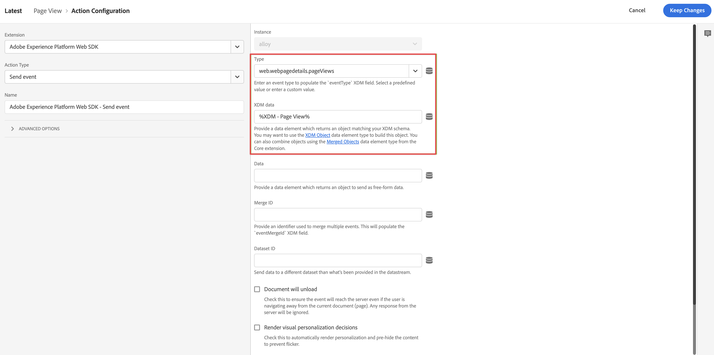

# タグへの XDM データ収集ロジックを追加 {#upgrade-tag-xdm}

<!-- markdownlint-disable MD034 -->

>[!CONTEXTUALHELP]
>id="cja-upgrade-tag-xdm"
>title="タグへの XDM データ収集ロジックを追加"
>abstract="サイトにローダータグがインストールされている状態で、ルールとデータ要素を追加し、XDM オブジェクトにデータを入力してアドビに送信できます。 アドビでは、タグがどのように設定されているかを追跡するために、ソリューションデザインドキュメントを保守することをお勧めします。  この手順には、プロパティの Analytics ロジックをすべて設定する必要があるので、手間がかかります。 正しいタグルールを確立し、テストしてサイトにデプロイするために、1 か月以上を費やしたいと考えています。"

<!-- markdownlint-enable MD034 -->

{{upgrade-note-step}}

[タグを作成し、web SDK 拡張機能を追加](/help/getting-started/cja-upgrade/cja-upgrade-tag-property.md)した後、サイトを追跡して Adobe Experience Platform にデータを送信する方法に応じて、データ要素とルールを使用してタグを設定する必要があります。 タグのデータ要素とルールを設定したら、タグを作成して公開できます。

## データ要素の設定

データ要素は、データ辞書（またはデータマップ）の構築要素です。 データ要素を使用して、マーケティングおよび広告テクノロジー全体でデータを収集、整理、配信します。 タグでデータレイヤーから読み取り、Adobe Experience Platform にデータを配信するために使用できるデータ要素を設定します。 （データ要素について詳しくは、タグドキュメント[データ要素](https://experienceleague.adobe.com/ja/docs/experience-platform/tags/ui/data-elements)を参照してください。）

以下の節では、推奨されるデータ要素と、設定可能なその他の一般的なデータ要素について説明します。

データ要素には様々なタイプがあります。 設定する一般的なデータ要素は、サイトでユーザーが表示しているページ名をキャプチャするものです。

ページ名データ要素を設定したら、キャプチャする特定のデータに対して追加のデータ要素を設定できます。

最後に、目的のデータ要素をすべて定義した後、前に[作成したスキーマ](/help/getting-started/cja-upgrade/cja-upgrade-schema-create.md)にデータ要素を割り当てる必要があります。 これを行うには、XDM スキーマを表す XDM データ要素を定義します。

<!-- Assigning data elements to an XDM object. All of the available XDM objects are based on the schema -->

### 推奨されるデータ要素の作成

次の節では、ほとんどの組織に適用される一般的なデータ要素の作成方法について説明します。

#### ページ名データ要素

ほとんどの組織に適用される共通のデータ要素は、ユーザーが表示しているページ名を取得するデータ要素です。

ページ名データ要素を作成するには：

1. Adobe ID 資格情報を使用して experiencecloud.adobe.com にログインします。

1. Adobe Experience Platform で、**[!UICONTROL データ収集]**／**[!UICONTROL タグ]**&#x200B;に移動します。

1. **[!UICONTROL タグプロパティ]**&#x200B;ページで、プロパティのリストから新しく作成したタグを選択して開きます。

1. 左パネルで「**[!UICONTROL データ要素]**」を選択します。

1. 「**[!UICONTROL データ要素を追加]**」を選択します。

1. **[!UICONTROL データ要素を作成]**&#x200B;ダイアログで、次の情報を指定します。

   * **[!UICONTROL 名前]**：データ要素の名前。 例：`Page Name`。

   * **[!UICONTROL 拡張機能]**：リストから「**[!UICONTROL コア]**」を選択します。

   * **[!UICONTROL データ要素タイプ]**：リストから「**[!UICONTROL ページ情報]**」を選択します。

   * **[!UICONTROL 属性]**：リストから「**[!UICONTROL タイトル]**」を選択します。

     

     または、データレイヤーの変数の値（`pageName` や [!UICONTROL JavaScript 変数] データ要素タイプなど）を使用して、データ要素を定義できました。

     

1. 「**[!UICONTROL 保存]**」を選択します。

1. [追加のデータ要素の作成](#create-additional-data-elements)に進みます。

### 追加のデータ要素の作成

収集するデータのタイプごとにデータ要素を作成します。 [&#x200B; ページ名データ要素](#page-name-data-element)で説明されているのと同じプロセスを使用して、各追加データ要素を作成します。

作成するデータ要素には、スキーマ内に関連するフィールドが必要です。

一般的なデータ要素は、業界やビジネスの要件によって異なります。 業界別に整理された次の一般的なデータ要素を考慮します。

**小売データ要素**

* 製品

* 買い物かごへの追加

* チェックアウト

**金融データ要素**

* トランザクション ID

* トランザクション日

* サービスタイプ

**医療データ要素**

* プロバイダー ID

* 訪問日

* 処理タイプ

組織で必要なすべてのデータ要素を実装に作成したら、[XDM オブジェクトデータ要素](#xdm-object-data-element)に進みます。

### XDM オブジェクトデータ要素

最後に、作成したデータ要素を、前に[作成したスキーマ](/help/getting-started/cja-upgrade/cja-upgrade-schema-create.md)にマッピングします。 これを行うには、XDM スキーマを表す XDM オブジェクトデータ要素を定義します。

XDM オブジェクトデータ要素を定義するには：

1. Adobe ID 資格情報を使用して experiencecloud.adobe.com にログインします。

1. Adobe Experience Platform で、**[!UICONTROL データ収集]**／**[!UICONTROL タグ]**&#x200B;に移動します。

1. [!UICONTROL タグのプロパティ]をクリックして新しく作成したタグを開きます。

1. 左パネルで「**[!UICONTROL データ要素]**」を選択します。

1. 「**[!UICONTROL データ要素を追加]**」を選択します。

1. **[!UICONTROL データ要素を作成]**&#x200B;ダイアログで、次の情報を指定します。

   * **[!UICONTROL 名前]**：データ要素の名前。 例：`XDM - Page View`。

   * **[!UICONTROL 拡張機能]**：リストから「**[!UICONTROL Adobe Experience Platform Web SDK]**」を選択します。

   * **[!UICONTROL データ要素タイプ]**：リストから「**[!UICONTROL XDM オブジェクト]**」を選択します。

   * **[!UICONTROL サンドボックス]**：リストからサンドボックスを選択します。

   * **[!UICONTROL スキーマ]**：リストからスキーマを選択します。

1. スキーマ内で定義した `web > webPageDetails > name` 属性を、ページ名データ要素にマッピングします。

   

1. 「**[!UICONTROL 保存]**」を選択します。

1. [ルールの設定](#configure-rules)に進みます。

## **ルールの設定**

Adobe Experience Platform のタグは、ルールベースのシステムに従います。 ユーザーの操作と関する各種データを参照します。 ルールで設定された条件が満たされると、ルールは、特定した拡張機能、スクリプトまたはクライアント側コードをトリガーします。 ルールを使用し、Adobe Experience Platform Web SDK 拡張機能を使用して、XDM オブジェクトなどのデータを Adobe Experience Platform に送信できます。

ルールを定義するには：

>[!NOTE]
>
>次の手順は、他のデータ要素の値を含む XDM データを Adobe Experience Platform に送信するルールを定義する例です。
>
>タグ内で様々な方法でルールを使用して、（データ要素を使用して）変数を操作できます。
>
>詳しくは、[ルール](https://experienceleague.adobe.com/docs/experience-platform/tags/ui/rules.html?lang=ja)を参照してください。

1. Adobe ID 資格情報を使用して experiencecloud.adobe.com にログインします。

1. Adobe Experience Platform で、**[!UICONTROL データ収集]**／**[!UICONTROL タグ]**&#x200B;に移動します。

1. [!UICONTROL タグのプロパティ]をクリックして新しく作成したタグを開きます。

1. 左パネルで「**[!UICONTROL ルール]**」を選択します。

1. 「**[!UICONTROL ルールを追加]**」を選択します。

1. **[!UICONTROL ルールを作成]**&#x200B;ダイアログで、次の情報を指定します。

   * **[!UICONTROL 名前]**：ルールの名前。 例：`Page View`。

   * **[!UICONTROL イベント]**：「**[!UICONTROL +追加]**」を選択します。 次に、**[!UICONTROL イベント設定]**&#x200B;ダイアログで、次の情報を指定します。 完了したら、「**[!UICONTROL 変更を保持]**」を選択します。

      * **[!UICONTROL 拡張機能]**：リストから「**[!UICONTROL コア]**」を選択します。

      * **[!UICONTROL イベントタイプ]**：リストから「**[!UICONTROL 読み込まれたウィンドウ]**」を選択します。

        

   * **[!UICONTROL アクション]**：「**[!UICONTROL +追加]**」を選択します。 次に、[!UICONTROL アクション設定]ダイアログで、次の情報を指定します。 完了したら、「**[!UICONTROL 変更を保持]**」を選択します。

      * **[!UICONTROL 拡張機能]**：リストから「**[!UICONTROL Adobe Experience Platform Web SDK]**」を選択します。

      * **[!UICONTROL アクションタイプ]**：リストから「**[!UICONTROL イベントを送信]**」を選択します。

      * **[!UICONTROL タイプ]**：リストから「**[!UICONTROL Web Webpagedetails ページビュー]**」を選択します。

      * **[!UICONTROL XDM データ]**：円柱アイコンを選択し、データ要素のリストから「**[!UICONTROL XDM - ページビュー]**」を選択します。

        

        ルールは次のようになります。

        

1. 「**[!UICONTROL 保存]**」を選択します。

1. サイトに追加する各ルールに対して、このプロセスを繰り返します。

   ルールについて詳しくは、タグドキュメントの[ルール](https://experienceleague.adobe.com/ja/docs/experience-platform/tags/ui/rules)を参照してください。

1. [タグの作成と公開](#build-and-publish-your-tag)に進みます。

## タグの作成と公開

データ要素とルールを定義したら、タグを作成して公開する必要があります。 ライブラリビルドを作成する場合は、そのビルドを環境に割り当てる必要があります。 ビルドの拡張機能、ルール、およびデータ要素がコンパイルされ、割り当てられた環境に配置されます。 各環境は、割り当てられたビルドをサイトに統合できる、一意の埋め込みコードを提供します。

Adobe Experience Platform タグは、Adobe Experience Platform Web SDK のデプロイに対応する必要がある、シンプルな公開ワークフローから複雑な公開ワークフローをサポートします。 詳しくは、[公開の概要](https://experienceleague.adobe.com/docs/experience-platform/tags/publish/overview.html?lang=ja)を参照してください。

タグを構築して公開するには、次の手順に従います。

1. Adobe ID 資格情報を使用して experiencecloud.adobe.com にログインします。

1. Adobe Experience Platform で、**[!UICONTROL データ収集]**／**[!UICONTROL タグ]**&#x200B;に移動します。

1. [!UICONTROL タグのプロパティ]をクリックして新しく作成したタグを開きます。

1. 左パネルから「**[!UICONTROL 公開フロー]**」をクリックします。

1. 「**[!UICONTROL ライブラリを追加]**」を選択します。

1. **[!UICONTROL ライブラリを作成]**&#x200B;ダイアログで、次の情報を指定します。

   * **[!UICONTROL 名前]**：ライブラリの名前。

   * **[!UICONTROL 環境]**：リストから「**[!UICONTROL 開発（開発）]**」を選択します。

1. 「**[!UICONTROL + 変更されたリソースをすべて追加]**」を選択します。

   

1. 「**[!UICONTROL 開発用に保存およびビルド]**」を選択します。

   タグが保存され、開発環境用に作成されます。 緑のドットは、開発環境でタグが正常に作成されたことを示します。

1. **[!UICONTROL ...]** を選択してライブラリを再構築するか、ライブラリをステージング環境または本番環境に移動することができます。

   

{{upgrade-final-step}}

