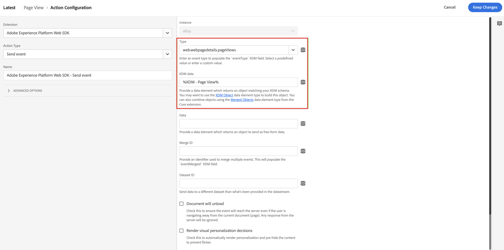

# タグへの XDM データ収集ロジックの追加 {#upgrade-tag-xdm}

<!-- markdownlint-disable MD034 -->

>[!CONTEXTUALHELP]
>id="cja-upgrade-tag-xdm"
>title="タグへの XDM データ収集ロジックの追加"
>abstract="ローダータグがサイトにインストールされている場合は、ルールとデータ要素を追加し、XDM オブジェクトにデータを入力してAdobeに送信できます。 Adobeでは、タグの設定方法をトラッキングするために、ソリューションデザインドキュメントを管理することをお勧めします。   この手順には、プロパティの Analytics ロジックをすべて設定する必要があるので、手間がかかります。 正しいタグルールを確立し、テストしてサイトにデプロイするために、1 か月以上を費やしたいと考えています。"

<!-- markdownlint-enable MD034 -->

>[!NOTE]
> 
>このページの手順は、以前のアップグレード手順をすべて完了した後でのみ実行してください。 [ 推奨されるアップグレード手順 ](/help/getting-started/cja-upgrade/cja-upgrade-recommendations.md#recommended-upgrade-steps-for-most-organizations) に従うか、[Adobe AnalyticsからCustomer Journey Analyticsへのアップグレードに関するアンケート ](https://gigazelle.github.io/cja-ttv/) で組織用に動的に生成されたアップグレード手順に従うことができます。
>
>このページの手順を完了した後、推奨されるアップグレード手順または動的に生成されるアップグレード手順に従って続行します。

[ タグを作成して web SDK拡張機能を追加 ](/help/getting-started/cja-upgrade/cja-upgrade-tag-property.md) した後、サイトをトラッキングしてAdobe Experience Platformにデータを送信する方法に従って、データ要素とルールを使用してタグを設定する必要があります。 タグのデータ要素とルールを設定したら、タグを作成して公開できます。

## データ要素の設定

データ要素は、データディクショナリ（またはデータマップ）の構築ブロックです。データ要素を使用して、マーケティングおよび広告テクノロジー全体でデータを収集、整理、配信します。タグでデータレイヤーから読み取り、Adobe Experience Platformにデータを配信するために使用できるデータ要素を設定します。 （データ要素について詳しくは、タグドキュメントの [ データ要素 ](https://experienceleague.adobe.com/en/docs/experience-platform/tags/ui/data-elements) を参照してください。）

以下の節では、推奨されるデータ要素と、設定可能なその他の一般的なデータ要素について説明します。

データ要素にはさまざまなタイプがあります。 設定する一般的なデータ要素は、サイトで閲覧されているユーザーのページ名を取得する要素と、サイトを訪問する各ユーザーのExperience Cloud ID を取得する要素の 2 つです。

これら 2 つのデータ要素を設定した後、取得する特定のデータに対して追加のデータ要素を設定できます。

最後に、目的のデータ要素をすべて定義した後、前に作成した [ スキーマ ](/help/getting-started/cja-upgrade/cja-upgrade-schema-create.md) にデータ要素を割り当てる必要があります。 これを行うには、XDM スキーマを表す XDM データ要素を定義します。

<!-- Assigning data elements to an XDM object. All of the available XDM objects are based on the schema -->

### 提案されたデータ要素の作成

次の節では、ほとんどの組織に適用される一般的なデータ要素の作成方法について説明します。

#### ページ名データ要素

ほとんどの組織に適用される共通のデータ要素は、ユーザーが表示しているページ名をキャプチャするデータ要素です。

ページ名データ要素を作成するには：

1. Adobe IDの資格情報を使用してexperience.adobe.comにログインします。

1. Adobe Experience Platformで、**[!UICONTROL Data Collection]**/**[!UICONTROL Tags]** に移動します。

1. **[!UICONTROL タグプロパティ]** ページで、プロパティのリストから新しく作成したタグを選択して開きます。

1. 左パネルで「**[!UICONTROL データ要素]**」を選択します。

1. 「**[!UICONTROL データ要素を追加]**」を選択します。

1. **[!UICONTROL データ要素を作成]** ダイアログで、次の情報を指定します。

   * **[!UICONTROL 名前]**：データ要素の名前。 例：`Page Name`。

   * **[!UICONTROL 拡張機能]**：リストから **[!UICONTROL Core]** を選択します。

   * **[!UICONTROL データ要素タイプ]**：リストから **[!UICONTROL ページ情報]** を選択します。

   * **[!UICONTROL 属性]**：リストから **[!UICONTROL タイトル]** を選択します。

     

     または、データレイヤーの変数の値（`pageName` や [!UICONTROL JavaScript 変数] データ要素タイプなど）を使用して、データ要素を定義できました。

     

1. 「**[!UICONTROL 保存]**」を選択します。

   次に、Experience Cloud ID（Adobe Experience Platform Web SDK によって自動的に提供され、Experience Cloud ID サービス拡張機能を通じて使用できる）を参照するデータ要素を設定します。

1. [ECID データ要素 ](#ecid-data-element) を続行します。

#### ECID データ要素

ほとんどの組織に適用される共通のデータ要素は、サイトを訪問する各ユーザーのExperience CloudID を取得するデータ要素です。

ECID データ要素を作成するには：

1. Adobe IDの資格情報を使用してexperience.adobe.comにログインします。

1. Adobe Experience Platformで、**[!UICONTROL Data Collection]**/**[!UICONTROL Tags]** に移動します。

1. [!UICONTROL タグのプロパティ]をクリックして新しく作成したタグを開きます。

1. （条件付き）Experience CloudID サービス拡張機能がまだインストールされていない場合は、インストールします。

   1. 左パネルで「**[!UICONTROL 拡張機能]**」を選択します。

   1. 「**[!UICONTROL インストール済み]**」タブがデフォルトで選択されています。 「**[!UICONTROL Experience CloudID サービス]**」タイルが表示されている場合は、手順 5 に進みます。

   1. **[!UICONTROL Experience CloudID サービス]** タイルが表示されない場合は、「**[!UICONTROL カタログ]**」タブを選択します。

   1. 検索フィールドで、**[!UICONTROL Experience CloudID サービス]** を検索し、表示されたらタイルを選択します

   1. **[!UICONTROL インストール]**/**[!UICONTROL 保存]** を選択します。

1. 左パネルで「**[!UICONTROL データ要素]**」を選択します。

1. 「**[!UICONTROL データ要素を追加]**」を選択します。

1. **[!UICONTROL データ要素を作成]** ダイアログで、次の情報を指定します。

   * **[!UICONTROL 名前]**：データ要素の名前。 例：`ECID`。

   * **[!UICONTROL 拡張機能]**：リストから **[!UICONTROL Experience CloudID サービス]** を選択します。

   * **[!UICONTROL データ要素タイプ]**：リストから **[!UICONTROL ECID]** を選択します。

     

1. 「**[!UICONTROL 保存]**」を選択します。

1. [ 追加のデータ要素の作成 ](#create-additional-data-elements) を参照してください。

### 追加のデータ要素の作成

収集するデータのタイプごとにデータ要素を作成します。 [ ページ名データ要素 ](#page-name-data-element) および [ECID データ要素 ](#ecid-data-element) で説明したのと同じプロセスを使用して、追加の各データ要素を作成します。

作成するデータ要素には、スキーマ内に関連するフィールドが必要です。

一般的なデータ要素は、業界やビジネスの要件によって異なります。 次の一般的なデータ要素を、業界別に整理して考えてみましょう。

**小売データ要素**

* 製品

* 買い物かごへの追加

* チェックアウト

**財務データ要素**

* トランザクション ID

* トランザクション日

* サービスタイプ

**ヘルスケアデータ要素**

* プロバイダー ID

* 訪問日

* 処理タイプ

組織で必要なすべてのデータ要素を実装に作成したら、[XDM オブジェクトデータ要素 ](#xdm-object-data-element) に進みます。

### XDM オブジェクトデータ要素

最後に、作成したデータ要素を、前に作成した [ スキーマ ](/help/getting-started/cja-upgrade/cja-upgrade-schema-create.md) にマッピングします。 これを行うには、XDM スキーマを表現する XDM オブジェクトデータ要素を定義します。

XDM オブジェクトデータ要素を定義するには：

1. Adobe IDの資格情報を使用してexperience.adobe.comにログインします。

1. Adobe Experience Platformで、**[!UICONTROL Data Collection]**/**[!UICONTROL Tags]** に移動します。

1. [!UICONTROL タグのプロパティ]をクリックして新しく作成したタグを開きます。

1. 左パネルで「**[!UICONTROL データ要素]**」を選択します。

1. 「**[!UICONTROL データ要素を追加]**」を選択します。

1. **[!UICONTROL データ要素を作成]** ダイアログで、次の情報を指定します。

   * **[!UICONTROL 名前]**：データ要素の名前。 例：`XDM - Page View`。

   * **[!UICONTROL 拡張機能]**：リストから **[!UICONTROL Adobe Experience Platform Web SDK]** を選択します。

   * **[!UICONTROL データ要素タイプ]**：リストから **[!UICONTROL XDM オブジェクト]** を選択します。

   * **[!UICONTROL サンドボックス]**：リストからお使いのサンドボックスを選択します。

   * **[!UICONTROL スキーマ]**：リストからスキーマを選択します。

1. スキーマ内で定義した `identification > core > ecid` 属性を、ECID データ要素にマッピングします。円柱アイコンを選択すると、データ要素のリストから ECID データ要素を簡単に選択できます。

   

   

1. スキーマ内で定義した `web > webPageDetails > name` 属性を、ページ名データ要素にマッピングします。

   

1. 「**[!UICONTROL 保存]**」を選択します。

1. [ ルールの設定 ](#configure-rules) を続行します。

## **ルールの設定**

Adobe Experience Platform のタグは、ルールベースのシステムに従います。ユーザーの操作と関する各種データを参照します。ルールで設定された条件が満たされると、ルールは、特定した拡張機能、スクリプトまたはクライアント側コードをトリガーします。ルールを使用し、Adobe Experience Platform Web SDK 拡張機能を使用して、XDM オブジェクトなどのデータを Adobe Experience Platform に送信できます。

ルールを定義するには：

>[!NOTE]
>
>次の手順は、他のデータ要素の値を含む XDM データをAdobe Experience Platformに送信するルールを定義する例です。
>
>タグ内で様々な方法でルールを使用して、（データ要素を使用して）変数を操作できます。
>
>詳しくは、[ルール](https://experienceleague.adobe.com/docs/experience-platform/tags/ui/rules.html?lang=ja)を参照してください。

1. Adobe IDの資格情報を使用してexperience.adobe.comにログインします。

1. Adobe Experience Platformで、**[!UICONTROL Data Collection]**/**[!UICONTROL Tags]** に移動します。

1. [!UICONTROL タグのプロパティ]をクリックして新しく作成したタグを開きます。

1. 左パネルで「**[!UICONTROL ルール]**」を選択します。

1. 「**[!UICONTROL ルールを追加]**」を選択します。

1. **[!UICONTROL ルールを作成]** ダイアログで、次の情報を指定します。

   * **[!UICONTROL 名前]**：ルールの名前。 例：`Page View`。

   * **[!UICONTROL イベント]**:「**[!UICONTROL +追加]**」を選択します。 次に、**[!UICONTROL イベント設定]** ダイアログで、次の情報を指定します。 完了したら、「変更を保持 **[!UICONTROL を選択し]** す。

      * **[!UICONTROL 拡張機能]**：リストから **[!UICONTROL Core]** を選択します。

      * **[!UICONTROL イベントタイプ]**：リストから **[!UICONTROL 読み込んだウィンドウ]** を選択します。

        

   * **[!UICONTROL アクション]**:「**[!UICONTROL +追加]**」を選択します。 次に、[!UICONTROL  アクションの設定 ] ダイアログで、次の情報を指定します。 完了したら、「変更を保持 **[!UICONTROL を選択し]** す。

      * **[!UICONTROL 拡張機能]**：リストから **[!UICONTROL Adobe Experience Platform Web SDK]** を選択します。

      * **[!UICONTROL アクションタイプ]**：リストから **[!UICONTROL イベントを送信]** を選択します。

      * **[!UICONTROL タイプ]**：リストから「**[!UICONTROL Web Webpagedetails ページビュー]**」を選択します。

      * **[!UICONTROL XDM データ]**：円柱アイコンを選択し、データ要素のリストから **[!UICONTROL XDM - ページビュー]** を選択します。

        

        ルールは次のようになります。

        

1. 「**[!UICONTROL 保存]**」を選択します。

1. サイトに追加する各ルールに対して、このプロセスを繰り返します。

   ルールについて詳しくは、タグドキュメントの [ ルール ](https://experienceleague.adobe.com/en/docs/experience-platform/tags/ui/rules) を参照してください。

1. [ タグを作成して公開 ](#build-and-publish-your-tag) をクリックして進みます。

## タグを作成して公開する

データ要素とルールを定義したら、タグを作成して公開する必要があります。 ライブラリビルドを作成する場合は、そのビルドを環境に割り当てる必要があります。ビルドの拡張機能、ルール、およびデータ要素がコンパイルされ、割り当てられた環境に配置されます。各環境は、割り当てられたビルドをサイトに統合できる、一意の埋め込みコードを提供します。

Adobe Experience Platform タグは、Adobe Experience Platform web SDKのデプロイメントに対応する必要がある、シンプルな公開ワークフローから複雑な公開ワークフローをサポートします。 詳しくは、[公開の概要](https://experienceleague.adobe.com/docs/experience-platform/tags/publish/overview.html?lang=ja)を参照してください。

タグを構築して公開するには、次の手順に従います。

1. Adobe IDの資格情報を使用してexperience.adobe.comにログインします。

1. Adobe Experience Platformで、**[!UICONTROL Data Collection]**/**[!UICONTROL Tags]** に移動します。

1. [!UICONTROL タグのプロパティ]をクリックして新しく作成したタグを開きます。

1. 左パネルから「**[!UICONTROL 公開フロー]**」をクリックします。

1. **[!UICONTROL ライブラリを追加]** を選択します。

1. **[!UICONTROL ライブラリを作成]** ダイアログで、次の情報を指定します。

   * **[!UICONTROL 名前]**: ライブラリの名前。

   * **[!UICONTROL 環境]**：リストから **[!UICONTROL 開発（開発）]** を選択します。

1. 「**[!UICONTROL + 変更されたリソースをすべて追加]**」を選択します。

   

1. 「**[!UICONTROL 開発用に保存およびビルド]**」を選択します。

   タグが保存され、開発環境用に作成されます。 緑のドットは、開発環境でタグが正常に作成されたことを示します。

1. **[!UICONTROL ...]** を選択してライブラリを再構築するか、ライブラリをステージング環境または実稼動環境に移動することができます。

   
