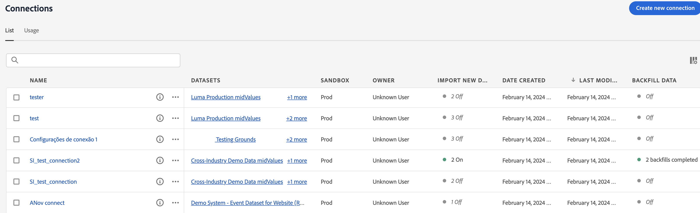

# Customer Journey Analytics へのデータのフローの検証 {#validate-data}

<!-- markdownlint-disable MD034 -->

>[!CONTEXTUALHELP]
>id="cja-upgrade-data-validate"
>title="データのフローの検証"
>abstract="接続の詳細を使用して、データが Customer Journey Analytics に送信されているかどうかを検証します。  すべてが正しく問題なく行われた場合、この手順は 1 日未満で完了します。 データ収集の問題が複数ある場合、トラブルシューティングにかなり長い時間がかかる可能性があります。"

<!-- markdownlint-enable MD034 -->

{{upgrade-note-step}}

接続がアクティブで、Customer Journey Analytics でデータビューへのデータのフローを検証できます。

1. Customer Journey Analytics で、「接続」タブを選択します。

   

1. [設定した接続](/help/getting-started/cja-upgrade/cja-upgrade-connection.md)を選択します。

   

1. 各接続について詳しくは、[接続の管理](/help/connections/manage-connections.md)の[接続の詳細](/help/connections/manage-connections.md#manage-connections)を参照してください。

{{upgrade-final-step}}

<!-- Should we duplicate the content here or single source it with /help/connections/manage-connections.md -->
