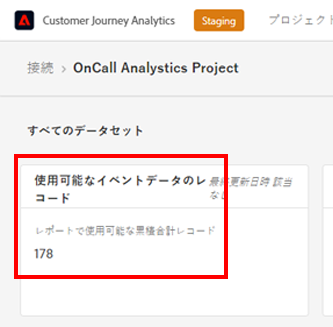

# CJA 使用状況の推定と管理

CJA の使用方法を理解するには、次の 3 つの方法を使用できます。

* 各接続のイベントデータ行を追加します。 ( **接続サイズの予測** 以下 ) 特定のタイムスタンプに関する、接続ごとのイベント行データを簡単に確認できます。
* Analysis Workspaceを使用して先月のイベントを報告します。 ( **すべてのイベントデータを使用して Workspace プロジェクトを作成する** 下 ) これにより、使用状況データの詳細な分析と使用履歴をおこなうことができます。
* CJA API を使用して、自動レポートを作成します。 ( **CJA API でのレポートの作成** 下 )

CJA の使用を管理するには：

* 周期データウィンドウを定義します。 ( **周期データウィンドウの定義** 下 )

## 接続サイズの予測 {#estimate-size}

現在、にあるイベントデータの行数を知る必要が生じる場合があります。 [!UICONTROL Customer Journey Analytics]. 組織のイベントデータレコード（データ行）の使用状況を正確に把握するには、**組織が作成した各接続に対して**、次の手順を実行します。

>[!NOTE]
>
>これは、Adobeがその日に最新の使用状況レポートを実行するので、毎月最初の金曜日に実行します。

1. [!UICONTROL Customer Journey Analytics] で、「**[!UICONTROL 接続]**」タブをクリックします。

   これで、現在のすべての接続のリストが表示されます。

1. 各接続名をクリックして、接続マネージャーに移動します。

1. 追加する **[!UICONTROL 使用可能なイベントデータのレコード]** 組織が作成したすべての接続に対して （接続のサイズによっては、数字の表示に時間がかかる場合があります）。

   

   >[!CAUTION]
   >
   >   このカウントは、プロファイルや参照データではなく、イベントデータのみに適用されます。 プロファイルと参照データがある場合、カウントは若干高くなります。 ただし、現在のところ、ユーザーインターフェイスでプロファイルと参照のデータの使用状況をレポートする方法はありません。 この機能は 2023 年に予定されています。

1. すべてのイベントデータ行の合計が表示されたら、自社とアドビで合意した Customer Journey Analytics 契約の「データ行」使用権を確認してください。

   これにより、受注で許可されているデータ行の最大数がわかります。手順 3 で取得したデータ行数がこの許可されている行数より多い場合は、データ使用量の超過が発生しています。

1. この状況を修正するには、次のようなオプションがあります。

   * [データ保持設定](https://experienceleague.adobe.com/docs/analytics-platform/using/cja-connections/manage-connections.html?lang=ja#set-rolling-window-for-connection-data-retention)を変更する。
   * [未使用の接続を削除する](https://experienceleague.adobe.com/docs/analytics-platform/using/cja-overview/cja-faq.html?lang=ja#implications-of-deleting-data-components)。
   * [AEP のデータセットを削除する](https://experienceleague.adobe.com/docs/analytics-platform/using/cja-overview/cja-faq.html?lang=ja#implications-of-deleting-data-components)。
   * 追加容量のライセンスを取得する（アドビのアカウントマネージャーにお問い合わせください）。

## すべてのイベントデータを使用して Workspace プロジェクトを作成する {#workspace-event-data}

1. Workspace でプロジェクトを作成する前に、 [データビューの作成](/help/data-views/create-dataview.md) 各接続に対して（フィルターを適用しない）、

1. Workspace で、各データビューに基づいて新しいプロジェクトを作成し、( **[!UICONTROL 指標]** ドロップダウン ) を開き、現在の CJA 契約の最初の日から始まる、月の最初の金曜日にリダイレクトすることができます。

   

   これにより、月々の使用状況のトレンドを把握できます。

1. 必要に応じて、データセット別などにドリルダウンできます。

## CJA API での自動レポートの作成 {#api-report}

1. 以下を使用： [CJA レポート API](https://developer.adobe.com/cja-apis/docs/api/#tag/Reporting-API) をクリックして、すべてのイベントデータに関するレポートを実行します。 **すべての接続**. レポートが実行されるように設定します

   * 毎月第三金曜日に
   * 現在の CJA 契約の最初の日に戻ります。

   これにより、月々の使用状況のトレンドを把握できます。 すべての CJA 接続の合計行数が表示されます。

1. Excel を使用して、このレポートをさらにカスタマイズします。

## 周期データウィンドウの定義 {#rolling}

使用状況を管理するには、 [接続 UI](/help/connections/create-connection.md) を使用すると、CJA データ保持を接続レベルで、月（1 か月、3 か月、6 か月など）単位の周期的な期間として定義できます。

主な利点は、該当する有用なデータのみを保存またはレポートして、有用でなくなった古いデータを削除できるという点です。契約上の上限を超えないようにし、超過コストのリスクを軽減します。

デフォルト（オフ）のままにすると、Adobe Experience Platform のデータ保持設定によって保持期間が置き換えられます。Experience Platform に 25 か月分のデータがある場合、CJA はバックフィルを通じて 25 か月分のデータを取得します。Platform でこのうち 10 か月を削除すると、CJA は残りの 15 か月を保持します。

データ保持は、イベントデータセットのタイムスタンプに基づいており、イベントデータセットにのみ適用されます。適用可能なタイムスタンプがないので、プロファイルまたはルックアップデータセットには、周期的なデータ時間枠設定は存在しません。ただし、接続に（1 つ以上のイベントデータセットに加えて）プロファイルまたはルックアップデータセットが含まれる場合、そのデータは、同じ期間だけ保持されます。

