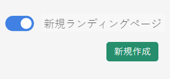
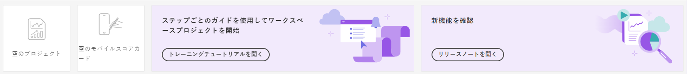

# Customer Journey Analyticsランディングページ

Customer Journey Analytics用のランディングページには、プロジェクトマネージャーのホームページと、より効果的に使い始めるのに役立つ学習セクションが用意されています。

>[!VIDEO](https://video.tv.adobe.com/v/334278/?quality=12)

## ランディングページへのアクセス {#access-landing}

Adobe Experience CloudとCustomer Journey Analyticsにログインした後、 [!UICONTROL 新しいランディングページ — ベータ版] 左下隅の切り替えボタン 切り替えボタンへのアクセスは、会社固有ではなく、組織ごとのユーザー固有です。

次のことが可能です。

* を展開します。 [!UICONTROL プロジェクト] テーブルをフルスクリーンに変換します。 テーブルを展開するには、ハンバーガーのメニューアイコンをクリックします。 この操作を実行すると、左側のパネルのタブが折りたたまれます。
* 列区切り記号をドラッグして、列の幅をカスタマイズします。
* ピンされた項目を並べ替えます。 ピンされた項目を上下に移動するには、ピンされた項目の横の省略記号をクリックし、「 **[!UICONTROL 上に移動]** または **[!UICONTROL 下に移動]**.

## 「[!UICONTROL プロジェクト]」タブに移動する {#navigate-projects}

[!UICONTROL プロジェクト]は [!UICONTROL ワークスペース]ホーム ページとして機能します。モバイルスコアカードを含む、ワークスペースプロジェクトがここに表示されます。**[!UICONTROL プロジェクト]**&#x200B;とは、自分が構築したもの、または他のユーザーが構築し共有したものです。[!UICONTROL プロジェクト]は、空のプロジェクトと空のモバイルスコアカードも指します。

>[!NOTE]
>
>次の設定の一部は、セッション全体およびセッション間で保持（記憶）されます。例：開いていたタブ、選択したフィルター、選択した列、列の並べ替え方向。ただし、検索結果は保持されません。

| UI 要素 | 定義 |
| --- | --- |
| ... さらに詳しく | [!UICONTROL チュートリアルを表示]し、[ユーザーの環境設定を編集](/help/analysis-workspace/user-preferences.md)できます。 |
| **[!UICONTROL 新規作成]** モーダルが戻りました | クリック時 **[!UICONTROL 新規作成]** Workspace で、 [!UICONTROL 空のプロジェクト] および [!UICONTROL 空のモバイルスコアカード]. 会社が作成した任意のテンプレートから選択することもできます。 |
| [!UICONTROL 表示回数を減らす／増やす] | バナーの表示と非表示を切り替えます。  |
| [!UICONTROL 空のプロジェクト] | 入力する空の [ワークスペースプロジェクト](https://experienceleague.adobe.com/docs/analytics/analyze/analysis-workspace/home.html?lang=ja)を作成します。 |
| [!UICONTROL 空のモバイルスコアカード] | 入力する空の[モバイルスコアカード](https://experienceleague.adobe.com/docs/analytics/analyze/mobapp/curator.html?lang=ja)を作成します。 |
| [!UICONTROL トレーニングチュートリアルを開く] | 新規ユーザーがプロジェクトを構築できるよう順を追ってガイドする、ワークスペーストレーニングチュートリアルを開きます。 |
| [!UICONTROL リリースノートを開く] | 最新のAdobe Experience Cloudリリースノートを開きます。 |
| フィルターアイコン | タグ、レポートスイート、所有者、タイプおよびその他のフィルター（自分が所有、自分と共有、お気に入りおよび承認済み）を使用してフィルタリングできます |
| 検索バー | これで、検索にテーブル内のすべての列が含まれます。 |
| 選択ボックス | 1 つ以上のプロジェクトの横にあるこのボックスをクリックすると、実行できるプロジェクト管理アクション（削除、タグ付け、ピン止め、承認、共有、名前変更、コピー、CSV に書き出し）が表示されます。これらのアクションを実行する権限がない可能性があります。 |
| [!UICONTROL お気に入り] | プロジェクトをお気に入りに追加すると、そのプロジェクトに星が付き、フィルタリングできるお気に入りとしてタグ付けされます。 |
| [!UICONTROL 名前] | プロジェクトの名前。 |
| 情報 (i) アイコン | 情報アイコンをクリックすると、このプロジェクトに関する情報（タイプ、プロジェクトの役割、所有者、説明、および共有相手）が表示されます。また、このプロジェクトを[編集または複製](/help/analysis-workspace/curate-share/share-projects.md)できるユーザーも示します。 |
| 省略記号（...） | プロジェクトの横にある省略記号をクリックすると、実行できるプロジェクト管理アクション（削除、タグ付け、ピン止め、承認、共有、名前変更、コピー、CSV に書き出し）が表示されます。これらのアクションを実行する権限がない可能性があります。 |
| [!UICONTROL タイプ] | ワークスペースプロジェクトかモバイルスコアカードのどちらであるかを示します。 |
| [!UICONTROL タグ] | レポートにタグを付けて、グループに整理できます。 |
| [!UICONTROL プロジェクトの役割] | プロジェクトの役割とは、自分がプロジェクトの所有者であるかどうか、およびプロジェクトの編集または複製の権限を持っているかどうかを指します。 |
| [!UICONTROL データビュー] | パネル内のテーブルとビジュアライゼーションは、パネルの右上で選択されたデータビューからデータを取得します。 また、データビューによって、左側のパネルで使用できるコンポーネントも決まります。 プロジェクト内では、分析の使用例に応じて、1 つまたは複数のデータビューを使用できます。 データビューのリストは関連度に基づいて並べ替えられます。 Adobeは、現在のユーザーがデータビューをどの程度最近、頻繁に使用したか、および組織内でデータビューがどのくらいの頻度で使用されているかに基づいて関連度を定義します。 |
| [!UICONTROL 所有者] | プロジェクトを作成したユーザー。 |
| [!UICONTROL 共有先] | このプロジェクトの共有先。 |
| [!UICONTROL 最終変更日] | このプロジェクトが最後に変更された日時。 |
| [!UICONTROL 前回開いた日時] | このプロジェクトが最後に開かれた日時。 |
| [!UICONTROL スケジュール済み] | に設定 [!UICONTROL オン] プロジェクトがスケジュールされたとき、または **[!UICONTROL オフ]** そうでない場合は クリック **[!UICONTROL オン]** 「 」リンクを使用すると、スケジュール済みプロジェクトに関する情報を表示できます。 また、 [プロジェクトスケジュールを編集](/help/analysis-workspace/curate-share/t-schedule-report.md) （プロジェクトの所有者である場合） |
| [!UICONTROL プロジェクト ID] | プロジェクト ID は、プロジェクトのデバッグに使用できます。 |
| [!UICONTROL 最長の日付範囲] | 日付範囲を長くすると、プロジェクトの複雑さが増し、処理と読み込み時間が長くなる場合があります。 |
| [!UICONTROL クエリ数] | プロジェクトクエリの数が多いと、プロジェクトが複雑になり、処理と読み込みに時間がかかる場合があります。 |
| テーブルのカスタマイズアイコン | （右上）プロジェクトのリストに列を追加または削除する場合は、列を選択または選択解除して追加できます。 |
| &lt;（戻るボタン） | Workspace プロジェクトのこのボタンを使用すると、最新のランディングページ設定に戻ります。 ランディングページを離れた時点でのページ設定は、戻った際にも保持されます。 |

## 「学習」タブへの移動 {#navigate-learning}

学習ページには、実践ビデオツアーとチュートリアルのほか、ドキュメントへのリンクが含まれています。

* [!UICONTROL ワークスペースの基本]ツアーでは、ワークスペースに直接アクセスし、ワークスペースのレイアウトと、最も一般的なアクションをどこで見つけて実行できるかについて説明します。このツアーは、パネルヘッダーからツールチップポップオーバーを使用して、ワークスペースでいつでも直接再起動できます。
* ビデオ／ツアーをクリックすると、「**[!UICONTROL 閲覧済み]**」タグが追加されます。このタグは、学習コンテンツの進捗状況を追跡するのに役立ちます。コンテンツをまだ完了していない場合は、タグをクリックするとタグが消えます。
* ビデオモーダルの「**[!UICONTROL 詳細情報]**」ボタンをクリックすると、先ほど視聴したビデオに関連する詳細なヘルプコンテンツが記載された Adobe Experience League ドキュメントページが表示されます。「**[!UICONTROL その他のビデオを視聴する]**」をクリックすると、Analysis Workspace YouTube の完全なプレイリスト全体が表示されます。

## ランディングページに関する FAQ {#landing-faq}

| 質問 | 回答 |
| --- | --- |
| ピン留めできるプロジェクトに最大数はありますか？ | いいえ、固定できるプロジェクトの数に制限はありません。 |
| 管理者がこのランディングページをユーザーに指定できますか？ | いいえ。管理者は、ユーザーの代わりにランディングページを指定することはできません。 個々のユーザーは、自分で切り替えをオンにする必要があります。 |