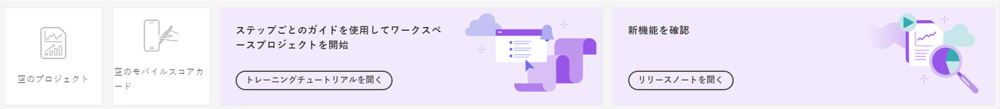

# Customer Journey Analytics のランディングページ

Customer Journey Analyticsのランディングページには次のサブタブがあります。

**[!UICONTROL プロジェクト]**：自分で作成したり、他のユーザーが作成して共有したりしたデータコンポーネント、テーブルおよびビジュアライゼーションを組み合わせてカスタマイズされたデザイン。 [!UICONTROL プロジェクト]は、空のプロジェクトと空のモバイルスコアカードも指します。

**[!UICONTROL テンプレート]**:Adobeから提供されたテンプレートと、組織に固有の任意のテンプレートを含みます。

**[!UICONTROL ラーニング]**：実践ビデオツアー、チュートリアル、ドキュメントへのリンクが含まれています。 また、Adobe AnalyticsからCustomer Journey Analyticsへのアップグレードに関する情報と、組織に固有のアップグレード手順を動的に生成するツールについても説明します。

>[!BEGINSHADEBOX]

デモビデオについて詳しくは、 [Analysis Workspace のランディングページ](https://experienceleague.adobe.com/en/docs/customer-journey-analytics-learn/tutorials/cja-basics/customer-journey-analytics-landing-page){target="_blank"}を参照してください。

{{videoaa}}

>[!ENDSHADEBOX]

## プロジェクト

左側のレールの **[!UICONTROL プロジェクト]** セクションは、「[!UICONTROL **Workspace**]」タブのホームページとして機能します。

Customer Journey Analyticsでプロジェクトにアクセスするには：

1. 「[!UICONTROL **ワークスペース**]」タブを選択します。

1. 左パネルで「[!UICONTROL **プロジェクト**]」を選択します。

「プロジェクト」セクションには、会社フォルダー、作成した個人用フォルダー、Workspace プロジェクト、モバイルスコアカードが表示されます。 このページを使用して、フォルダー、プロジェクトおよびモバイルスコアカードを表示、作成および変更します。詳しくは、[プロジェクト](/help/analysis-workspace/build-workspace-project/freeform-overview.md)を参照してください。

**[!UICONTROL プロジェクト]**&#x200B;は、自分で作成したり、他のユーザーが作成して共有したりしたデータコンポーネント、テーブルおよびビジュアライゼーションを組み合わせてカスタマイズされたデザインです。[!UICONTROL プロジェクト]は、空のプロジェクトと空のモバイルスコアカードも指します。

>[!NOTE]
>
>次の設定の一部は、セッション間で保持されます。 例えば、選択したタブ、選択したセグメント、選択した列、列の並べ替え方向などがあります。検索結果が保持されません。

詳しくは、[プロジェクト](/help/analysis-workspace/build-workspace-project/freeform-overview.md)を参照してください。

## テンプレート

Customer Journey Analyticsのテンプレートにアクセスする手順は次のとおりです。

1. 「[!UICONTROL **ワークスペース**]」タブを選択します。

1. 左側のパネルの [!UICONTROL **テンプレート**] セクションでは、Adobe テンプレートまたは会社テンプレートを選択できます。

テンプレートの使用について詳しくは、次のリソースを参照してください。

* [テンプレートの使用](/help/analysis-workspace/templates/use-templates.md)

* [テンプレートの作成と管理](/help/analysis-workspace/templates/create-templates.md)

<!--

### Customize table columns

To customize column widths, drag the vertical bar that separates each column. 

To add or remove columns from the list of projects, click the column icon ( ) in the top-right, then select or deselect column titles. 

The available columns are:

| Column name | Description |
|---------|----------|
| [!UICONTROL **Name**] | Identifies the name of the project. |
| [!UICONTROL **Type**] | Indicates whether this type is a Workspace project, a Mobile scorecard, or a folder. |
| [!UICONTROL **Tags**] | Tags projects to organize them into groups. |
| [!UICONTROL **Scheduled**] | Set to [!UICONTROL On] when a project is scheduled or [!UICONTROL Off] when it is not. Clicking the [!UICONTROL On] link lets you see information about the scheduled project. You can also [edit the project schedule](/help/analysis-workspace/export/t-schedule-report.md) if you are the project owner. |
| [!UICONTROL **Project role**] | Identifies the project roles: whether you are the project Owner and whether you have permissions to Edit or Duplicate the project. |
| [!UICONTROL **Report suite**] | Identifies the Report Suites that are associated with the project. Tables and visualizations within a panel derive data from the report suite selected in the top right of the panel. The report suite also determines what components are available in the left rail. Within a project, you can use one or many report suites depending on your analysis use cases. The list of report suites is sorted on relevance. Adobe defines relevance based on how recently and frequently the suite has been used by the current user, and how frequently the suite is used within the organization. |
| [!UICONTROL **Owner**] | Identifies the person who created the project. |
| [!UICONTROL **Shared With**] | Shows who the project is currently shared with. |
| [!UICONTROL **Last Modified**] | The date and time when the project was last modified. |
| [!UICONTROL **Last Opened**] | Identifies the date that a project was last opened by the user who is currently viewing the Projects page. |
| [!UICONTROL **Last Used**] | Helps determine whether a project is valuable to users in your organization by showing the date and time when the project was last opened by any user within the organization.
Consider the following when viewing this column:
<ul><li>Usage information is available starting in September 2023.</li><li>This column is available only to system administrators.</li></ul> |
| [!UICONTROL **Project ID**] | Can be used for debugging projects. |
| [!UICONTROL **Longest Date Range**] | Longer date ranges increase project complexity and may increase processing and load times. |
| [!UICONTROL **Number of queries**] | The total number of requests made to Analytics when the project loads. A higher number of project queries increases project complexity and may increase processing and load times. This data is available only after a project has loaded or a scheduled project was sent. |
| [!UICONTROL **Location**] | Shows the folder where the project is located. |

### Other UI elements on the Projects page

| UI element | Definition |
| --- | --- |
| Edit preferences | Lets you [!UICONTROL View Tutorials], and [Edit user preferences](/help/analysis-workspace/user-preferences.md). |
| [!UICONTROL Create new] | Opens the project modal where you can create a Workspace project or a Mobile scorecard or open a company template.  |
| [!UICONTROL Show less  Show more] | Toggles between not showing and showing the banner:  |
| [!UICONTROL Workspace project] | Creates a blank [Workspace project](/help/analysis-workspace/home.md) for you to  design and build. |
| [!UICONTROL Mobile scorecard] | Creates a blank [mobile scorecard](https://experienceleague.adobe.com/docs/analytics/analyze/mobapp/curator.html) for you to design and build. |
| [!UICONTROL Open Training Tutorial] | Opens the Workspace training tutorial that guides you through the process of building a new starter project in a step-by-step tutorial.|
| [!UICONTROL Open release notes] | Opens the Adobe Analytics section of the latest Adobe Experience Cloud release notes. |
| Filter icon | Filters by tags, report suites, owners, types, and other filters (Mine, Shared with me, Favorites, and Approved)  |
| Search bar | Searches all columns in the table. |
| Selection box | Selects one or more projects to display the project management actions you can perform: **Delete**, **Share**, **Rename**, **Copy**, **Unpin**, **Move Up**, **Move Down**, **Tag**, **Approve**, **Export CSV**, and **Move to**. You may not have permissions to perform all listed actions. |
| [!UICONTROL Favorites] | Adds a star next to a favorite project or folder that can be used as a filter. |
| [!UICONTROL Name] | Identifies the name of the project. |
| Pin icon | Pins items so they always appear at the top of your list but you can re-adjust the order by moving them up or down in the order. Use the ellipsis option menu and select **Move Up** or **Move down** in the list. |
| Info (i) icon | Displays the following information about a project: Type, Project Role, Owner, Description, and who it is shared with. It also indicates who can [edit or duplicate](/help/analysis-workspace/curate-share/share-projects.md) this project. |
| Ellipsis (...) | Displays the project management actions you can perform: **Delete**, **Share**, **Rename**, **Copy**, **Unpin**, **Move Up**, **Move Down**, **Tag**, **Approve**, **Export CSV**, and **Move to**. You may not have permissions to perform all listed actions. |
| SHOW: Folders & Projects or All Projects | Changes the view setting on the table to show folders and projects according to your folder organization **or** show all of your projects in an unorganized list. |
| < (Back button) | Returns you to your most recent landing page configuration in a Workspace project or a report. The page configuration you had when you left the landing page will persist when you return. |

-->

## 学習

**[!UICONTROL 2}Workspace]** タブの「ラーニング [!UICONTROL **」セクションには、Customer Journey Analyticsの初級、中級、高度な機能とユースケースに関する情報が表示されます。**]&#x200B;また、Adobe AnalyticsからCustomer Journey Analyticsへのアップグレード方法についても説明します。

### 学習パス

Customer Journey Analyticsでラーニングパスに関する情報にアクセスするには：

1. 「[!UICONTROL **ワークスペース**]」タブを選択します。

1. 左パネルの「[!UICONTROL **学習**]」セクションで、「[!UICONTROL **学習パス**]」を選択します。

   このページには、実践ビデオツアー、チュートリアル、ドキュメントへのリンクが含まれています。

[!UICONTROL **学習パス**] ページには次の機能があります。

* **コンテンツをフィルタリング：**を使用して、**[!UICONTROL タイプ]**（**[!UICONTROL ドキュメント]**、**[!UICONTROL ビデオ]**、**[!UICONTROL ツアーとチュートリアル]**）および&#x200B;**[!UICONTROL エクスペリエンスレベル]**（**[!UICONTROL 初級]**、**[!UICONTROL 中級]**、または&#x200B;**[!UICONTROL 上級]**）で学習コンテンツをフィルタリングします。
* **進行状況を追跡：**&#x200B;コンテンツを選択すると、「 **[!UICONTROL 表示済み]**」タグが表示されます。このタグは、学習コンテンツの進捗状況を追跡するのに役立ちます。「 **[!UICONTROL 表示済み]**」タグを選択して、コンテンツの一部から削除できます。
* **追加コンテンツを表示：**&#x200B;ビデオの表示中に「**[!UICONTROL 詳細情報]**」を選択すると、Experience League の関連ドキュメントコンテンツが表示されます。または、学習ページから次のオプションのいずれかを選択して追加コンテンツを表示します。
   * **[!UICONTROL YouTube を訪問]：** Analysis Workspace の完全な YouTube プレイリストを表示します。
   * [!UICONTROL **Experience League を訪問**]：Experience League で Customer Journey Analytics ドキュメントの完全なスイートを表示します。
* **新規ユーザー向けの基礎：**&#x200B;新規ユーザーには、[!UICONTROL Workspace の基礎を学ぶ]ツアーをお勧めします。このツアーでは、Workspace に直接移動し、最も一般的なアクションを順を追って説明します。このツアーは、[フリーフォームパネル](/help/analysis-workspace/c-panels/freeform-panel.md)または[空白のパネル](/help/analysis-workspace/c-panels/blank-panel.md)ヘッダーのツールチップを使用して、Workspace でいつでも再度開始することもできます。

### Customer Journey Analytics にアップグレード

Customer Journey Analyticsへのアップグレードに関する情報にアクセスするには：

1. 「[!UICONTROL **ワークスペース**]」タブを選択します。

1. 左パネルの「[!UICONTROL **ラーニング**]」セクションで、「[!UICONTROL **Customer Journey Analyticsにアップグレード**]」を選択します。

このページは、Adobe AnalyticsからCustomer Journey Analyticsに完全にアップグレードされていないお客様を対象としています。 アンケートを提供し、組織固有の状況に合わせてアップグレード手順を動的に生成します。

詳しくは、[Adobe AnalyticsからCustomer Journey Analyticsへのアップグレード ](/help/getting-started/cja-upgrade/cja-upgrade-recommendations.md#dynamically-generate-upgrade-steps-for-your-organization) の「組織のアップグレード手順を動的に生成する [ を参照してください ](/help/getting-started/cja-upgrade/cja-upgrade-recommendations.md)。

## 好みのランディングページ

好みのランディングページを設定できます。詳しくは、[ユーザー環境設定](/help/analysis-workspace/user-preferences.md#general-preferences)を参照してください。

<!--
## Landing page FAQ {#landing-faq}

| Question | Answer |
| --- | --- |
| Does the work I do in the beta program UI carry over to the production [!UICONTROL Workspace] experience? | Yes, any work done in the beta carries over to the old/current [!UICONTROL Workspace] experience. |
| Is there a maximum number of projects I can pin? | No, there is no limit on the number of projects you can pin. |
| Can admins designate this landing page for their users? | No, admins cannot designate the landing page on behalf of users. Individual users must turn on the toggle themselves. |
| Are all reports that currently exist in [!DNL Reports & Analytics] still available? | No, the following reports were phased out, based on overall usage data: <ul><li>Any custom eVars/props/events/classifications<li>My Recommended Reports</li><li>Hourly/Daily/Weekly/Monthly/Quarterly/Yearly unique visitors</li><li>DailyWeekly/Monthly/Quarterly/Yearly unique customers</li><li>Action name depth</li><li>Action name summary</li><li>Add dashboard</li><li>Age</li><li>Audio support</li><li>Billing information</li><li>Clicks to page</li><li>Color depth</li><li>Cookie support</li><li>Cookies</li><li>Connection types</li><li>Creative elements</li><li>Credit card type</li><li>Cross sell</li><li>Custom event funnels</li><li>Custom links</li><li>Customer ID</li><li>Day of week</li><li>Entry action name</li><li>Exit action name</li><li>Exit links</li><li>Fallout</li><li>File downloads</li><li>Find in store</li><li>Full paths</li><li>Gender</li><li>Hit ype VISTA rule</li><li>Image support</li><li>Java</li><li>JavaScript</li><li>JavaScript version</li><li>Manage bookmarks</li><li>Manage dashboards</li><li>Monitor color depth</li><li>Monitor resolutions</li><li>Newsletter signups</li><li>Next action name</li><li>Next action name flow</li><li>Null searches</li><li>Operating system</li><li>Order review</li><li>Page of day</li><li>Pages not found</li><li>Pathfinder</li><li>Path length</li><li>Previous action name</li><li>Previous action name flow</li><li>Product activity</li><li>Product cost</li><li>Product department</li><li>Product inventory category</li><li>Product name</li><li>Product reviews</li><li>Product season</li><li>Product shares</li><li>Product zooms</li><li>Reload</li><li>Searches</li><li>Servers</li><li>Single page visits</li><li>Shipping information</li><li>Site hierarchy</li><li>Social mentions</li><li>Time of day</li><li>Time spent on action name</li><li>Video support</li><li>Visitor state</li></ul> |
-->
