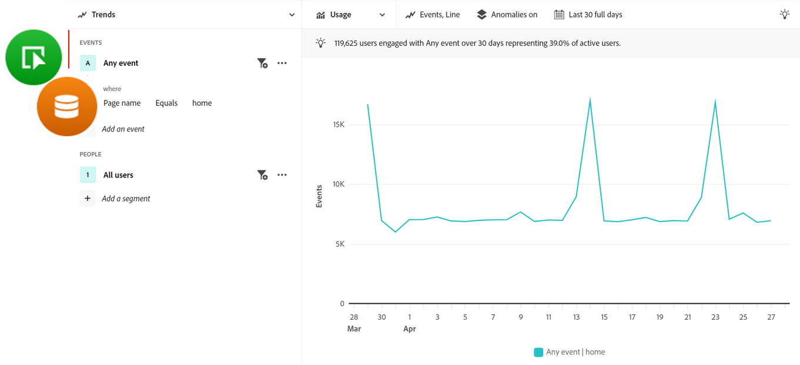

# ガイド付き分析に関する FAQ

ガイド付き分析に関するよくある質問 (FAQ) です。

+++**自分の組織をガイド付き分析用にプロビジョニングするにはどうすればよいですか？**

ガイド付き分析は、Adobe Product Analyticsの一部であり、Customer Journey Analyticsへの有料アドオンです。 このアドオンの使用を開始する場合は、Adobeアカウントチームにお問い合わせください。

+++

+++**ガイド付き分析を使用するには、どのような実装の変更が必要ですか？**

今日既にCustomer Journey Analyticsを使用している場合は、追加の実装変更は必要ありません。 ガイド付き分析でも同じ機能が使用されます [データビュー](../data-views/data-views.md) および [接続](../connections/overview.md) などの他の CJA インターフェイス [Analysis Workspace](../analysis-workspace/home.md).

ガイド付き分析でエンドユーザーを最も成功に導くには、Adobe Experience Platformに強力なイベントスキーマと管理戦略を導入し、 [データビュー](../data-views/data-views.md).

+++

+++**ガイド付き分析やAnalysis Workspaceを使用する必要があるのはいつですか？**

**ガイド付き分析** は、高品質のインサイトを迅速に得るのに役立ちます。 これは、製品チーム、より自信を持ってデータを扱いたいユーザー、さらにはアナリストが深い分析に着手する際に役立ちます。

**[Analysis Workspace](../analysis-workspace/home.md)** は、より自由なスペースで、データを詳細に分析して、より多くのインサイトを引き出すことができます。 データをよく理解し、深く掘り下げたいアナリストやパワーユーザーに役立ちます。

+++

+++**ガイド付き分析とAnalysis Workspaceの用語の比較方法**

ガイド付き分析では、製品チーム間でより頻繁に使用される用語を使用します。 ガイド付き分析を切り替える際に、このテーブルを参照できます。 [Analysis Workspace](../analysis-workspace/home.md).

| ガイド付き分析の用語 | Analysis Workspace用語 |
| --- | --- |
| イベント | 指標 |
| ユーザー | ユーザー |
| プロパティ | ディメンション |
| 値 | Dimension項目 |
| セグメント | フィルター |

{style="table-layout:auto"}

+++

+++**ガイド付き分析とAnalysis Workspaceアプローチのレポートの違いは何ですか。**

While [Analysis Workspace](../analysis-workspace/home.md) とガイド付き分析では、同じ基になるデータを使用します。この方法では、各ツールがそのデータのクエリを作成する方法が異なります。

* **Analysis Workspaceは、ディメンションを中心としたエクスペリエンスです。** テーブルは通常、ディメンションの行で構成され、列は通常、指標です。 行と列の両方にフィルターを適用して、目的のデータを取得できます。

* **ガイド付き分析は、イベントやユーザー中心のエクスペリエンスです。** 各分析は、まずイベントを選択することで開始し、ディメンションとフィルターを追加して、そのイベントデータを絞り込むことができます。

{style="border:1px solid gray"}

次の例では、Web サイトのホームページに関するデータに焦点を当てています。 チームが類似した質問をしますが、分析のアプローチは異なる場合があります。

* ディメンションを中心にしたAnalysis Workspaceの一般的なアプローチは、「ホームページを見て、受け取ったページビュー数を確認しましょう」です。

  {style="border:1px solid gray"}

* イベントを中心にした一般的な分析アプローチは、「ホームページを訪問したユーザーの数」です。

  {style="border:1px solid gray"}

+++
