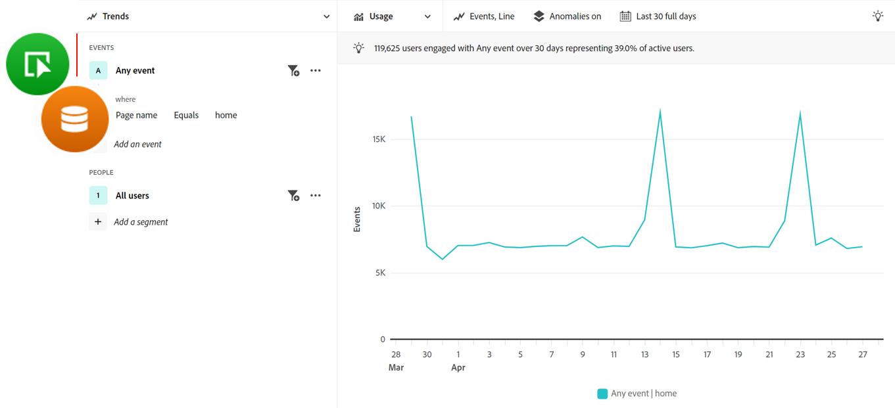

# ガイド付き分析に関するよくある質問

ガイド付き分析に関するよくある質問。

+++**組織はガイド付き分析にアクセスできますか？**

ガイド付き分析ビューは、すべての Customer Journey Analytics パッケージに含まれています。 CJA パッケージのロックが解除されるビューについて詳しくは、概要ページの[プロビジョニング](overview.md#provisioning)の節を参照してください。

+++

+++**ガイド付き分析を使用する上で必要な実装変更**

現在既に Customer Journey Analytics を使用している場合、追加の実装変更は必要ありません。 ガイド付き分析では、[Analysis Workspace](../analysis-workspace/home.md) などの他の CJA インターフェイスと同じ[データビュー](../data-views/data-views.md)と[接続](../connections/overview.md)を使用します。

ガイド付き分析でエンドユーザーの成功を最大限に導くには、Adobe Experience Platform と[データビュー](../data-views/data-views.md)で強力なイベントスキーマと管理戦略を導入することをお勧めします。

+++

+++**ガイド付き分析や Analysis Workspace を使用すべきタイミング**

**ガイド付き分析**&#x200B;により、ユーザーは質の高い分析情報を迅速に入手できます。 これは、製品チーム、より自信を持ってデータを扱いたいユーザー、さらにはアナリストが深い分析に着手する際に有益です。

**[Analysis Workspace](../analysis-workspace/home.md)** は、より自由なスペースで、データを詳細に分析して、より多くのインサイトを引き出すことができます。 データをよく理解し、深く掘り下げたいアナリストやパワーユーザーに役立ちます。

+++

+++**ガイド付き分析と Analysis Workspace の用語の比較方法**

ガイド付き分析と [Analysis Workspace](../analysis-workspace/home.md) は、いくつかの小さな違いはありますが、ほとんどの主要な用語が合致しています。

| ガイド付き分析の用語 | Analysis Workspace の用語 |
| --- | --- |
| イベント（バイナリ 1/0 指標） | 指標 |
| ユーザー | People |
| ディメンション | ディメンション |
| ディメンション項目 | ディメンション項目 |
| セグメント | セグメント |
| フィルター | レポートフィルター |
| 計算指標、指標 | 計算指標 |

{style="table-layout:auto"}

+++

+++**ガイド付き分析と Analysis Workspace アプローチのレポートの相違点**

[Analysis Workspace](../analysis-workspace/home.md) とガイド付き分析では同じ基礎データを使用しますが、各ツールでそのデータのクエリを作成する方法が異なります。

* **Analysis Workspaceはディメンション中心のエクスペリエンスです。** 通常、テーブルはディメンション行で構成され、列は通常、指標です。 行と列の両方にセグメントを適用して、目的のデータを取得できます。

* **ガイド付き分析はイベントであり、ユーザー中心の体験です。** 各分析はイベントを選択することから始まり、ディメンションとセグメントを追加してそのイベントデータを絞り込むことができます。

{style="border:1px solid gray"}

Web サイトのホームページに関するデータに焦点を当てる次の例を考えてみましょう。 チームが類似した質問をしますが、分析のアプローチは異なる場合があります。

* ディメンションを中心にした Analysis Workspace の一般的なアプローチでは、「ホームページを見て、受け取ったページビュー数を確認」します。

  {style="border:1px solid gray"}

* イベントやユーザーを中心にした一般的な分析アプローチでは、「ホームページを訪問したユーザーの数を確認」します。

  {style="border:1px solid gray"}

+++
