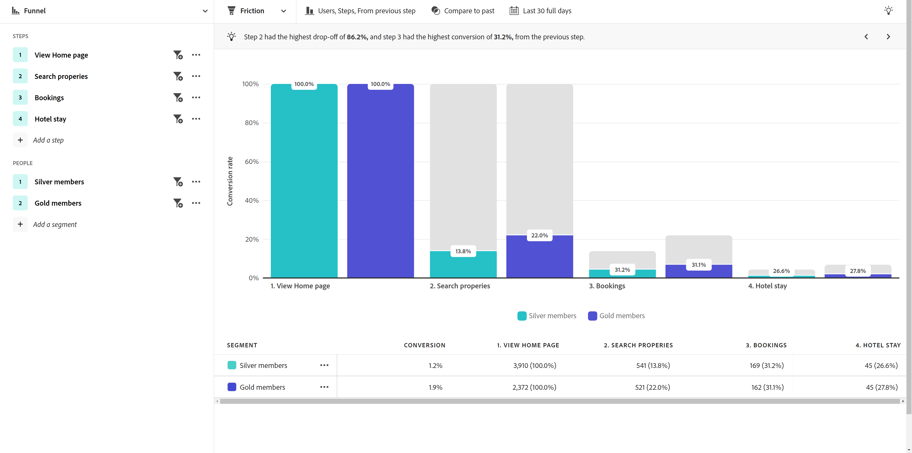
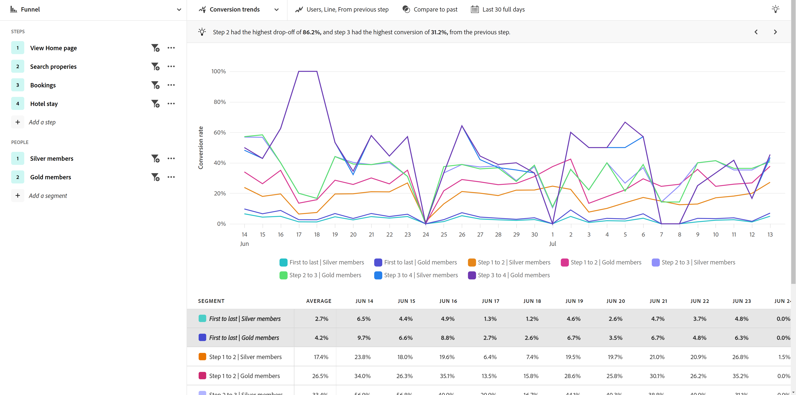
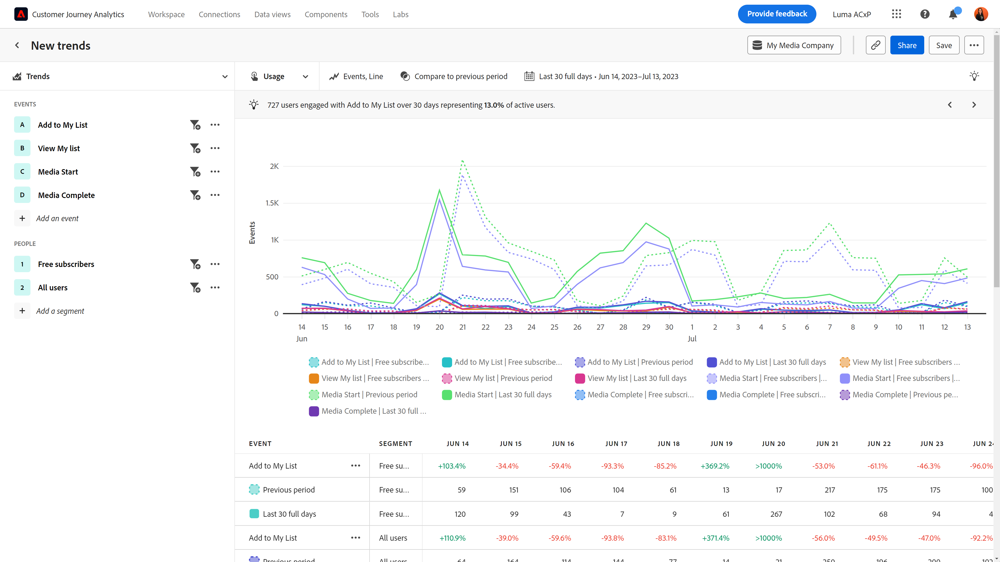

# 業界ユースケース

このページでは、アナリストから製品チーム、マーケターに至るまで、カスタマーエクスペリエンスチームがガイド付き分析を使用して達成できることについて、業界の例をいくつか紹介します。

+++**小売**

| ユースケース | 例 | 影響 | 分析 |
| --- | --- | --- | --- |
| **モバイルショッピングアプリを最適化する** | 多くの顧客が組織のモバイルアプリをダウンロードしましたが、一度もショッピングに使用していませんでした。 同社は、顧客が最初のオファーのためだけにアプリを使用していることに気付きました。 そこで、この休眠状態の顧客と再びエンゲージメントを確立します。 | **モバイルユーザーのLTVを増加させます。** アプリの利用状況を測定および増加して、より「満足のいくパス」のユーザーエクスペリエンスを開発します。 | [アクティブな増加率分析](types/active-growth.md) [純増加率分析](types/net-growth.md) |
| **新しいチェックアウト機能の影響を定量化** | 食料品店がオンラインショッピングへの参入を試しています。 製品レコメンデーションやカーブサイドピックアップなどの新しいチェックアウト機能の影響を迅速に測定します。 | **コンバージョン率を向上。** 機能の利用状況だけでなく、ビジネスへの影響を測定。 | [リリースの影響分析](types/release-impact.md) [初回使用の影響分析](types/first-use-impact.md) |
| **メンバーシップチャーンを減らす** | 組織は、顧客離れを引き起こすカスタマージャーニーの摩擦ポイントを発見します。 これにより、メンバーシッププログラムを見直し、リスクの高いメンバーの行動を分析できます。 | **解約を減らします。** 離反を防ぎ、顧客離れを低減するために、顧客との関係を育む方法を特定する。 | [アクティブな増加率分析](types/active-growth.md) [ファネル分析](types/funnel.md) |
| **非効率なセールスジャーニーを見つける** | ある組織は、顧客が離れた店舗のセールス担当者のジャーニーにおける非効率性を発見します。 プロセスを調整することで、店内でのより楽しいショッピングエクスペリエンスを顧客に提供できるようにします。 | **営業対応を改善します。** 非効率なプロセスを削減し、その結果、社内のジャーニーを改善し、顧客体験を向上させることができます。 | [ファネル分析](types/funnel.md) |

{style="table-layout:auto"}

{style="border:1px solid gray"}

{style="border:1px solid gray"}

+++

+++**金融機関**

| ユースケース | 例 | 影響 | 分析 |
| --- | --- | --- | --- |
| **新機能の影響を定量化** | ある金融機関は、Zelle を使用した銀行送金を展開しており、送金の完了時に新機能の影響を把握したいと考えています。 ガイド付き分析を使用すると、顧客の反応を確認できるので、マーケティングチームが展開できるようになります。 | **コンバージョン率を向上。** 新機能が転送コンバージョンに与える影響を測定。 | [リリースの影響分析](types/release-impact.md) [初回使用の影響分析](types/first-use-impact.md) |
| **コールセンターへのコール数を減らす** | ガイド付き分析によると、ある組織の 5 段階のモバイル請求プロセスがコールセンターへの問い合わせを促していることがわかりました。 オーディエンスを作成し、そのユーザーのエクスペリエンスをより良く理解することを目的としたメールを送信します。 | **エクスペリエンス内の摩擦を分離します。** 「ハッピーパス」ジャーニーを改善し、通話を減らします。 | [ファネル分析](types/funnel.md) [コンバージョントレンド分析](types/conversion-trends.md) |
| **顧客離れを減らす** | ある組織では、毎月の頻度で銀行モバイルアプリにログインする顧客は、その後も長く顧客であり続けることがわかりました。 ガイド付き分析を使用すると、解約するリスクがあるユーザーを特定し、ウィンバック戦略を立てることができます。 | **解約を減らします。** 実際の新規顧客の獲得に費やす一方で、顧客レベルを維持したい。 | [アクティブな増加率分析](types/active-growth.md) [純増加率分析](types/net-growth.md) |
| **新機能の推奨** | ある組織は、デジタルの引き出しがここ数ヶ月で減少していることに気付きました。 金融アドバイザーへのコール数が増加しました。 ガイド付き分析は、組織が運営委員会と共にデジタルプロセスの最適化に優先順位を付ける上で役に立ちます。 | **データ主導のロードマップを作成します。** データにもとづく最適化の計画と実施。 | [トレンド分析](types/trends.md) |

{style="table-layout:auto"}

{style="border:1px solid gray"}

{style="border:1px solid gray"}

{style="border:1px solid gray"}

+++

+++**旅行およびホスピタリティ**

| ユースケース | 例 | 影響 | 分析 |
| --- | --- | --- | --- |
| **新しい予約フロー機能の影響を定量化** | 組織では、ガイド付き分析を使用して、新しい予約手順機能がコンバージョン率に及ぼす影響を迅速に確認します。 エクスペリエンスの中で最も大きな利益が得られる部分を特定します。 | **予約率を上げます。** 機能の利用状況だけでなく、ビジネスへの影響を測定。 | [リリースの影響分析](types/release-impact.md) [ファネル分析](types/funnel.md) |
| **モバイルアプリエクスペリエンスの最適化** | 組織は、月別のアクティブなアプリユーザーを経時的にすばやく簡単に把握し、バージョンごとにプラスの影響を特定します。 | **MAUを増やす。** アプリの利用状況を測定し、増加させます。これは顧客の満足度と相関関係があります。 | [アクティブな増加率分析](types/active-growth.md) [純増加率分析](types/net-growth.md) |
| **モバイルチェックインフローでのフリクションの特定** | 組織は、予想されるモバイルチェックインプロセスにおいて成功している点、またはどの時点でユーザーがドロップアウトしたかを確認することで、エクスペリエンスの最適化が必要な領域を簡単に特定できます。 | **CSATの増加とIROPの削減** 摩擦を取り除くことで、よりシームレスな「旅行の日」体験を実現できます。 | [ファネル分析](types/funnel.md) [コンバージョントレンド分析](types/conversion-trends.md) |
| **コールセンターへのコール数を減らす** | ファネル分析でユーザーエクスペリエンスを確認すると、訪問者がどこでフリクションを経験し、それがコールセンターのコスト増につながるかを把握できます。 次に注力すべき手順は明確です。 | **コールセンターの利用頻度を減らします。** より「ハッピーパス」なユーザーエクスペリエンスを得て、コストのかかる呼び出しを減らします。 | [ファネル分析](types/funnel.md) [コンバージョントレンド分析](types/conversion-trends.md) |

{style="table-layout:auto"}

{style="border:1px solid gray"}

{style="border:1px solid gray"}

{style="border:1px solid gray"}

+++

+++**メディア＆エンターテインメント**

| ユースケース | 例 | 影響 | 分析 |
| --- | --- | --- | --- |
| **新しい番組やシリーズの影響を定量化** | ストリーミングサービスは、ユーザーが新しい番組やシリーズを視聴した後に視聴者数に与える影響を分析し、どのコンテンツが共感を呼んだのかをより深く理解できます。 | **閲覧者数を増やします。** 視聴者に最も大きな影響を与えるコンテンツを見つけましょう。 | [初回使用の影響分析](types/first-use-impact.md) |
| **顧客離れリスクの特定** | ある組織は、季節的なイベントを視聴するためにプラットフォームに登録し、イベントが終了した直後に登録解除する顧客の回帰率が高いことに気付きました。 これらのユーザーを迅速に特定すると、顧客がプラットフォームに関心を持ち続けるよう促すレコメンデーションを表示できます。 | **満足できる購読者を維持します。** 成長セグメントを惹きつけ、レコメンデーションを促進するコンテンツを特定。 | [アクティブな増加率分析](types/active-growth.md) [純増加率分析](types/net-growth.md) |
| **アップセルの機会を見つける** | 企業の収益拡大にとって重要なのは、スタジアムにいる間にファンにとって最も魅力的なアプリ内オファーを理解することです。 ガイド付き分析を使用すると、最も効果的なオファーを正確に確認できます。 | **関連売上を増加させます。** アプリ内オファーが購買行動の促進に与える影響を把握できます。 | [初回使用の影響分析](types/first-use-impact.md) [ファネル分析](types/funnel.md) |
| **クロスデバイスエクスペリエンスの最適化** | 組織は、購読者が複数のデバイス／アプリをどのように操作するかを分析したいと考えています。 この知識により、コンテンツの消費パターンを理解し、再ターゲティングするのに最適な場所を判断できます。 | **エクスペリエンスをパーソナライズします。** 各デバイスの購読者に最も効果的なコンテンツを把握します。 | [トレンド分析](types/trends.md) |
| **コールセンターへのコール数を減らす** | ある組織は、ガイド付き分析を使用して、自動引き落としが機能しない問題を特定しました。この件では、不満を持った顧客がサポートセンターに連絡してプランをキャンセルしました。 | **サポートの呼び出しを減らします。** より優れた顧客体験を構築し、カスタマーサービスへの問い合わせを削減。 | [ファネル分析](types/funnel.md) [コンバージョントレンド分析](types/conversion-trends.md) |

{style="table-layout:auto"}

{style="border:1px solid gray"}

{style="border:1px solid gray"}

{style="border:1px solid gray"}

+++

+++**医療**

| ユースケース | 例 | 影響 | 分析 |
| --- | --- | --- | --- |
| **患者の健康状態を改善** | ある組織は、成長に注力するためのデータを持っています。 ガイド付き分析を使用する前は、週に何人のウェルネスプランメンバーがガイド付き分析の使用を完全にやめたのかを、明確に把握していませんでした。 | **医師の診察を減らします。** 休眠ユーザーを迅速に特定し、リエンゲージメントを促進。 | [アクティブな増加率分析](types/active-growth.md) |
| **患者エクスペリエンスの向上** | 簡単なパスワードのリセットを行うためにコールセンターに連絡するユーザーの数が可視化され、アナリストは患者エクスペリエンスの向上に重点を置くことに新たな闘志を燃やすようになりました。 | **サービスの全体的なコストを削減します。** より優れた患者体験の構築と、患者サービスへの問い合わせ件数の削減。 | [トレンド分析](types/trends.md) [ファネル分析](types/funnel.md) |
| **セグメント別の繰り返しクロスチャネルアクションを特定** | ある組織では、デジタル製品で特定のメッセージを提供するために、メディケア資格のある会員がプランの使用にどの程度積極的であるかを把握したいと考えています。 ガイド付き分析から得られたインサイトは、マーケティングをより効果的に行うのに役立ちます。 | **メディケア登録の選択肢をパーソナライズします。** 最もアクティブなプランメンバーによる一般的な連続アクションの比較。 | [ファネル分析](types/funnel.md) [アクティブな増加率分析](types/active-growth.md) |
| **業界トップの人材を維持** | 組織の分析リソースには時間制限があります。 ガイド付き分析により、組織はリーダーシップの更新呼び出しに必要な製品使用状況データを迅速に取得できます。 | **アナリストの作業負荷を軽減します。** 迅速な回答。 最重要タイミングでわかりやすいレポートを作成します。 | [ガイド付き分析](overview.md) |

{style="table-layout:auto"}

{style="border:1px solid gray"}

+++

+++**ハイテク企業と B2B**

| ユースケース | 例 | 影響 | 分析 |
| --- | --- | --- | --- |
| **新機能の影響を定量化** | 組織は、新しい製品機能の使用量の増加を分析し、どのセグメントが最も効果的かを判断できます。 この分析は、ユーザーエンゲージメントを最大化し、マーケティングとのパートナーシップを強化するために、どこにリソースを費やすべきかの優先順位付けに役立ちます。 | **データ主導の優先順位付け。** リソースの割り当てを、十分な情報にもとづいて意思決定。 | [リリースの影響分析](types/release-impact.md) [初回使用の影響分析](types/first-use-impact.md) |
| **製品の利用率が低い役割を特定** | 組織は、エンジニア、製品マネージャー、およびマーケティングが使用する製品を設計します。 ガイド付き分析では、製品マネージャーやマーケターがほぼ毎日それを使用しているのに対し、エンジニアリングスタッフはほとんど採用していなかったことがわかりました。 | **製品の導入を拡大する。** さまざまな方法で、利用者の行動を迅速に特定できます。 | [アクティブな増加率分析](types/active-growth.md) [純増加率分析](types/net-growth.md) |
| **コンバージョンプロセスで摩擦点を削除** | 購入フローに発注書番号が必要な場合、クレジットカードを好むユーザーは注文を完了できなくなります。 そのフィールドをオプションにすると、コンバージョンが増加しました。 | **顧客体験の向上。** 解約の可能性を減らす： | [ファネル分析](types/funnel.md) [コンバージョントレンド分析](types/conversion-trends.md) |
| **セルフサービス分析のロック解除** | インサイトにアクセスすることは困難であり、組織内のユーザーの中には分析に関するトレーニングを受けていない人もいます。 ガイド付き分析を使用すると、回答を入手したり、組織内の他のユーザーが使用しているのと同じデータを活用して、より強力なパートナーシップを構築し、真の意味でのデータ主導型の意思決定ができるようになります。 | **組織全体でより緊密なパートナーシップ** プロダクトマネージャーは、従来は連携できていなかったデータにアクセスできます。 | [ガイド付き分析](overview.md) |

{style="table-layout:auto"}

{style="border:1px solid gray"}

+++
