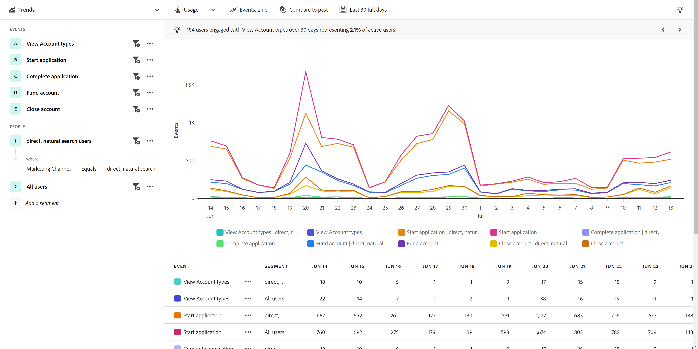

# 業界の使用例

ガイド付き分析の使用例は、業界によって異なります。 このページでは、ガイド付き分析とAdobe Product Analytics機能を使用して製品チームが達成できることを示す例をいくつか示します。

+++**小売**

| ユースケース | 例 | 影響 | 分析 |
| --- | --- | --- | --- |
| **モバイルショッピングアプリを最適化** | 多くのお客様は、組織のモバイルアプリをダウンロードしましたが、一度も戻ってきませんでした。 その会社は、顧客が最初のオファーのみにそれを使用することを発見します。 休眠中の顧客を再び惹きつけました | **モバイルユーザーの LTV を増やします。** アプリの使用状況を測定および増やして、より「ハッピーパス」のユーザーエクスペリエンスを開発します。 | [アクティブなユーザーの成長ビュー](types/active.md) [正味の成長見通し](types/net-growth.md) |
| **新しいチェックアウト機能の影響を定量化する** | 食料品店は、オンラインショッピングへの道のりを試す。 製品レコメンデーションやカーブサイドピックアップなど、新しいチェックアウト機能の影響をすばやく測定します。 | **コンバージョン率を向上させます。** 機能の使用だけでなく、ビジネスへの影響を測定できます。 | [リリースの影響ビュー](types/release.md) [初回使用ビュー](types/first-use.md) |
| **メンバーシップのチャーンを減らす** | 組織は、顧客がチャーンを引き起こすカスタマージャーニーの摩擦ポイントを明らかにします。 これにより、メンバーシッププログラムを確認し、リスクの高いメンバーの行動を分析できます。 | **チャーンを減らす。** 顧客との関係を育成および育成する方法を特定して、低下を防ぎ、チャーンを減らします。 | [アクティブなユーザーの成長ビュー](types/active.md) [摩擦ビュー](types/friction.md) |
| **非効率なセールスジャーニーを見つける** | ある組織は、顧客から引き離された店舗でのセールス担当者のジャーニーにおける非効率性を明らかにします。 プロセスを調整し、店内でのショッピングをより楽しめるようにします。 | **セールスへの対応を改善します。** 非効率なプロセスを削減し、内部ジャーニーを改善し、顧客体験を改善します。 | [摩擦ビュー](types/friction.md) |

{style="table-layout:auto"}

+++

+++**金融サービス**

| ユースケース | 例 | 影響 | 分析 |
| --- | --- | --- | --- |
| **新機能の影響を定量化** | ある金融機関は、Zelle との銀行振込を手配し、新機能が仕上げの振込に与える影響を理解したいと考えています。 ガイド付き分析を使用すると、顧客の反応を確認して、マーケティングチームが展開できるようになります。 | **コンバージョン率を向上させます。** 転送コンバージョンに対する新機能の影響を測定します。 | [リリースの影響ビュー](types/release.md) [初回使用ビュー](types/first-use.md) |
| **コールセンターコールの偏向** | ガイド付き分析によると、ある組織の 5 ステップのモバイル請求プロセスが、コールセンターへの呼び出しを促していることが明らかになります。 オーディエンスを作成し、そのユーザーのエクスペリエンスをより深く理解するために E メールを送信します。 | **エクスペリエンス内の摩擦を分離します。** 「ハッピーパス」ジャーニーを改善し、呼び出しを減らします。 | [摩擦ビュー](types/friction.md) [コンバージョントレンドビュー](types/conversion-trends.md) |
| **顧客の離脱を減らす** | ある組織は、月次の頻度で銀行モバイルアプリにログインしたお客様が、その後もお客様の時間が長くなることを学習します。 ガイド付き分析を使用すると、チャーンのリスクがあるユーザーを特定し、ウィンバック戦略を作成できます。 | **チャーンを減らす。** 実際の新規顧客を獲得するために費やしながら、顧客のレベルを維持します。 | [アクティブなユーザーの成長ビュー](types/active.md) [正味の成長見通し](types/net-growth.md) |
| **新機能を推奨** | ある組織は、デジタルの引き出しがここ数ヶ月で減少したことを知らせます。 金融アドバイザーへの電話の数が増えました。 ガイド付き分析は、組織が運営委員会と共にデジタルプロセスの最適化に優先順位を付けるのに役立ちます。 | **データ駆動型ロードマップを作成する。** 最適化の計画と実装には、データを使用します。 | [使用状況トレンドビュー](types/usage.md) |

{style="table-layout:auto"}

+++

+++**旅行と接客業**

| ユースケース | 例 | 影響 | 分析 |
| --- | --- | --- | --- |
| **新しい予約フロー機能の影響を定量化する** | 組織では、ガイド付き分析を使用して、新しい予約ステップ機能がコンバージョン率に与える影響をすばやく確認できます。 最も大きな成果を挙げて、エクスペリエンスの一部を特定します。 | **予約率を上げます。** 機能の使用だけでなく、ビジネスへの影響を測定できます。 | [リリースの影響ビュー](types/release.md) [摩擦ビュー](types/friction.md) |
| **モバイルアプリエクスペリエンスの最適化** | 組織は、月別のアクティブなアプリユーザーを時間の経過と共にすばやく簡単に理解し、バージョンごとにプラスの影響を特定します。 | **MAU を増やします。** 顧客の幸せと相関関係にあるアプリの使用量を測定し、増やします。 | [アクティブなユーザーの成長ビュー](types/active.md) [正味の成長見通し](types/net-growth.md) |
| **モバイルチェックインフローで摩擦を検索** | 組織は、期待されるモバイルチェックインプロセスがどこで成功したか、またはどこからドロップアウトしたかを確認することで、エクスペリエンスを最適化する領域を簡単に特定できます。 | **CSAT を増やし、IROP を減らします。** 摩擦を取り除くことで、よりシームレスな「旅行日」体験が得られます。 | [摩擦ビュー](types/friction.md) [コンバージョントレンドビュー](types/conversion-trends.md) |
| **コールセンターコールの偏向** | ファネル表示でユーザーエクスペリエンスを確認すると、訪問者が摩擦に直面したユーザーがわかります。これにより、コストの高いコールセンターのボリュームが増加します。 次に焦点を当てる手順は明確です。 | **コールセンターの使用量を削減します。** より多くの「幸せなパス」ユーザーエクスペリエンスを取得し、コストのかかる呼び出しを削減します。 | [摩擦ビュー](types/friction.md) [コンバージョントレンドビュー](types/conversion-trends.md) |

{style="table-layout:auto"}

+++

+++**メディア&amp;エンターテインメント**

| ユースケース | 例 | 影響 | 分析 |
| --- | --- | --- | --- |
| **新しい番組やシリーズの影響を定量化** | ストリーミングサービスは、ユーザーが新しい番組やシリーズを視聴した後に視聴者数に与える影響を分析し、どのコンテンツが共鳴するかをより深く理解できます。 | **閲覧者数を増やします。** 視聴者数に最も大きな影響を与えるコンテンツを見つけます。 | [初回使用ビュー](types/first-use.md) |
| **チャーンリスクの特定** | ある組織は、季節のイベントを見て、イベントが終了した直後にキャンセルするために、プラットフォームに新規登録した顧客の売り上げが高いと見ています。 これらのユーザーをすばやく特定することで、顧客がプラットフォームに関与し続けるきっかけとなるレコメンデーションを表示できます。 | **幸せな購読者を保持します。** レコメンデーションに介入するために成長セグメントに関与するコンテンツを見つけます。 | [アクティブなユーザーの成長ビュー](types/active.md) [正味の成長見通し](types/net-growth.md) |
| **アップセルの機会を見つける** | 企業の収益の伸びにとって重要なのは、スタジアムにいる間にファンにとって最も魅力的なアプリ内オファーを理解することです。 ガイド付き分析を使用すると、最も効果的なオファーを正確に確認できます。 | **付帯的な収入を増やします。** 購入行動の促進に対するアプリ内オファーの影響を理解します。 | [初回使用ビュー](types/first-use.md) [摩擦ビュー](types/friction.md) |
| **クロスデバイスエクスペリエンスの最適化** | 組織は、購読者が複数のデバイス/アプリとどのようにやり取りするかを分析したいと考えています。 この知識により、コンテンツ消費パターンを理解し、再ターゲティングするのに最適な場所を判断できます。 | **エクスペリエンスをパーソナライズします。** 各デバイスの購読者にとって最も共鳴するコンテンツを把握します。 | [使用状況トレンドビュー](types/usage.md) |
| **コールセンターコールの偏向** | ある組織は、ガイド付き分析を使用して、自動引き落としが機能しない問題を特定し、不満を抱えたお客様がサポートセンターに連絡して計画をキャンセルするよう求めました。 | **サポート呼び出しを削減します。** より良いカスタマーエクスペリエンスを作成し、カスタマーサービスへの呼び出しを減らします。 | [摩擦ビュー](types/friction.md) [コンバージョントレンドビュー](types/conversion-trends.md) |

{style="table-layout:auto"}

+++

+++**医療**

| ユースケース | 例 | 影響 | 分析 |
| --- | --- | --- | --- |
| **患者の健康の成果を改善する** | ある組織は、成長に取り組むためのデータを持っています。 ガイド付き分析を使用する前は、1 週間にウェルネスプランのメンバーが完全に使用を停止した数を明確に把握していませんでした。 | **医師の訪問を減らす。** 再エンゲージメントのために休止状態のユーザーを迅速に特定。 | [アクティブなユーザーの成長ビュー](types/active.md) |
| **患者体験の向上** | シンプルなパスワードリセットのために多くの患者がコールセンターに接続する状況を把握することで、分析者は患者体験の強化に熱心に取り組みました。 | **提供する全体的なコストを削減します。** より良い患者体験を作り出し、患者サービスへの呼び出しを減らします。 | [使用状況トレンドビュー](types/usage.md) [摩擦ビュー](types/friction.md) |
| **セグメント別に繰り返しクロスチャネルアクションを特定する** | ある組織は、Medicare の有効なメンバーがどの程度の活動をしているかを把握し、デジタル製品で特定のメッセージを提供するためのプランの使用を希望しています。 ガイド付き分析から得られたインサイトは、マーケティングをより効果的におこなうのに役立ちます。 | **メディケアの登録の選択肢をパーソナライズします。** 最もアクティブなプラン・メンバーによる共通の順次処理を比較します。 | [摩擦ビュー](types/friction.md) [アクティブなユーザーの成長ビュー](types/active.md) |
| **業界最高の人材を保持** | 組織の Analytics リソースが時間的に停止されます。 ガイド付き分析により、組織はリーダーシップの更新に必要な製品使用状況データを迅速に取得できます。 | **アナリストの作業負荷を削減します。** 回答を迅速に得る。 最も重要なタイミングに関する適切なレポート。 | [ガイド付き分析](overview.md) |

{style="table-layout:auto"}

+++

+++**ハイテクと B2B**

| ユースケース | 例 | 影響 | 分析 |
| --- | --- | --- | --- |
| **新機能の影響を定量化** | 組織は、新しい製品機能の使用状況の上昇を分析し、どのセグメントが最も効果が高いかを判断できます。 この分析は、ユーザーエンゲージメントを最大化し、マーケティングとのパートナーシップを強化するために、リソースを費やす場所を優先するのに役立ちます。 | **データ主導型の優先順位付け。** リソースの割り当てに関する十分な情報に基づく決定を下します。 | [リリースの影響ビュー](types/release.md) [初回使用ビュー](types/first-use.md) |
| **製品の利用率が低い役割の特定** | 組織は、エンジニア、製品マネージャ、およびマーケティングが使用する製品を設計します。 ガイド付き分析では、製品マネージャーやマーケターがほぼ毎日それを使用しているのに対し、エンジニアリングスタッフはほとんど採用していなかったことが示されました。 | **製品の採用を拡大** ユーザーの行動を様々な方法で迅速に識別します。 | [アクティブなユーザーの成長ビュー](types/active.md) [正味の成長見通し](types/net-growth.md) |
| **変換プロセスで摩擦点を削除します。** | 購入フローに発注番号を必要とすると、クレジットカードを好むユーザーが注文を完了できなくなります。 オプションにすると、コンバージョンが増加しました。 | **カスタマーエクスペリエンスを向上させます。** 潜在的なチャーンを減らす。 | [摩擦ビュー](types/friction.md) [コンバージョントレンドビュー](types/conversion-trends.md) |
| **セルフサービス分析のロック解除** | インサイトへのアクセスは課題で、組織内の一部のユーザーは分析に関するトレーニングを受けていません。 ガイド付き分析を使用すると、他の組織が使用しているのと同じデータを利用し、より強力なパートナーシップを構築し、真のデータ主導型の意思決定を可能にすることができます。 | **組織全体でパートナーシップを緊密化します。** 製品マネージャーに、以前にサイロ化されたデータへのアクセス権を付与します。 | [ガイド付き分析](overview.md) |

{style="table-layout:auto"}

+++
