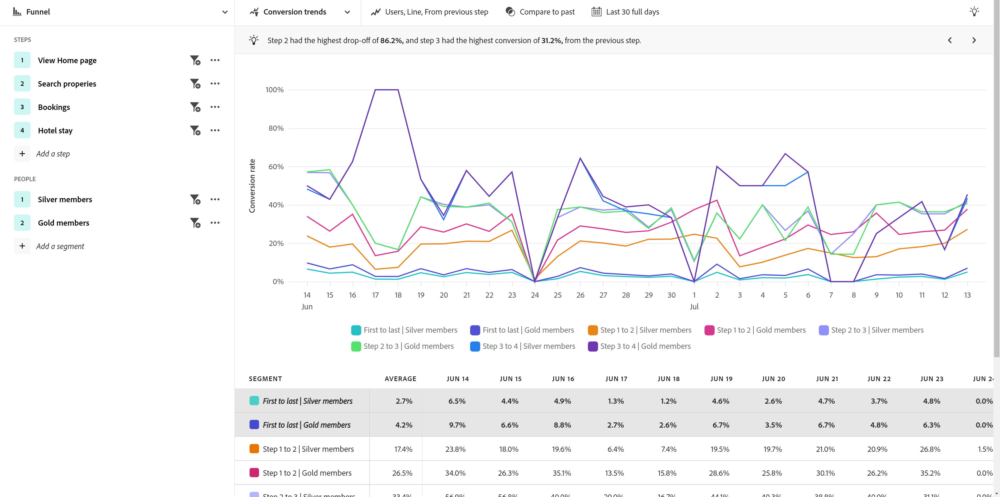

# 業界の使用例

ガイド付き分析の使用例は、業界によって異なります。 このページでは、ガイド付き分析とAdobe Product Analytics機能を使用して製品チームが達成できることを示す例をいくつか示します。

+++**小売**

| ユースケース | 例 | 影響 | Analysis |
| --- | --- | --- | --- |
| **モバイルショッピングアプリを最適化** | 多くのお客様がモバイルアプリをダウンロードしましたが、戻ってきませんでした。 最初のオファーにのみ使用し、休止状態の顧客に再エンゲージしていることがわかりました。 | **モバイルユーザーの LTV を増やします。** アプリの使用状況を測定および増やして、より「ハッピーパス」のユーザーエクスペリエンスを開発します。 | [アクティブなユーザーの成長ビュー](types/active.md) 

 [正味の成長見通し](types/net-growth.md) |
| **新しいチェックアウト機能の影響を定量化する** | 食料品店がオンラインショッピングに入る道を試みている中で、「バターを忘れたの？」といった新しいチェックアウト機能の影響を素早く測定することができます。 商品のレコメンデーション、またはカーブサイドピックアップなどの新しいチェックアウト方法。 | **コンバージョン率を向上させます。** 機能の使用だけでなく、ビジネスへの影響を測定できます。 | [リリースの影響ビュー](types/release.md) 

 [初回使用ビュー](types/first-use.md) |
| **メンバーシップのチャーンを減らす** | カスタマージャーニーで顧客が変化する原因となる摩擦点を明らかにしました。 これにより、メンバーシッププログラムを確認し、アットリスクメンバーの行動やシグナルを分析する機会が得られました。 | **チャーンを減らす。** 顧客との関係を育成および育成する方法を特定して、低下を防ぎ、チャーンを減らします。 | [アクティブなユーザーの成長ビュー](types/active.md) 

 [摩擦ビュー](types/friction.md) |
| **非効率なセールスジャーニーを見つける** | 私たちは、店内の販売員の遍歴の非効率性を明らかにし、顧客から引き離されました。 店内でのショッピングを楽しむことができるように、工程を調整しました。 | **セールスへの対応を改善します。** 内部ジャーニーを改善して、非効率なプロセスを減らし、顧客体験を積極的にします。 | [摩擦ビュー](types/friction.md) |

{style="table-layout:auto"}

+++

+++**金融サービス**

| ユースケース | 例 | 影響 | Analysis |
| --- | --- | --- | --- |
| **新機能の影響を定量化** | 最近、Zelle との銀行振込を行い、仕上げの振込に対する新機能の影響を理解する必要がありました。 これで、顧客の反応を確認できるので、マーケティングチームが展開できます。 | **コンバージョン率を向上させます。** 転送コンバージョンに対する新機能の影響を測定します。 | [リリースの影響ビュー](types/release.md) 

 [初回使用ビュー](types/first-use.md) |
| **コールセンターコールの偏向** | 5 段階のモバイル請求プロセスがコールセンターへの通話を促進しました。 この分析を迅速におこない、オーディエンスを作成し、そのユーザーのエクスペリエンスを把握するために電子メールを送信しました。」 | **エクスペリエンス内の摩擦を分離します。** 「ハッピーパス」ジャーニーを改善し、呼び出しを減らします。 | [摩擦ビュー](types/friction.md) 

 [コンバージョントレンドビュー](types/conversion-trends.md) |
| **顧客の離脱を減らす** | 毎月の頻度で銀行モバイルアプリにログインしたお客様は、引き続きお客様の時間が長くなります。 アプリのユーザーの増加を見ると、誰が変化するリスクがあるかを特定し、勝者戦略を作成できます。 | **チャーンを減らす。** 実際の新規顧客を獲得するために費やしながら、顧客のレベルを維持します。 | [アクティブなユーザーの成長ビュー](types/active.md) 

 [正味の成長見通し](types/net-growth.md) |
| **新機能を推奨** | デジタルの引き出しは、金融アドバイザーの呼び出しに代わって、時間の経過と共に減少しています。 デジタルプロセスを最適化したいと考えており、データの傾向は運営委員会による最適化の優先順位付けに役立ちます。 | **データ駆動型ロードマップを作成する。** データを活用して最適化を計画および実装します。 | [使用状況トレンドビュー](types/usage.md) |

{style="table-layout:auto"}

+++

+++**旅行およびホスピタリティ**

| ユースケース | 例 | 影響 | Analysis |
| --- | --- | --- | --- |
| **新しい予約フロー機能の影響を定量化する** | 新しい予約ステップ機能がコンバージョン率に与える影響をすばやく分析し、最も大きな増加を示したエクスペリエンスの部分を特定しました。 | **予約率を上げます。** 機能の使用だけでなく、ビジネスへの影響を測定できます。 | [リリースの影響ビュー](types/release.md) 

 [摩擦ビュー](types/friction.md) |
| **モバイルアプリエクスペリエンスの最適化** | 月別のアクティブアプリユーザー (MAU) を時間の経過と共に迅速かつ容易に把握し、バージョン別にプラスの影響を特定できました。 | **MAU を増やします。** 顧客の幸せと相関関係にあるアプリの使用量を測定し、増やします。 | [アクティブなユーザーの成長ビュー](types/active.md) 

 [正味の成長見通し](types/net-growth.md) |
| **モバイルチェックインフローで摩擦を検索** | 訪問者が期待されるモバイルチェックインプロセスに成功した場所や外れた場所を確認することで、エクスペリエンスの最適化のための領域を簡単に特定できます。 | **CSAT を増やし、IROP を減らします。** 摩擦を取り除くことで、よりシームレスな「旅行日」体験が得られます。 | [摩擦ビュー](types/friction.md) 

 [コンバージョントレンドビュー](types/conversion-trends.md) |
| **コールセンターコールの偏向** | ファネルビューでユーザーエクスペリエンスを見ると、ユーザーが摩擦にぶつかった場所がわかり、コールセンターのボリュームが高くなりました。 次に焦点を合わせる必要がある場所を知りました | **コールセンターの使用量を削減します。** より多くの「幸せなパス」ユーザーエクスペリエンスを取得し、コストのかかる呼び出しを削減します。 | [摩擦ビュー](types/friction.md) 

 [コンバージョントレンドビュー](types/conversion-trends.md) |

{style="table-layout:auto"}

+++

+++**メディアとエンターテインメント**

| ユースケース | 例 | 影響 | Analysis |
| --- | --- | --- | --- |
| **新しい番組やシリーズの影響を定量化** | ユーザーが新しいショーやシリーズを視聴した後に視聴者数に与える影響を分析し、どのコンテンツが共鳴しているかをより深く理解することができます。 | **閲覧者数を増やします。** 視聴者数に最も大きな影響を与えるコンテンツを見つけます。 | [初回使用ビュー](types/first-use.md) |
| **チャーンリスクの特定** | 当社のプラットフォームに参加したお客様は、季節のイベントを見て、イベントが終わるとすぐにキャンセルするという高い売り上げ率を見ていました。 これらのユーザーをすばやく特定することで、プラットフォームとの関わりを維持するためのレコメンデーションを表示できます。 | **幸せな購読者を保持します。** レコメンデーションに介入するために成長セグメントに関与するコンテンツを見つけます。 | [アクティブなユーザーの成長ビュー](types/active.md) 

 [正味の成長見通し](types/net-growth.md) |
| **アップセルの機会を見つける** | 収益の伸びに対する Jey は、スタジアムにいる間に、アプリ内のオファーがファンにとって最も魅力的なものを理解できるようになりました。 | **付帯的な収入を増やします。** 購入行動の促進に対するアプリ内オファーの影響を理解します。 | [初回使用ビュー](types/first-use.md) 

 [摩擦ビュー](types/friction.md) |
| **クロスデバイスエクスペリエンスの最適化** | 購読者が複数のデバイスやアプリとどのようにやり取りしているかを分析できるので、コンテンツ消費のパターンを理解し、再ターゲティングが最適な場所を判断できます。 | **エクスペリエンスをパーソナライズします。** 各デバイスの購読者にとって最も共鳴するコンテンツを把握します。 | [使用状況トレンドビュー](types/usage.md) |
| **コールセンターコールの偏向** | 自動引き落とし機能が機能しない問題を特定できたので、不満を抱くお客様がサポートセンターに連絡して計画をキャンセルしました。 | **サポート呼び出しを削減します。** より良いカスタマーエクスペリエンスを作成し、カスタマーサービスへの呼び出しを減らします。 | [摩擦ビュー](types/friction.md) 

 [コンバージョントレンドビュー](types/conversion-trends.md) |

{style="table-layout:auto"}

+++

+++**ヘルスケア**

| ユースケース | 例 | 影響 | Analysis |
| --- | --- | --- | --- |
| **患者の健康の成果を改善する** | 1 週間に何人のウェルネスプランのメンバーがそれを完全に使うのを止めたかは明確には理解できませんでした。 成長に向けた取り組みに焦点を当てるデータが揃いました。 | **医師の訪問を減らす。** 再エンゲージメントのために休止状態のユーザーを迅速に特定。 | [アクティブなユーザーの成長ビュー](types/active.md) |
| **患者体験の向上** | シンプルなパスワードを求めてコールセンターに電話をかけていた患者数を直接把握することで、私の情熱はレーザーに集中し、当社の患者体験を提供し、強化するための全体的なコストを削減することに注力しました。 | **提供する全体的なコストを削減します。** より良い患者体験を作り出し、患者サービスへの呼び出しを減らします。 | [使用状況トレンドビュー](types/usage.md) 

 [摩擦ビュー](types/friction.md) |
| **セグメント別に繰り返しクロスチャネルアクションを特定する** | Medicare の有効なメンバーがどの程度の活動をしているかを理解し、当社のデジタル製品で具体的なメッセージを提供するために、計画の使用状況を理解する必要があります。 製品シグナルは、マーケティングをより効果的にするのに役立ちます。 | **メディケアの登録の選択肢をパーソナライズします。** 最もアクティブなプラン・メンバーによる共通の順次処理を比較します。 | [摩擦ビュー](types/friction.md) 

 [アクティブなユーザーの成長ビュー](types/active.md) |
| **業界最高の人材を保持** | 分析リソースが時間的に膨れ上がっています。 リーダーシップアップデートに必要な製品使用状況データを迅速に入手する必要があります。 | **アナリストの作業負荷を削減します。** 回答を迅速に得る。 最も必要なタイミングに応じて、適切なレポートを作成できます。 | [ガイド付き分析](overview.md) |

{style="table-layout:auto"}

+++

+++**ハイテクと B2B**

| ユースケース | 例 | 影響 | Analysis |
| --- | --- | --- | --- |
| **新機能の影響を定量化** | 新しい製品機能の使用状況の上昇を分析し、どのセグメントが最も効果が高いかを判断できました。 これにより、ユーザーエンゲージメントを最大化し、マーケティングとのパートナーシップを強化するために、リソースの使用場所を優先することができました。 | **データ主導型の優先順位付け。** リソースの割り当てに関する十分な情報に基づく決定を下します。 | [リリースの影響ビュー](types/release.md) 

 [初回使用ビュー](types/first-use.md) |
| **製品の利用率が低い役割の特定** | 当社の製品は、エンジニア、製品マネージャ、マーケティング担当者が使用できるように設計されています。 分析によると、PM とマーケターはほぼ毎日それを使用していましたが、エンジニアリングスタッフはほとんど採用していませんでした。 | **製品の採用を拡大** 様々な方法でユーザーの行動を迅速に識別します。 | [アクティブなユーザーの成長ビュー](types/active.md) 

 [正味の成長見通し](types/net-growth.md) |
| **変換プロセスで摩擦点を削除します。** | ユーザーデータから、購入フローに発注番号が必要な場合、クレジットカードで購入したいユーザーが注文を完了できないことがわかっていました。 そのフィールドをオプションにすることで、コンバージョンが増加しました。 | **カスタマーエクスペリエンスを向上させます。** 潜在的なチャーンを減らす。 | [摩擦ビュー](types/friction.md) 

 [コンバージョントレンドビュー](types/conversion-trends.md) |
| **セルフサービス分析のロック解除** | インサイトにアクセスするのは困難で、ユーザーの分析トレーニングは実施されていません。 組織全体が使用している同じデータを活用し、より強力なパートナーシップを構築し、真のデータに基づく意思決定を可能にする必要があります。 | **組織全体でパートナーシップを緊密化します。** 製品マネージャーに、以前にサイロ化されたデータへのアクセス権を付与します。 | [ガイド付き分析](overview.md) |

{style="table-layout:auto"}

+++
