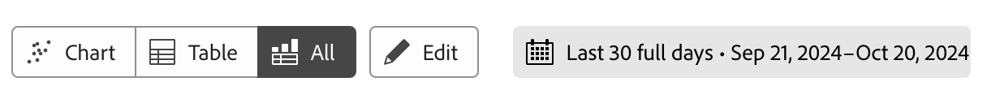

# ガイド付き分析の概要

ガイド付き分析を使用すると、マーケティングから製品、アナリストに至るまで、Customer Journey Analyticsのクロスチャネルデータに基づいて構築されたガイド付きワークフローを通じて、カスタマージャーニーに関する高品質のデータとインサイトをセルフサービスで提供できます。 Analysis Workspaceおよびモバイルスコアカードと同様に、ガイド付き分析では、[ 接続 ](/help/data-views/data-views.md) を介してAdobe Experience Platformのデータを参照する [ データビュー ](../connections/overview.md) のデータを使用します。 ガイド付き分析で作成した多くのレポートは、Analysis Workspace にシームレスに転送して、さらに調査することができます。

>[!NOTE]
>
>Guided Analysis とAnalysis Workspaceの用語（セグメント、フィルターなど）の違いについては、[FAQ](faq.md) を参照してください。

次のガイド付き分析を利用できます。

| アイコン | 分析 | 説明 |
| :----:|--- | --- |
|  | [ 積極的成長 ](types/active-growth.md) | 新規、継続、再来訪または休眠状態のユーザーを特定します。 |
|  | [コンバージョントレンド](types/conversion-trends.md) | コンバージョン率の推移を追跡します。 |
|  | [エンゲージメント](types/engagement.md) | 機能エンゲージメントの幅と深度を理解します。 |
|  | [ 初回使用時の影響 ](types/first-use-impact.md) | 機能の初回使用が主要指標に与える影響を測定します。 |
|  | [頻度](types/frequency.md) | 使用頻度別にエンゲージメントを測定します。 |
|  | [ファネル](types/funnel.md) | ステップ間のコンバージョン率を比較します。 |
|  | [純増加率](types/net-growth.md) | ユーザーは増加していますか、それとも減少していますか？ |
|  | [ リリースの影響 ](types/release-impact.md) | リリース前とリリース後の同じ期間にわたるパフォーマンスを比較します。 |
|  | [リテンション](types/retention.md) | ユーザーの継続的な再来訪習慣を測定します。 |
|  | [タイムライン](types/timeline.md) | セッションアクティビティのパターンを探索します。 |
|  | [トレンド](types/trends.md) | ユーザーエンゲージメントの推移を測定します。 |

## アクセス

Customer Journey Analyticsホームページからガイド付き分析にアクセスできます。

1. ホームページから **[!UICONTROL ガイド付き分析]** を選択すると、[ トレンド分析 ](types/trends.md) に直接移動します。

   {style="border:1px solid gray"}

1. 「**[!UICONTROL 新規作成]**」を選択して様々な表示オプションを表示し、分析の別の開始点を選択します。

   {style="border:1px solid gray"}

また、Analysis Workspace プロジェクト内からガイド付き分析にアクセスすることもできます。

1. ホームページから **[!UICONTROL 空のプロジェクト]** を選択して、空のWorkspace プロジェクトを作成します。

   {style="border:1px solid gray"}

1. 左パネルで「**[!UICONTROL ガイド付き分析]**」を選択します。

   {style="border:1px solid gray"}

1. 新しい分析をWorkspace キャンバスにドラッグし、「**[!UICONTROL 作成]**」を選択して目的の分析を生成します（例：**[!UICONTROL トレンドを作成]**）。 また、既存の分析を「保存済み **[!UICONTROL セクションの下からWorkspace キャンバスにドラッグす]** こともできます。

   

## インターフェイス

ガイド付き分析のインターフェイスは、質問と回答の形式に従っています。クエリパネルで質問を作成し、書き込まれたインサイト、グラフ、テーブルを含む回答を取得します。その後、分析とビジュアライゼーション設定を使用して次の質問をすることができます。

ガイド付き分析では、次の UI 要素を使用します。

| インターフェイスのプレビュー | UI 要素 | 説明 |
| --- | --- | --- |
| {style="border:1px solid gray"} | **[!UICONTROL クエリパネル]** | 分析を構成する目的のコンポーネント（イベント、プロパティ、セグメント）を選択して、*質問* を設定します。 以下のオプションはすべての分析で使用でき、追加の設定は表示ごとに使用できます。 <ul><li>**表示**：新しい分析に切り替えるには、オプションから選択します。 クエリーの選択は、新しい分析で許可される制限内に維持されます。</li><li>**イベント**：測定するイベントです。設定できるイベントの数に対して、分析ごとに異なる制限が適用されます。  イベントには、**[!UICONTROL 開始イベントと復帰イベント]**、**[!UICONTROL 手順]**、**[!UICONTROL 主要指標]** というラベルが付いていることがあります。 分析では、イベントは 1、2、...を使用して識別されます。  新しいイベントを追加するには、「**[!UICONTROL イベントの追加]** を選択します。</li><li>**[!UICONTROL 要因]**：可能な場合、日付の開始日時や初回イベントなどの要因を指定できます。</li><li>**カウント対象**：選択したイベントに適用するカウント方法。 ドロップダウンメニューからを選択します。</li><li>**セグメント**：測定するセグメント。設定できるセグメントの数に対して、分析ごとに異なる制限が適用されます。 分析では、セグメントは A、B、...を使用して識別されます。  新しいセグメントを追加するには、「**[!UICONTROL セグメントの追加]** を選択します。</li><li>**[!UICONTROL 分類]**：分析に適用する分類（使用可能な場合）。</li></ul>一部の設定では、追加の設定を使用できます。<ul><li>**フィルター**:  を使用すると、特定のディメンションごとにイベントやセグメントを絞り込むことができます。 ディメンションを選択した場合は、標準フィルター条件（**[!UICONTROL 次に等しい]**、**[!UICONTROL 次を含む]**、**[!UICONTROL 次で終わる]** など）および上位 1000 個のディメンション値の両方を使用できます。  「」を選択して、フィルターを追加します。  「」を選択して、フィルターを削除します。</li><li>**その他のアクション**:  を使用して、次のようなアクションを選択します<ul><li>**[!UICONTROL 名前を変更]**：イベントまたはセグメントの名前を変更します。</li><li>**[!UICONTROL 複製]**：イベントまたはセグメントを複製します。</li><li>**[!UICONTROL 削除]**：イベント、セグメントまたは分類を削除します。</li><li>**[!UICONTROL セグメントの編集]**: [ フィルタービルダー ](/help/components/filters/filter-builder.md) でセグメントを編集します。</li><li>**[!UICONTROL お気に入りに追加]**: [ フィルターマネージャー ](/help/components/filters/manage-filters.md) のお気に入りフィルターのリストにセグメントを追加します。</li><li>**[!UICONTROL 名前を付けて保存]**：セグメントを新しいコンポーネントとして保存します。 **[!UICONTROL セグメントをコンポーネントに保存]** ダイアログで、セグメント名と説明を指定できます。  を選択すると、新しいセグメントをお気に入りに登録できます。 「**[!UICONTROL 保存]**」を選択して、セグメントを新しいフィルターとして保存します。</li><li>**[!UICONTROL リンクの開始イベントと戻りイベント]**。:[ リテンション ](types/retention.md) 分析で開始イベントと復帰イベントをリンクします。</li><li>**[!UICONTROL 開始イベントと復帰イベントのリンク解除]**:「リテンション [ 分析で開始イベントと復帰イベントのリンクを解除 ](types/retention.md) します。</li></ul></li></ul> |
| {style="border:1px solid gray"} | **[!UICONTROL グラフ]** | クエリパネルと設定からの入力に基づいて返されるデータのビジュアライゼーション。どのビジュアライゼーションが表示されるかは、グラフ上のビューと設定によって異なります。グラフには次も含まれます。 <ul><li>**ツールチップ**：グラフのデータポイントの上にマウスポインターを置くと、詳細情報を含むツールチップが表示されます。</li><li>**凡例**：グラフの凡例系列の上にポインタを合わせると、定義がある場合はその系列の定義を表示したり、その系列に焦点を当てたり、他の系列を一時的に非表示にしたりできます。凡例のシリーズを選択すると、シリーズが非表示になります。</li><li>**注釈**：適用可能な[注釈](../components/annotations/overview.md)は、ビジュアライゼーションと凡例の間に表示されます。注釈の設定された色で アイコンとして表示されます。時間の経過に伴うデータを表示する分析では、設定された日付または日付範囲の下に  アイコンが配置されます。 時間の経過とともにデータが表示されない分析では、グラフの右下隅に  アイコンが表示されます。</li><li>**アクションを選択**：任意のデータポイントを選択して、使用可能な次のアクションを公開します。 オプションには「**セグメントを保存**」が含まれます。</li></ul> |
| {style="border:1px solid gray"} | **[!UICONTROL テーブル]** | クエリパネルからの入力と設定に基づいて返されるデータのテーブル表示域。イベント（1、2、...）およびセグメント識別子（A、B、...）を参照として使用した、テーブルの行。 テーブルの列は、グラフ上の分析によって異なります。 この表には、各行に対して次の内容も含まれます。 <ul><li>**アクションの選択**：行のグラフシリーズの表示と非表示を切り替える  トグルします。 追加のアクションについては、「」を選択してください。 オプションには「**セグメントを保存**」が含まれます。</li></ul> |
| {style="border:1px solid gray"} | **[!UICONTROL ビジュアライゼーション設定]** | グラフ上にあるオプション。次の質問をしたり、グラフとテーブルがデータを返す方法をカスタマイズしたりできます。次のオプションはすべての分析で使用でき、追加の設定は分析ごとに使用できます。 <ul><li>**グラフ設定**：グラフとテーブルの表示内容を微調整します。 使用できるオプションは、選択した解析によって異なります。</li><li>**オーバーレイ設定**：オーバーレイを追加します。 使用できるオプションは、選択した解析によって異なります。</li><li>**[!UICONTROL バケット設定]**：自動バケットまたはカスタムバケット設定をデータに適用します。 使用できるオプションは、選択した解析によって異なります。<li>**[!UICONTROL Compare 設定]**：特定のデータ範囲とデータを比較します。 使用できるオプションは、選択した解析によって異なります。</li><li>**[!UICONTROL 表示設定]**: データの表示方法を選択します。 使用できるオプションは、選択した解析によって異なります。<li>**日付範囲**：分析の日付範囲を決定できるカレンダー選択。 また、毎日、毎週、毎月など、トレンド分析の間隔を選択することもできます。</li><li>**Insights**：表示する分析に応じたコンテキストインサイト。 これらのインサイトは、現在の分析に関する考察を提供します。複数のインサイトがある場合は、右側の矢印を使用して表示できます。右上の電球アイコンを使用して、このボックスの表示／非表示を切り替えることができます。</li></ul> |
| {style="border:1px solid gray"} | **[!UICONTROL メニュー ]**  ガイド付き分析プロジェクトで使用可能 | ガイド付き分析プロジェクトの右上にあるコマンド。分析のための包括的なアクションが用意されています。<ul><li>***データビュー名***：分析で使用するデータビューを変更します。 データビューを変更すると、クエリパネルの使用可能なコンポーネントも変更されます。</li><li>**リンクをコピー**：分析へのリンクをクリップボードにコピーします。 共有する前に保存するよう求めるメッセージが表示されます。</li><li>**共有**：共有モーダルを開きます。個々のユーザーまたはグループに共有するためのその他のオプションがあります。他のユーザーと分析を共有したり、任意のユーザーと共有するためのリンクを生成したりできます。</li><li>**保存**：分析を保存します。新しい分析を保存する場合、名前と説明の入力を求める **[!UICONTROL 分析を保存]** ダイアログが表示されます。 保存すると、「**[!UICONTROL 分析保存済み]** ダイアログで分析を共有できます。</li></ul> を選択すると、次のようなアクションが表示されます。<ul><li>**別名で保存**：現在の分析とは別に分析を保存し、コピーを作成します。新しい名前と説明の入力を求めるダイアログが表示されます。</li><li>**Workspaceに書き出し**：現在のガイド付き分析クエリをAnalysis Workspaceに再作成します。 Workspace プロジェクトは新しいタブで作成されるので、ガイド付き分析での作業が中断されることはありません。分析のコピーであり、開いた後は元のガイド付き分析と同期しません。このコマンドは、アナリストチームに引き渡す場合や、ガイド付き分析で可能な範囲よりも詳細なデータを取得する場合に使用します。</li><li>**クリップボードにグラフをコピー**：グラフのグラフィックをクリップボードにコピーして、他のアプリケーションに貼り付けます。 クエリパネルとテーブルは、グラフィックに含まれていません。</li><li>**PNG のダウンロード**：グラフのグラフィックを `.png` としてダウンロードします。クエリパネルとテーブルは、グラフィックに含まれていません。</li><li>**CSV のダウンロード**：テーブルデータを `.csv` としてダウンロードします。クエリパネルとグラフはファイルに含まれていません。</li></ul> |
|  | **メニュー**  Analysis Workspace のガイド付き分析ビジュアライゼーションで使用できます。 | Analysis Workspace のガイド付き分析ビジュアライゼーションで使用できるコマンド。<ul><li>**[!UICONTROL グラフ]**：分析のグラフのみを表示します。</li><li>**[!UICONTROL Table]**：分析のテーブルのみを表示します。</li><li>**[!UICONTROL All]**：分析のグラフとテーブルを表示します。</li><li>**[!UICONTROL 編集]**：分析の設定を編集します。</li><li>**[!UICONTROL *日付範囲&#x200B;*]**：分析のデータ範囲を設定します。</li></ul> |

{style="table-layout:auto"}

## プロビジョニング

ガイド付き分析は、次の方法でCustomer Journey Analyticsパッケージに含まれています。

| パッケージ | 利用可能な分析 |
| --- | --- |
| [!UICONTROL Customer Journey Analyticsアドオン ] | アクティブな増加、コンバージョンのトレンド、頻度、ファネル、純増加、定着、トレンド |
| [!UICONTROL Customer Journey Analytics基盤 ] | 傾向 |
| [!UICONTROL Customer Journey Analyticsを選択 ] | 基盤となるビュー+ アクティブな成長、コンバージョンのトレンド、頻度、ファネル、純成長、定着 |
| [!UICONTROL Customer Journey Analyticsプライム ] | ビュー+ エンゲージメント、初回使用の影響、リリースの影響、タイムラインを選択 |
| [!UICONTROL Ultimate Customer Journey Analytics] | Prime ビュー数 |

{style="table-layout:auto"}

製品プロファイル管理者は、Adobe Admin Console でガイド付き分析へのアクセスを追加または削除できます。

1. [Adobe Admin Console](https://adminconsole.adobe.com) にログインします。
1. 製品リストから **[!UICONTROL Customer Journey Analytics]** を選択します。
1. 編集する権限に必要な製品プロファイルを選択します。
1. 「**[!UICONTROL 権限]**」タブを選択し、「**[!UICONTROL レポートツール [!UICONTROL  の下にある]** 編集 ] をクリックします。
1.  のリストの **[!UICONTROL ガイド付き分析アクセス]** の横にある [!UICONTROL AddCircle] を選択すると、[!UICONTROL  含まれる権限項目 ] のリストに追加されます。
1. 「**[!UICONTROL 保存]**」を選択します。

詳しくは、[ ユーザーレベルアクセス ](/help/technotes/access-control.md#user-level-access) を参照してください。

>[!TIP]
>
>管理者によっては、Customer Journey Analytics の新規ユーザーに対してガイド付き分析を有効にし、Analysis Workspace を無効ににすることを好む場合があります。これらのユーザーが製品と組織のデータに慣れてきたら、Analysis Workspace へのアクセスを有効にできます。
