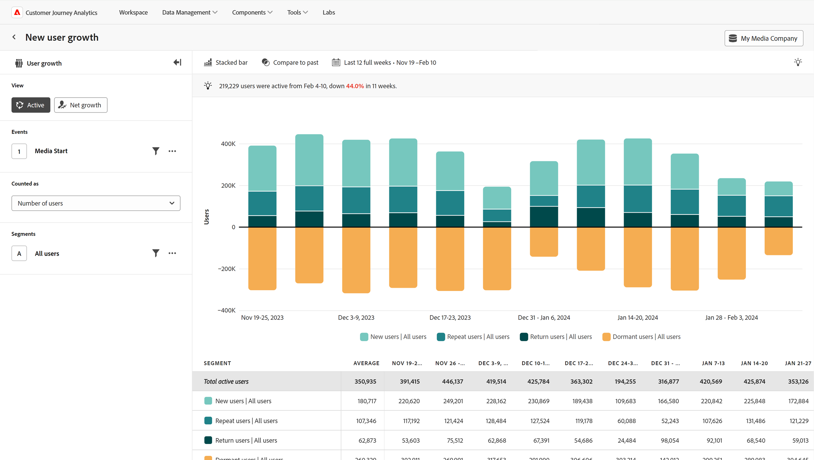

# アクティブ

{{release-limited-testing}}

この **アクティブ** 表示タイプは、特定の期間におけるユーザーの増加と獲得に関するインサイトを提供します。 横軸は常に時間の精度ですが、縦軸は常にユーザーの測定です。 ユーザーは、日付範囲の開始時から分析され、次の 4 つのカテゴリに分類されます。

* **新規**:現在のデータポイントの間、ユーザーはアクティブで、以前のデータポイントには表示されませんでした。 &#39;[!UICONTROL 新規ユーザー]」をクリックして、新しいユーザーを特定するためにレポートがどの程度遡るかを確認します。 この日付は、日付範囲の長さと精度に基づいて動的に選択されます。
* **繰り返し**:ユーザーが直前のデータポイントと現在のデータポイントに表示されていた問題を修正しました。
* **戻る**:ユーザーは直前のデータポイントには表示されませんでしたが、新規ユーザーではありません。
* **休止**:ユーザーは現在のデータポイントには表示されませんでしたが、直前のデータポイントに表示されていました。 休止状態のユーザーは、アクティブなユーザーの合計数にカウントされません。

すべてのアクティブなユーザー（新しい+リピート+リターン）は、水平軸の上にティールのシェードとして表示され、休止状態のユーザーはすべて、水平軸の下にオレンジ色で表示されます。

このビュータイプの使用例を次に示します。

* **ユーザーリテンションとチャーン：** ユーザー保持率の高い期間または低い期間を中心に明確なビジュアライゼーションを提供します。 保持率の高い期間または低い期間を認識すると、高い保持率を促す製品の決定を下したり、チャーンを最小限に抑えるのに役立ちます。
* **キャンペーン評価**:特定のキャンペーンを表示すると、そのキャンペーンが生み出したトラフィック量だけでなく、キャンペーンがユーザーの関与を維持するのに役立ったかどうかも把握できます。
* **ユーザーのライフサイクル分析**:ユーザーのライフサイクル全体を通じてアクティブなユーザーの増加を分析すると、ユーザーエンゲージメントが低下する特定のステージを特定するのに役立ちます。 例えば、オンボーディング段階にいるユーザーに対して休止状態のユーザーの割合が高い場合は、使い勝手の問題や、より優れた製品内ガイダンスの必要性を示す可能性があります。

## クエリレール

クエリレールでは、次のコンポーネントを設定できます。

* **イベント**:測定するイベント。 このビュータイプはユーザーベースなので、ユーザーは設定された日付精度内に 1 回イベントにタッチすると、アクティブなユーザーとしてカウントされます。 1 つのクエリに含めることができるイベントは 1 つだけです。
* **人**:測定するセグメント。 1 つのクエリに含めることができるセグメントは 1 つだけです。

## グラフ設定

この表示タイプでは、次のグラフ設定をおこなえます。 表示タイプとカレンダーセレクターの間のメニューを使用して、グラフ設定を調整できます。

* **指標**:測定する指標です。 オプションには、ユーザー数とユーザーの割合が含まれます。
* **グラフのタイプ**:使用するビジュアライゼーションのタイプ。 オプションには、積み重ね棒グラフおよび積み重ね面グラフがあります。

## 時間比較を適用

{{apply-time-comparison}}

## 日付範囲

目的の日付範囲。 この設定には、次の 2 つの重要なコンポーネントがあります。

* **間隔**:データを表示する日付精度です。 有効なオプションは、時間別、日別、週別、月別、四半期別です。 グラフ内のデータポイントの数やテーブルの列数に影響を与える異なる間隔を、同じ日付範囲に設定することができます。 例えば、毎日の精度で 3 日間の分析を表示すると、3 つのデータポイントのみが表示され、1 時間ごとの精度で 3 日間の分析では 72 個のデータポイントが表示されます。
* **日付**:開始日と終了日。 日付範囲プリセットを利用して便利なように設定するか、カレンダーセレクターを使用して目的の日付を設定します。
