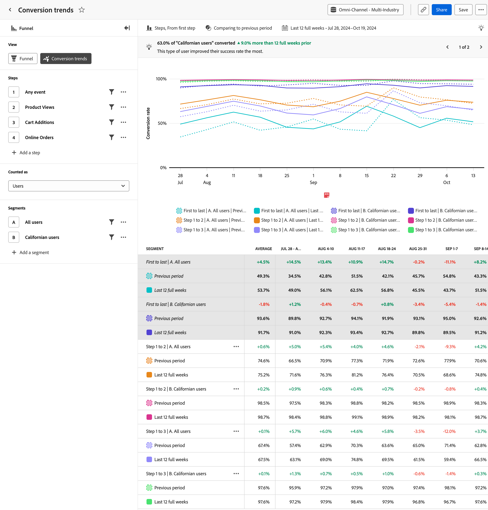

# [!UICONTROL  コンバージョンのトレンド ] 分析

**[!UICONTROL コンバージョンの傾向]** 分析では、コンバージョン率の経時的なトレンドをビジュアライゼーションできます。 横軸は時間間隔、縦軸はコンバージョン率を表します。

+++ デモビデオ

>[!VIDEO](https://video.tv.adobe.com/v/3421662/?learn=on)

+++

## ユースケース

この分析のユースケースには、次のものがあります。

* **最適化の取り組みを追跡**:[ ファネル ](funnel.md) 分析を使用して改善したい主なボトルネックを特定した後、この分析を使用して、それらの最適化が時間の経過と共にコンバージョン率に与える影響を追跡できます。
* **A/B テストの評価**：ファネルのコンテキスト内で行われた A/B テストまたは実験の有効性を評価します。 異なるバリエーション間でコンバージョン率を比較することで、どのテストがより高いコンバージョン率を提供するかを簡単に判断でき、どのバリエーションを永続的に実装するかのデータに基づく決定につながります。
* **キャンペーン評価の履歴**: マーケティングキャンペーンの効果を経時的に測定します。 特定のキャンペーンにタッチしたユーザーに焦点を当てたセグメントを作成し、そのコンバージョン率を他のキャンペーンと比較できます。 また、現在のコンバージョン率を、過去に実行された類似のキャンペーンと比較することもできます。

## インターフェイス

ガイド付き分析インターフェイスの概要については、[ インターフェイス ](../overview.md#interface) を参照してください。 次の設定は、この分析に固有です。

### クエリパネル

クエリパネルでは、次のコンポーネントを設定できます。

* **[!UICONTROL 表示]**：この分析と [ ファネル ](funnel.md) を切り替えます。
* **[!UICONTROL 手順]**：トラッキングするイベントタッチポイント。 グラフ内の各棒グラフはステップを表します。 最大 10 個の手順を含めることができます。
* **[!UICONTROL カウント対象]**：選択したイベントに適用するカウント方法。 オプションには [!UICONTROL  ユーザー ] と [!UICONTROL  セッション ] があります。
* **[!UICONTROL セグメント]**：ファネルを比較するセグメント。 選択したセグメントごとに、各ステップが複数の棒に分割されます。 それぞれの色が異なるセグメントを表します。 最大 3 つのセグメントを含めることができます。

### グラフ設定

[!UICONTROL  コンバージョンのトレンド ] 分析には次のグラフ設定が用意されており、グラフ上のメニューで調整できます。

* **[!UICONTROL グラフのタイプ]**：使用するビジュアライゼーションのタイプ。 オプションには [!UICONTROL  折れ線グラフ ] があります。
* **[!UICONTROL 変換元]**：ステップからステップへのパーセンテージ計算を決定します。 オプションには、[!UICONTROL  最初の手順 ] または [!UICONTROL  前の手順 ] からのコンバージョンの計算が含まれます。

>[!NOTE]
>
>コンバージョントレンド分析テーブルの **平均** 列は、[ ファネル分析 **テーブルの** 合計 ](funnel.md) 列とは異なります。 前者は間隔列の平均（例：日別コンバージョン率の平均）で、後者は日付範囲全体の集計計算です。

### 時間比較

{{apply-time-comparison}}

### 日付範囲

分析に必要な日付範囲。 この設定には、次の 2 つのコンポーネントがあります。

* **[!UICONTROL 間隔]**：トレンドデータの表示に使用する日付の精度。 有効なオプションには、時間別、日別、週別、月別、四半期別があります。 同じ日付範囲に異なる間隔を設定すると、グラフのデータポイント数とテーブルの列数に影響します。 例えば、毎日の精度で 3 日間の分析を表示すると、3 日間の精度で 3 つのデータポイントのみが表示され、時間単位の精度で 3 日間の分析では、72 のデータポイントが表示されます。
* **[!UICONTROL 日付]**：開始日と終了日。 周期的な日付範囲のプリセットと以前に保存したカスタム範囲は便利に使用できます。または、カレンダーセレクターを使用して固定された日付範囲を選択できます。
