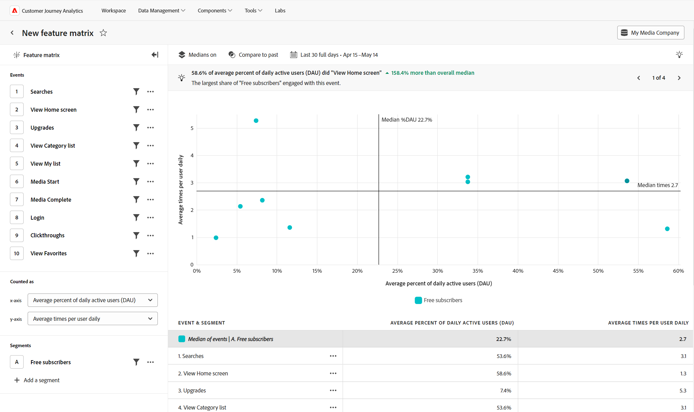

# [!UICONTROL エンゲージメント] 表示

この **[!UICONTROL エンゲージメント]** ビューは、機能が使用された頻度と使用されたユーザーの数に関するインサイトを提供します。 この分析は、複数の機能を相互に比較する場合に最も適しています。 コア、パワー、ワンタイム、疑問の機能を理解することで、投資の意思決定に役立ちます。

このビジュアライゼーションの上部にプロットされる機能は、エンゲージメントのあるユーザー間で頻繁に使用されていることを示します。 このビジュアライゼーションの右側にプロットされる機能は、アクティブユーザーに広く採用されていることを示しています。 機能を使用した中央値の回数により、グラフが水平方向に分割されます。 アクティブユーザーの中央値の割合により、グラフが垂直方向に分割されます。 メディアは、すべてのデータではなく、クエリで選択されたイベントに基づいて計算されます。

* マトリックスの左上にある機能は、 **power** の機能。広く採用されているわけではありませんが、エンゲージメントの高いユーザーがよく使用します。
* マトリックスの右上にある機能は、 **ハイインパクト** 機能。広く採用され、頻繁に使用されます。
* マトリックスの左下に表示される機能は、 **影響の少ない** 機能：広く採用されたり、頻繁に使用されたりしているわけではありません。
* マトリックスの右下に表示される機能は、 **1 回限り** 機能：広く採用されているが、頻繁に使用されているわけではない。

## ユースケース

この表示タイプの使用例を次に示します。

* **機能別エンゲージメント**：特定の機能のエンゲージメントと採用の間の直接的な相関関係を確立できます。 最も多く使用されている機能を理解すると、どの機能をさらに投資すべきかを判断するのに役立ちます。
* **使用率の低い機能の検出**：アクティブなユーザーが少ないが使用率が高い機能は、電源機能を示している場合があります。この機能は、価値はあるものの、より広い人口が検出または使用しているわけではありません。 より多くのユーザーが活用できるように、これらの機能の検出性を高めることを検討してください。
* **一般的な機能の改善**：アクティブなユーザー数が多いが使用状況が低い機能は、その機能が強くリクエストされているが使用率が低いことを示している場合があります。 このような状況では、ユーザーにとってどのような改善が有益かをユーザーから詳しく学ぶ機会が得られます。
* **機能ベースのセグメントの作成**：追加の分析の機会を促すために、機能の使用状況をこの方法で表示します。 グラフ上の任意のポイントのセグメントを作成して、そのユーザーグループをさらに掘り下げ、それらの学習をユーザーエンゲージメント戦略に適用します。
* **機能の採用 A/B テスト**：異なるユーザーグループにわたる複数の機能の使用状況を比較します。 クエリパネルでセグメントを追加して、主要なユーザーグループ間での機能の使用状況の違いを特定します。

## クエリパネル

クエリパネルでは、次のコンポーネントを設定できます。

* **[!UICONTROL イベント]**：測定するイベントです。各イベントは、特定の機能の使用状況を表し、マトリックス内のポイントとして表示されます。 最大 10 個のイベントを含めることができます。 中央値は、選択したイベントに基づいて計算されます。
* **[!UICONTROL 次のようにカウント]**:x 軸に沿って、日別、週別、月別または四半期別のアクティブユーザーの平均割合を測定できます。 Y 軸は、x 軸の選択に基づいて、ユーザーあたりの平均時間を自動的に調整します。
* **[!UICONTROL セグメント]**：測定するセグメント。選択したセグメントごとに、グラフのプロットされたポイント数とテーブルの行数が 2 倍になります。 最大 3 つのセグメントを含めることができます。

>[!TIP]
>
>複数のイベントが 1 つの機能の使用を表している場合、データビューでその機能を表す新しいイベントを派生させることができます。

## グラフ設定

この [!UICONTROL エンゲージメント] ビューには次のグラフ設定があり、グラフ上のメニューで調整できます。

* **[!UICONTROL Medians]**：中央分離線の表示位置と、プロットされた点と中央分離線との関係を指定します。
   * **[!UICONTROL 標準]**：使用状況とエンゲージメントの絶対値を表示します。
   * **[!UICONTROL 正規化]**：各メジアンからの相対的な変化を表示します。
* **[!UICONTROL 上位のイベントのオーバーレイ]**：会社とユーザーの最新性および関連度（クエリレールのイベントセレクターに適用されるのと同じアルゴリズム）に基づいて、上位 20 件のイベントと比較してイベントのパフォーマンスを確認します。

## 時間比較

{{apply-time-comparison}}

## 日付範囲

分析に必要な日付範囲。 この設定には、次の 2 つのコンポーネントがあります。

* **[!UICONTROL 間隔]**：トレンドデータの表示基準となる日付の精度。 このビュータイプはを処理します [!UICONTROL 間隔] ～と同じように [!UICONTROL 次のようにカウント] クエリパネルで変更します。 1 時間ごとのアクティブユーザーはサポートされていません。
* **[!UICONTROL 日付]**：開始日と終了日。 周期的な日付範囲のプリセットと以前に保存したカスタム範囲は便利に使用できます。または、カレンダーセレクターを使用して固定された日付範囲を選択できます。
