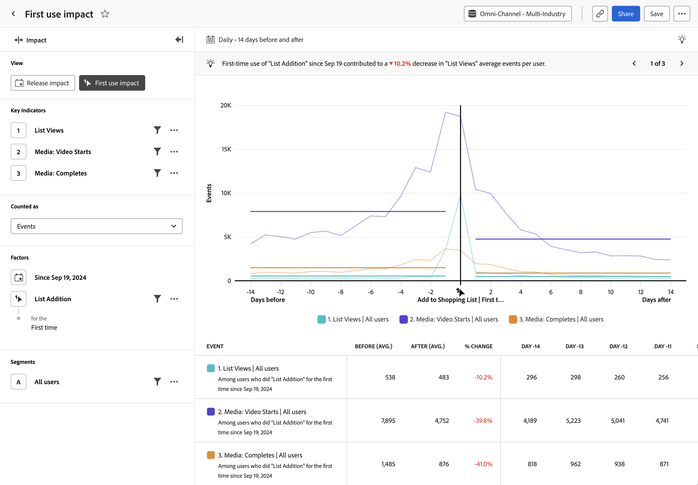

# [!UICONTROL 最初の使用の影響]分析 {#first-use-impact}

<!-- markdownlint-disable MD034 -->

>[!CONTEXTUALHELP]
>id="workspace_guidedanalysis_firstuseimpact_button"
>title="初回使用の影響"
>abstract="機能の初回使用が主要指標に与える影響を測定します。"

<!-- markdownlint-enable MD034 -->

**[!UICONTROL First use impact]** 分析は、ユーザーが初めて製品機能を使用する前と後に実行された主要指標の比較を示します。 このレポートの横軸はイベントの前後の相対的な時間間隔で、縦軸は目的の主要指標を測定します。 グラフの中央にある縦棒は、特定のユーザーが最初に機能を使用した日の 0 日を表します。 ユーザーは必ずしも同じ日に機能を採用するわけではなく、ロールアウトは数日にわたって発生する可能性があるので、0 日目はユーザーごとに異なる意味を持つ場合があります。

>[!VIDEO](https://video.tv.adobe.com/v/3421661/?learn=on)

## ユースケース

この分析のユースケースには、次のものがあります。

* **新機能の分析**：製品内で新機能を起動する場合は、その新機能にユーザーが初めて触れる前と後の主要指標のパフォーマンスを比較できます。
* **段階的なロールアウト**：分析では固定日付ではなく機能の初回使用を探すので、この分析は、機能のロールアウトを段階的に行う場合に役立ちます。
* **新しい製品バージョン分析**：製品の新しいバージョンを起動する場合、ユーザーがその新しいバージョンに初めて公開される前と後に実行された主要指標を比較できます。 初めて使用するイベントとして「任意のイベント」を選択し、バージョン番号プロパティにフィルタリングします。
* **既存の機能の改善**：製品内の既存の機能を改善する場合、ユーザーが新しい改善に初めて触れる前と後の主要指標のパフォーマンスを比較できます。 この解析は、フィーチャーの計装に応じて 1 つまたは複数の方法で実行できます。
   * 改善を表すイベントを最初の使用イベントとして選択
   * 変更のロールアウトを開始する日付を選択します
   * 改善の対象となった人々のグループに分析をセグメント化する
* **キャンペーンの効果**：ユーザーが特定のキャンペーンからクリックスルーする際に、ユーザーがそのキャンペーンで何らかのアクションを起こす前後に実行された主要指標を比較できます。

## インターフェイス

ガイド付き分析インターフェイスの概要については、[ インターフェイス ](../overview.md#interface) を参照してください。 次の設定は、この分析に固有です。

### クエリパネル

クエリパネルでは、次のコンポーネントを設定できます。

* **[!UICONTROL 表示]**：この分析と [ リリース ](release-impact.md) を切り替えます。
* **[!UICONTROL 主要指標]**：ユーザーごとに測定するイベント。 選択した各キーインジケータは、色付きの線で表されます。 イベントを表す行がテーブルに追加されます。 最大 3 つのイベントを含めることができます。
* **[!UICONTROL 次としてカウント]**：選択したイベントに適用するカウント方法。オプションには、[!UICONTROL  ユーザーあたりのイベント ]、[!UICONTROL  イベント ]、[!UICONTROL  セッション ]、[!UICONTROL  ユーザー ] があります。
* **[!UICONTROL 要因]**：この分析には次の 2 つの要因があります。
   * **[!UICONTROL 日付]**：初回使用イベントの検索を開始するまでの期間。
   * **[!UICONTROL イベント]**：分析を中心として配置し、最初に使用することを求めるイベントです。
* **[!UICONTROL セグメント]**：測定するセグメント。 選択したセグメントでは、セグメント条件に一致する個人にのみフォーカスするようにデータをフィルタリングします。 この分析では、単一のセグメントがサポートされています。

### グラフ設定

[!UICONTROL  初回使用の影響 ] 分析では、次のグラフ設定が提供されます。これらの設定は、グラフの上にあるメニューで調整できます。

* **[!UICONTROL グラフのタイプ]**：使用するビジュアライゼーションのタイプ。 オプションには「折れ線」があります。

### 日付範囲

分析はクエリパネルで指定された日付を中心に回転するので、[!UICONTROL  最初の使用の影響 ] 分析での日付選択は、他の分析とは異なる動作をします。 次のオプションがあります。

* **[!UICONTROL 間隔]**：トレンドデータの表示に使用する日付の精度。 有効なオプションには、[!UICONTROL  毎日 ]、[!UICONTROL  毎週 ]、[!UICONTROL  毎月 ]、[!UICONTROL  四半期 ] などがあります。 間隔を変更すると、「前」期間と「後」期間で使用可能なオプションに影響します。
* **[!UICONTROL 期間の前後]**：クエリレールで指定された最初の使用イベントの前後に分析する時間。 使用できるオプションは、「[!UICONTROL  間隔 ] の選択によって異なります。

<!--
## Example

See below for an example of the analysis.

-->
