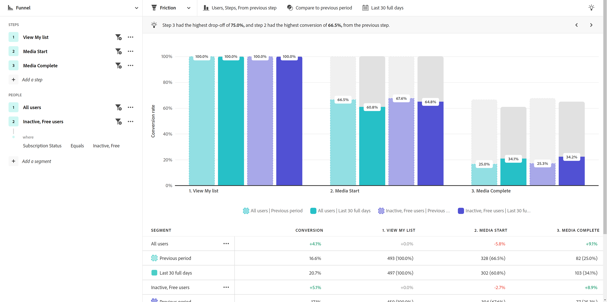

# [!UICONTROL 摩擦] 表示

この **[!UICONTROL 摩擦]** ビューは、製品内の重要なユーザージャーニーを視覚的に表します。 水平軸は、ユーザーが通る必要のある各ステップを表します。 縦軸は、各ステップのユーザーまたはセッションの割合を表します。 すべての手順は最終的な順序で実行する必要がありますが、レポートウィンドウ内でいつでも実行できます。

>[!VIDEO](https://video.tv.adobe.com/v/3421663/?learn=on)

## ユースケース

このビュータイプの使用例を次に示します。

* **コンバージョン分析**:ファネルの各段階でコンバージョンを分析できます。 1 つのステップから次のステップに進むユーザー数を追跡することで、通常とは異なるコンバージョン率や望ましくないコンバージョン率を持つボトルネックを特定できます。 この情報は、製品を改善して即座に結果を得られる場所を理解するのに役立ちます。
* **オンボーディングの最適化**:主要なイベントに関するユーザーの行動を調べて、製品のオンボーディングプロセスを最適化します。 ユーザーが苦労したり、完了に失敗したりした手順を特定できます。
* **機能の採用とエンゲージメント**:製品内の特定の機能に対するユーザーのインタラクションを理解します。 機能関連の手順を通じてユーザの進行状況を分析することで、機能採用率を評価し、特定の機能を放棄したり利用しなくなったりする可能性のある領域を特定できます。 この情報を使用して、機能の改善に焦点を当て、導入率を高めることができます。
* **キャンペーン評価**:マーケティングキャンペーンの効果を測定します。 特定のキャンペーンに触れたユーザーに焦点を当てたセグメントを作成し、そのコンバージョンプロセスを他のキャンペーンや製品全体と比較することができます。

## クエリレール

クエリレールでは、次のコンポーネントを設定できます。

* **[!UICONTROL 手順]**:追跡するイベントタッチポイントです。 グラフの各棒は、1 つのステップを表します。 最大 10 個の手順を含めることができます。
* **[!UICONTROL 人]**:ファネルを比較するセグメント。 選択した各セグメントは、各ステップを複数のバーに分割します。 各色は異なるセグメントを表します。 最大 3 つのセグメントを含めることができます。

## グラフ設定

摩擦ビューには、次のグラフ設定があります。この設定は、グラフの上のメニューで調整できます。

* **[!UICONTROL 指標]**:ファネルに適用するスコープ。 オプションには、 Sessions と Users があります。 セッションを選択すると、カウントされる同じセッション内ですべての手順が実行される必要があります。 ユーザーを選択すると、カウント対象として選択したレポートウィンドウ内ですべての手順が実行されます。
* **[!UICONTROL グラフのタイプ]**:使用するビジュアライゼーションのタイプ。 オプションには「ステップ」があります。
* **[!UICONTROL コンバージョン元]**:ステップごとのパーセンテージ計算を決定します。 「最初のステップ」または「前のステップ」からのコンバージョンの計算が含まれます。

## 時間比較を適用

{{apply-time-comparison}}

## 日付範囲

分析に必要な日付範囲。 この設定には、次の 2 つの要素があります。

* **[!UICONTROL 間隔]**:トレンドデータを表示する日付精度です。 この設定は、摩擦などの非トレンド表示には影響しません。
* **[!UICONTROL 日付]**:開始日と終了日。 周期的な日付範囲プリセットや以前に保存したカスタム範囲を使用して、簡単に利用できます。または、カレンダーセレクターを使用して、固定日付範囲を選択することもできます。
