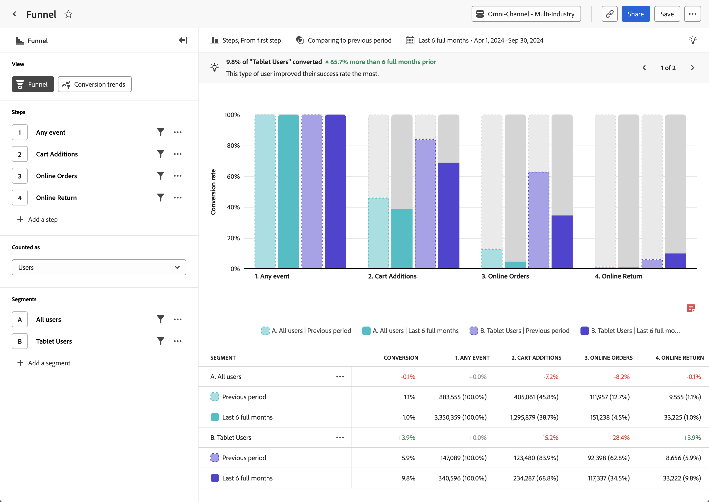

# [!UICONTROL ファネル]分析 {#funnel}

<!-- markdownlint-disable MD034 -->

>[!CONTEXTUALHELP]
>id="workspace_guidedanalysis_funnel_button"
>title="ファネル"
>abstract="ステップ間のコンバージョン率を比較します。"

<!-- markdownlint-enable MD034 -->

**[!UICONTROL ファネル&#x200B;]**分析では、製品における重要なユーザージャーニーを視覚的に表現します。 横軸は、ユーザーが通過する必要がある各手順を表します。 縦軸は、各手順でのユーザーまたはセッションの割合を表します。 すべての手順は、最終的な順序で実行する必要がありますが、レポートウィンドウ内でいつでも実行できます。

>[!BEGINSHADEBOX]

デモ動画については、 [Funnelのフリクション分析](https://video.tv.adobe.com/v/3421663/?quality=12&learn=onn){target="_blank"}を参照してください。

>[!ENDSHADEBOX]

## ユースケース

この分析のユースケースには、次のようなものがあります。

* **コンバージョン分析**：小売チェックアウト、アカウントの新規登録、購読フロー、製品エクスペリエンス内のその他の重要なジャーニーなど、ファネルの各ステージでコンバージョンを分析できます。 ある手順から次の手順に進むユーザーの数を追跡して、異常な、または望ましくないコンバージョン率を持つボトルネックを特定できます。 この情報は、すぐに結果を得るために製品ジャーニーを改善できる場所を把握するのに役立ちます。
* **実験分析**：オプションの手順や A/B 実験が実行されている手順を含むファネルをまたいでコンバージョン率を比較できます。 この情報は、最も高いコンバージョン率につながるファネルのバリエーションを判断するのに役立ち、より多くのユーザーをそのパスに関与させることができます。
* **オンボーディングの最適化**：主要なイベントに関するユーザーの行動を調査して、製品のオンボーディングプロセスを最適化します。 ユーザーが苦労している手順や完了できない手順を特定できます。
* **機能の採用とエンゲージメント**：ユーザーが製品の特定の機能を操作する方法について理解します。 機能に関連する手順を通じてユーザーの進行状況を分析することで、採用率を確認し、ユーザーが特定の機能を十分に活用していない可能性のある領域を特定できます。 この情報を使用して機能の改善に焦点を当てて、採用率を高めることができます。
* **マーケティングチャネルの有効性**：マーケティングチャネルの有効性を測定します。 有料検索、ディスプレイ、自然検索、ダイレクトなど、様々なマーケティングチャネルを操作するユーザーに焦点を当てたセグメントを作成できます。 その後、ジャーニーを比較して、最適な製品成果につながるチャネルを確認できます。

## インターフェイス

ガイド付き分析インターフェイスの概要については、[インターフェイス](../overview.md#interface)を参照してください。 次の設定は、この分析に固有です。

### クエリパネル

クエリパネルでは、次のコンポーネントを設定できます。

* **[!UICONTROL 表示]**：この分析と[コンバージョントレンド](conversion-trends.md)を切り替えます。
* **[!UICONTROL 手順]**：追跡するイベントタッチポイント。 グラフ内の各バーは手順を表します。 最大 10 個の手順を含めることができます。
   * [!UICONTROL 比較]：各手順では、 1 つのファネルステップで複数のイベントを比較するオプションが用意され、「分岐ファネル」が作成されます。 この機能を使用すると、2 つの個別の分析を作成しなくても、2 つのジャーニーのフリクションを並べて比較できます。 これは、ステップオプションがある場合や、ファネル内で A/B 実験が実行されている場合に役立ちます。 ファネルの比較方法を説明するビデオについては、Customer Journey Analytics チュートリアルの[ファネル](https://experienceleague.adobe.com/ja/docs/customer-journey-analytics-learn/tutorials/guided-analysis/funnel)を参照してください。
* **[!UICONTROL 次としてカウント]**：ファネルに適用する範囲。 オプションには、[!UICONTROL セッション]と[!UICONTROL ユーザー]が含まれます。
   * [!UICONTROL セッション]：すべての手順が、同じセッション内で発生してカウントされる必要があります。
   * [!UICONTROL ユーザー]：すべての手順が、選択したレポートウィンドウ内で発生してカウントされる必要があります。
* **[!UICONTROL セグメント]**：ファネル全体を比較するセグメント。 選択した各セグメントは、各手順を複数のバーに分割します。 各カラーは、異なるセグメントを表します。 最大 3 つのセグメントを含めることができます。

### グラフ設定

[!UICONTROL ファネル]分析には次のグラフ設定が用意されており、グラフの上にあるメニューで調整できます。

* **[!UICONTROL グラフのタイプ]**：使用するビジュアライゼーションのタイプ。 オプションには、[!UICONTROL 手順]が含まれます。
* **[!UICONTROL コンバージョン元]**：手順ごとにパーセンテージ計算を決定します。 オプションには、[!UICONTROL 最初の手順]または[!UICONTROL 前の手順]からのコンバージョンの計算が含まれます。

### 時間比較

{{apply-time-comparison}}

### 日付範囲

分析に対する目的の日付範囲。 この設定には、次の 2 つのコンポーネントがあります。

* **[!UICONTROL 間隔]**：トレンドデータの表示に使用する日付の精度。 この設定は、[ファネル](funnel.md)などの非トレンド分析には影響を与えません。
* **[!UICONTROL 日付]**：開始日と終了日。 便宜上、周期的な日付範囲のプリセットと以前に保存したカスタム範囲を使用できます。または、カレンダーセレクターを使用して固定日付範囲を選択することもできます。

<!--
## Example

See below for an example of the analysis.

-->
