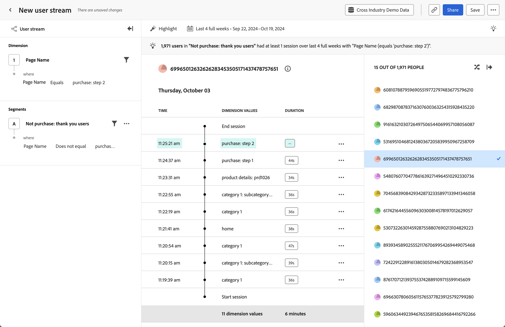

# [!UICONTROL タイムライン]分析 {#timeline}

<!-- markdownlint-disable MD034 -->

>[!CONTEXTUALHELP]
>id="workspace_guidedanalysis_timeline_button"
>title="タイムライン"
>abstract="ユーザーレベルのセッションイベントの推移を監視します。"

<!-- markdownlint-enable MD034 -->

 **[!UICONTROL タイムライン]**&#x200B;分析を使用すると、ユーザーレベルのセッションイベントの推移を監視して、エクスペリエンスのパターンを見つけ、より良いユーザーストーリーを伝えることができます。左側のパネルでは、プロパティ値とセグメントでストリームをフィルタリングできます。右側のパネルでは、フィルター条件に一致するユーザーのランダム化リストから選択できます。中央の領域には、タイムスタンプ、プロパティ値、期間で構成される、選択したユーザーのセッション別のストリームが表示されます。特定のセッションの最後のイベントでは、期間は使用できません。

>[!NOTE]
>
>[!UICONTROL タイムライン]分析では、[データビュー](/help/data-views/component-reference.md#optional)で&#x200B;**[!UICONTROL ユーザー ID]** 標準コンポーネントが使用可能である必要があります。 データビューへのユーザー ID のインクルージョンは、Customer Journey Analytics 管理者によって管理され、組織はこのデータにアクセスできるユーザーに対する完全なプライバシー制御が可能になります。
>&#x200B;> データビューに[!UICONTROL ユーザー ID] コンポーネントを含めていない場合は、次のメッセージが表示されます。
>
>* **管理者**：*この分析には、PersonID プロパティが必要です。データビューにユーザー ID を追加してください。*
>* **管理者以外**：*この分析には、PersonID プロパティが必要です。データビューにユーザー ID を追加するには、Customer Journey Analytics 管理者にお問い合わせください。*

>[!VIDEO](https://video.tv.adobe.com/v/3435768/?quality=12&learn=on&captions=jpn)

## ユースケース

この分析のユースケースには、次のようなものがあります。

* **フリクションの探索**：[ファネル分析](funnel.md)で急激な低下が見つかった場合は、これらのユーザーのセグメントを作成し、この分析でそのセグメントを適用して潜在的な原因を調査できます。
* **エラーの動作**：ユーザーに製品エラーが発生した場合、そのエラーが発生する前または後にユーザーが何をしていたかを探索できます。
* **データ収集の検証**：データ管理者は、この分析を独自のユーザー ID にフィルタリングして、組織の実装が期待どおりに機能していることを検証できます。

## インターフェイス

ガイド付き分析インターフェイスの概要については、[インターフェイス](../overview.md#interface)を参照してください。次の設定は、この分析に固有です。

### クエリパネル

クエリパネルでは、次のコンポーネントを設定できます。

* **[!UICONTROL ディメンション]**：ストリーミングされた値を表示するディメンション。中央のストリームには、選択したディメンションの値が表示されます。また、フィルターを適用して、ストリームをより関連性の高いデータに絞り込むこともできます。フィルターの有効な演算子には、[!UICONTROL 次と等しい]、[!UICONTROL 次と等しくない]、[!UICONTROL 次で始まる]、[!UICONTROL 次で終わる]、[!UICONTROL 次を含む]、[!UICONTROL 次を含まない]、[!UICONTROL 存在する]、[!UICONTROL 存在しない]などがあります。
* **[!UICONTROL セグメント]**：分析するセグメント。選択したセグメントでは、データがフィルタリングされ、セグメント条件に一致する個人にのみ焦点が当てられます。分析を特定のユーザー ID に絞り込む場合は、右側のパネルでそのユーザー ID にフィルタリングできます。この分析では、1 つのセグメントがサポートされます。

### グラフ設定

[!UICONTROL タイムライン]分析には次のグラフ設定が用意されており、グラフの上にあるメニューで調整できます。

* **[!UICONTROL 次の形式で表示]**：目的のプロパティ値を表示します。
   * [!UICONTROL すべてを表示]：セッション内のすべてのプロパティ値を表示します。
   * [!UICONTROL ハイライト表示]：クエリフィルターに一致するセッション内のプロパティ値を視覚的にハイライト表示します。
   * [!UICONTROL 表示のみ]：クエリフィルターに一致するセッション内のプロパティ値のみを表示します。

### 日付範囲

分析に対する目的の日付範囲。この設定には、次の 2 つのコンポーネントがあります。

* **[!UICONTROL 間隔]**：トレンドデータの表示に使用する日付の精度。この設定は、タイムラインなどの非トレンド分析には影響を与えません。
* **[!UICONTROL 日付]**：開始日と終了日。便宜上、周期的な日付範囲のプリセットと以前に保存したカスタム範囲を使用できます。または、カレンダーセレクターを使用して固定日付範囲を選択することもできます。

<!--

## Example

See below for an example of the analysis.

-->
