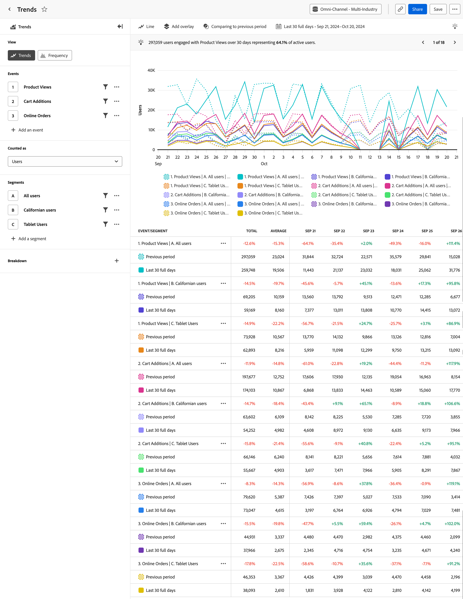

# [!UICONTROL 傾向]分析 {#trends}

<!-- markdownlint-disable MD034 -->

>[!CONTEXTUALHELP]
>id="workspace_guidedanalysis_trends_button"
>title="トレンド"
>abstract="ユーザーエンゲージメントの推移を測定します。"

<!-- markdownlint-enable MD034 -->

 **[!UICONTROL トレンド]**&#x200B;分析は、製品のパフォーマンスやユーザーの行動の推移に関する貴重なインサイトを提供します。 このレポートの横軸は時間間隔で、縦軸は目的のイベントの測定値です。

>[!VIDEO](https://experienceleague.adobe.com/en/docs/customer-journey-analytics-learn/tutorials/guided-analysis/trends)

## ユースケース

この分析のユースケースには、次のようなものがあります。

* **製品パフォーマンスの評価**：トレンド分析を使用すると、特定の期間における製品の全体的なパフォーマンスを評価できます。 ユーザーエンゲージメント率、採用率、コンバージョン率などの指標を分析することで、製品のパフォーマンスが向上しているか、低迷しているか、低下しているかを特定できます。
* **機能の採用**：トレンド分析を使用すると、リリースした新機能やアップデートをユーザーがどの程度採用しているかを把握できます。 どの機能が人気があり、どの機能を改善する必要があるかを判断できます。 この情報を使用すると、開発作業に優先順位を付けるための機能に関して、データに基づく意思決定を行うことができます。
* **ユーザー行動**：トレンド分析は、ユーザー行動の推移に関するインサイトを提供できます。 ユーザーが実行する特定のアクションを調べることで、ユーザーが離脱する可能性のあるパターンを特定できます。 この分析からのインサイトを[ファネル](funnel.md)と組み合わせることで、行動に関するさらに多くのインサイトを得ることができます。
* **A/B テストと実験**：製品内で A/B テストを実行する場合、トレンド分析を使用して、どのテストの推移が最も成功だったかを測定できます。

## インターフェイス

ガイド付き分析インターフェイスの概要については、[インターフェイス](../overview.md#interface)を参照してください。 次の設定は、この分析に固有です。

### クエリパネル

クエリパネルでは、次のコンポーネントを設定できます。

* **[!UICONTROL 表示]**：この分析と[頻度](frequency.md)を切り替えます。
* **[!UICONTROL イベントと指標]**：測定するイベントまたは指標です。 各選択範囲が、グラフの系列やテーブルの行として表されます。 イベントと指標をクエリで組み合わせることはできません。最初の選択を行ったら、残りのクエリの選択項目は同じタイプにする必要があります。 最大 5 つの選択項目を含めることができます。
* **[!UICONTROL 次としてカウント]**：選択したイベントに適用するカウント方法。 <ul><li>**[!UICONTROL オプション]**&#x200B;には、[!UICONTROL &#x200B; ユーザー]、[!UICONTROL &#x200B; イベント &#x200B;]、[!UICONTROL &#x200B; セッション &#x200B;]、[!UICONTROL &#x200B; ユーザーの割合]、[!UICONTROL &#x200B; セッションごとのイベント &#x200B;]、および[!UICONTROL &#x200B; ユーザーごとのイベント &#x200B;]が含まれます。</li><li>[!BADGE B2B edition]{type=Informative url="https://experienceleague.adobe.com/ja/docs/analytics-platform/using/cja-overview/cja-b2b/cja-b2b-edition" newtab=true tooltip="Customer Journey Analytics B2B Edition"}追加の&#x200B;**[!UICONTROL B2B オプション]**&#x200B;がCustomer Journey Analytics B2B editionで利用できます：[!UICONTROL &#x200B; グローバルアカウント &#x200B;]、[!UICONTROL &#x200B; アカウント &#x200B;]、[!UICONTROL 購買グループ &#x200B;]、[!UICONTROL &#x200B; グローバルアカウントの割合]、[!UICONTROL &#x200B; グローバルアカウントの割合]、[!UICONTROL &#x200B; アカウントの割合]、[!UICONTROL 購買グループの割合]、[!UICONTROL 商談の割合] イベント アカウント 、購買グループごとの[!UICONTROL &#x200B; イベント &#x200B;]、商談ごとの[!UICONTROL &#x200B; イベント &#x200B;]。</li></ul>「次としてカウント」オプションは、イベントクエリにのみ適用され、指標クエリでは削除されます。
* **[!UICONTROL セグメント]**：測定するセグメント。 選択した各セグメントによって、グラフの系列とテーブルの行の数が 2 倍になります。 最大 5 つのセグメントを含めることができます。
* **[!UICONTROL 分類プロパティ]**：グラフの系列とテーブルの行を、選択したプロパティの値で分類します。 単一の分類プロパティがサポートされています。 テーブルには上位 20 個の値が表示され、最大 10 個の値をグラフに表示できます。 アイコンを切り替えることで、グラフの行を非表示にしたり表示したりできます。

### グラフ設定

[!UICONTROL トレンド]分析には次のグラフ設定が用意されており、グラフの上にあるメニューで調整できます。

* **[!UICONTROL グラフのタイプ]**：使用するビジュアライゼーションのタイプ。 オプションには、折れ線グラフ、棒グラフ、積み重ね棒グラフ、積み重ね面グラフがあります。

### オーバーレイ

グラフにデータを追加します。 複数の系列がグラフに表示されている場合、オーバーレイはカーソルを合わせたときにのみ表示されます。

* **[!UICONTROL 異常値検出]**：トレンド分析で[異常値検出](/help/analysis-workspace/c-anomaly-detection/anomaly-detection.md)を実行します。 異常値はドットとして表示され、その上にポインタを合わせると詳細が表示されます。
* **[!UICONTROL トレンドラインオーバーレイ]**：データのより明確なパターンを表現するのに役立つトレンドラインをグラフに追加します。
   * [!UICONTROL 線形]：直線回帰線を作成します。 一定の割合で増加または減少する単純な線形データに最適です。 数式：`y = a + b * x`
   * [!UICONTROL 対数]：曲線回帰線を作成します。 急速に増加または減少し、その後レベルが高くなるデータに最適です。 数式：`y = a + b * log(x)`
   * [!UICONTROL 移動平均]：平均値のセットに基づいて、滑らかなトレンドラインを作成します。 移動平均は、ローリング平均とも呼ばれ、特定数の以前のデータポイント（選択で決定される）を使用して、それらを平均し、その平均値を折れ線グラフのポイントとして使用します。 例えば、7 日の移動平均や 4 週間の移動平均があります。 使用できる移動平均オプションは、選択した間隔と日付範囲によって異なります。

### 時間比較

{{apply-time-comparison}}

### 日付範囲

分析に対する目的の日付範囲。 この設定には、次の 2 つのコンポーネントがあります。

* **[!UICONTROL 間隔]**：トレンドデータの表示に使用する日付の精度。 有効なオプションには、毎時、毎日、毎週、毎月、四半期ごとが含まれます。 同じ日付範囲に異なる間隔を設定すると、グラフのデータポイント数とテーブルの列数に影響を与える場合があります。 例えば、毎日の精度で 3 日間にわたる分析を表示すると、3 つのデータポイントのみが表示されますが、毎時の精度で 3 日間にわたる分析を表示すると、72 のデータポイントが表示されます。
* **[!UICONTROL 日付]**：開始日と終了日。 便宜上、周期的な日付範囲のプリセットと以前に保存したカスタム範囲を使用できます。または、カレンダーセレクターを使用して固定日付範囲を選択することもできます。

<!--

## Example

See below for an example of the analysis.

-->