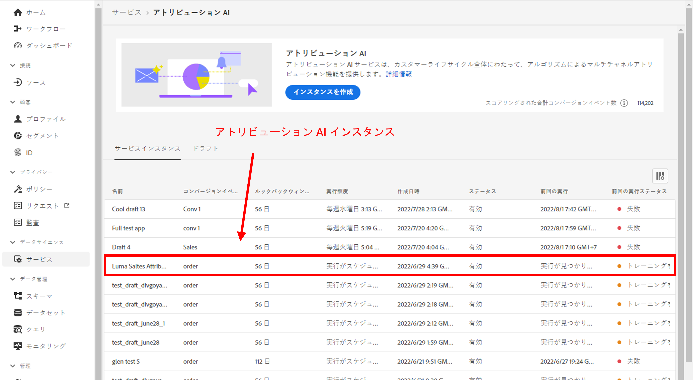

# アトリビューション AI と CJA の統合

[アトリビューション AI](https://experienceleague.adobe.com/docs/experience-platform/intelligent-services/attribution-ai/overview.html?lang=ja) は、Adobe Experience Platform インテリジェントサービスの一部で、顧客とのやり取りの影響と増分的な効果を指定した成果に照らして計算する、マルチチャネルのアルゴリズムアトリビューションサービスです。アトリビューション AI を使用すると、マーケターは、カスタマージャーニーの各段階における個々の顧客インタラクションの影響を把握することで、マーケティング費用と広告費用を測定し、最適化できます。

Attribution AI は、顧客のマーケティングタッチポイントおよびコンバージョンデータソースに対して Attribution AI がモデルを実行する範囲内で Customer Journey Analytics（CJA）と統合されます。次に、CJA は、これらのモデルの出力をデータセットとして読み込みます。または、他の CJA データセットと統合することもできます。Attribution AIが有効なデータセットは、CJA のデータビューとレポートで利用できます。

アトリビューション AI は、Experience Event、Adobe Analytics、Consumer Experience Event の 3 つの Experience Platform スキーマをサポートします。

アトリビューション AI では、スコアの 2 つのカテゴリ（アルゴリズムとルールベース）をサポートしています。

## アルゴリズムスコア

アルゴリズムスコアには、増分スコアと影響スコアが含まれます。

* **[!UICONTROL 影響]スコア**&#x200B;では、マーケティングチャネル間でコンバージョンクレジットの 100%を配分します。
* **[!UICONTROL 増分]スコア**&#x200B;ではまず、マーケティングを行わなくても達成できたコンバージョンベースラインを考慮します。このベースラインは、既存のブランド認知度、忠誠度、口コミによるパターンや季節性などの AI による観測に依存します。残りのクレジットはマーケティングチャネル間で分割されます。

## ルールベースのスコア

ルールベーススコアには、以下が含まれます

* **[!UICONTROL ファーストタッチ]**：アトリビューションのルックバックウィンドウで最初に確認されたタッチポイントに 100％のクレジットが与えられます。
* **[!UICONTROL ラストタッチ]**：コンバージョンの直前に発生したタッチポイントに 100％のクレジットが与えられます。
* **[!UICONTROL 線形]**：線形コンバージョンにつながるすべてのタッチポイントに対して、同等のクレジットが与えられます。
* **[!UICONTROL U 字型]**：最初のインタラクションに 40％のクレジット、最後のインタラクションに 40％のクレジットが与えられ、残りの 20％がその間のタッチポイントに割り振られます。タッチポイントが 1 つのコンバージョンの場合、100％のクレジットが与えられます。タッチポイントが 2 つのコンバージョンの場合、両方に 50％のクレジットが与えられます。
* **[!UICONTROL タイムディケイ]**：カスタムの半減期パラメーター（デフォルトは 7 日）で指定される指数関数的減衰に従います。各チャネルの重みは、タッチポイントの開始から最終的なコンバージョンまでの経過時間によって異なります。クレジットの決定に使用される式は `2^(-t/halflife)` です。ここで、`t` は、タッチポイントからコンバージョンまでの時間を表します。その後、すべてのタッチポイントが 100％に正規化されます。

## ワークフロー

手順の一部は、CJA の出力を処理する前に、Adobe Experience Platform で実行されます。出力は、適用されたデータモデルを持つ Attribution AI セットで構成されます。

### 手順 1：Attribution AI インスタンスの作成

Experience Platform で、データを選択およびマッピングし、イベントを定義し、データをトレーニングすることで、アトリビューション AI インスタンスを作成します（[こちら](https://experienceleague.adobe.com/docs/experience-platform/intelligent-services/attribution-ai/user-guide.html?lang=ja)を参照）。

### 手順 2：Attribution AI セットへの CJA 接続の設定

CJA で、Attribution AI 用に実装された Experience Platform セットに、[1 つ以上の接続を作成](/help/connections/create-connection.md)できるようになりました。これらのデータセットは、次に示すように、「Attribution AI スコア」プレフィックスで表示されます。

### 手順 3：これらの接続に基づいたデータビューを作成する

CJA で、Attribution AI XDM フィールドを含む [1 つ以上のデータビューを作成](/help/data-views/create-dataview.md)します。

タッチポイントの XDM スキーマフィールドを次に示します。

次に、コンバージョン用の XDM スキーマフィールドを示します。

### 手順 4：CJA ワークスペースでの AAI データのレポート

CJA ワークスペースプロジェクトでは、「AAI 注文」などの指標や、「AAI キャンペーン名」や「AAI マーケティングチャネル」などのディメンションを取り込むことができます。

AAI での生のスコア出力にはネストされたスキーマがあり、フィールドへのパスには、テーブルやビジュアライゼーションのスペースのほとんどを占めるのに十分な長さが含まれます。 くつろいで [!UICONTROL 表示名] は、次のルールに従って、CJA で自動的に生成および活用されます。

* すべてのフィールドには「AAI」プレフィックスが付きます
* タッチポイントフィールドの場合：
   * スコア XDM の一部であるフィールドの場合、CJA では次のように表示されます。 `AAI T {field name}`
   * passThrough 列として含まれるフィールドは、CJA に次のように表示されます。 `AAI T PT {field name}`
* コンバージョンフィールドの場合：
   * スコア XDM の一部であるフィールドの場合、CJA では次のように表示されます。 `AAI C {field name}`
   * passThrough 列として含まれるフィールドは、CJA に次のように表示されます。 `AAI C PT {field name}`

**注文と影響スコアおよび増分スコア**

AAI データを使用したワークスペースプロジェクトが表示され、注文と影響スコアおよび増分スコアを確認できます。任意のディメンションにドリルダウンして、キャンペーン、製品グループ、ユーザーセグメント、地域などによってアトリビューションを理解します。

**マーケティング効果**

様々なアトリビューションモデル間でタッチポイントアトリビューションを比較および対比させます。

**チャネルインタラクション**

ベン図を使用してチャネルのインタラクションを理解し、他のチャネルと最も効果的に使用できるチャネルを確認します。

**コンバージョンへの上位パス**

次の表に、タッチポイントの設計と最適化に役立つ、コンバージョン（重複排除）への上位パスを示します。

**コンバージョンまでのリードタイム**

ここでは、タッチポイントが混在している場合の、コンバージョンまでのリードタイムを確認します。リードタイムの最適化に役立ちます。

## アトリビューション AI と Attribution IQ の違い

では、CJA のネイティブ機能である [Attribution IQ](/help/analysis-workspace/attribution/overview.md) と比較して、アトリビューション AI データはどのような場合に使用する必要があるでしょうか。次の表に、機能の違いの一部を示します。

| 機能 | アトリビューション AI | Attribution IQ |
| --- | --- | --- |
| 増分アトリビューションを実行 | ○ | × |
| ユーザーにモデルの調整を許可 | ○ | ○ |
| チャネルをまたいだアトリビューションを行う（メモ：AAI は CJA と同じステッチされたデータを使用しない。） | ○ | ○ |
| 影響スコアを含む | ○ | ○ |
| ML モデリングを行う | ○ | ○ |
| 地域ベースのアトリビューションモデル | ○ | ○ |
| モデルでマーケティングタッチポイントを設定できる | ○ | × |

{style=&quot;table-layout:auto&quot;}
