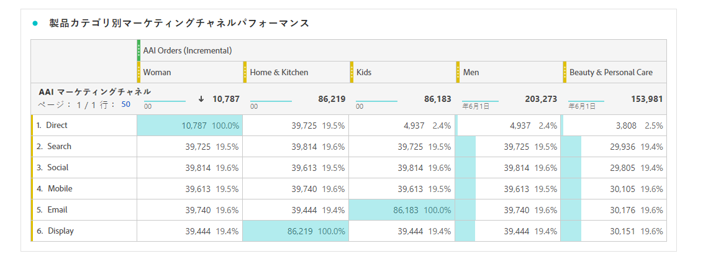

# Attribution AIと CJA の統合

>[!NOTE]
>
>この機能は 2022 年 5 月 25 日にリリースされます。

[Attribution AI](https://experienceleague.adobe.com/docs/experience-platform/intelligent-services/attribution-ai/overview.html?lang=en)は、Adobe Experience Platformインテリジェントサービスの一部で、指定した結果に対する顧客とのやり取りの影響と増分的な影響を計算する、マルチチャネルのアルゴリズムアトリビューションサービスです。 マーケターは、Attribution AIジャーニーの各段階における個々の顧客インタラクションの影響を把握することで、マーケティング費用と広告費用を測定し、最適化できます。

Attribution AIはCustomer Journey Analytics(CJA) と統合され、顧客のマーケティングタッチポイントおよびコンバージョンデータソースに対してAttribution AIがモデルを実行する範囲で実行されます。 次に、CJA は、これらのモデルの出力をデータセットとして読み込みます。または、他の CJA データセットと統合することもできます。 Attribution AIが有効なデータセットは、CJA のデータビューとレポートで利用できます。

Attribution AIは、次の 3 つのExperience Platformスキーマをサポートします。エクスペリエンスイベント、Adobe Analytics、および消費者エクスペリエンスイベント。

Attribution AIは、次の 2 つのカテゴリのスコアをサポートします。アルゴリズムとルールベースの両方を使用できます。

## アルゴリズムスコア

アルゴリズムスコアには、増分スコアと影響スコアが含まれます。

* **[!UICONTROL 影響] スコア** マーケティングチャネル間でコンバージョンクレジットの 100%を配分します。
* **[!UICONTROL 増分] スコア** まず、マーケティングを行わなくても達成できたコンバージョンベースラインを考慮します。 このベースラインは、既存のブランド認知度、忠誠度、口コミによるパターンや季節性などの AI による観測に依存します。 残りのクレジットはマーケティングチャネルに分割されます。

## ルールベースのスコア

ルールベーススコアには、以下が含まれます

* **[!UICONTROL ファーストタッチ]** は、アトリビューションルックバックウィンドウで最初に確認されたタッチポイントに 100%のクレジットを与えます。
* **[!UICONTROL ラストタッチ]** は、コンバージョンの直前に発生したタッチポイントに 100%のクレジットを与えます。
* **[!UICONTROL 線形]** は、コンバージョンにつながるすべてのタッチポイントに対して、同等のクレジットを与えます。
* **[!UICONTROL U 字形]** は最初のインタラクションに 40%のクレジット、最後のインタラクションに 40%のクレジットを与え、残りの 20%をその間のタッチポイントに割り振ります。 タッチポイントが 1 つのコンバージョンの場合、100％のクレジットが与えられます。タッチポイントが 2 つのコンバージョンの場合、両方に 50％のクレジットが与えられます。
* **[!UICONTROL タイムディケイ]** カスタムの半減期パラメーター（デフォルトは 7 日）で指定される指数関数的減衰に従います。 各チャネルの重みは、タッチポイントの開始から最終的なコンバージョンまでの経過時間によって異なります。クレジットの決定に使用される式は `2^(-t/halflife)` です。ここで、`t` は、タッチポイントからコンバージョンまでの時間を表します。その後、すべてのタッチポイントが 100％に正規化されます。

## ワークフロー

一部の手順は、CJA での出力を操作する前に、Adobe Experience Platformで実行されます。 出力は、適用されたデータモデルを持つAttribution AIセットで構成されます。

### 手順 1:Attribution AIインスタンスの作成

Experience Platformで、Attribution AIを選択してマッピングし、イベントを定義し、データをトレーニングすることで、データインスタンスを作成します（説明を参照） [ここ](https://experienceleague.adobe.com/docs/experience-platform/intelligent-services/attribution-ai/user-guide.html).

### 手順 2:Attribution AIセットへの CJA 接続の設定

CJA で、次の操作を実行できます。 [1 つ以上の接続を作成](/help/connections/create-connection.md) を、Attribution AI用に実装されたExperience Platformセットに追加しました。 これらのデータセットは、次に示すように、「Attribution AIスコア」プレフィックスで表示されます。

### 手順 3:これらの接続に基づくデータビューの作成

CJA では、 [1 つ以上のデータビューを作成する](/help/data-views/create-dataview.md) Attribution AIXDM フィールドを含む （ここにスクリーンショットを表示すると便利です）。

### 手順 4:CJA Workspace での AAI データのレポート

CJA Workspace プロジェクトでは、「AAI 注文」などの指標や、「AAI キャンペーン名」や「AAI マーケティングチャネル」などのディメンションを取り込むことができます。

>[!IMPORTANT]
>
>これらのディメンションと指標は、この方法ではネイティブで名前が付けられません。 これらは「わかりやすい名前」です。 この [Attribution AIの命名規則](https://experienceleague.adobe.com/docs/experience-platform/intelligent-services/attribution-ai/input-output.html?lang=en#attribution-ai-output-data) スキーマパスに従います。 AAI 内の長いスキーマパス名を、CJA で短く、よりわかりやすい名前（ディメンション/指標）に変更することをお勧めします。 これは、 **[!UICONTROL データビュー]** > **[!UICONTROL データビューを編集]** > **[!UICONTROL コンポーネント]** タブ/ **[!UICONTROL スキーマフィールド]** -> スキーマフィールドをクリック —> **[!UICONTROL コンポーネント名]**.

**影響スコアと増分スコアを持つ注文**

AAI データを含む Workspace プロジェクトが表示され、影響スコアと増分スコアを含む注文が示されます。 任意のディメンションにドリルダウンして、次の方法でアトリビューションを理解します。キャンペーン、製品グループ、ユーザーセグメント、地域など。

**マーケティング効果**

様々なアトリビューションモデル間でのタッチポイントアトリビューションの比較とコントラスト：

**チャネルインタラクション**

ベン図を使用して、チャネルのインタラクションを理解し、他のチャネルと最も効果的に使用できるチャネルを確認します。

**コンバージョンへの上位のパス**

次の表に、タッチポイントの設計と最適化に役立つ、コンバージョン（重複排除）への上位のパスを示します。

**コンバージョンへのリードタイム**

ここでは、タッチポイントがミックスに含まれる場合のコンバージョンへのリードタイムを確認します。 リードタイムの最適化に役立ちます。

## Attribution AIとAttribution IQの違い

したがって、Attribution AIデータを使用するタイミングと [Attribution IQ](/help/analysis-workspace/attribution/overview.md)、ネイティブの CJA 機能？ 次の表に、機能の違いを示します。

| 機能 | アトリビューション AI | Attribution IQ |
| --- | --- | --- |
| 増分アトリビューションを実行 | ○ | × |
| ユーザーがモデルを調整できるようにします | ○ | ○ |
| チャネルをまたいで属性を設定します ( 注意：AAI は、CJA と同じステッチ済みデータを使用しません )。 | ○ | ○ |
| 影響スコアが含まれます | ○ | ○ |
| ML モデリングを実行 | ○ | ○ |
| 地域ベースのアトリビューションモデル | ○ | ○ |
| モデルにマーケティングタッチポイントを含めることができます | ○ | × |

{style=&quot;table-layout:auto&quot;}
