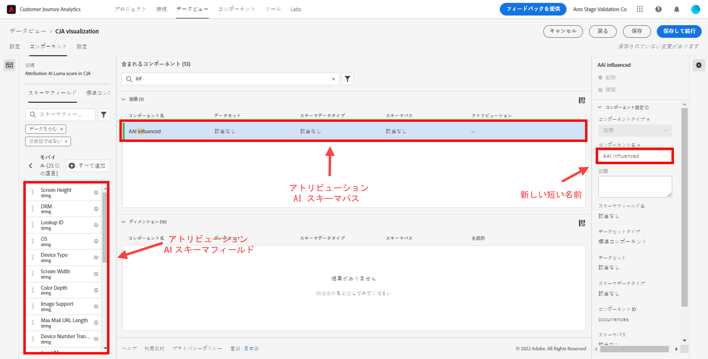
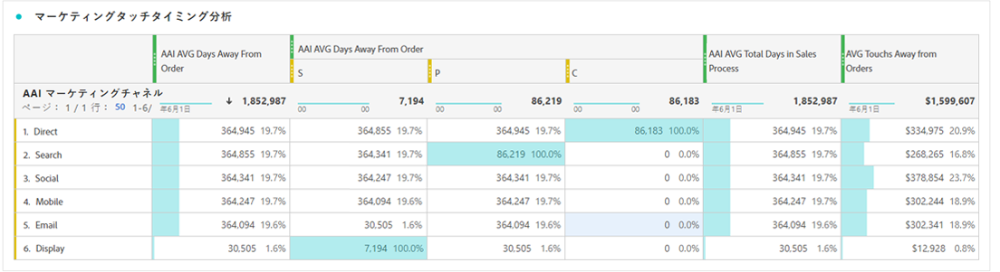

# アトリビューション AI と CJA の統合

[アトリビューション AI](https://experienceleague.adobe.com/docs/experience-platform/intelligent-services/attribution-ai/overview.html?lang=ja) は、Adobe Experience Platform インテリジェントサービスの一部で、顧客とのやり取りの影響と増分的な効果を指定した成果に照らして計算する、マルチチャネルのアルゴリズムアトリビューションサービスです。アトリビューション AI を使用すると、マーケターは、カスタマージャーニーの各段階における個々の顧客インタラクションの影響を把握することで、マーケティング費用と広告費用を測定し、最適化できます。

Attribution AIはCustomer Journey Analytics(CJA) と統合され、顧客のマーケティングタッチポイントおよびコンバージョンデータソースに対してAttribution AIがモデルを実行する範囲で実行されます。 次に、CJA は、これらのモデルの出力をデータセットとして読み込みます。または、他の CJA データセットと統合することもできます。 アトリビューション AI に対応したデータセットは、CJA のデータビューおよびレポートで活用できます。

アトリビューション AI は、Experience Event、Adobe Analytics、Consumer Experience Event の 3 つの Experience Platform スキーマをサポートします。

アトリビューション AI では、スコアの 2 つのカテゴリ（アルゴリズムとルールベース）をサポートしています。

## アルゴリズムスコア

アルゴリズムスコアには、増分スコアと影響スコアが含まれます。

* **[!UICONTROL 影響] スコア** マーケティングチャネル間でコンバージョンクレジットの 100%を配分します。
* **[!UICONTROL 増分] スコア** まず、マーケティングを行わなくても達成できたコンバージョンベースラインを考慮します。 このベースラインは、既存のブランド認知度、忠誠度、口コミによるパターンや季節性などの AI による観測に依存します。 残りのクレジットはマーケティングチャネルに分割されます。

## ルールベースのスコア

ルールベーススコアには、以下が含まれます

* **[!UICONTROL ファーストタッチ]** は、アトリビューションルックバックウィンドウで最初に確認されたタッチポイントに 100%のクレジットを与えます。
* **[!UICONTROL ラストタッチ]** は、コンバージョンの直前に発生したタッチポイントに 100%のクレジットを与えます。
* **[!UICONTROL 線形]** は、コンバージョンにつながるすべてのタッチポイントに対して、同等のクレジットを与えます。
* **[!UICONTROL U 字形]** は最初のインタラクションに 40%のクレジット、最後のインタラクションに 40%のクレジットを与え、残りの 20%をその間のタッチポイントに割り振ります。 タッチポイントが 1 つのコンバージョンの場合、100％のクレジットが与えられます。タッチポイントが 2 つのコンバージョンの場合、両方に 50％のクレジットが与えられます。
* **[!UICONTROL タイムディケイ]** カスタムの半減期パラメーター（デフォルトは 7 日）で指定される指数関数的減衰に従います。 各チャネルの重みは、タッチポイントの開始から最終的なコンバージョンまでの経過時間によって異なります。クレジットの決定に使用される式は `2^(-t/halflife)` です。ここで、`t` は、タッチポイントからコンバージョンまでの時間を表します。その後、すべてのタッチポイントが 100％に正規化されます。

## ワークフロー

手順の一部は、CJA の出力を処理する前に、Adobe Experience Platform で実行されます。出力は、適用されたデータモデルを持つAttribution AIセットで構成されます。

### 手順 1:Attribution AIインスタンスの作成

Experience Platform で、データを選択およびマッピングし、イベントを定義し、データをトレーニングすることで、アトリビューション AI インスタンスを作成します（[こちら](https://experienceleague.adobe.com/docs/experience-platform/intelligent-services/attribution-ai/user-guide.html?lang=ja)を参照）。

### 手順 2:Attribution AIセットへの CJA 接続の設定

CJA で、次の操作を実行できます。 [1 つ以上の接続を作成](/help/connections/create-connection.md) を、Attribution AI用に実装されたExperience Platformセットに追加しました。 これらのデータセットは、次に示すように、「Attribution AIスコア」プレフィックスで表示されます。

### 手順 3:これらの接続に基づくデータビューの作成

CJA では、 [1 つ以上のデータビューを作成する](/help/data-views/create-dataview.md) Attribution AIXDM フィールドを含む

タッチポイントの XDM スキーマフィールドを次に示します。

次に、変換用の XDM スキーマフィールドを示します。

### 手順 4:CJA Workspace での AAI データのレポート

CJA Workspace プロジェクトでは、「AAI 注文」などの指標や、「AAI キャンペーン名」や「AAI マーケティングチャネル」などのディメンションを取り込むことができます。

>[!IMPORTANT]
>
>これらのディメンションと指標は、この方法ではネイティブで名前が付けられません。 これらは「わかりやすい名前」です。 この [Attribution AIの命名規則](https://experienceleague.adobe.com/docs/experience-platform/intelligent-services/attribution-ai/input-output.html?lang=en#attribution-ai-output-data) スキーマパスに従います。 CJA で、長い AAI スキーマのパス名を短く、よりわかりやすい名前（ディメンション/指標）に変更することをお勧めします。 これは、 **[!UICONTROL データビュー]** > **[!UICONTROL データビューを編集]** > **[!UICONTROL コンポーネント]** タブ/ **[!UICONTROL スキーマフィールド]** -> スキーマフィールドをクリック —> **[!UICONTROL コンポーネント名]**.

**影響スコアと増分スコアを持つ注文**

AAI データを含む Workspace プロジェクトが表示され、影響スコアと増分スコアを含む注文が示されます。 任意のディメンションにドリルダウンして、次の方法でアトリビューションを理解します。キャンペーン、製品グループ、ユーザーセグメント、地域など。

**マーケティング効果**

様々なアトリビューションモデル間でのタッチポイントアトリビューションの比較とコントラスト：

**チャネルインタラクション**

ベン図を使用して、チャネルのインタラクションを理解し、他のチャネルと最も効果的に使用できるチャネルを確認します。

**コンバージョンへの上位のパス**

次の表に、タッチポイントの設計と最適化に役立つ、コンバージョン（重複排除）への上位のパスを示します。

**コンバージョンへのリードタイム**

ここでは、タッチポイントがミックスに含まれる場合のコンバージョンへのリードタイムを確認します。 リードタイムの最適化に役立ちます。

## アトリビューション AI と Attribution IQ の違い

では、CJA のネイティブ機能である [Attribution IQ](/help/analysis-workspace/attribution/overview.md) と比較して、アトリビューション AI データはどのような場合に使用する必要があるでしょうか。次の表に、機能の違いの一部を示します。

| 機能 | アトリビューション AI | Attribution IQ |
| --- | --- | --- |
| 増分アトリビューションを実行 | ○ | × |
| ユーザーにモデルの調整を許可 | ○ | ○ |
| チャネルをまたいだアトリビューションを行う（メモ：AAI は CJA と同じステッチされたデータを使用しない。） | ○ | ○ |
| 影響スコアが含まれます | ○ | ○ |
| ML モデリングを行う | ○ | ○ |
| 地域ベースのアトリビューションモデル | ○ | ○ |
| モデルでマーケティングタッチポイントを設定できます | ○ | × |

{style=&quot;table-layout:auto&quot;}
