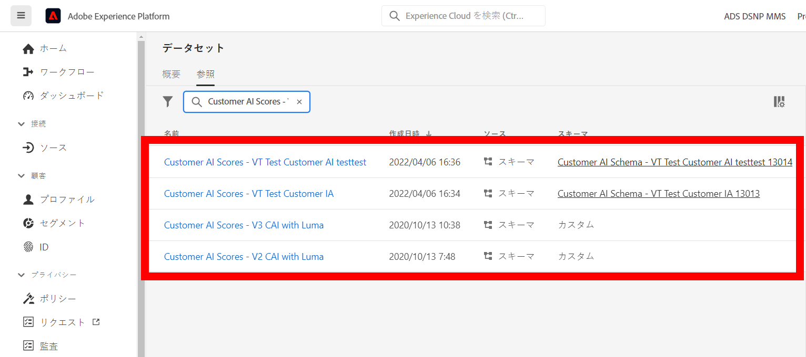
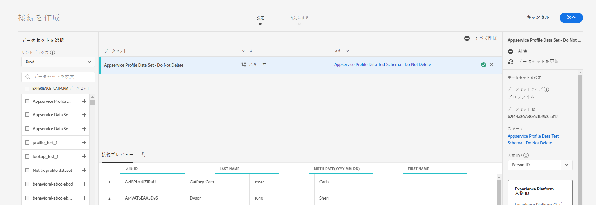
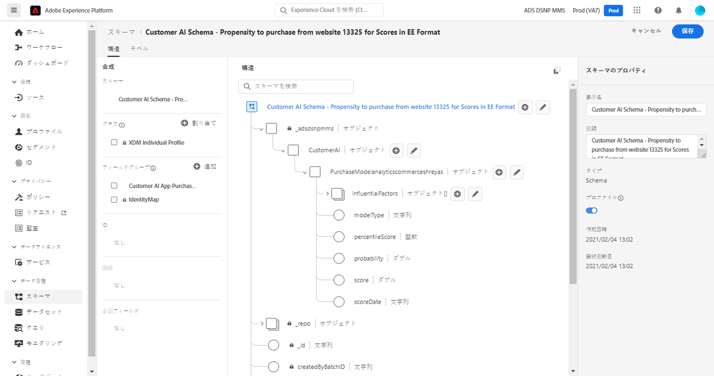
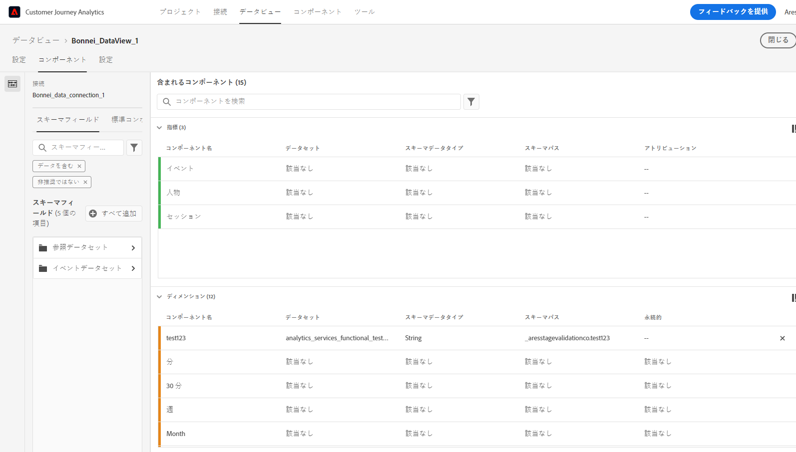
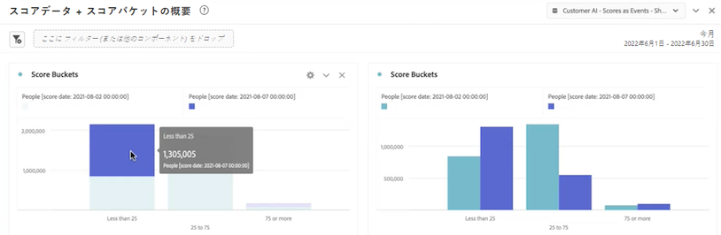
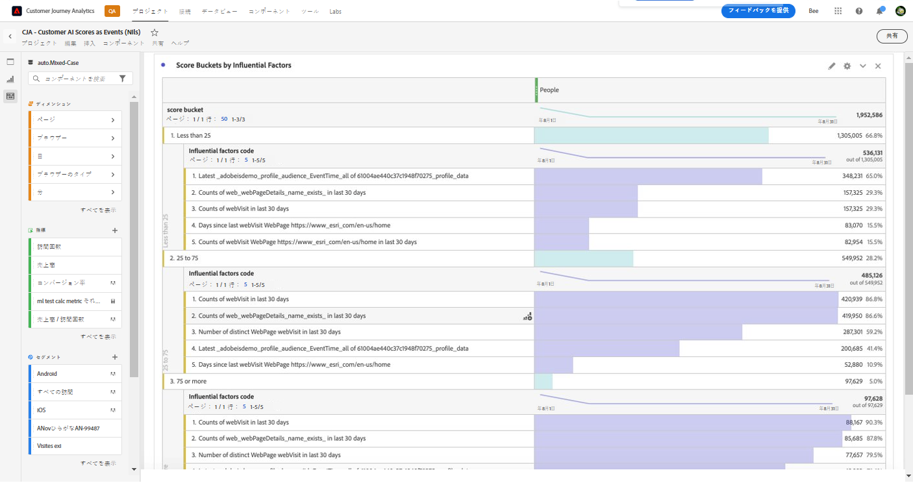
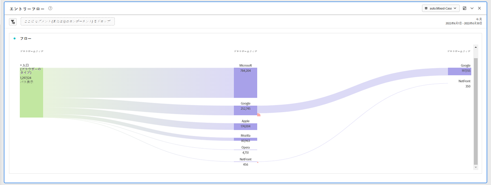
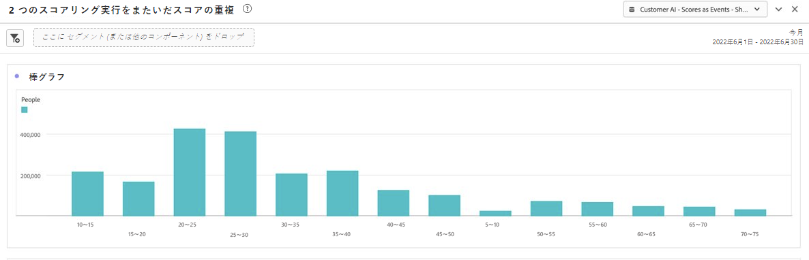
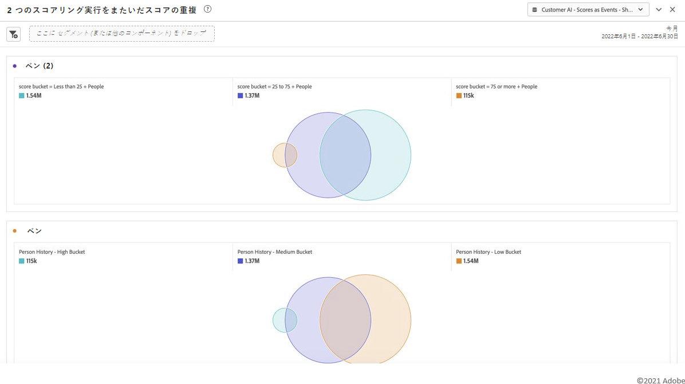

# 顧客 AI と CJA の統合

>[!NOTE]
>
>この機能は 2022 年 5 月 25 日にリリースされます。

[顧客 AI](https://experienceleague.adobe.com/docs/experience-platform/intelligent-services/customer-ai/overview.html?lang=en)は、Adobe Experience Platform Intelligent Services の一部として、マーケターに対して、個々のレベルで顧客予測を生成する力を提供します。

顧客 AI は、影響力のある要因の助けを借りて、顧客が何をする可能性があるかとその理由を知ることができます。さらに、マーケターは、顧客 AI の予測と洞察を活用して、最も適切なオファーとメッセージを提供することで、顧客のエクスペリエンスをパーソナライズできます。

顧客 AI は、傾向スコアリングに個々の行動データとプロファイルデータに依存します。 顧客 AI は、Adobe Analytics、Adobe Audience Manager、消費者エクスペリエンスイベントデータ、エクスペリエンスイベントデータなど、複数のデータソースを取り込むことができる柔軟性があります。 AEP データコネクタを使用してAdobe Audience ManagerとAdobe Analyticsのデータを取り込む場合、モデルは自動的に標準のイベントタイプを選択し、モデルのトレーニングとスコアリングをおこないます。 標準のイベントタイプを使用せずに独自のエクスペリエンスイベントデータセットを取り込む場合、モデルで使用するには、関連するフィールドをカスタムイベントまたはプロファイル属性としてマッピングする必要があります。 これは、顧客 AI の設定手順でおこなえます。&#x200B;

顧客 AI はCustomer Journey Analytics(CJA) と統合され、顧客 AI が有効なデータセットを CJA のデータビューおよびレポートで利用できる範囲です。 この統合を使用すると、次のことが可能になります。

* **ユーザーのセグメントの傾向スコアの経時的な追跡**. 使用例：ホテルのお客様がホテルのコンサート会場でショーチケットを購入する可能性はどれくらいですか？
* **傾向スコアに関連付けられている成功イベントまたは属性を分析する**.&#x200B;使用例：傾向スコアに関連付けられた属性や成功イベントについて理解したいと考えています。
* **様々なスコアリング実行における顧客傾向のエントリフローに従う**. 使用例：私は、最初に傾向の低いユーザーで、時間の経過と共に傾向の高いユーザーになった人々を理解したいと思いま&#x200B;す。
* **傾向の分布を見る**. 使用例：自分のセグメントで、より正確に傾向スコアの分布を把握したいと思います。&#x200B;例：ある小売業者は、1 つの製品に対して 50 ドルの特定のプロモーションを実行したいと考えています。  予算などの理由で、非常に限られたプロモーションを実行したい場合があります。 データを分析し、顧客の上位 80%以上をターゲットにするこ&#x200B;とにします。
* **特定のコホートで時間の経過と共にアクションを実行する傾向を見てみましょう**. 使用例：特定のコホートを経時的に追跡したいのですが、 これは最初のコホートに似ていますが、特定のコホートを経時的に追跡できま&#x200B;す。 接客業の例：マーケターは、ブロンズ層と銀層、または銀層と金層の時間の経過を追跡できます。 その後、時間の経過と共にホテルを予約する各コホートの傾向を確認できます。&#x200B;

## ワークフロー

一部の手順は、CJA での出力を操作する前に、Adobe Experience Platformで実行されます。

### 手順 1:顧客 AI インスタンスの設定

データを準備し、すべての資格情報とスキーマを設定したら、次の手順に従って開始します。 [顧客 AI インスタンスの設定](https://experienceleague.adobe.com/docs/experience-platform/intelligent-services/customer-ai/user-guide/configure.html?lang=en) ガイド。

### 手順 2:顧客 AI データセットへの CJA 接続の設定

CJA で、次の操作を実行できます。 [1 つ以上の接続を作成](/help/connections/create-connection.md) を、顧客 AI に実装されたExperience Platformデータセットに追加しました。 「アカウントをアップグレードする可能性」などの各予測は、1 つのデータセットと同じです。 これらのデータセットは、次に示すように、「顧客 AI スコア」プレフィックスで表示されます。

次に、CJA が既存または新しいデータセットの一部として取り込む XDM スキーマの例を示します。

( この例はプロファイルデータセットです。同じスキーマオブジェクトのセットは、CJA が取得するエクスペリエンスイベントデータセットの一部になります。 エクスペリエンスイベントデータセットには、スコアの日付としてタイムスタンプが含まれます )。 このモデルでスコアリングされたすべての顧客には、スコア、scoreDate などが割り当てられます。 と関連付けられています。

### 手順 3:これらの接続に基づくデータビューの作成

CJA で、次に進むことができます。 [データビューを作成](/help/data-views/create-dataview.md) を設定します。

### 手順 4:Workspace での CAI スコアのレポート

CJA Workspace で、新しいプロジェクトを作成し、ビジュアライゼーションを取り込むことができるようになりました。

CAI データを含む Workspace プロジェクトの例を次に示します。CAI データは、ユーザーのセグメントの傾向スコアを経時的に積み重ね棒グラフでトレンド表示しま&#x200B;す。

次の表に、セグメントの傾向が高いまたは低い理由コードを示しま&#x200B;す。

次のフロー図は、様々なスコアリング実行における顧客の傾向のエントリフローを示していま&#x200B;す。

この棒グラフは、傾向スコアの分布を示しま&#x200B;す。

次のベン図は、様々なスコアリングの実行で傾向が重なっていることを示しています。

