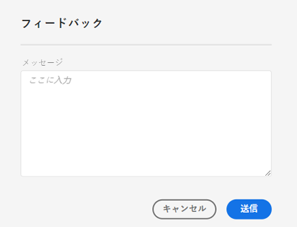
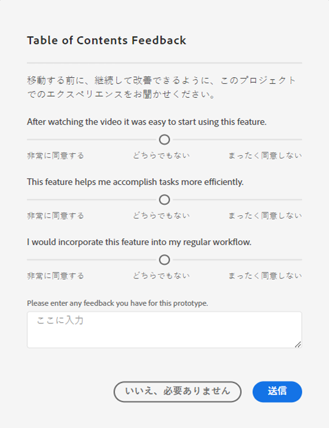

# [!UICONTROL ラボ]ユーザーガイド

[!UICONTROL ラボ]を使用すると、初期段階のアイデアのプロトタイピングを高速化できます。 お客様の注力により、透過的に開発を促進するツールとプロセスを組み合わせたものです。 新しいテクノロジーとの連携、価値ある洞察の発見、将来の機能の開発と優先事項への影響を可能にします。 ラボを利用すれば、Adobe Customer Journey Analyticsのイノベーションをいち早く入手し、自社のビジネスユースケースとデータから今後導入される機能を評価できます。

>[!IMPORTANT]
>
>Customer Journey Analytics LabsはHIPAA対応のサービスではなく、Customer Journey Analyticsで他の方法で使用が許可されている許可されたヘルスデータ（個人の健康情報やPHIなど）を含む、機密性の高い個人データを処理するために使用することはできません。

## 要件

[!UICONTROL ラボ]は、すべての管理者に対して自動的に有効になります。 他のチームメンバーは、製品管理者に問い合わせてアクセス権を要求する必要があります。

まだ開示していない場合は、該当する守秘義務契約および利用条件のフォームを読んで署名します。

## [!UICONTROL ラボ]ポータルへのアクセス

[!UICONTROL ラボ]にアクセスするには：

1. [!UICONTROL Workspace]および[!UICONTROL ラボ]へのアクセス権をまだ持っていない場合は管理者に権限を問い合わせてください。

1. Customer Journey Analyticsで、「**[!UICONTROL Labs]**」タブをクリックします。

## プロトタイプの評価

プロトタイプを起動して評価するには：

1. 「[!UICONTROL ラボ]」画面で、表示するプロトタイプの「**[!UICONTROL 起動]**」ボタンをクリックします。 プロトタイプを起動すると、プロトタイプ環境の左上にその名前が表示されます。

   ここにスクリーンショットを追加

1. 画面の右上にある「**[!UICONTROL ビデオを視聴]**」をクリックして、プロトタイプをハイライトしたビデオを見ます。 ビデオが完了したら、「**[!UICONTROL 閉じる]**」ボタンをクリックします。

   ここにスクリーンショットを追加

1. プロトタイプを操作します。 プロトタイプ環境で作業する場合：

* プロトタイプ環境で作成されたプロジェクトは保存または共有できません。

* プロトタイプでは、Workspace 内でアクセスできる任意のディメンション、指標、セグメントおよびビジュアライゼーションを使用して、データを評価できます。

* プロトタイプ内で行った変更は、データの収集や処理には影響しません。

* セグメント、計算指標およびアラートの作成または変更によって行われた変更は、プロトタイプ環境の外部で保持されます。

## フィードバックを残す

1. 「**[!UICONTROL フィードバックを与える]**」ボタンをクリックすると、プロトタイプの操作中はいつでも、メッセージボックスにフィードバックを入力できます。

   

1. **[!UICONTROL 送信]**&#x200B;をクリックして、フィードバックを送信します。

1. 別のプロトタイプを試す場合、またはプロトタイプ環境を終了する場合は、画面の右上にある「**[!UICONTROL プロトタイプを終了]**」ボタンをクリックして、プロトタイプについての短いアンケートを完了します。 プロトタイププロジェクトに対して行った変更は、プロトタイプ環境を終了すると失われます。

   

1. **[!UICONTROL 送信]**&#x200B;をクリックして、メインのプレビューポータルに戻ります。

## 追加情報

* Customer Journey Analytics 機能になるのは、[!UICONTROL ラボ]内の一部のプロトタイプだけです。 お客様のフィードバックはアドべの意思決定を促すものです。プロトタイプをレビューして、ご意見・ご感想をアドビにお知らせください。
* ラボは、すべての SKU エンタイトルメントで利用できます。
