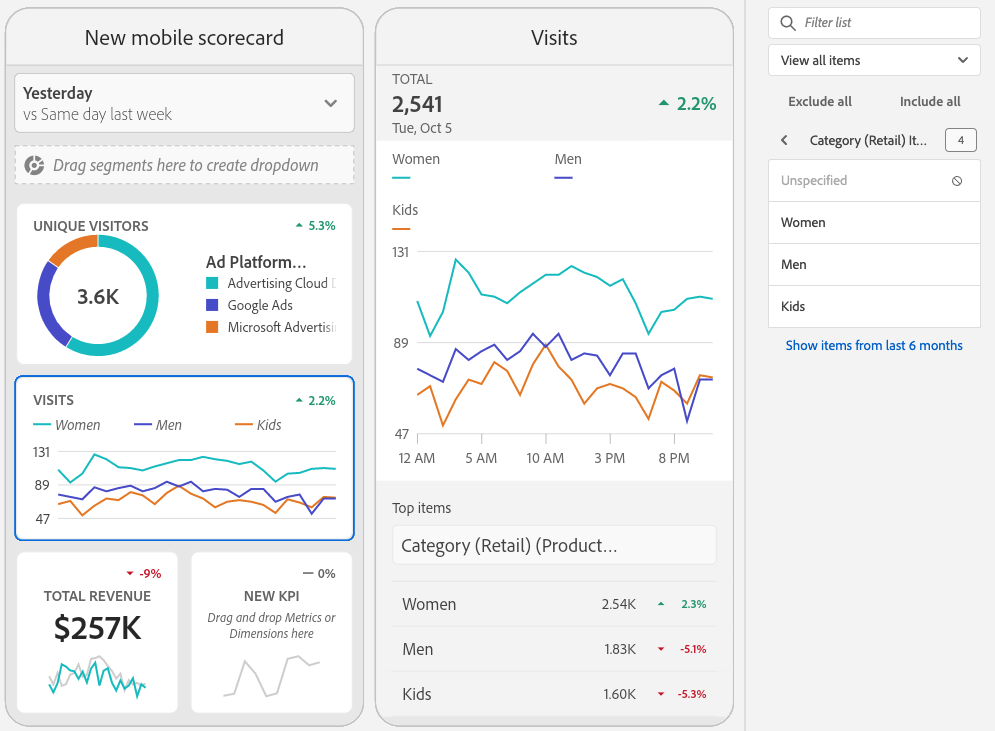
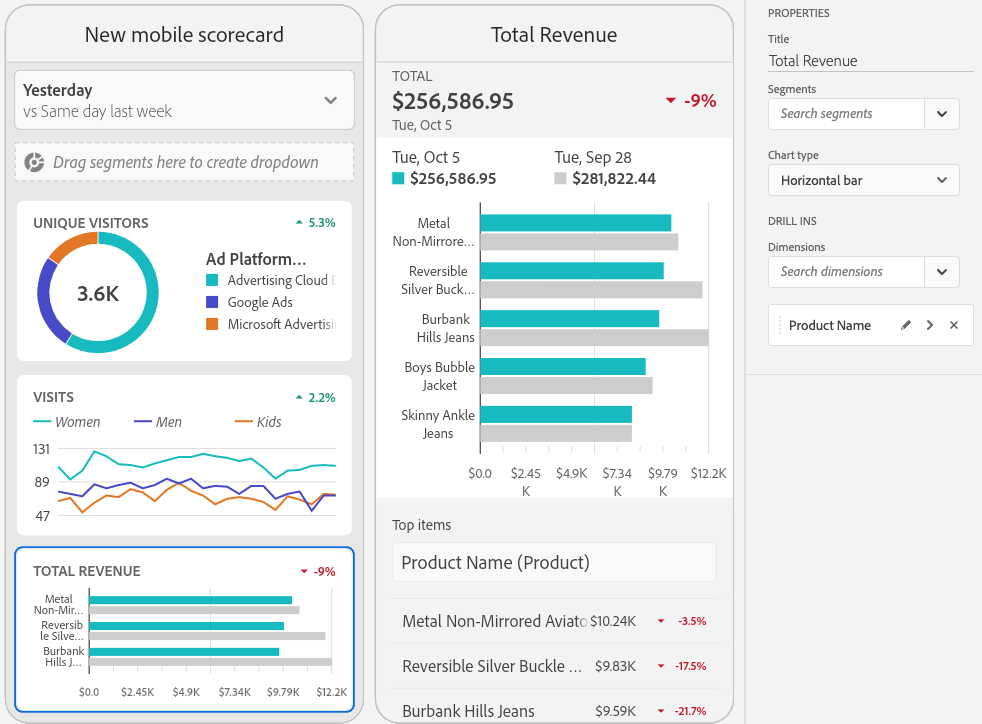

# モバイルスコアカードの作成 {#create-a-mobile-scorecard}

<!-- markdownlint-disable MD034 -->

>[!CONTEXTUALHELP]
>id="mobilescorecard_annotations"
>title="注釈"
>abstract="注釈は、ワークスペースプロジェクト内のコンポーネントマネージャーで作成できます。"

<!-- markdownlint-enable MD034 -->

次の情報は、Customer Journey Analyticsデータのキュレーターに、エグゼクティブユーザー向けのダッシュボードの設定方法と表示方法を示しています。 はじめに、Analytics ダッシュボードのスコアカードビルダーのビデオを視聴できます。

>[!BEGINSHADEBOX]

デモビデオについては、[ モバイルスコアカードの作成 ](https://video.tv.adobe.com/v/343458?quality=12&learn=on){target="_blank"} を参照してください。

>[!ENDSHADEBOX]

>[!NOTE]
>
>このページの Analytics スコアカードのスクリーンショットは、Customer Journey Analyticsではなく、Adobe Analytics UI のものです。 UI はほぼ同じです。

Analytics スコアカードでは、次のように、エグゼクティブユーザー向けの主要なデータビジュアライゼーションがタイル化されたレイアウトで表示されます。

このスコアカードのキュレーターは、スコアカードビルダーを使用して、エグゼクティブコンシューマーのスコアカードに表示するタイルを設定できます。 また、タイルをタップした後に詳細ビューや分類を調整する方法も設定できます。スコアカードビルダーインターフェイスを次に示します。

スコアカードを作成するには、次の手順を実行する必要があります。

1. 「[!UICONTROL 空のモバイルスコアカード]」テンプレートにアクセスします。
2. データを使用したスコアカードを構成し、保存します。

## 「[!UICONTROL 空のモバイルスコアカード]」テンプレートへのアクセス {#template}

「[!UICONTROL 空のモバイルスコアカード]」テンプレートにアクセスするには、新しいプロジェクトを作成するか、ツールメニューを使用します。

### 新規プロジェクトを作成 {#create}

1. Customer Journey Analyticsを開いて「**[!UICONTROL Workspace]**」タブをクリックします。
1. 「**[!UICONTROL プロジェクトを作成]**」をクリックして、「**[!UICONTROL 空のモバイルスコアカード]**」プロジェクトテンプレートを選択します。
1. 「**[!UICONTROL 作成]**」をクリックします。

### ツールメニュー

1. 「**[!UICONTROL ツール]**」メニューから、**[!UICONTROL Analytics ダッシュボード（モバイルアプリ）]**」を選択します。
1. 次の画面で、「**[!UICONTROL スコアカードを新規作成]**」をクリックします。

## データを使用したスコアカードの構成と保存 {#configure}

スコアカードテンプレートを実装する手順は、次のとおりです。

1. 右側のパネルの「**[!UICONTROL プロパティ]**」で、使用するデータの元となる&#x200B;**[!UICONTROL プロジェクトデータビュー]**&#x200B;を指定します。

   

1. 新しいタイルをスコアカードに追加するには、左側のパネルから指標をドラッグし、「指標をここにドラッグ&amp;ドロップ **[!UICONTROL ゾーンにドロップし]** す。 同様のワークフローを使用して、2 つのタイル間に指標を挿入することもできます。

   

1. 各タイルから、関連ディメンションのリストの上位アイテムなど、指数に関する追加情報を表示する詳細ビューにアクセスできます。

## ディメンションまたは指標の追加 {#dimsmetrics}

指標に関連ディメンションを追加するには、左のパネルからディメンションをドラッグし、タイルにドロップします。

例えば、適切なディメンション（この例では **[!DNL Marketing Channel]**）をタイルにドラッグ＆ドロップして、**[!UICONTROL ユニーク訪問者数]**&#x200B;指標に追加できます。ディメンション分類は、タイル固有の&#x200B;**[!UICONTROL プロパティ]**&#x200B;の[!UICONTROL ドリルイン]（分類）セクションの下に表示されます。タイルごとに複数のディメンションを追加できます。

## フィルターの適用 {#filters}

個々のタイルにフィルターを適用するには、左パネルからフィルター（セグメントはCustomer Journey Analytics内のフィルターです）をドラッグし、タイルの上に直接ドロップします。

スコアカードのすべてのタイルにフィルターを適用する場合は、スコアカードの上にタイルをドロップします。 または、日付範囲の下にあるフィルターメニューでフィルターを選択して、フィルターを適用することもできます。Customer Journey Analytics Workspaceと同じ方法で [ スコアカードに対してフィルターを設定し ](https://experienceleague.adobe.com/docs/analytics-learn/tutorials/analysis-workspace/using-panels/using-drop-down-filters.html?lang=ja) 適用します。

## 日付範囲の追加 {#dates}

日付範囲のドロップダウンを選択して、スコアカードで選択できる日付範囲の組み合わせを追加および削除します。

新しいスコアカードはそれぞれ、今日と昨日のデータにフォーカスした 6 つの日付範囲の組み合わせで始まります。x をクリックして不要な日付範囲を削除したり、鉛筆をクリックして各日付範囲の組み合わせを編集したりできます。

プライマリ日付を作成または変更するには、ドロップダウンを使用して使用可能な日付範囲から選択するか、日付コンポーネントを右側のレールからドロップゾーンにドラッグ＆ドロップします。

比較日を作成するには、ドロップダウンメニューで、一般的な時間比較の便利な事前設定から選択します。また、日付コンポーネントを右側のレールからドラッグ＆ドロップすることもできます。

必要な日付範囲がまだ作成されていない場合は、カレンダーアイコンをクリックして新しい日付範囲を作成できます。

これにより、新しい日付範囲コンポーネントを作成して保存できる日付範囲ビルダーに移動します。

### 比較日付範囲の表示／非表示の切り替え {#show-comparison-dates}

比較日付範囲を含めるには、「**比較日付を含める**」設定を切り替えます。

この設定は、デフォルトで&#x200B;*オン*&#x200B;になっています。比較日付を表示しない場合は、*オフ*&#x200B;に切り替えます。

## ビジュアライゼーションの適用 {#viz}

Analytics ダッシュボードには、4 つのビジュアライゼーションが用意されており、これらを使用してディメンション項目と指標を詳細に把握できます。タイルの[!UICONTROL プロパティ]の[!UICONTROL チャートのタイプ]を変更して、別のビジュアライゼーションを適用します。適切なタイルを選択して、チャートのタイプを変更します。

または、左側のパネルの「[!UICONTROL ビジュアライゼーション]」アイコンをクリックし、右側のビジュアライゼーションをタイルにドラッグ＆ドロップします。

### [!UICONTROL 数値の概要]

数値の概要ビジュアライゼーションを使用して、プロジェクトで重要な大きな数を強調表示します。

### [!UICONTROL ドーナツ]

このビジュアライゼーションは、円グラフと同様に、データを全体の一部として表示します。合計に対する割合を比較する際にドーナツグラフを使用します。例えば、一意のユーザーの合計数に貢献した広告プラットフォームを確認するとします。

### [!UICONTROL 行]

行のビジュアライゼーションでは、時間の経過に伴う値の変化を確認できるように、折れ線で指標が表されます。線グラフは、時間の経過に伴うディメンションを表示しますが、あらゆるビジュアライゼーションで機能します。この例では、製品カテゴリディメンションを視覚化しています。

### [!UICONTROL 横棒グラフ]

このビジュアライゼーションでは、1 つ以上の指標の様々な値を表す横棒グラフが表示されます。例えば、上位の製品を簡単に確認するには、優先したいビジュアライゼーションで「[!UICONTROL 横棒グラフ]」を選択します。

## スコアカードの命名 {#name}

スコアカードに名前を付けるには、画面の左上にある名前空間をクリックして、新しい名前を入力します。

### [!UICONTROL 未指定]ディメンション項目を削除 {#remove-dims}

[!UICONTROL 未指定]ディメンション項目をデータから削除する場合、次の操作を行います。

1. 正しいタイルを選択します。
1. 右側のパネルの「**[!UICONTROL ドリルイン]**」の下で、削除する&#x200B;**[!UICONTROL 未指定]**&#x200B;の項目があるディメンション項目の横にある右矢印を選択します。

   

1. 「**[!UICONTROL 未指定]**」の横にあるアイコンをクリックして、レポートから未指定のデータを削除します。（他のディメンション項目も削除できます）

## タイルのプロパティの表示と設定 {#tiles}

スコアカードビルダーでタイルをクリックすると、右側のパネルにそのタイルに関連付けられているプロパティと特性および詳細スライドが表示されます。 このパネルでは、タイルに新しい&#x200B;**タイトル**&#x200B;を提供したり、またはフィルターを適用してタイルを設定したりできます。セグメントは、Customer Journey Analyticsのフィルターです。

## 詳細スライドを表示 {#view-detail-slides}

タイルをクリックすると、アプリで詳細スライドがエグゼクティブユーザーにどのように表示されるかが、動的なポップアップウィンドウで表示されます。ディメンションを追加して、特定のニーズに合わせてデータを分類できます。 ディメンションが適用されていない場合、分類ディメンションは、デフォルトの日付範囲に応じて、**時間**&#x200B;または&#x200B;**日**&#x200B;になります。

分類を使用すると、次のようなディメンション項目別に指標が分類されるので、分析を絞り込むことができます。

* ユニーク訪問者数の指標を広告プラットフォーム (AMO ID) 別に分類
* 訪問数を製品カテゴリ（小売）別に分類
* 合計売上高を製品名別に分類

タイルに追加された各ディメンションは、アプリケーションの詳細ビューのドロップダウンリストに表示されます。エグゼクティブユーザーは、ドロップダウンリストにリストされたオプションから選択できるようになります。

## 詳細スライドのカスタマイズ {#customize-detail-slide}

カスタムの詳細スライドを使用すると、オーディエンスと共有する情報をさらに絞り込むことができます。

>[!BEGINSHADEBOX]

デモビデオについては、[ カスタム詳細ビュー ](https://video.tv.adobe.com/v/3410002?quality=12&learn=on){target="_blank"} を参照してください。

{{videoaa}}

>[!ENDSHADEBOX]

各詳細スライドのレイアウトを変更し、テキストを追加して、エンドユーザーに表示されるデータをより適切に説明できます。また、ドロップダウンメニューを使用してグラフのタイプを変更することもできます。

### スライドレイアウトを変更する

スライドのレイアウトを変更して、最も重要な情報に焦点を当てます。 例えば、レイアウトを変更して、グラフのみを表示したり、テーブルのみを表示したりできます。 ススライドのレイアウトを変更するには、事前に設計された形式の 1 つを選択します。

左側のパネルからキャンバスにビジュアライゼーションコンポーネントをドラッグ＆ドロップして、スライドレイアウトを変更することもできます。各詳細スライドには、一度に 2 つのビジュアライゼーションのみを表示できます。

### スライドに説明テキストを追加する

テキストを追加して、グラフに含まれる内容やデータに関するニュアンスなど、重要な情報を提供できます。

詳細スライドにテキストを追加するには、`T` 記号が表示されるレイアウトを選択するか、左側のパネルからテキストビジュアライゼーションコンポーネントをドラッグ＆ドロップします。新しいテキストビジュアライゼーションを追加する場合や、テキストを含むスライドレイアウトを選択する場合は、テキストエディターが自動的に開きます。テキストエディターには、テキストの書式設定に使用できるすべての標準オプションが用意されています。段落、見出しおよび小見出しなどのテキストスタイルを適用したり、太字や斜体のフォントを適用したりできます。 テキストの両端揃え、箇条書きと番号付きのリストの追加、およびリンクの追加を行うことができます。 編集が完了したら、テキストエディターの右上隅にある最小化ボタンを選択して、テキストエディターを閉じます。既に追加したテキストを編集するには、鉛筆アイコンを選択して、テキストエディターを再度開きます。

## コンポーネントの削除 {#remove}

同様に、スコアカード全体に適用されるコンポーネントを削除するには、タイルの外側のスコアカード上の任意の場所をクリックし、コンポーネントにカーソルを合わせたときに表示される **x** をクリックして削除します。以下に **初回訪問** の場合を示します。

## データストーリーの作成 {#create-data-story}

データストーリーは、中心的なテーマや指標に基づいて作成された、サポート対象データポイント、ビジネスコンテキスト、関連指標のコレクションです。

例えば、web トラフィックに焦点を当てると、最も重要な指標は訪問数ですが、新規担当者や一意のユーザーにも関心がある場合や、web ページ別またはトラフィックが発生しているデバイスタイプ別にデータを分類したい場合があります。 モバイルスコアカードプロジェクトのデータストーリーを使用すると、最も重要な指標を前面と中央に配置しながら、指標の背後にあるストーリー全体を複数の詳細スライドで伝えることができます。

Analysis Workspace のモバイルスコアカードプロジェクトでデータストーリーを作成する方法について詳しくは、ビデオをご覧ください。

>[!BEGINSHADEBOX]

デモビデオについては、[ データストーリー ](https://video.tv.adobe.com/v/3416392/?quality=12&learn=on){target="_blank"} を参照してください。

{{videoaa}}

>[!ENDSHADEBOX]

**データストーリーを作成するには**{#data-story-create}

複数の詳細スライドをタイルに追加して、データストーリーを作成します。

1. モバイルスコアカードプロジェクトから開始します。
1. ストーリーを作成するタイルを選択します。
   
   {width=".50%"}
1. スライドを追加して、データストーリーを作成します。デフォルトでは、最初のスライドが生成されます。
新しいスライドを追加するには、スライドにポインタを合わせるかクリックして、次の使用可能なオプションから選択します。
   * 「+」記号をタップして、新しいスライドを作成します。
   * 複製アイコンをタップすると、既存のスライドを複製できます。
1. 空のスライドを作成する場合は、左側のパネルからコンポーネントをドラッグ＆ドロップするか、レイアウトを選択してタイルのデータをスライドに自動入力します。
   
スライドを削除するには、ごみ箱アイコンをタップします。

### データストーリーのカスタマイズ {#customize-data-story}

データストーリーを使用すると、すべてをカスタマイズできるので、共有したい情報を共有し、不要な情報をすべて除外できます。タイルと個々のスライドをカスタマイズすると、フィルターの追加、分類の表示、レイアウトの変更、ビジュアライゼーションの変更を行うことができます。

**タイルをカスタマイズするには**

1. タイルをタップします。 選択したタイルは青色で囲まれ、右側のパネルにはタイルのプロパティが表示されます。
1. タイトル、グラフタイプ、その他のタイルオプションを変更します。
1. コンポーネントをタイルにドラッグします。
   
ビジュアライゼーションなどのコンポーネントをタイルにドラッグ＆ドロップすると、そのコンポーネントがすべてのデータストーリーのスライドに適用されます。
1. タイトルにのみ変更を適用するには、Shift キーを押したまま変更を適用します。
   

>[!NOTE]
>スライドはタイルからコンポーネントを継承しますが、タイルはスライドからコンポーネントを継承しません。

**個々のスライドをカスタマイズするには**

データストーリー内の個々のスライドのビジュアライゼーションを変更できます。例えば、特定のスライドの横棒グラフをドーナツグラフに変更できます。また、レイアウトを変更することもできます。[詳細スライドのカスタマイズ](#customize-detail-slide)を参照してください。

### データストーリーのプレビュー {#preview-data-story}

データストーリーを作成した後、「**プレビュー**」ボタンを使用すると、アプリユーザーのようにデータストーリーを表示したり操作したりできます。データストーリーのプレビューについて詳しくは、[スコアカードのプレビュー](#preview)を参照してください。

### タイルとスライド間の移動 {#navigate-tiles-slides}

ナビゲーションバーには、各スライドの内容を表すアイコンが表示されます。ナビゲーションバーを使用すると、多数のスライドがある場合に、特定のスライドに簡単に移動できます。

タイルとスライドの間を移動するには、ナビゲーションバーをタップします。

{width="45%"}

また、キーボードの矢印を使用するか、コンポーネントを選択して画面の左または右に長押ししてスクロールすることで、前後に移動することもできます。

## スコアカードのプレビュー {#preview}

スコアカードがAdobe Analytics ダッシュボードアプリで公開された後にどのように表示され、機能するかをプレビューできます。

1. 画面の右上隅にある「**[!UICONTROL プレビュー]**」をクリックします。

   

1. 様々なデバイスでのスコアカードの表示を確認するには、[!UICONTROL デバイスのプレビュー]ドロップダウンメニューからデバイスを選択します。

   

1. プレビューを操作するには、以下を行います。

   * 左クリックして、電話画面をタップするシミュレーションを行います。

   * コンピューターのスクロール機能を使用して、電話画面を指でスクロールするシミュレーションを行います。

   * クリック＆ホールドして、電話画面を指で押し続けるシミュレーションを行います。これは、詳細ビューでビジュアライゼーションを操作する場合に役立ちます。

## スコアカードの共有 {#share}

エグゼクティブユーザーとスコアカードを共有する手順は、次のとおりです。

1. **[!UICONTROL 共有]**&#x200B;メニューをクリックし、「**[!UICONTROL スコアカードの共有]**」を選択します。

1. **[!UICONTROL モバイルスコアカードを共有]** フォームで、次の方法でフィールドに入力します。

   * スコアカードの名前を指定します。
   * スコアカードの説明を指定します。
   * 関連するタグを追加します。
   * スコアカード受信者を指定します。

1. 「**[!UICONTROL 共有]**」をクリックします。

受信者は、共有したスコアカードに Analytics ダッシュボードでアクセスできます。その後、スコアカードビルダーでスコアカードに変更を加えると、共有されたスコアカードが自動的に更新されます。 エグゼクティブユーザーがアプリのスコアカードを更新すると、変更が表示されます。

新しいコンポーネントを追加してスコアカードを更新する場合、スコアカードを再度共有すると（および「**[!UICONTROL 埋め込みコンポーネントを共有]**」オプションをオンにすると）、エグゼクティブユーザーがこれらの変更にアクセスできることを確認できます。

### 共有可能なリンクを使用したスコアカードの共有

共有可能なリンクを使用すると、メール、ドキュメント、またはテキストメッセージアプリでスコアカードを簡単に共有できます。 共有可能なリンクを使用すると、受信者はデスクトップまたはダッシュボードモバイルアプリでスコアカードを開くことができます。 共有可能なディープリンクを使用すると、プロジェクトの共有がさらに簡単になり、関係者とのエンゲージメントを高めることができます。

共有可能なリンクを使用してスコアカードを共有するには

1. **[!UICONTROL 共有]**&#x200B;メニューをクリックし、「**[!UICONTROL スコアカードの共有]**」を選択します。

   

1. リンクをコピーして、メール、ドキュメント、または IM アプリに貼り付けます。

   受信者がデスクトップアプリまたはブラウザーを使用してリンクを開くと、モバイルスコアカードプロジェクトがWorkspaceで開きます。

   受信者がモバイルデバイスでリンクを開くと、Adobe Analytics ダッシュボードアプリで直接スコアカードが開きます。

   受信者がモバイルアプリをダウンロードしていない場合は、App StoreまたはGoogle Play ストアのアプリリストでダウンロードできます。

