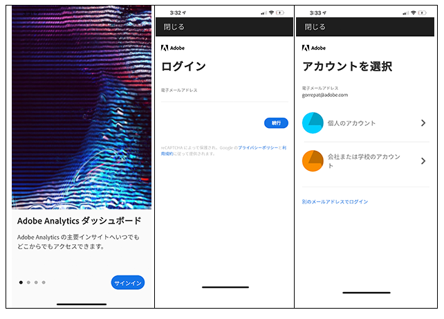
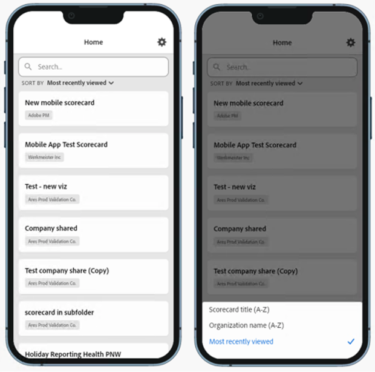
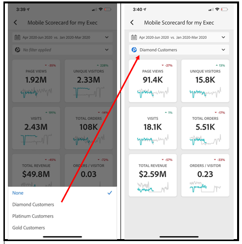
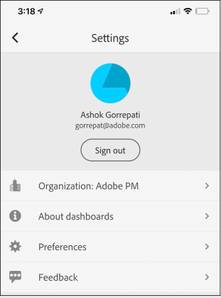
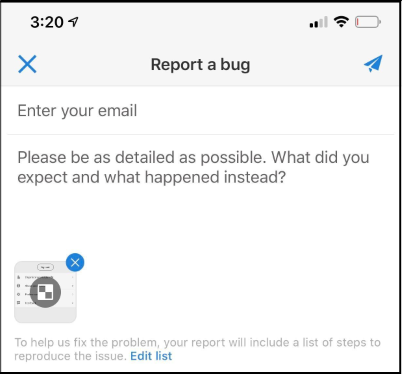

# エグゼクティブユーザー向けクイックスタートガイド

次の情報は、Analytics ダッシュボードの使用と表示に関するベストプラクティスに関する情報をエグゼクティブユーザーに提供します。

>[!BEGINSHADEBOX]

デモ動画については、 [&#x200B; モバイルスコアカード &#x200B;](https://experienceleague.adobe.com/ja/docs/customer-journey-analytics-learn/tutorials/dashboards/assist-executives-to-access-mobile-scorecards){target="_blank"}へのアクセスを経営陣に支援するを参照してください。

>[!ENDSHADEBOX]

このガイドは、エグゼクティブユーザーが Analytics ダッシュボードでスコアカードを読み、解釈するのに役立つように作成されています。 エグゼクティブユーザーは、自分のモバイルデバイスで、重要な概要データの幅広いレンダリングをすばやく簡単に表示できます。

## デバイスでのダッシュボードの設定

ダッシュボードを効果的に使用するには、スコアカードキュレーターに設定の支援を依頼する必要があります。 この節では、キュレーターの支援を得てセットアップを行う際に役立つ情報を提供します。

### アクセス権の取得

ダッシュボードのスコアカードにアクセスするには、次の点を確認します。

* Customer Journey Analytics への有効なログインがある
* キュレーターがモバイルスコアカードを正しく作成し、共有している

### ダッシュボードのダウンロードとインストール

アプリケーションをダウンロードしてインストールするには、デバイス上のオペレーティングシステムに従って手順に従います。

>[!NOTE]
>
>モバイルアプリの名前はアプリストアのAdobe Analytics ダッシュボードですが、このアプリはCustomer Journey Analytics モバイルスコアカードでも同じように使用できます。

**iOS**：

次のリンク（**[!UICONTROL ツール]**/**[!UICONTROL Analytics ダッシュボード（モバイルアプリ）]**&#x200B;の下にあるCustomer Journey Analyticsでも使用できます）をクリックし、プロンプトに従ってアプリをダウンロード、インストール、開きます。

[iOS リンク](https://apple.co/2zXq0aN)

**Android**：

次のリンク（**[!UICONTROL ツール]**/**[!UICONTROL Analytics ダッシュボード（モバイルアプリ）]**&#x200B;の下にあるCustomer Journey Analyticsでも使用できます）をクリックし、プロンプトに従ってアプリをダウンロード、インストール、開きます。

[Android リンク](https://bit.ly/2LM38Oo)

ダウンロードしてインストールすると、エグゼクティブユーザーは既存のCustomer Journey Analytics資格情報を使用してアプリにサインインできます。

## ダッシュボードの使用 {#use-dashboards}

ダッシュボードを使用するには：

1. アプリにログインします。 ダッシュボードを起動すると、ログイン画面が表示されます。 既存のCustomer Journey Analytics資格情報を使用して、プロンプトに従います。 Adobe ID または Enterprise／Federated ID を使用できます。

   

1. 会社を選択します。 ダッシュボードにログインすると、「**[!UICONTROL 会社の選択]**」画面が表示されます。 この画面には、所属するログイン会社が一覧表示されます。 共有されたスコアカードに関連付けられている会社名をタップします。

   スコアカード リストには、共有されているすべてのスコアカードが表示されます。

1. 表示するスコアカードをタップします。

   1つのログインで複数の組織にアクセスできる場合、組織のすべてのスコアカードがスコアカード リストに表示されます。

   スコアカードのタイトル、組織名、または最近表示した項目に従って、スコアカードのリストを並べ替えることができます。 特定のスコアカードを検索することもできます。

   

   ログインして、何も共有されていないというメッセージが表示された場合は、キュレーターに次の点を確認してください。

   * 適切なCustomer Journey Analyticsサンドボックスにログインします。
   * スコアカードが共有されました。

   

1. スコアカードでタイルがどのように表示されるかを調べます（最初のスコアカードがダークモードで表示されます。詳しくは、次の「**[!UICONTROL 環境設定]**」を参照してください）。

   

   タイルに関する追加情報：

   * スパークラインの精度は、日付範囲の長さに依存します。

      * 1 日 - 時間ごとの傾向を表示
      * 2 日以上 1 年未満 - 毎日の傾向を表示。
      * 1 年以上 - 毎週の傾向を表示。

   * 値の変化パーセントの式は、（指標合計（現在の日付範囲） - 指標合計（比較日付範囲））÷指標合計（比較日付範囲）です。

   * 画面をプルダウンして、スコアカードを更新できます。

   次の例では、スコアカードが通常モードで表示されます。

   

1. タイルをタップすると、そのタイルの詳細な分類の仕組みを表示できます。

   

1. スコアカードの日付範囲を変更する手順は、次のとおりです。

   

   * 同様に、上記の分類ビュー内で日付範囲を変更することもできます。

   * タップした間隔（**日**、**週**、**月**、**年**）に応じて、現在の期間またはその直前の日付範囲の 2 つのオプションが表示されます。 次の 2 つのオプションのいずれかをタップして、最初の範囲を選択します。 「**[!UICONTROL 比較]**」リストで、表示されたオプションのいずれかをタップして、この期間のデータを選択した最初の日付範囲と比較します。 画面右上の「**[!UICONTROL 完了]**」をタップします。 「**[!UICONTROL 日付範囲]**」フィールドとスコアカードタイルは、選択した新しい範囲の新しい比較データで更新されます。

1. スコアカードにセグメントを適用するには、セグメント ドロップダウンメニューをタップし、キュレーターが設定したセグメントを選択します。 アプリの[&#x200B; セグメント &#x200B;](https://experienceleague.adobe.com/docs/analytics-learn/tutorials/analysis-workspace/using-panels/using-drop-down-filters.html?lang=ja)は、Workspaceと同じように機能します。

   

1. [!UICONTROL &#x200B; スコアカード &#x200B;]の更新プログラムを取得します。 [!UICONTROL &#x200B; スコアカード &#x200B;]に、興味を持つ可能性のある指標または分類がすべて含まれていない場合は、Customer Journey Analytics チームに連絡して、スコアカードを更新してください。 更新されたら、画面上のカードをプルダウンすると、最近追加したデータをロードして更新を表示できます。

1. アプリケーションでフィードバックを残す手順は、次のとおりです。

   1. アプリケーション画面の右上にある設定アイコンをタップします。
   2. **[!UICONTROL 設定]**&#x200B;画面で、「**[!UICONTROL フィードバック]**」オプションをタップします。
   3. タップして、フィードバックを残すためのオプションを表示します。

      

1. 環境設定を変更するには、上記の「**[!UICONTROL 環境設定]**」オプションをタップします。 環境設定で、生体認証ログインをオンにするか、次に示すようにアプリケーションのダークモードを設定できます。

   

**バグを報告する手順は、次のとおりです。**

オプションをタップして、バグのサブカテゴリを選択します。 バグを報告するためのフォームで、一番上のフィールドにメールアドレスを入力し、その下のフィールドにバグの説明を入力します。 アカウント情報のスクリーンショットがメッセージに自動的に添付されますが、必要に応じて、添付画像の「**X**」をタップして削除できます。 また、画面録画の取得、スクリーンショットの追加、ファイルの添付のオプションもあります。 レポートを送信するには、フォームの右上にある紙飛行機のアイコンをタップします。

**改善を提案する手順は、次のとおりです。**

オプションをタップして、提案のサブカテゴリを選択します。 提案フォームの一番上のフィールドにメールアドレスを入力し、その下のフィールドに提案を入力します。 アカウント情報のスクリーンショットがメッセージに自動的に添付されますが、必要に応じて、添付画像の「**X**」をタップして削除できます。 また、画面録画の取得、スクリーンショットの追加、ファイルの添付のオプションもあります。 提案を送信するには、フォームの右上にある紙飛行機のアイコンをタップします。

**質問する手順は、次のとおりです。**

オプションをタップします。一番上のフィールドにメールアドレスを入力し、その下のフィールドに質問を入力します。 スクリーンショットがメッセージに自動的に添付されますが、必要に応じて、添付画像の「**X**」をタップして削除できます。 また、画面録画の取得、スクリーンショットの追加、ファイルの添付のオプションもあります。 質問を送信するには、フォームの右上にある紙飛行機のアイコンをタップします。

## 用語集

| 用語 | 定義 |
|--- |--- |
| 消費者 | Customer Journey Analyticsの主要な指標とインサイトをモバイルデバイスで表示する経営陣のペルソナ |
| キュレーター | Customer Journey Analyticsからインサイトを見つけ出して配信し、スコアカードを消費者が表示できるように設定する、データリテラシーペルソナ |
| キュレーション | 消費者に関連する指標、ディメンション、その他のコンポーネントを含むモバイルスコアカードを作成または編集する行為 |
| スコアカード | 1 つ以上のタイルを含むダッシュボードビュー |
| タイル | スコアカードビュー内の指標のレンダリング |
| 分類 | スコアカードでタイルをタップしてアクセスできるセカンダリビュー。 このビューは、タイルに表示されている指標に対して展開され、オプションで追加の分類ディメンションに関するレポートを表示します |
| 日付範囲 | ダッシュボードレポートの主な日付範囲 |
| 比較日付範囲 | プライマリ日付範囲と比較される日付範囲 |
