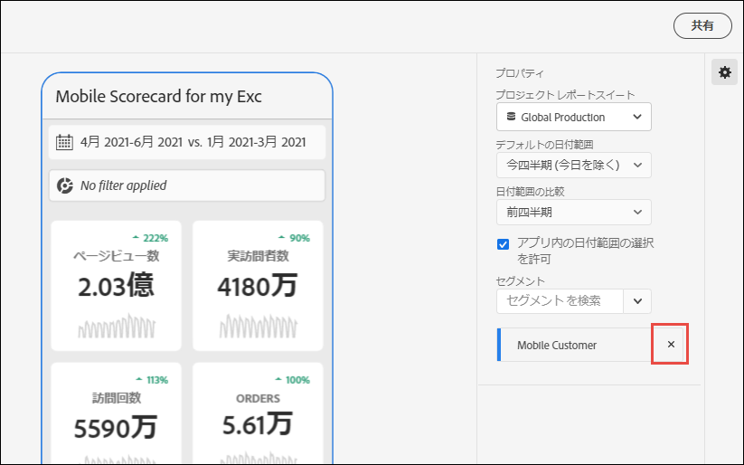
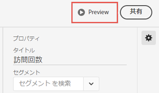
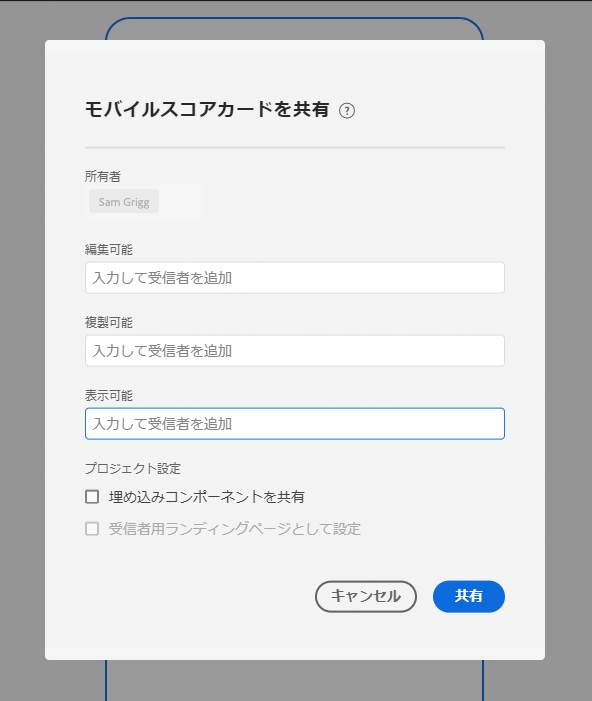

# スコアカードの管理

このトピックでは、Customer Journey Analytics データのキュレーターにスコアカード要素の表示および管理方法を示します。

## タイルのプロパティの表示と設定 {#tiles}

スコアカードビルダーでタイルをクリックすると、右側のパネルにそのタイルに関連付けられているプロパティと特性および詳細スライドが表示されます。このパネルで、タイルに新しい&#x200B;**タイトル**&#x200B;を提供するか、セグメントを適用してタイルを設定することもできます。

## 詳細スライドを表示 {#view-detail-slides}

タイルをクリックすると、アプリで詳細スライドがエグゼクティブユーザーにどのように表示されるかが、動的なポップアップウィンドウで表示されます。ディメンションを追加して、特定のニーズに合わせてデータを分類できます。 ディメンションが適用されていない場合、分類ディメンションは、デフォルトの日付範囲に応じて、**時間**&#x200B;または&#x200B;**日**&#x200B;になります。

分類を使用すると、次のようなディメンション項目別に指標が分類されるので、分析を絞り込むことができます。

* ユニーク訪問者数の指標を広告プラットフォーム (AMO ID) 別に分類
* 訪問数を製品カテゴリ（小売）別に分類
* 合計売上高を製品名別に分類

タイルに追加された各ディメンションは、アプリの詳細表示のドロップダウンメニューに表示されます。 エグゼクティブユーザーは、ドロップダウンメニューにリストされたオプションから選択できるようになります。

## 詳細スライドのカスタマイズ {#customize-detail-slide}

カスタムの詳細スライドを使用すると、オーディエンスと共有する情報をさらに絞り込むことができます。

>[!BEGINSHADEBOX]

デモビデオについて詳しくは、 [カスタム詳細ビュー](https://video.tv.adobe.com/v/3410002?quality=12&learn=on){target="_blank"}を参照してください。

>[!ENDSHADEBOX]

各詳細スライドのレイアウトを変更し、テキストを追加して、エンドユーザーに表示されるデータをより適切に説明できます。また、ドロップダウンメニューを使用してグラフのタイプを変更することもできます。

### スライドレイアウトを変更する

スライドのレイアウトを変更して、最も重要な情報に焦点を当てます。 例えば、レイアウトを変更して、グラフのみを表示したり、テーブルのみを表示したりできます。 ススライドのレイアウトを変更するには、事前に設計された形式の 1 つを選択します。

左側のパネルからキャンバスにビジュアライゼーションコンポーネントをドラッグ＆ドロップして、スライドレイアウトを変更することもできます。各詳細スライドには、一度に 2 つのビジュアライゼーションのみを表示できます。

### スライドに説明テキストを追加する

テキストを追加して、グラフに含まれる内容やデータに関するニュアンスなど、重要な情報を提供できます。

詳細スライドにテキストを追加するには、`T` 記号が表示されるレイアウトを選択するか、左側のパネルからテキストビジュアライゼーションコンポーネントをドラッグ＆ドロップします。新しいテキストビジュアライゼーションを追加する場合や、テキストを含むスライドレイアウトを選択する場合は、テキストエディターが自動的に開きます。テキストエディターには、テキストの書式設定に使用できるすべての標準オプションが用意されています。段落、見出しおよび小見出しなどのテキストスタイルを適用したり、太字や斜体のフォントを適用したりできます。 テキストの両端揃え、箇条書きと番号付きのリストの追加、およびリンクの追加を行うことができます。 編集が完了したら、テキストエディターの右上隅にある最小化ボタンを選択して、テキストエディターを閉じます。既に追加したテキストを編集するには、鉛筆アイコンを選択して、テキストエディターを再度開きます。

## コンポーネントの削除 {#remove}

同様に、スコアカード全体に適用されるコンポーネントを削除するには、タイルの外側のスコアカード上の任意の場所をクリックし、コンポーネントにポインタを合わせたときに表示される「**x**」をクリックして削除します。以下に&#x200B;**初回訪問回数**&#x200B;の場合を示します。

## データストーリーの作成 {#create-data-story}

データストーリーは、中心的なテーマや指標に基づいて作成された、サポート対象データポイント、ビジネスコンテキスト、関連指標のコレクションです。

例えば、web トラフィックに焦点を当てると、最も重要な指標は訪問数ですが、新規ユーザー数やユニークユーザー数にも関心がある場合や、web ページ別またはトラフィックが発生しているデバイスタイプ別にデータを分類したい場合があります。モバイルスコアカードプロジェクトのデータストーリーを使用すると、最も重要な指標を前面と中央に配置しながら、指標の背後にあるストーリー全体を複数の詳細スライドで伝えることができます。

Analysis Workspace のモバイルスコアカードプロジェクトでデータストーリーを作成する方法について詳しくは、ビデオをご覧ください。

>[!BEGINSHADEBOX]

デモビデオについては、[ モバイルスコアカードプロジェクトのデータストーリー ](https://video.tv.adobe.com/v/3416392/?quality=12&learn=on){target="_blank"} を参照してください。

>[!ENDSHADEBOX]

**データストーリーを作成するには** {#data-story-create}

複数の詳細スライドをタイルに追加して、データストーリーを作成します。

1. モバイルスコアカードプロジェクトから開始します。
1. ストーリーを作成するタイルを選択します。
   
   {width=".50%"}
1. スライドを追加して、データストーリーを作成します。デフォルトでは、最初のスライドが生成されます。
新しいスライドを追加するには、スライドにポインタを合わせるかクリックして、次の使用可能なオプションから選択します。
   * 「+」記号をタップして、新しいスライドを作成します。
   * 複製アイコンをタップすると、既存のスライドを複製できます。
1. 空のスライドを作成する場合は、左側のパネルからコンポーネントをドラッグ＆ドロップするか、レイアウトを選択してタイルのデータをスライドに自動入力します。
   
スライドを削除するには、ごみ箱アイコンをタップします。

### データストーリーのカスタマイズ {#customize-data-story}

データストーリーを使用すると、すべてをカスタマイズできるので、共有したい情報を共有し、不要な情報をすべて除外できます。タイルと個々のスライドをカスタマイズすると、セグメントの追加、分類の表示、レイアウトの変更、ビジュアライゼーションの変更を行うことができます。

**タイルをカスタマイズするには**

1. タイルをタップします。 選択したタイルは青色で囲まれ、右側のパネルにはタイルのプロパティが表示されます。
1. タイトル、グラフタイプ、その他のタイルオプションを変更します。
1. コンポーネントをタイルにドラッグします。
   
ビジュアライゼーションなどのコンポーネントをタイルにドラッグ＆ドロップすると、そのコンポーネントがすべてのデータストーリーのスライドに適用されます。
1. タイトルにのみ変更を適用するには、Shift キーを押したまま変更を適用します。
   

>[!NOTE]
>スライドはタイルからコンポーネントを継承しますが、タイルはスライドからコンポーネントを継承しません。

**個々のスライドをカスタマイズするには**

データストーリー内の個々のスライドのビジュアライゼーションを変更できます。例えば、特定のスライドの横棒グラフをドーナツグラフに変更できます。また、レイアウトを変更することもできます。[詳細スライドのカスタマイズ](#customize-detail-slide)を参照してください。

### データストーリーのプレビュー {#preview-data-story}

データストーリーを作成した後、「**プレビュー**」ボタンを使用すると、アプリユーザーのようにデータストーリーを表示したり操作したりできます。データストーリーのプレビューについて詳しくは、[スコアカードのプレビュー](#preview)を参照してください。

### タイルとスライド間の移動 {#navigate-tiles-slides}

ナビゲーションバーには、各スライドの内容を表すアイコンが表示されます。ナビゲーションバーを使用すると、多数のスライドがある場合に、特定のスライドに簡単に移動できます。

タイルとスライドの間を移動するには、ナビゲーションバーをタップします。

{width="45%"}

また、キーボードの矢印を使用するか、コンポーネントを選択して画面の左または右に長押ししてスクロールすることで、前後に移動することもできます。

## スコアカードのプレビュー {#preview}

スコアカードが Adobe Analytics ダッシュボードアプリで公開された後にどのように表示され、機能するかをプレビューできます。

1. 画面の右上隅にある「**[!UICONTROL プレビュー]**」をクリックします。

   

1. 様々なデバイスでのスコアカードの表示を確認するには、[!UICONTROL デバイスのプレビュー]ドロップダウンメニューからデバイスを選択します。

   

1. プレビューを操作するには、以下を行います。

   * 左クリックして、電話画面をタップするシミュレーションを行います。

   * コンピューターのスクロール機能を使用して、電話画面を指でスクロールするシミュレーションを行います。

   * クリック＆ホールドして、電話画面を指で押し続けるシミュレーションを行います。これは、詳細ビューでビジュアライゼーションを操作する場合に役立ちます。

## スコアカードの共有 {#share}

エグゼクティブユーザーとスコアカードを共有するには：

1. **[!UICONTROL 共有]**&#x200B;メニューをクリックし、「**[!UICONTROL スコアカードの共有]**」を選択します。

1. **[!UICONTROL モバイルスコアカードを共有]**&#x200B;フォームで、次の方法でフィールドに入力します。

   * スコアカードの名前を指定します。
   * スコアカードの説明を指定します。
   * 関連するタグを追加します。
   * スコアカード受信者を指定します。

1. 「**[!UICONTROL 共有]**」をクリックします。

受信者は、共有したスコアカードに Analytics ダッシュボードでアクセスできます。スコアカードビルダーでスコアカードに後続の変更を行うと、共有したスコアカードでその変更が自動的に更新されます。エグゼクティブユーザーは、アプリでスコアカードを更新すると、変更を確認できます。

新しいコンポーネントを追加してスコアカードを更新する場合、スコアカードを再度共有すると（および「**[!UICONTROL 埋め込みコンポーネントを共有]**」オプションをオンにすると）、エグゼクティブユーザーがこれらの変更にアクセスできることを確認できます。

### 共有可能なリンクを使用したスコアカードの共有

共有可能なリンクを使用すると、メール、ドキュメントまたはテキストメッセージアプリでスコアカードを簡単に共有できます。共有可能なリンクを使用すると、受信者はデスクトップまたはダッシュボードモバイルアプリでスコアカードを開くことができます。共有可能なディープリンクを使用すると、プロジェクトの共有がさらに簡単になり、関係者とのエンゲージメントを高めることができます。

共有可能なリンクを使用してスコアカードを共有するには：

1. **[!UICONTROL 共有]**&#x200B;メニューをクリックし、「**[!UICONTROL スコアカードの共有]**」を選択します。

   

1. リンクをコピーして、メール、ドキュメントまたは IM アプリにペーストします。

   受信者がデスクトップアプリまたはブラウザーを使用してリンクを開くと、モバイルスコアカードプロジェクトが Workspace で開きます。

   受信者がモバイルデバイスでリンクを開くと、スコアカードは Adobe Analytics ダッシュボードアプリで直接開きます。

   受信者がモバイルアプリをダウンロードしていない場合は、App Store または Google Play ストアのアプリリストでダウンロードできます。

## [!UICONTROL 未指定]ディメンション項目を削除 {#remove-dims}

[!UICONTROL 未指定]ディメンション項目をデータから削除する場合、次の操作を行います。

1. 正しいタイルを選択します。
1. 右側のパネルの「**[!UICONTROL ドリルイン]**」の下で、削除する&#x200B;**[!UICONTROL 未指定]**&#x200B;の項目があるディメンション項目の横にある右矢印を選択します。

   

1. 「**[!UICONTROL 未指定]**」の横にあるアイコンをクリックして、レポートから未指定のデータを削除します。（他のディメンション項目も削除できます）

## スコアカードでのインテリジェントキャプションの表示 {#captions}

インテリジェントキャプションを使用すると、アナリストの助けを借りずに、アナリスト以外のユーザーがデータをよりよく理解できます。 インテリジェントキャプションは、高度な機械学習とジェネレーティブ AI を使用して、ビジュアライゼーションに貴重な自然言語のインサイトを提供します。

これらのキャプションは、データの主要な統計的洞察を選び出し、自然言語で表現することで、アナリスト以外のユーザーがデータリテラシーを向上させるのを支援します。

インテリジェントキャプションは、モバイルアプリのすべてのビジュアライゼーションで使用でき、折れ線グラフ、ドーナツ、棒グラフ、概要番号が含まれます。

モバイルスコアカードでインテリジェントキャプションを表示するには：

1. スコアカードで、タイルをクリックします。 例えば、このスコアカードでは、下部の折れ線グラフをクリックします。

   

1. 右上の青いアイコンをタップして、キャプションを生成します。 キャプションが折れ線グラフの下に表示されます。

   

1. 右にスワイプすると、インテリジェントキャプションがすべて表示されます。

   インテリジェントキャプションは、データのスパイク、異常値、トレンド、低下、相関関係、その他の現象を示すことができます。

1. キャプションの中の黒いフラグをタップすると、有害なコンテンツや違法なコンテンツなどの問題が報告されます。

   

1. 「X」をクリックして「結果をレポート **[!UICONTROL ダイアログを終了し]** す。
